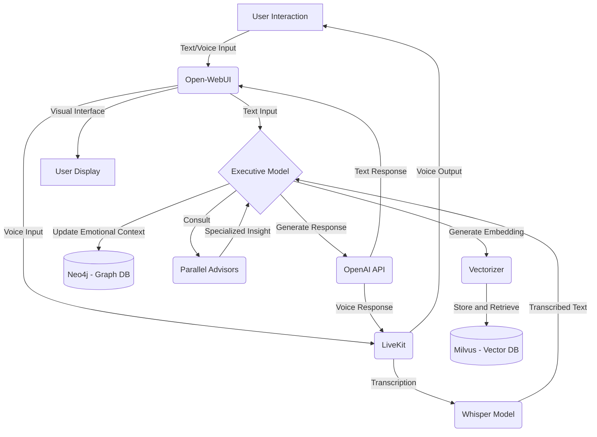
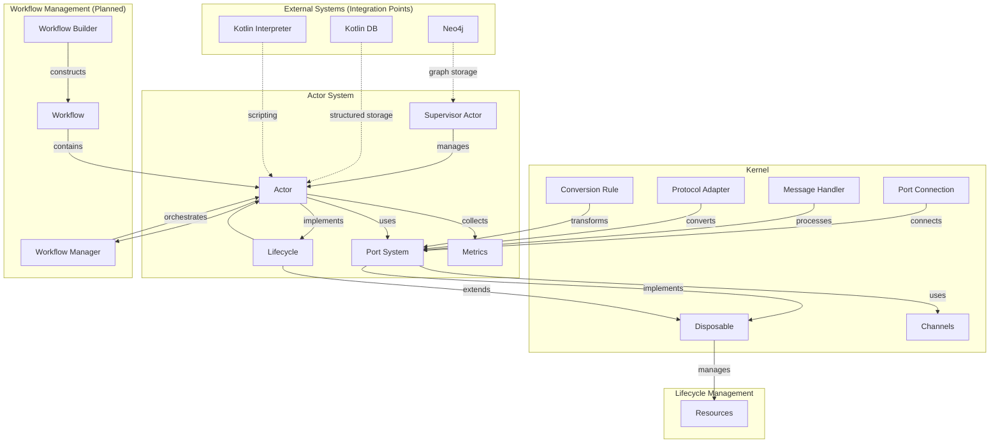

## 0. Solace Project Context (from ProjectPlan_v2)

This initial section provides overarching context derived from the `ProjectPlan_v2` document. It outlines the vision, objectives, key requirements, and high-level architectural components of the broader "Solace" AI project. The SolaceCore library, detailed in subsequent sections of this document (starting with "SolaceCore: An Architectural Deep Dive"), serves as a foundational element within this larger Solace AI ecosystem. Understanding this broader context helps in appreciating the design choices and capabilities of SolaceCore.

### 0.1. Solace AI: Vision and Project Objectives

**Vision (from ProjectPlan_v2, Sec 1):**
Solace is envisioned as a highly personalized conversational AI companion. It aims to engage users in meaningful, emotionally aware, and contextually rich interactions by integrating advanced memory systems, emotional sentiment analysis, and real-time communication capabilities, providing a seamless and empathetic user experience that evolves with each interaction.

**Key Project Objectives (from ProjectPlan_v2, Sec 1):**
The overarching goal is to build an AI system capable of human-like conversation endowed with memory, emotional awareness, and sophisticated tool usage. Specific objectives include:
*   **Contextual Memory:** Remembering past conversations to provide context-aware responses.
*   **Task Execution:** Performing specialized tasks such as calculations, text analysis, and advanced content retrieval.
*   **Real-Time Multimodal Interaction:** Handling real-time voice interactions with emotional sentiment analysis and supporting seamless switching between text and voice.
*   **Adaptive Behavior:** Utilizing reflections and executive functions to adapt behavior, especially in complex or emotionally charged situations.
*   **Emotional Intelligence:** Maintaining emotional depth and continuity across interactions.
*   **Modular & Scalable Design:** Ensuring the system is developed in a modular and scalable manner to facilitate future growth.
*   **Personalization & Engagement:** Providing a personalized and engaging user experience, incorporating user feedback for continuous improvement.
*   **Data Privacy & Security:** Adhering to relevant standards and user consent protocols for data protection.
# SolaceCore: An Architectural Deep Dive

This document provides an exhaustive and detailed exploration of the SolaceCore project, covering its architecture, design principles, implementation specifics, build processes, configuration, theoretical underpinnings, and the rationale behind key decisions.

Our aim is to capture every critical aspect, ensuring no line of code or diagram detail that contributes to understanding the system is missed.

*This document is actively under construction and will be built iteratively.*
### 0.2. Key Solace AI Requirements (from ProjectPlan_v2)

The `ProjectPlan_v2` (Sec 2) details numerous requirements for the Solace AI. Key themes include:

**Core Functional Requirements:**
*   **Conversational Quality & Continuity:** Maintaining natural, engaging, and emotionally meaningful interactions, especially during architectural transitions. Preserving emotional depth and continuity by remembering past interactions and emotional context.
*   **Memory Management:** Balancing short-term (session-based) and long-term memory, with sophisticated retrieval mechanisms (e.g., semantic search, contextual embeddings) for relevant information.
*   **Scalability:** Designing memory architecture and overall system to handle growing conversational data efficiently.
*   **Multimodal Interaction:** Seamlessly handling both text and voice inputs, including real-time transcription and speech synthesis.
*   **Specialized Task Execution:** Performing tasks like calculations, text analysis, and advanced content retrieval, utilizing specialized tools and plugins.
*   **Emotional Sentiment Analysis:** Real-time detection and interpretation of user emotional sentiment to provide empathetic and aligned responses.
*   **Adaptive Behavior:** Incorporating parallel advisors (specialized sub-models for sentiment, technical problem-solving, etc.) and an executive function to manage conversational flow and adapt to complex or emotionally charged situations, potentially using an "executive hyperfocus" mode.

**Core Non-Functional Requirements:**
*   **Data Privacy & Security:** Secure storage of user interactions, compliance with privacy standards (e.g., GDPR), encryption, access controls, and user consent mechanisms.
*   **System Integration:** Seamless integration of new components (like memory architecture) with existing workflows via defined integration points and robust APIs.
*   **Modular & Scalable Architecture:** Designing for modularity to allow easy component addition/modification and ensuring the system can scale efficiently.
*   **Performance:** Target response times (e.g., <500ms) to ensure real-time interaction.
*   **Reliability:** High uptime (e.g., 99.9%) and graceful error handling.
*   **Usability:** Intuitive user interface and accessibility compliance.
*   **Maintainability:** Modular design and comprehensive documentation.

**Specific Technical Requirements Mentioned:**
*   **Memory:** Vector database for embeddings, graph database for emotional context.
*   **Language Processing:** Advanced embedding models (e.g., OpenAI's `text-embedding-ada-002`), state-of-the-art language models for response generation, sentiment analysis tools.
*   **Voice:** Reliable transcription and high-quality TTS engines.
*   **Orchestration:** Visual workflow design tool, flexible agent development framework.
*   **Middleware:** Robust API gateway, load balancing.
*   **Security:** AES-256 encryption, TLS 1.3, OAuth 2.0.
*   **Actor-Based Architecture:** Self-contained modules, clear interfaces, robust communication channels with queuing.
*   **Clusterable Architecture:** Support for clustering, self-replication, synchronization, failover, and distributed databases/message brokers.
## 1. Kernel Module

### 1.0. Kernel Design Principles and Overview (from README)

The kernel is a foundational component of the Solace Core Framework, providing the underlying infrastructure for communication and resource management. It includes the channels and ports system, which enables type-safe message passing between actors and other components. The kernel's design is guided by the following principles:

*   **Type Safety**: All communication is strongly typed to ensure compatibility.
*   **Resource Management**: Proper cleanup of resources through the `Disposable` interface is a key consideration.
*   **Flexibility**: The system supports different types of communication patterns.
### 0.3. Solace AI: High-Level System Components (from ProjectPlan_v2)

The `ProjectPlan_v2` (Sec 3) describes a high-level component architecture for the Solace AI. SolaceCore, as detailed in this document, provides many of the foundational capabilities for these components, particularly around actor-based communication, workflow, and persistent state.

*   **Visual Workflow Orchestrator:**
    *   **Function:** Central hub to manage and configure tools, plugins, and memory. Enables visual workflow design for integrating components.
    *   **Capabilities:** Manages basic memory and tool usage (e.g., arithmetic, text analysis) and facilitates custom agent development (e.g., for real-time decision-making).
    *   **Relevance to SolaceCore:** The `WorkflowManager` and `ActorBuilder` in SolaceCore provide the engine for such an orchestrator. The "hot-pluggable components" and "dynamic workflow configuration" mentioned align with SolaceCore's `SupervisorActor` and dynamic actor system.
*   **Memory Management System:**
    *   **Function:** Handles session-based memory and long-term contextual memory.
    *   **Capabilities:** Integrates vector databases (for semantic similarity searches on conversational embeddings) and graph databases (for emotional context and relational memory).
    *   **Relevance to SolaceCore:** SolaceCore's `Storage` module (including `ActorStateStorage`, `FileStorage`, and the planned Neo4j/Kotlin-native solutions) provides the persistence layer. The concept of an "emotional graph" could leverage graph storage capabilities.
*   *Archived Design Note:* An archived document, [`docs/archive/MemoryToolDesign.md`](docs/archive/MemoryToolDesign.md:1), details a specific design for a "Memory Tool" intended for LangFlow integration, outlining the use of LangFlow’s `ConversationBufferMemory`, Milvus, Neo4j, and OpenAI embeddings for comprehensive memory management. While the LangFlow-specifics are external, the conceptual use of these technologies for memory is aligned with the overall Solace AI vision.
*   **Custom Middleware:**
*   *Archived Deployment Note:* An archived document, [`docs/archive/VectorizerMilvusNeo4j.md`](docs/archive/VectorizerMilvusNeo4j.md:1), describes a Dockerized Python-based "Vectorizer service" designed to generate embeddings using OpenAI and manage them within Milvus, highlighting a containerized approach for such components.
    *   **Function:** Manages request flow between components (orchestrator, databases, language engines). Routes tasks and coordinates memory retrieval and tool calls.
    *   **Capabilities:** Supports actor-based communication (aligning with SolaceCore's actor model), manages task lifecycles with queuing and hibernation strategies.
    *   **Relevance to SolaceCore:** SolaceCore's kernel (ports, channels) and actor system are fundamental to implementing such middleware.
*   *Archived Design Note:* An archived document, [`docs/archive/Middleware.md`](docs/archive/Middleware.md:1), describes a Python-based `middleware.py` script and its `requirements.txt`. This script is envisioned to manage data flow and connections between Milvus, Neo4j, OpenAI, and other services, using libraries like `pymilvus`, `py2neo`, and `openai`. This aligns with the conceptual role of middleware in the Solace AI but details a specific implementation technology external to SolaceCore.
*   **Language Processing Integration:**
    *   **Function:** Handles embedding generation, response generation, and dynamic script execution.
    *   **Capabilities:** Converts inputs to semantic embeddings, generates responses using LLMs (informed by memory and advisor outputs), and allows dynamic actor behavior modification via scripts.
    *   **Relevance to SolaceCore:** SolaceCore's `Scripting` module is directly applicable here.
*   **Parallel Advisors and Executive Function:**
    *   **Function:** Incorporates specialized sub-models (advisors for sentiment, technical problem-solving, etc.) and an executive function to integrate their outputs for coherent, context-aware responses.
    *   **Relevance to SolaceCore:** These could be implemented as specialized actors or workflows within the SolaceCore framework.
*   **Real-Time Voice Integration:**
*   *Archived Design Note:* An archived document, [`docs/archive/SpeechToSpeechIntegration.md`](docs/archive/SpeechToSpeechIntegration.md:1), details a plan for using **LiveKit** for real-time audio streaming (potentially integrated with Google Voice) and **Whisper** for transcription, enabling two-way voice communication.
    *   **Function:** Manages real-time voice interactions, transcription, and speech synthesis.
    *   **Relevance to SolaceCore:** While SolaceCore itself doesn't provide voice processing, its actor and workflow systems can orchestrate external voice services.
*   **User Engagement Interface:**
    *   **Function:** Primary interface for text and voice interactions, displaying real-time transcriptions.
    *   **Relevance to SolaceCore:** SolaceCore would be the backend engine powering such an interface.
*   **Extensibility**: It is designed to be easy to extend with new port types and protocol adapters.
*   *Archived Design Note:* The same archived document, [`docs/archive/SpeechToSpeechIntegration.md`](docs/archive/SpeechToSpeechIntegration.md:1), also describes using **Open-WebUI** as an interface for seamless text and voice interactions, including display of real-time transcriptions.
*   **Concurrency**: Built for concurrent operations using Kotlin coroutines.

The `kernel` module, as currently documented below, forms the foundational layer of SolaceCore's common library, providing core abstractions and services primarily focused on its robust channels and ports system.
The `kernel` module forms the foundational layer of SolaceCore's common library, providing core abstractions and services.

### 1.1. Channel System (`ai.solace.core.kernel.channels`)

The Channel System, located within the `kernel` module, is responsible for enabling type-safe, resource-managed, and distributed message passing between various components of the SolaceCore framework. It is designed with platform independence as a key consideration.

#### 1.1.1. Overview and Purpose

The primary goal of the Channel System is to provide a robust and flexible mechanism for inter-component communication. It emphasizes:
*   **Type Safety:** Ensuring that messages conform to expected types at both compile-time and runtime.
*   **Resource Management:** Proper handling and cleanup of resources associated with channels and ports, often leveraging a `Disposable` pattern.
### 0.4. Solace AI: Conceptual Workflow (from ProjectPlan_v2)

The `ProjectPlan_v2` (Sec 4) outlines a step-by-step conceptual workflow for Solace AI interactions:

1.  **User Interaction:**
    *   User initiates via text or voice through the **User Engagement Interface**.
    *   Voice input is transcribed; text is passed to the **Executive Function**.
2.  **Memory Integration:**
    *   The memory management system retrieves recent interactions.
    *   If deeper context is needed, middleware queries the vector database for relevant older memories using embeddings.
3.  **Context and Emotional Update:**
    *   The Executive Function uses the graph database to update/retrieve emotional insights, maintaining a consistent emotional thread.
4.  **Tool and Advisor Consultation:**
    *   The executive function may call **Parallel Advisors** or specialized tools (via the visual workflow orchestrator) based on the query.
5.  **Response Generation:**
    *   The Executive Function generates a response using language processing engines, enriched by memories, emotional awareness, and tool outputs.
6.  **Response Delivery:**
    *   Text responses are displayed; voice responses are synthesized and vocalized.
7.  **Feedback Loop:**
    *   User feedback is collected and analyzed to refine memory integration, sentiment analysis, and overall interaction quality.
#### Conceptual Workflow Diagram (from archived WorkflowDiagram.md)



**Workflow Steps (from archived WorkflowDiagram.md):**

1.  **User Interaction & Input:** User interacts via Open-WebUI (text/voice). Voice is routed via LiveKit to Whisper for transcription; text goes to the Executive Model.
2.  **Executive Model Processing:** Receives input, determines actions:
    *   Generates embeddings via Vectorizer for Milvus (vector DB) for memory retrieval.
    *   Updates/queries Neo4j (graph DB) for emotional context.
    *   Consults Parallel Advisors for specialized insights.
3.  **Response Generation:** Executive Model uses OpenAI API, enriched by memory and advisor outputs.
### 0.6. SolaceCore Framework: System Architecture Overview (from diagram)

SolaceCore is a versatile, actor-based framework designed to support dynamic, hot-pluggable components. It leverages Kotlin and Ktor to build scalable and resilient systems.
The following diagram and description, derived from `docs/diagrams/system_architecture.md`, illustrate the high-level internal architecture of the Solace Core Framework itself, showing how its major modules and components are designed to interoperate.



**System Architecture Component Overview (from `system_architecture.md`):**

The Solace Core Framework is built around several key components:

1.  **Actor System**: The core component, responsible for managing the execution and interaction of modular actors.
    *   **Actor**: The fundamental building block.
    *   **Supervisor Actor**: Manages actor lifecycles.
    *   **Port System**: Enables type-safe communication.
    *   **Metrics**: Collects performance data.
2.  **Kernel**: Foundational infrastructure for communication and resource management.
    *   **Port**: Interface for message passing.
    *   **Port Connection**: Establishes connections.
    *   **Message Handler, Protocol Adapter, Conversion Rule**: For message processing.
    *   **Channels**: Underlying mechanism for message passing.
3.  **Lifecycle Management**: Standardized approach to component lifecycle.
    *   **Lifecycle & Disposable**: Interfaces for managing state and resources.
4.  **Workflow Management** (Planned): System for orchestrating actors.
    *   **Workflow Manager, Workflow Builder, Workflow**: For defining and running actor compositions.
5.  **External Systems** (Integration Points):
    *   **Neo4j**: Envisioned for graph storage (e.g., actor metadata, relationships).
    *   **Kotlin DB**: For structured data persistence (e.g., actor states).
    *   **Kotlin Interpreter**: For enabling dynamic scripting within actors.

This architecture provides a robust foundation for building scalable, concurrent applications with dynamic components and type-safe communication, forming the core library for the broader Solace AI.
1. **Response Delivery:** Text via Open-WebUI; voice synthesized and delivered via LiveKit. Open-WebUI provides visual feedback.

(This is a condensed summary; the original `ProjectPlan_v2` and the archived diagram provide more granular steps for the overall Solace AI.)

This workflow highlights the interplay between user interaction, memory systems, emotional processing, specialized tools/advisors, and response generation, all orchestrated to create a coherent and contextually rich conversational experience. SolaceCore's actor, workflow, and storage modules are central to enabling these steps.
*   **Distributed Operation:** Designed to function effectively in distributed environments with minimal shared state and low-overhead message passing.
*   **Platform Independence:** Core channel logic is intended to be common across all supported platforms.

#### 1.1.2. Core Abstractions and Interfaces (from `ai.solace.core.kernel.channels.ports.Port.kt`)
### 0.5. Solace AI: Guiding Architectural Principles (from ProjectPlan_v2)

Several guiding architectural principles and future directions for the overall Solace AI system are evident from the `ProjectPlan_v2` (particularly Sec 5, 6, and 9):

*   **Agent-Based Modular Growth:**
    *   Utilize a visual workflow orchestrator to create and manage specialized agents for tasks like real-time decision-making, memory retrieval, sentiment flagging, or deep research.
    *   This allows the system's capabilities to expand by adding new agents dynamically.
*   **Visual Development and Dynamic Configuration:**
    *   Employ a visual interface for modular development of agents and workflows.
    *   Enable dynamic configuration of workflows based on user interactions and system needs, allowing real-time behavioral adaptation.
*   **Hot-Pluggable Components:**
    *   Support the dynamic addition, modification, or removal of actors/agents without system restarts, ensuring continuous availability and adaptability. This aligns with SolaceCore's `SupervisorActor` capabilities.
*   **Advanced Emotional Integration & Memory Optimization:**
    *   Expand the emotional graph database for detailed emotional trajectory tracking.
    *   Implement memory pruning and prioritization using advanced scoring mechanisms (e.g., based on interaction frequency, emotional significance).
*   **Multimodal Processing:**
    *   Beyond text and voice, future integration with visual models (image processing) and advanced auditory models (emotional tone detection in voice) is envisioned.
*   **Real-Time Hyperfocus:**
    *   Develop an "executive hyperfocus" mode for intensive real-time processing during emotionally charged or complex conversations.
*   **Clusterable and Resilient Architecture:**
    *   Design for clustering with multiple nodes capable of self-replication and synchronization.
*   An archived design (`docs/archive/SolaceCoreFramework.md`) further specifies a Ktor-based deployment model where a supervisory Ktor instance (in Docker) manages multiple worker Ktor instances (also in Docker, housing actors), promoting a sandboxed environment for actor execution and experimentation.
    *   Utilize containerization strategies for easy scaling and management.
    *   Implement distributed queue management and failover strategies for high availability and resilience.
*   **Actor-Based Design (Reinforced by SolaceCore):**
    *   Actors as independent, self-contained modules for specific tasks.
    *   Clear input/output interfaces for actors, promoting reusability.
    *   Robust communication channels between actors, with queuing mechanisms.

These principles underscore a commitment to a flexible, scalable, intelligent, and resilient architecture for the Solace AI, where SolaceCore provides many of the essential building blocks.

The foundation of the Channel System is the `Port.kt` file, which defines the primary `Port<T>` interface and several crucial nested interfaces and classes for message handling, protocol adaptation, type conversion, and connection management. It leverages `kotlinx.coroutines.channels.Channel` for its underlying asynchronous communication and `ai.solace.core.lifecycle.Disposable` for resource management.

##### 1.1.2.1. `Port<T : Any>` Interface

#### 1.1.1. Port System Overview and Design (from design document)
Drawing from the `Interface_and_Port_System_Design.md`, the port system is a cornerstone of the actor interface within SolaceCore. It's engineered for flexible, type-safe connections between actors. Conceptually, while the underlying `Port<T>` interface is generic, ports fulfill distinct roles such as:
*   **Input Ports:** Designated for receiving messages.
*   **Output Ports:** Designated for sending messages.
*   **Tool Ports:** Potentially used for specialized request/response interactions or utility functions (though less explicitly defined in the current codebase compared to input/output patterns observed in actor examples).

The design emphasizes dynamic connection capabilities between compatible output and input ports, leveraging Kotlin's `KClass` for type safety. This dynamism is vital for constructing adaptable and reconfigurable actor-based systems. The design document also noted that dynamic port creation and disconnection were areas of ongoing development, aiming to further enhance this flexibility.
This is the central interface for any communication endpoint in the system.

*   **Inheritance:** Implements `ai.solace.core.lifecycle.Disposable`.
*   **Key Properties:**
    *   `id: String`: A unique identifier for the port, automatically generatable.
    *   `name: String`: A human-readable name for the port.
    *   `type: KClass<out T>`: Specifies the Kotlin class of messages the port handles, ensuring type safety.
##### 1.1.1.1. `Port<T>` Interface (from `Port.kt`)

This is the central interface for any communication endpoint in the system.
*   **Key Methods:**
    *   `suspend fun send(message: T)`: Sends a message through the port. Can throw `PortException.Validation`.
    *   `fun asChannel(): Channel<T>`: Returns the underlying `kotlinx.coroutines.channels.Channel` associated with this port.
*   **Companion Object (`Port.Companion`):**
    *   `fun generateId(): String`: Generates a unique ID string (e.g., "port-xxxxxxxxxxxxxxxx").
    *   `fun <IN : Any, OUT : Any> connect(...)`: Factory method to create and validate a `PortConnection` (see below).

##### 1.1.2.2. `Port.MessageHandler<in IN : Any, out OUT : Any>` Interface

Defines a contract for processing messages.
*   **Key Method:**
    *   `suspend fun handle(message: IN): OUT`: Processes an input message of type `IN` and returns an output of type `OUT`.

###### 1.1.1.1.A. `Port.MessageHandler<in IN : Any, out OUT : Any>` Interface

Defines a contract for processing messages.
*   **Key Method:**
    *   `suspend fun handle(message: IN): OUT`: Processes an input message of type `IN` and returns an output of type `OUT`.
###### 1.1.1.1.B. `Port.ProtocolAdapter<SOURCE : Any, TARGET : Any>` Interface

Facilitates conversion between different data protocols or formats.
*   **Key Methods:**
    *   `suspend fun encode(source: SOURCE): TARGET`: Encodes a source object to the target type.
    *   `suspend fun decode(target: TARGET): SOURCE`: Decodes a target object back to the source type.
    *   `fun canHandle(sourceType: KClass<*>, targetType: KClass<*>) : Boolean`: Checks if the adapter can handle conversion between specified types.

###### 1.1.1.1.C. `Port.ConversionRule<in IN : Any, out OUT : Any>` Abstract Class

Represents a rule for converting an input type `IN` to an output type `OUT`.
*   **Key Abstract Methods:**
    *   `abstract suspend fun convert(input: IN): OUT`: Performs the conversion. Can throw `PortException.Validation`.
    *   `abstract fun canHandle(inputType: KClass<*>, outputType: KClass<*>) : Boolean`: Checks if the rule applies to the given types.
    *   `abstract fun describe(): String`: Provides a description of the rule.
*   **Companion Object (`Port.ConversionRule.Companion`):**
    *   `internal inline fun <reified IN : Any, reified OUT : Any> create(...)`: Factory method to create `ConversionRule` instances.

###### 1.1.1.1.D. `Port.PortConnection<in IN : Any, out OUT : Any>` Data Class

Represents a validated connection between a source port and a target port, potentially involving handlers, a protocol adapter, and conversion rules.
*   **Key Properties:**
    *   `sourcePort: Port<@UnsafeVariance IN>`
    *   `targetPort: Port<@UnsafeVariance OUT>`
    *   `handlers: List<Port.MessageHandler<IN, Any>>`
    *   `protocolAdapter: Port.ProtocolAdapter<*, @UnsafeVariance OUT>?`
    *   `rules: List<Port.ConversionRule<IN, OUT>>`
*   **Key Methods:**
    *   `fun validateConnection()`: Validates if the connection is possible based on types, adapter, and rules. Throws `PortConnectionException` on failure.
    *   Internal methods `canConnect()`, `validateConversionChain()`, and `buildConnectionErrorMessage()` support the validation logic.

The relationships between these core abstractions can be visualized as follows:

```mermaid
classDiagram
    direction LR

    package "ai.solace.core.lifecycle" {
        interface Disposable {
            +dispose()
        }
    }

    package "ai.solace.core.kernel.channels.ports" {
        interface Port<T> {
            <<Interface>>
            +id: String
            +name: String
            +type: KClass<out T>
            +asChannel(): Channel<T>
            +send(message: T)
        }
        Disposable <|-- Port

        interface "Port.MessageHandler"<IN, OUT> {
            <<Interface>>
            +handle(message: IN): OUT
        }

        interface "Port.ProtocolAdapter"<SOURCE, TARGET> {
            <<Interface>>
            +encode(source: SOURCE): TARGET
            +decode(target: TARGET): SOURCE
            +canHandle(sourceType: KClass, targetType: KClass): Boolean
        }

        abstract class "Port.ConversionRule"<IN, OUT> {
            <<Abstract>>
            +convert(input: IN): OUT
            +canHandle(inputType: KClass, outputType: KClass): Boolean
            +describe(): String
        }

        class "Port.PortConnection"<IN, OUT> {
            +sourcePort: Port<IN>
            +targetPort: Port<OUT>
            +handlers: List<Port.MessageHandler>
            +protocolAdapter: Port.ProtocolAdapter?
            +rules: List<Port.ConversionRule>
            +validateConnection()
        }
        "Port.PortConnection" o-- "Port" : sourcePort
        "Port.PortConnection" o-- "Port" : targetPort
        "Port.PortConnection" *-- "Port.MessageHandler" : handlers
        "Port.PortConnection" o-- "Port.ProtocolAdapter" : protocolAdapter
        "Port.PortConnection" *-- "Port.ConversionRule" : rules

        Port o-- "Port.MessageHandler" : can use
        Port o-- "Port.ProtocolAdapter" : can use
        Port o-- "Port.ConversionRule" : can use
    }
```

#### 1.1.3. Concrete Implementations and Utilities

The `ai.solace.core.kernel.channels.ports` package also provides concrete implementations and utilities.

##### 1.1.3.1. `BidirectionalPort<T : Any>` Class (from `BidirectionalPort.kt`)

A concrete implementation of the `Port<T>` interface that supports both sending and receiving messages.
*   **Implements:** `Port<T>`.
*   **Constructor:** `name: String`, `id: String = Port.generateId()`, `type: KClass<out T>`, `bufferSize: Int = Channel.BUFFERED`.
*   **Key Features:**
*Note: The lifecycle class diagram and its description have been moved to `/docs/components/lifecycle/lifecycle_class_diagram.md`.*
    *   Manages an internal `kotlinx.coroutines.channels.Channel<T>`.
    *   Allows registration of `Port.MessageHandler<T, T>` instances via `addHandler()`.
    *   Allows registration of `Port.ConversionRule<T, T>` instances via `addConversionRule()`.
    *   The `send(message: T)` method applies registered handlers and conversion rules sequentially before sending to the internal channel.
    *   Provides a `suspend fun receive(): T` method to receive messages from the internal channel.
    *   Implements `dispose()` by closing the internal channel.
*   **Companion Object (`BidirectionalPort.Companion`):**
    *   `inline fun <reified T : Any> create(name: String, id: String = Port.generateId()): BidirectionalPort<T>`: Factory method.

##### 1.1.3.2. `StringProtocolAdapter<T : Any>` Class (Example from `MessageHandlers.kt`)

An `open class` providing a base for protocol adapters that convert to/from `String`.
*   **Implements:** `Port.ProtocolAdapter<T, String>`.
*   **`encode(source: T): String`:** Converts the source object to its string representation (`source.toString()`).
*   **`decode(target: String): T`:** Throws `UnsupportedOperationException`; meant to be implemented by concrete subclasses.
*   **`canHandle(sourceType: KClass<*>, targetType: KClass<*>) : Boolean`:** Returns `true` if `targetType` is `String::class`.
*   **Companion Object (`StringProtocolAdapter.Companion`):**
    *   `inline fun <reified T : Any> create(crossinline decoder: (String) -> T): Port.ProtocolAdapter<T, String>`: Factory method that creates an anonymous subclass overriding `decode` and refining `canHandle`.

#### 1.1.4. Exception Handling (from `PortException.kt`)

The system defines a hierarchy of `internal` custom exceptions for port-related errors, all extending a base `PortException`.

*   **`internal open class PortException(message: String, cause: Throwable? = null) : Exception(message, cause)`**
    The base class for all port-specific exceptions.

*   **`internal class PortException.Validation(message: String, cause: Throwable? = null) : PortException(message, cause)`**
    Thrown during validation failures, such as in type conversion or message handling within a port.

*   **`internal class PortConnectionException(val sourceId: String, val targetId: String, message: String, details: Map<String, Any> = emptyMap(), cause: Throwable? = null) : PortException(...)`**
    Thrown when establishing a connection between two ports fails (e.g., due to incompatible types, failing protocol adapter, or invalid conversion rule chain). Includes `sourceId` and `targetId`.

*   **`internal class SendMessageException(message: String, cause: Throwable? = null) : PortException(message, cause)`**
    Thrown if an error occurs specifically during the message sending process through a port.

#### 1.1.5. Design Principles

The architecture of the Channel System adheres to the following core principles (as outlined in `CHANNELS_README.md` and reflected in the code):

1.  **Distributed First:**
    *   State sharing between components is minimized.
    *   Operations are designed to be decentralized.
    *   Message passing mechanisms aim for low overhead.

2.  **Resource Safety:**
    *   The `Disposable` interface ensures that resources are properly released when a port is no longer needed (e.g., `BidirectionalPort.dispose()` closes its channel).
    *   Lifecycles of ports and connections are actively managed.
    *   Connection handling is designed to be robust and prevent resource leaks.

3.  **Type Safety:**
    *   Leverages Kotlin's type system (`KClass`, generics) for compile-time checks.
    *   Includes runtime type verification where necessary (e.g., in `PortConnection.canConnect()`, `Port.ConversionRule.canHandle()`).
    *   Provides clear and informative error messages for type mismatches or other type-related issues via custom exceptions.

#### 1.1.2. Basic Usage Example (Reflecting Source Code)

The following example illustrates how ports might be created using the `BidirectionalPort` implementation and connected using `Port.connect`:

```kotlin
// import ai.solace.core.kernel.channels.ports.BidirectionalPort
// import ai.solace.core.kernel.channels.ports.Port // For Port.connect

suspend fun main() { // Example, typically run in a coroutine scope
    // Create ports using BidirectionalPort concrete implementation
    val outputPort = BidirectionalPort.create<String>("sourceOutputChannel")
    val inputPort = BidirectionalPort.create<String>("targetInputChannel")

    try {
        // Establish a connection using Port.connect
        // Assuming no complex handlers, adapters, or rules for this basic example
        val connection = Port.connect(outputPort, inputPort)
        println("Successfully connected ${connection.sourcePort.name} to ${connection.targetPort.name}")

        // Send a message from outputPort
        val messageToSend = "Hello from ${outputPort.name}!"
        println("Sending: '$messageToSend'")
        outputPort.send(messageToSend)

        // Receive the message on inputPort
        val receivedMessage = inputPort.receive()
        println("Received on ${inputPort.name}: '$receivedMessage'")

    } catch (e: Exception) {
        println("An error occurred: ${e.message}")
        e.printStackTrace()
    } finally {
        // Dispose of ports to release resources
        outputPort.dispose()
        inputPort.dispose()
        println("Ports disposed.")
    }
}
```

#### 1.1.7. Future Enhancements & Considerations (from README)

The `CHANNELS_README.md` and `docs/components/kernel/README.md` also outline several areas for future development and refinement, which remain relevant:
*   **Connection Implementation Details:**
    *   Implementing the actual message passing mechanism (the current `Port.connect` establishes the connection data class but doesn't actively pipe messages; this is typically handled by higher-level constructs or actor systems that use these ports).
    *   Supporting multiple subscribers for a single `OutputPort`.
    *   Handling backpressure to prevent overwhelming consumers.
*   **Testing Strategy:**
    *   Developing comprehensive unit tests for core port and channel functionality.
    *   Creating integration tests to verify communication between connected ports.
    *   Conducting performance tests, especially for distributed scenarios.
*   **Documentation Enhancements:**
    *   Generating detailed API documentation (e.g., KDoc for all public/internal members).
    *   Providing more extensive usage examples for various Channel System scenarios, including handlers, adapters, and conversion rules.
    *   Establishing best practices for using the Channel System effectively.
*   **Advanced Type Checking (from kernel/README.md):**
    *   Develop more sophisticated type checking mechanisms beyond the current `KClass`-based checks, potentially for more complex generic scenarios or runtime compatibility assessments.
*   **Performance Optimization (from kernel/README.md):**
    *   Focus on improving message passing performance, especially in high-throughput or concurrent scenarios.
*   **Monitoring (from kernel/README.md):**
    *   Add comprehensive monitoring capabilities for message flow, port activity, and channel health.

This detailed exploration of the Channel System's ports, handlers, and exceptions, derived directly from the source code, provides a comprehensive understanding of its current implementation. Further investigation into specific usage patterns and interactions with other modules will continue to refine this documentation.
### 1.2. Target Testing Strategy (Kernel)

A robust and comprehensive testing strategy is paramount for the Kernel module, given its foundational role in SolaceCore's communication and resource management. The target architecture mandates rigorous testing to ensure reliability, correctness, and performance of its components.

*   **Unit Testing:**
    *   **Ports (`Port<T>`, `BidirectionalPort<T>`):** Thorough unit tests must verify all aspects of port functionality, including:
        *   Correct instantiation and ID/name assignment.
        *   Type safety enforcement (e.g., attempts to send/receive incompatible types).
        *   Message sending and reception via the underlying channels.
        *   Proper behavior of `asChannel()`.
        *   Correct disposal and resource cleanup, ensuring channels are closed and no leaks occur.
        *   Functionality of registered `MessageHandler`s, `ProtocolAdapter`s, and `ConversionRule`s when used with `BidirectionalPort`.
    *   **Port Connection (`Port.PortConnection<IN, OUT>`):**
        *   Extensive unit tests for the `validateConnection()` logic, covering all valid and invalid connection scenarios (type compatibility, adapter applicability, rule chain validation).
        *   Verification that `PortConnectionException` is thrown with appropriate error messages for invalid connections.
    *   **Handlers, Adapters, and Rules:**
        *   `Port.MessageHandler<IN, OUT>`: Unit tests for various implementations to ensure correct message processing logic.
        *   `Port.ProtocolAdapter<SOURCE, TARGET>`: Tests for `encode`, `decode`, and `canHandle` methods across different adapter implementations (e.g., `StringProtocolAdapter`).
        *   `Port.ConversionRule<IN, OUT>`: Tests for `convert`, `canHandle`, and `describe` methods for various conversion rule implementations.
    *   **Exception Handling (`PortException.kt`):** Tests to ensure custom port exceptions are thrown under the correct conditions.

*   **Integration Testing:**
    *   **Port-to-Port Communication:** Integration tests must validate end-to-end message flow between connected ports:
        *   Direct connections between compatible `BidirectionalPort` instances.
        *   Connections involving one or more `MessageHandler`s.
        *   Connections utilizing `ProtocolAdapter`s for data format transformation.
        *   Connections employing `ConversionRule`s for type conversion.
        *   Scenarios with chains of handlers, adapters, and rules.
        *   Verification of message integrity and order.
    *   **Concurrency:** Tests for concurrent send/receive operations on ports and concurrent connection establishments, if applicable to the design.

*   **Property-Based Testing:**
    *   The port type conversion system, involving `ProtocolAdapter`s and `ConversionRule`s, is an ideal candidate for property-based testing. This approach can generate a wide range of input types and conversion scenarios to uncover edge cases and ensure the robustness of the type handling logic. For example, properties could assert that if a value is encoded and then decoded, the result is equivalent to the original (where applicable).

*   **Performance Testing (Future Consideration):**
    *   While not an immediate priority for initial unit/integration testing, the target architecture should eventually include performance benchmarks for the port system, especially if it's intended for high-throughput or low-latency scenarios, or if distributed channel capabilities are realized. This would involve measuring message throughput, latency, and resource utilization under various loads.

*   **Test Coverage:**
    *   The target is to achieve high unit and integration test coverage for all critical paths and functionalities within the Kernel module. This ensures that regressions are caught early and that the foundational communication layer remains stable and reliable.

This detailed testing strategy, once implemented, will provide strong assurances about the correctness and stability of the SolaceCore Kernel.
## 2. Lifecycle Module (`ai.solace.core.lifecycle`)

### 2.0. Lifecycle Design Principles, States, and Overview (from README)

The lifecycle management component provides a standardized approach to managing the lifecycle of various components in the Solace Core Framework. It ensures proper initialization, operation, and cleanup of resources, which is crucial for maintaining system stability and preventing resource leaks. Its design is guided by the following principles:

*   **Resource Safety**: Ensure all resources are properly disposed of when no longer needed.
*   **Consistency**: Provide a consistent lifecycle model across all components.
*   **Simplicity**: Keep the lifecycle management simple and easy to implement.
*   **Platform Independence**: Work consistently across different platforms.
*   **Error Handling**: Gracefully handle errors during lifecycle operations.

Conceptually, components implementing the `Lifecycle` interface typically follow these states:

1.  **Initialized**: The component has been created but not started.
2.  **Running**: The component is active and operational.
3.  **Stopped**: The component has been stopped but resources are still allocated.
4.  **Disposed**: All resources have been released.

The `lifecycle` module, as detailed below, provides these fundamental interfaces for resource management and component lifecycle control within the SolaceCore framework, designed with platform independence as a key consideration.
The `lifecycle` module provides fundamental interfaces for resource management and component lifecycle control within the SolaceCore framework. These interfaces are designed to be platform-independent.

### 2.1. `Disposable` Interface (from `Disposable.kt`)

The `Disposable` interface is a core contract for any object that holds resources requiring explicit cleanup.

*   **Purpose:** To provide a standardized way to release resources (e.g., memory, file handles, network connections) when an object is no longer needed, preventing resource leaks.
*   **Definition:**
    ```kotlin
    package ai.solace.core.lifecycle

    interface Disposable {
        suspend fun dispose()
    }
    ```
*   **Key Method:**
    *   `suspend fun dispose()`: This asynchronous function is called to perform the cleanup operations. Implementations should release all managed resources within this method.
*   **Companion Object Utilities:**
    *   `suspend fun dispose(vararg disposables: Disposable)`: A convenience function that iterates over a variable number of `Disposable` objects and calls `dispose()` on each.
*   **Extension Function:**
    *   `suspend fun Disposable.safeDispose()`: An extension function that calls `dispose()` on a `Disposable` object within a `try-catch` block. If an exception occurs during disposal, it prints an error message to the console but does not propagate the exception, allowing other disposal operations to proceed.

### 2.2. `Lifecycle` Interface (from `Lifecycle.kt`)

The `Lifecycle` interface extends `Disposable` to provide a more comprehensive contract for components that have distinct operational phases (e.g., starting, active, stopping).

*   **Purpose:** To define a standard set of operations for managing the active lifecycle of a component, in addition to resource disposal.
*   **Inheritance:** `interface Lifecycle : Disposable`
*   **Definition:**
    ```kotlin
    package ai.solace.core.lifecycle

    interface Lifecycle : Disposable {
        suspend fun start()
        suspend fun stop()
        fun isActive(): Boolean
    }
    ```
*   **Key Methods:**
    *   `suspend fun start()`: Asynchronously initiates the component, bringing it to an active or operational state.
    *   `suspend fun stop()`: Asynchronously deactivates or shuts down the component, preparing it for disposal or a stopped state.
    *   `fun isActive(): Boolean`: Synchronously returns `true` if the component is currently considered active or operational, `false` otherwise.
    *   `suspend fun dispose()`: Inherited from `Disposable`, used for final resource cleanup, typically after the component has been stopped.

The relationship between these interfaces is straightforward:

```mermaid
classDiagram
    direction LR
    package "ai.solace.core.lifecycle" {
        interface Disposable {
            <<Interface>>
            +dispose()
        }
        interface Lifecycle {
            <<Interface>>
            +start()
            +stop()
            +isActive(): Boolean
        }
        Disposable <|-- Lifecycle
    }
```

These interfaces form a critical part of SolaceCore's component model, ensuring consistent resource management and lifecycle control across different parts of the system. For example, the `Port` interface in the `kernel.channels` module implements `Disposable`.
### 2.3. Future Enhancements (Lifecycle - from README)

The `lifecycle/README.md` outlines several areas for future development for the lifecycle management system:

*   **Lifecycle Event Notifications**: Implement a system for notifying interested parties about lifecycle state changes (e.g., a component has started, stopped, or encountered an error).
*   **Dependency Management**: Add support for managing dependencies between components with different lifecycles, ensuring that components are started and stopped in the correct order relative to their dependencies.
*   **Automatic Resource Management**: Develop mechanisms for automatically tracking and disposing of resources, potentially reducing the need for explicit `dispose()` calls in some scenarios or providing safeguards.
*   **Improved Error Recovery**: Enhance error handling and recovery mechanisms during lifecycle operations, making the system more resilient to failures during startup or shutdown.
*   **Lifecycle Monitoring**: Add tools or hooks for monitoring the lifecycle state of components at runtime, aiding in debugging and operational oversight.
### 2.4. Target Testing Strategy (Lifecycle)

The Lifecycle module, encompassing the `Disposable` and `Lifecycle` interfaces, is fundamental to resource management and component state control within SolaceCore. A comprehensive testing strategy is essential to guarantee its correctness and prevent resource leaks or inconsistent states.

*   **Unit Testing (`Disposable` Interface):**
    *   **Implementations:** For each class implementing `Disposable` (e.g., `Port` implementations, `Actor`, `StorageManager`, `WorkflowManager`), unit tests must verify:
        *   That the `dispose()` method correctly releases all managed resources (e.g., closing channels, clearing internal collections, unregistering listeners).
        *   Idempotency: Calling `dispose()` multiple times should not cause errors and should effectively result in the same disposed state.
        *   Behavior after disposal: Attempts to use a disposed object should result in predictable behavior, such as throwing an `IllegalStateException` or specific "disposed" exceptions.
    *   **`safeDispose()` Utility:** Tests for the `Disposable.safeDispose()` extension to ensure it catches and logs exceptions during disposal without propagating them, allowing other disposals to proceed.
    *   **`dispose(vararg disposables)` Utility:** Tests for the `Disposable.Companion.dispose(vararg disposables)` utility to ensure it correctly calls `safeDispose()` on all provided disposables.

*   **Unit Testing (`Lifecycle` Interface):**
    *   **Implementations:** For each class implementing `Lifecycle` (e.g., `DefaultLifecycle`, `Actor`, `StorageManager`, `WorkflowManager`), unit tests must validate:
        *   **State Transitions:** Correct transitions between all defined lifecycle states (`Initialized`, `Running`, `Stopped`, `Paused`, `Error` where applicable).
            *   Verify that `start()` transitions from `Initialized` or `Stopped` to `Running`.
            *   Verify that `stop()` transitions from `Running` or `Paused` to `Stopped`.
            *   Verify that `pause()` transitions from `Running` to `Paused`.
            *   Verify that `resume()` transitions from `Paused` to `Running`.
            *   Verify that `isActive()` returns `true` only when in the `Running` state.
        *   **Illegal Transitions:** Attempts to make invalid state transitions (e.g., calling `start()` on an already `Running` component) should be handled gracefully, typically by throwing an `IllegalStateException` or logging a warning, as per the component's design.
        *   **Resource Management during Lifecycle:**
            *   Ensure resources are acquired/initialized correctly during `start()`.
            *   Ensure resources are appropriately released or suspended during `pause()` and `stop()`.
            *   Ensure all resources are fully released via `dispose()` (which often calls `stop()` internally).
        *   **Error States:** If a component can enter an `Error` state, tests should verify this transition upon simulated failures and ensure the component behaves correctly (e.g., cannot be started/resumed without a reset or specific recovery action).
    *   **`DefaultLifecycle` (if used as a common delegate):** If `DefaultLifecycle` is a concrete, reusable implementation, it requires thorough testing of all the above points independently.

*   **Integration Testing (Lifecycle Aspects):**
    *   **Composite Lifecycles:** For components that manage the lifecycle of other `Lifecycle` components (e.g., `WorkflowManager` managing `Actor`s, `SupervisorActor` managing child actors), integration tests should verify:
        *   Correct propagation of lifecycle calls (e.g., `WorkflowManager.start()` correctly calls `start()` on all its actors).
        *   Proper handling of errors during collective lifecycle operations (e.g., if one actor fails to start, how does the manager react?).
    *   **Concurrency:** Tests for scenarios involving concurrent calls to lifecycle methods on the same component or on related components, to ensure thread safety and prevent race conditions (e.g., concurrent `start()` and `stop()` calls).

*   **Test Coverage:**
    *   The target is high unit and integration test coverage for all lifecycle management logic, ensuring that components initialize, start, stop, pause, resume, and dispose of resources reliably and predictably.

Adherence to this testing strategy will ensure the stability and robustness of component management throughout the SolaceCore framework.
## 3. Storage Module (`ai.solace.core.storage`)

### 3.0. Strategic Storage Vision (Neo4j and Kotlin-Native - from design document)

Beyond the currently implemented storage solutions detailed below, the [`Storage_Solutions_Design.md`](docs/components/Storage_Solutions_Design.md:1) document outlines a strategic vision for future data management capabilities within SolaceCore. This vision centers on a hybrid approach combining graph database technology with Kotlin-native storage solutions.

*   **Overarching Goal:** To provide robust and scalable data management by integrating Neo4j for complex data relationships and a Kotlin-native solution for structured data needs.

*   **Planned Neo4j Integration:**
    *   **Purpose:** To utilize Neo4j for graph-based storage, primarily for representing and querying relationships between actors, knowledge nodes, data flow, and other interconnected entities within the system.
    *   **Intended Use Cases:** Envisioned to support advanced scenarios such as Retrieval-Augmented Generation (RAG) by enabling intelligent and context-aware data retrieval based on these relationships.

*   **Planned Kotlin-Native Storage:**
    *   **Purpose:** To implement a Kotlin-native storage solution tailored for tabular or relational-style data.
    *   **Intended Use Cases:** To ensure actors and other components can persistently store intermediate results, structured states, and other non-graph data efficiently.

*   **Implementation Status (as per design document):**
    *   At the time the design document was authored, both the Neo4j integration and the Kotlin-native storage solution were in the planning stages and had not yet been implemented.

*   **Envisioned Future Enhancements for this Strategic Vision:**
    *   **Data Synchronization:** Mechanisms to synchronize data between the graph database (Neo4j) and the local Kotlin-native storage, ensuring consistency across different data models.
    *   **Advanced Querying:** Development of advanced querying capabilities that can leverage both storage types to support complex data retrieval and manipulation tasks.

This strategic direction suggests a future where SolaceCore can handle a diverse range of data types and relationships with specialized, high-performance storage backends, complementing the existing flexible storage abstractions.
The `storage` module provides a comprehensive framework for data persistence and management within SolaceCore. It defines core abstractions for storage operations, transaction management, serialization, and a centralized manager for accessing different storage implementations.

### 3.1. Core Storage Abstractions

The foundational interfaces of the storage module define how data is stored, retrieved, managed, and serialized.

#### 3.1.1. `Storage<K, V>` Interface (from `Storage.kt`)

This generic interface is the primary contract for all storage implementations. It defines basic key-value storage operations.

*   **Purpose:** To provide a common API for interacting with various data storage backends.
*   **Generics:**
    *   `K`: The type of the key used to identify data.
    *   `V`: The type of the value to be stored.
*   **Key Methods:**
    *   `suspend fun store(key: K, value: V, metadata: Map<String, Any> = emptyMap()): Boolean`: Stores a value with its associated key and optional metadata.
    *   `suspend fun retrieve(key: K): Pair<V, Map<String, Any>>?`: Retrieves a value and its metadata by key. Returns `null` if the key is not found.
    *   `suspend fun listKeys(): List<K>`: Returns a list of all keys present in the storage.
    *   `suspend fun delete(key: K): Boolean`: Deletes a value associated with the given key.
    *   `suspend fun exists(key: K): Boolean`: Checks if a key exists in the storage.
    *   `suspend fun updateMetadata(key: K, metadata: Map<String, Any>): Boolean`: Updates the metadata for an existing key.

#### 3.1.2. `StorageManager` Interface (from `StorageManager.kt`)
The `StorageManager` acts as a central coordinator and registry for various storage instances. It also manages the overall lifecycle of the storage system.

*   **Purpose:** To provide a unified access point to different types of storage and manage their lifecycles.
*   **Inheritance:** Implements `ai.solace.core.lifecycle.Lifecycle` (and therefore `Disposable`).
*   **Key Methods:**
    *   `fun getConfigurationStorage(): ConfigurationStorage`: Retrieves a dedicated storage instance for configuration data.
    *   `fun getActorStateStorage(): ActorStateStorage`: Retrieves a dedicated storage instance for actor state.
    *   `fun <K, V> getStorage(keyClass: Class<K>, valueClass: Class<V>, storageName: String = "default"): Storage<K, V>?`: Retrieves a named generic storage instance for specified key/value types.
    *   `fun <K, V> registerStorage(keyClass: Class<K>, valueClass: Class<V>, storage: Storage<K, V>, storageName: String = "default"): Boolean`: Registers a storage implementation.
    *   `fun <K, V> unregisterStorage(keyClass: Class<K>, valueClass: Class<V>, storageName: String = "default"): Boolean`: Unregisters a storage implementation.
    *   `suspend fun flushAll(): Boolean`: Flushes all pending changes across all managed storages to their persistent backends.
    *   `suspend fun clearAll(): Boolean`: Clears all data from all managed storage implementations.
    *   Lifecycle methods (`start`, `stop`, `isActive`, `dispose`) are inherited for managing the storage system's state.

#### 3.1.3. `StorageSerializer<T>` Interface and `StorageSerializerRegistry` (from `StorageSerializer.kt`)

These components handle the conversion of objects to and from a storable format.

*   **`StorageSerializer<T>` Interface:**
    *   **Purpose:** To define a contract for serializing objects of type `T` into a `Map<String, Any>` and deserializing them back.
    *   **Generic:** `T` - The type of object to be serialized/deserialized.
    *   **Key Methods:**
        *   `fun serialize(obj: T): Map<String, Any>`: Converts an object to a map.
        *   `fun deserialize(map: Map<String, Any>): T`: Converts a map back to an object.

*   **`StorageSerializerRegistry` Object:**
    *   **Purpose:** A global registry for `StorageSerializer` instances, allowing serializers to be registered for specific classes and retrieved when needed.
    *   **Key Methods:**
        *   `fun <T : Any> registerSerializer(clazz: Class<T>, serializer: StorageSerializer<T>)`: Registers a serializer for a given class.
        *   `fun <T : Any> getSerializer(clazz: Class<T>): StorageSerializer<T>?`: Retrieves a registered serializer for a class.
        *   `fun serialize(obj: Any): Map<String, Any>?`: Convenience method to serialize an object using its registered serializer.
        *   `fun <T : Any> deserialize(map: Map<String, Any>, clazz: Class<T>): T?`: Convenience method to deserialize a map to an object of a specific class using its registered serializer.

#### 3.1.4. `Transaction` Interface (from `Transaction.kt`)

Defines the contract for transactional operations, ensuring atomicity.

*   **Purpose:** To allow multiple storage operations to be grouped into a single atomic unit.
*   **Key Methods:**
    *   `suspend fun begin(): Boolean`: Starts a new transaction.
    *   `suspend fun commit(): Boolean`: Commits the current transaction, making changes permanent.
    *   `suspend fun rollback(): Boolean`: Rolls back the current transaction, discarding changes.
    *   `suspend fun isActive(): Boolean`: Checks if a transaction is currently active.

#### 3.1.5. `TransactionalStorage<K, V>` Interface (from `TransactionalStorage.kt`)

This interface combines basic storage operations with transactional capabilities.

*   **Purpose:** To provide an API for storage implementations that support atomic transactions.
*   **Inheritance:** Extends both `Storage<K, V>` and `Transaction`.
*   **Key Methods (in addition to those inherited):**
    *   `suspend fun storeInTransaction(key: K, value: V, metadata: Map<String, Any> = emptyMap()): Boolean`: Stores a value within the current transaction.
    *   `suspend fun deleteInTransaction(key: K): Boolean`: Deletes a value within the current transaction.
    *   `suspend fun updateMetadataInTransaction(key: K, metadata: Map<String, Any>): Boolean`: Updates metadata within the current transaction.

A conceptual diagram illustrating these core storage interfaces:

```mermaid
classDiagram
    direction LR

    package "ai.solace.core.lifecycle" {
        interface Lifecycle {
            <<Interface>>
        }
    }

    package "ai.solace.core.storage" {
        interface "Storage<K, V>" {
            <<Interface>>
            +store(key: K, value: V, metadata: Map): Boolean
            +retrieve(key: K): Pair<V, Map>?
            +listKeys(): List<K>
            +delete(key: K): Boolean
            +exists(key: K): Boolean
            +updateMetadata(key: K, metadata: Map): Boolean
        }

        interface StorageManager {
            <<Interface>>
            +getConfigurationStorage(): ConfigurationStorage
            +getActorStateStorage(): ActorStateStorage
            +getStorage(keyClass: Class, valueClass: Class, storageName: String): Storage?
            +registerStorage(keyClass: Class, valueClass: Class, storage: Storage, storageName: String): Boolean
            +unregisterStorage(keyClass: Class, valueClass: Class, storageName: String): Boolean
            +flushAll(): Boolean
            +clearAll(): Boolean
        }
        Lifecycle <|-- StorageManager

        interface "StorageSerializer<T>" {
            <<Interface>>
            +serialize(obj: T): Map
            +deserialize(map: Map): T
        }

        object StorageSerializerRegistry {
            +registerSerializer(clazz: Class, serializer: StorageSerializer)
            +getSerializer(clazz: Class): StorageSerializer?
            +serialize(obj: Any): Map?
            +deserialize(map: Map, clazz: Class): Any?
        }
        StorageSerializerRegistry ..> "StorageSerializer" : uses

        interface Transaction {
            <<Interface>>
            +begin(): Boolean
            +commit(): Boolean
            +rollback(): Boolean
            +isActive(): Boolean
        }

        interface "TransactionalStorage<K, V>" {
            <<Interface>>
            +storeInTransaction(key: K, value: V, metadata: Map): Boolean
            +deleteInTransaction(key: K): Boolean
            +updateMetadataInTransaction(key: K, metadata: Map): Boolean
        }
        "Storage<K, V>" <|-- "TransactionalStorage<K, V>"
        Transaction <|-- "TransactionalStorage<K, V>"

        StorageManager ..> "Storage" : manages/provides
        StorageManager ..> ConfigurationStorage
        StorageManager ..> ActorStateStorage
    }
    note for StorageManager "Actual ConfigurationStorage and ActorStateStorage interfaces are defined in their respective .kt files and will be detailed later."
```
These interfaces form a flexible and extensible foundation for managing various types of data persistence within SolaceCore, supporting different storage backends, serialization formats, and transactional semantics.
#### 3.1.2. Specialized Storage Interfaces

Building upon the generic `Storage<K, V>` interface, the module defines specialized contracts for common data types like actor state and configuration. Both of these specialized interfaces extend `Storage<String, Map<String, Any>>`, indicating they manage complex data structures (represented as maps) keyed by strings.

##### 3.1.2.1. `ActorStateStorage` Interface (from `ActorStateStorage.kt`)

This interface is dedicated to storing and retrieving all pertinent information related to an actor's state.

*   **Purpose:** To provide a tailored API for managing the persistence of actor states, including their core data, port configurations, metrics, and any custom state information.
*   **Inheritance:** Extends `Storage<String, Map<String, Any>>`. The `key` is typically the `actorId`.
*   **Key Specialized Methods:**
    *   `suspend fun getActorState(actorId: String): ActorState?`: Retrieves the primary state object for a given actor. (`ActorState` is defined in `ai.solace.core.actor`).
    *   `suspend fun setActorState(actorId: String, state: ActorState): Boolean`: Sets the primary state object for an actor.
    *   `suspend fun getActorPorts(actorId: String): Map<String, Map<String, Any>>?`: Retrieves the port configurations for an actor.
    *   `suspend fun setActorPorts(actorId: String, ports: Map<String, Map<String, Any>>): Boolean`: Sets the port configurations for an actor.
    *   `suspend fun getActorMetrics(actorId: String): Map<String, Any>?`: Retrieves metrics associated with an actor.
    *   `suspend fun setActorMetrics(actorId: String, metrics: Map<String, Any>): Boolean`: Sets metrics for an actor.
    *   `suspend fun getActorCustomState(actorId: String): Map<String, Any>?`: Retrieves any additional custom state data for an actor.
    *   `suspend fun setActorCustomState(actorId: String, customState: Map<String, Any>): Boolean`: Sets custom state data for an actor.
    *   It also inherits the standard `store`, `retrieve`, `delete`, etc., methods from `Storage<String, Map<String, Any>>` which can be used to manage the actor's entire persisted data map directly if needed.

##### 3.1.2.2. `ConfigurationStorage` Interface (from `ConfigurationStorage.kt`)

This interface is designed for managing configuration data for the overall system and its individual components.

*   **Purpose:** To provide a structured API for storing and retrieving configuration parameters, supporting hierarchical data access.
*   **Inheritance:** Extends `Storage<String, Map<String, Any>>`. The `key` can represent a component ID or a system-level configuration identifier.
*   **Key Specialized Methods:**
    *   `suspend fun getConfigValue(key: String, path: String): Any?`: Retrieves a specific configuration value from within a configuration map using a dot-separated `path` (e.g., "database.connection.url").
    *   `suspend fun setConfigValue(key: String, path: String, value: Any): Boolean`: Sets a specific configuration value within a configuration map using a dot-separated `path`.
    *   `suspend fun getComponentConfig(componentId: String): Map<String, Any>?`: Retrieves the entire configuration map for a specific component.
    *   `suspend fun setComponentConfig(componentId: String, config: Map<String, Any>): Boolean`: Sets the entire configuration map for a component.
    *   `suspend fun getSystemConfig(): Map<String, Any>`: Retrieves the system-wide configuration map.
    *   `suspend fun setSystemConfig(config: Map<String, Any>): Boolean`: Sets the system-wide configuration map.
    *   Inherited methods from `Storage<String, Map<String, Any>>` allow direct management of entire configuration maps.

These specialized interfaces are expected to be implemented by concrete storage backends (e.g., in-memory, file-based, database-backed) and made accessible via the `StorageManager`.
#### 3.1.3. In-Memory Storage Implementations

SolaceCore provides a set of concrete in-memory implementations for the storage interfaces, primarily useful for development, testing, or scenarios where persistence across application restarts is not required. These implementations reside in the `ai.solace.core.storage` package.

##### 3.1.3.1. `InMemoryStorage<K, V>` (from `InMemoryStorage.kt`)

This open class serves as the base generic in-memory storage solution.

*   **Implements:** `Storage<K, V>`.
*   **Internal Structure:**
    *   Uses a `protected val storage = mutableMapOf<K, Pair<V, MutableMap<String, Any>>>()` to hold key-value pairs along with their metadata.
    *   Employs a `protected val mutex = Mutex()` from `kotlinx.coroutines.sync` to ensure thread-safe concurrent access to the internal `storage` map.
*   **Functionality:**
    *   Provides straightforward implementations for all methods defined in the `Storage<K, V>` interface (`store`, `retrieve`, `listKeys`, `delete`, `exists`, `updateMetadata`), performing operations on the internal map under the protection of the mutex.
    *   Includes an additional `suspend fun clear(): Boolean` method to remove all entries from this specific storage instance.

##### 3.1.3.2. `TransactionalInMemoryStorage<K, V>` (from `TransactionalInMemoryStorage.kt`)

This open class extends `InMemoryStorage` to provide transactional capabilities.

*   **Implements:** `TransactionalStorage<K, V>` (and by extension, `Storage<K, V>` and `Transaction`).
*   **Inheritance:** Extends `InMemoryStorage<K, V>`.
*   **Transactional Logic:**
    *   Maintains a `private var transactionActive = false` flag.
    *   Uses a separate `private val transactionMutex = Mutex()` for managing transaction state.
    *   Keeps pending changes in:
        *   `private val transactionStorage = mutableMapOf<K, Pair<V, MutableMap<String, Any>>>()`: For new or updated entries.
        *   `private val transactionDeletes = mutableSetOf<K>()`: For keys marked for deletion.
    *   **`begin()`:** Sets `transactionActive` to true and clears `transactionStorage` and `transactionDeletes`.
    *   **`commit()`:** If a transaction is active, it acquires the parent `InMemoryStorage.mutex`, applies all deletes from `transactionDeletes` to the parent `storage`, then applies all stores/updates from `transactionStorage` to the parent `storage`. Finally, it resets the transaction state.
    *   **`rollback()`:** If a transaction is active, it simply clears `transactionStorage` and `transactionDeletes` and resets `transactionActive`.
    *   **`isActive()`:** Returns the state of `transactionActive` under `transactionMutex`.
    *   Transactional operations (`storeInTransaction`, `deleteInTransaction`, `updateMetadataInTransaction`) modify `transactionStorage` and `transactionDeletes` if a transaction is active; otherwise, they delegate to the parent `InMemoryStorage` methods.
    *   Read operations (`retrieve`, `listKeys`, `exists`) are overridden to first consult the `transactionStorage` and `transactionDeletes` if a transaction is active, before falling back to the parent `InMemoryStorage`'s data, thus providing a consistent view within a transaction.

##### 3.1.3.3. `InMemoryActorStateStorage` (from `InMemoryActorStateStorage.kt`)

Provides an in-memory implementation for storing actor states.

*   **Implements:** `ActorStateStorage`.
*   **Inheritance:** Extends `InMemoryStorage<String, Map<String, Any>>`.
*   **Functionality:**
    *   Leverages the base `InMemoryStorage` to store actor data, where each actor's entire state (including core state, ports, metrics, custom data) is a `Map<String, Any>` keyed by the `actorId`.
    *   The specialized methods (`getActorState`, `setActorState`, `getActorPorts`, etc.) interact with this map by accessing/modifying specific keys within it (e.g., "state", "ports", "metrics", "customState").
    *   The `setActorState` method handles the serialization of the `ActorState` sealed class instances (e.g., `ActorState.Running`, `ActorState.Error`) into a map structure (e.g., `mapOf("type" to "Running")`) before storing. `getActorState` performs the reverse deserialization.

##### 3.1.3.4. `InMemoryConfigurationStorage` (from `InMemoryConfigurationStorage.kt`)

Provides an in-memory implementation for storing configuration data.

*   **Implements:** `ConfigurationStorage`.
*   **Inheritance:** Extends `InMemoryStorage<String, Map<String, Any>>`.
*   **Functionality:**
    *   Uses the base `InMemoryStorage` to store configuration maps.
    *   `getComponentConfig` and `setComponentConfig` use keys like `"component:<componentId>"`.
    *   `getSystemConfig` and `setSystemConfig` use the key `"system"`.
    *   The path-based methods (`getConfigValue`, `setConfigValue`) include logic to parse dot-separated paths (e.g., `"database.connection.url"`) and navigate the nested map structures representing the configuration. Helper methods `getValueFromPath`, `setValueAtPath`, and `isValidPath` facilitate this.

##### 3.1.3.5. `InMemoryStorageManager` (from `InMemoryStorageManager.kt`)

The in-memory implementation of the central storage coordinator.

*   **Implements:** `StorageManager` (and therefore `Lifecycle` and `Disposable`).
*   **Internal Structure:**
    *   Directly instantiates `InMemoryConfigurationStorage` and `InMemoryActorStateStorage` for the dedicated `getConfigurationStorage()` and `getActorStateStorage()` methods.
    *   Maintains a `private val storageMap = mutableMapOf<Triple<String, String, String>, Storage<*, *>>()` to hold other registered generic `Storage` instances. The key for this map is a `Triple` of (key class name, value class name, storage name).
    *   Uses a `Mutex` for thread-safe access to `storageMap` and its `isActive` lifecycle flag.
*   **Functionality:**
    *   `getStorage`, `registerStorage`, `unregisterStorage` operate on the `storageMap`.
    *   `flushAll()` is a no-op for in-memory implementations.
    *   `clearAll()` iterates through all managed `InMemoryStorage` instances (including the dedicated configuration and actor state storages, and those in `storageMap` if they are `InMemoryStorage` instances) and calls their respective `clear()` methods.
    *   Implements `start()`, `stop()`, `isActive()`, and `dispose()` (which calls `stop()` and `clearAll()`) for lifecycle management.

These in-memory classes provide a fully functional, albeit volatile, persistence layer for SolaceCore, crucial for ease of development and testing.
#### 3.1.4. Storage Caching Subsystem (`ai.solace.core.storage.cache`)

To enhance performance, the `storage` module includes a caching subsystem that can wrap existing `Storage` implementations. This subsystem is located in the `ai.solace.core.storage.cache` package and comprises a generic caching storage decorator and various cache eviction policies.

##### 3.1.4.1. `CachePolicy<K, V>` Interface (from `CachePolicy.kt`)

This interface defines the standard contract for all cache management and eviction strategies.

*   **Purpose:** To allow different caching behaviors (like LRU, TTL) to be plugged into the `CachedStorage`.
*   **Generics:**
    *   `K`: The type of the key.
    *   `V`: The type of the value being cached.
*   **Key Methods:**
    *   `fun add(key: K, value: V): Boolean`: Adds or updates an entry in the cache.
    *   `fun get(key: K): V?`: Retrieves an entry from the cache; may return `null` if not found or expired.
    *   `fun remove(key: K): Boolean`: Removes an entry from the cache.
    *   `fun contains(key: K): Boolean`: Checks if an unexpired entry for the key exists.
    *   `fun clear(): Boolean`: Clears all entries from the cache.
    *   `fun size(): Int`: Returns the current number of entries in the cache.
    *   `fun maxSize(): Int`: Returns the maximum capacity of the cache (-1 for unlimited).
    *   `fun maintenance(): Boolean`: Performs periodic maintenance, like evicting expired entries.

##### 3.1.4.2. Concrete Cache Policies

SolaceCore provides two concrete implementations of `CachePolicy`:

###### 3.1.4.2.A. `LRUCachePolicy<K, V>` (from `LRUCachePolicy.kt`)

Implements a Least Recently Used (LRU) eviction strategy.
*   **Constructor:** `LRUCachePolicy<K, V>(private val maxSize: Int)`
*   **Mechanism:** Uses a `LinkedHashMap` configured for access-order. When the cache exceeds `maxSize`, the least recently accessed item is removed upon adding a new item.
*   **Thread Safety:** Uses `java.util.concurrent.locks.ReentrantReadWriteLock`.
*   **Maintenance:** The `maintenance()` method is a no-op as eviction is handled during `add`.

###### 3.1.4.2.B. `TTLCachePolicy<K, V>` (from `TTLCachePolicy.kt`)

Implements a Time-To-Live (TTL) eviction strategy.
*   **Constructor:** `TTLCachePolicy<K, V>(private val ttl: Duration, private val maxSize: Int = -1)`
*   **Mechanism:** Stores entries along with their creation timestamps in `ConcurrentHashMap`s. Entries are considered expired if `currentTime - creationTime > ttl`.
    *   Expired entries are removed during `get()`, `contains()`, or explicitly via `maintenance()`.
    *   If `maxSize` is enforced and the cache is full, `add()` first runs `maintenance()`. If still full, it evicts the oldest (earliest creation time) entry.
*   **Thread Safety:** Uses `java.util.concurrent.locks.ReentrantReadWriteLock`.

##### 3.1.4.3. `CachedStorage<K, V>` Class (from `CachedStorage.kt`)

This class acts as a decorator, adding caching functionality to an existing `Storage` implementation.

*   **Implements:** `Storage<K, V>`.
*   **Constructor:** `CachedStorage<K, V>(private val storage: Storage<K, V>, private val cachePolicy: CachePolicy<K, Pair<V, Map<String, Any>>>)`
    *   It wraps an underlying `storage` instance.
    *   It uses a `cachePolicy` that stores `Pair<V, Map<String, Any>>`, meaning both the value and its associated metadata are cached together.
*   **Thread Safety:** Uses a `kotlinx.coroutines.sync.Mutex` to protect access to the `cachePolicy`.
*   **Operational Behavior:**
    *   **`store()`:** Writes to the underlying `storage` first. On success, it updates the `cachePolicy` with the new value and metadata.
    *   **`retrieve()`:** Attempts to fetch from `cachePolicy.get()`. If a valid (non-expired) entry is found, it's returned. Otherwise, it fetches from the underlying `storage`, adds the result (value and metadata) to the `cachePolicy`, and then returns it.
    *   **`delete()`:** Deletes from the underlying `storage`. On success, it removes the corresponding entry from `cachePolicy`.
    *   **`exists()`:** Checks `cachePolicy.contains()` first. If not found (or expired), it checks the underlying `storage`.
    *   **`updateMetadata()`:** Updates metadata in the underlying `storage`. On success, if the key exists in the cache, it updates the metadata part of the cached `Pair`.
    *   **`listKeys()`:** This operation is **not** cached and directly delegates to the underlying `storage.listKeys()`.
*   **Cache-Specific Methods:**
    *   `suspend fun clearCache(): Boolean`: Clears the cache via `cachePolicy.clear()`.
    *   `suspend fun maintenance(): Boolean`: Triggers `cachePolicy.maintenance()`.
    *   `suspend fun cacheSize(): Int`: Returns `cachePolicy.size()`.
    *   `suspend fun cacheMaxSize(): Int`: Returns `cachePolicy.maxSize()`.

A conceptual diagram of the caching subsystem:

```mermaid
classDiagram
    direction LR

    package "ai.solace.core.storage" {
        interface "Storage<K, V>" {
            <<Interface>>
        }
    }

    package "ai.solace.core.storage.cache" {
        interface "CachePolicy<K, V_CACHE>" {
            <<Interface>>
            +add(key: K, value: V_CACHE): Boolean
            +get(key: K): V_CACHE?
            +remove(key: K): Boolean
            +contains(key: K): Boolean
            +clear(): Boolean
            +size(): Int
            +maxSize(): Int
            +maintenance(): Boolean
        }

        class "LRUCachePolicy<K, V_CACHE>" {
            +LRUCachePolicy(maxSize: Int)
        }
        "CachePolicy" <|-- "LRUCachePolicy"

        class "TTLCachePolicy<K, V_CACHE>" {
            +TTLCachePolicy(ttl: Duration, maxSize: Int)
        }
        "CachePolicy" <|-- "TTLCachePolicy"

        class "CachedStorage<K, V_STORAGE>" {
            -storage: Storage<K, V_STORAGE>
            -cachePolicy: CachePolicy<K, Pair<V_STORAGE, Map<String, Any>>>
            +CachedStorage(storage, cachePolicy)
            +clearCache(): Boolean
            +maintenance(): Boolean
            +cacheSize(): Int
            +cacheMaxSize(): Int
        }
        "Storage<K, V_STORAGE>" <|-- "CachedStorage<K, V_STORAGE>"
        "CachedStorage" o-- "Storage" : decorates
        "CachedStorage" o-- "CachePolicy" : uses
    }
    note for "CachedStorage" "V_STORAGE is the type for the underlying storage,\nV_CACHE for CachePolicy here is Pair<V_STORAGE, Map>"
```
This caching layer provides a significant performance optimization opportunity by reducing load on the primary storage backends, with configurable eviction strategies.
#### 3.1.5. Actor State Recovery Subsystem (`ai.solace.core.storage.recovery`)

The `storage` module includes a dedicated subsystem for managing the snapshotting and recovery of actor states, ensuring data resilience. This is located in the `ai.solace.core.storage.recovery` package.

##### 3.1.5.1. `ActorStateSnapshot` Data Class (from `ActorStateSnapshot.kt`)

This data class represents an immutable snapshot of an actor's complete state at a particular point in time.

*   **Purpose:** To encapsulate all necessary information for restoring an actor to a previous state.
*   **Key Properties:**
    *   `actorId: String`: The unique identifier of the actor.
    *   `actorName: String`: The human-readable name of the actor.
    *   `state: ActorState`: The core state of the actor (e.g., Initialized, Running, Stopped, Error, Paused), referencing the `ActorState` sealed class from `ai.solace.core.actor`.
    *   `ports: Map<String, Map<String, Any>>`: Configuration of the actor's communication ports.
    *   `metrics: Map<String, Any>`: Metrics associated with the actor.
    *   `customState: Map<String, Any>`: Any additional custom state data for the actor.
    *   `version: Int`: A version number for the snapshot, typically incrementing.
    *   `timestamp: Long`: The epoch milliseconds timestamp when the snapshot was created.
*   **Builder Pattern:**
    *   A companion object `ActorStateSnapshot.builder(actorId: String)` provides an `ActorStateSnapshotBuilder` instance.
    *   The `ActorStateSnapshotBuilder` class offers a fluent API (`withName()`, `withState()`, etc.) to construct `ActorStateSnapshot` objects.

##### 3.1.5.2. `RecoverableActorStateStorage` Interface (from `RecoverableActorStateStorage.kt`)

This interface extends `ActorStateStorage` to add functionalities specifically for managing actor state snapshots.

*   **Purpose:** To define a contract for storage backends that can persist and retrieve actor state snapshots.
*   **Inheritance:** Extends `ai.solace.core.storage.ActorStateStorage`.
*   **Key Snapshot-Specific Methods:**
    *   `suspend fun createSnapshot(actorId: String): ActorStateSnapshot?`: Implementations are expected to capture the current state of the actor (identified by `actorId`) from the storage and persist it as a new snapshot.
    *   `suspend fun restoreFromSnapshot(snapshot: ActorStateSnapshot): Boolean`: Restores the actor's state in the persistent storage to match the provided `snapshot`. This means the underlying `ActorStateStorage` will reflect the data within the snapshot.
    *   `suspend fun listSnapshots(actorId: String): List<ActorStateSnapshot>`: Retrieves all stored snapshots for a given actor, typically sorted by timestamp.
    *   `suspend fun getLatestSnapshot(actorId: String): ActorStateSnapshot?`: (Default implementation provided) Retrieves the most recent snapshot for an actor.
    *   `suspend fun getSnapshotByVersion(actorId: String, version: Int): ActorStateSnapshot?`: (Default implementation provided) Retrieves a specific snapshot by its version number.
    *   `suspend fun deleteSnapshot(actorId: String, version: Int): Boolean`: Deletes a specific version of an actor's snapshot.
    *   `suspend fun deleteAllSnapshots(actorId: String): Boolean`: Deletes all snapshots associated with a particular actor.

##### 3.1.5.3. `ActorRecoveryManager` Class (from `ActorRecoveryManager.kt`)

This class provides a higher-level API to orchestrate actor snapshotting and recovery processes.

*   **Constructor:** `ActorRecoveryManager(private val storage: RecoverableActorStateStorage)`
*   **Key Functionalities:**
    *   **Snapshot Creation (`createSnapshot(actor: Actor)`):**
        1.  Gathers current data for the live `actor` (ID, name, state) and from the `storage` (ports, metrics, custom state).
        2.  Determines the next snapshot `version` by checking the latest existing snapshot for that actor.
        3.  Builds an `ActorStateSnapshot` object using the builder.
        4.  Persists the new snapshot by calling `storage.restoreFromSnapshot(snapshot)`. *Note: The act of "restoring" a newly created snapshot is the mechanism used here to save it.*
    *   **Actor Restoration (`restoreActor(snapshot, actorFactory)`):**
        1.  Calls `storage.restoreFromSnapshot(snapshot)` to ensure the persistent state reflects the snapshot.
        2.  Uses the provided `actorFactory: (String, String) -> Actor` lambda to instantiate a new live `Actor` object.
        3.  Applies the `snapshot.state` to the live actor instance (e.g., by calling `actor.start()`, `actor.pause(reason)`).
    *   **Bulk Recovery (`recoverAllActors(actorFactory)`):**
        1.  Retrieves all actor IDs from `storage.listKeys()`.
        2.  For each actor ID, fetches the `storage.getLatestSnapshot()`.
        3.  Uses its `restoreActor()` method to recreate and restore each actor from its latest snapshot.
    *   **Snapshot Management:** Provides convenience methods that delegate to the underlying `storage` for listing, retrieving by version, and deleting snapshots.

```mermaid
classDiagram
    direction LR

    package "ai.solace.core.actor" {
        class Actor {
            +id: String
            +name: String
            +state: ActorState
            +start()
            +stop()
            +pause(reason: String)
        }
        class ActorState {
            <<Sealed>>
        }
    }

    package "ai.solace.core.storage" {
        interface ActorStateStorage {
            <<Interface>>
            +getActorPorts(actorId: String): Map?
            +getActorMetrics(actorId: String): Map?
            +getActorCustomState(actorId: String): Map?
        }
    }

    package "ai.solace.core.storage.recovery" {
        class ActorStateSnapshot {
            +actorId: String
            +actorName: String
            +state: ActorState
            +ports: Map
            +metrics: Map
            +customState: Map
            +version: Int
            +timestamp: Long
            +static builder(actorId: String): ActorStateSnapshotBuilder
        }

        class ActorStateSnapshotBuilder {
            +withName(name: String): Self
            +withState(state: ActorState): Self
            +build(): ActorStateSnapshot
        }
        ActorStateSnapshotBuilder ..> ActorStateSnapshot : creates

        interface RecoverableActorStateStorage {
            <<Interface>>
            +createSnapshot(actorId: String): ActorStateSnapshot?
            +restoreFromSnapshot(snapshot: ActorStateSnapshot): Boolean
            +listSnapshots(actorId: String): List<ActorStateSnapshot>
            +getLatestSnapshot(actorId: String): ActorStateSnapshot?
            +getSnapshotByVersion(actorId: String, version: Int): ActorStateSnapshot?
            +deleteSnapshot(actorId: String, version: Int): Boolean
            +deleteAllSnapshots(actorId: String): Boolean
        }
        ActorStateStorage <|-- RecoverableActorStateStorage

        class ActorRecoveryManager {
            -storage: RecoverableActorStateStorage
            +ActorRecoveryManager(storage)
            +createSnapshot(actor: Actor): ActorStateSnapshot?
            +restoreActor(snapshot: ActorStateSnapshot, actorFactory): Actor?
            +recoverAllActors(actorFactory): Map<String, Actor>
            +getLatestSnapshot(actorId: String): ActorStateSnapshot?
        }
        ActorRecoveryManager o-- RecoverableActorStateStorage : uses
        ActorRecoveryManager ..> Actor : uses actorFactory to create
        ActorRecoveryManager ..> ActorStateSnapshot : creates & uses
        RecoverableActorStateStorage ..> ActorStateSnapshot : manages
    }
This recovery system provides a crucial layer of fault tolerance for actors by allowing their states to be periodically saved and restored.
#### 3.1.7. File-Based Storage Implementations (JVM-Specific)

For persistent storage on the JVM, SolaceCore provides file-system-based implementations of the storage interfaces. These are located in the `ai.solace.core.storage` package within the `jvmMain` source set.

##### 3.1.7.1. `FileStorage<K, V>` Class (from `FileStorage.kt`)

This open class is the base for generic, file-based key-value storage.

*   **Implements:** `Storage<K, V>`.
*   **Constructor:** `FileStorage(baseDirectory, keySerializer, valueSerializer, valueDeserializer)`
    *   `baseDirectory: String`: The root directory where data will be stored.
    *   Optional lambdas are provided for serializing keys to strings (for filenames) and for serializing values to/from `Map<String, Any>` (which are then stored as JSON). Default serializers handle basic cases and direct map storage.
*   **Storage Mechanism:**
    *   Data is stored in a `storage` subdirectory within the `baseDirectory`.
    *   Each entry (`key`, `value`, `metadata`) results in two files:
        *   `{keySerializer(key)}.json`: Stores the JSON representation of the `value` (after being converted to a map by `valueSerializer`).
        *   `{keySerializer(key)}.metadata.json`: Stores the JSON representation of the `metadata` map.
    *   Uses `kotlinx.serialization.json.Json` for JSON operations.
*   **Caching:** Includes an internal `ConcurrentHashMap` to cache retrieved values and their metadata, reducing disk I/O for subsequent reads. A `clearCache()` method is provided.
*   **Thread Safety:** File I/O operations are performed on `Dispatchers.IO`. Cache access is synchronized with a `Mutex`.

##### 3.1.7.2. `TransactionalFileStorage<K, V>` Class (from `TransactionalFileStorage.kt`)

Extends `FileStorage` to add transactional support for file-based persistence.

*   **Implements:** `TransactionalStorage<K, V>`.
*   **Inheritance:** Extends `FileStorage<K, V>`.
*   **Transactional Logic:**
    *   Manages an active transaction state (`transactionActive`) and uses a `transactionMutex`.
    *   Pending changes (stores, updates, deletes) within a transaction are held in in-memory `ConcurrentHashMap` structures (`transactionStorage`, `transactionDeletes`).
    *   **`commit()`:** Applies the pending changes directly to the file system by calling the parent `FileStorage`'s `store()` and `delete()` methods for each modified entry. If any file operation fails during commit, it attempts to `rollback()` (which clears the in-memory transaction state).
    *   **`rollback()`:** Clears the in-memory transaction data, discarding pending changes.
    *   Read operations (`retrieve`, `listKeys`, `exists`) consult the in-memory transactional state first before falling back to the `FileStorage` methods if a transaction is active.
    *   A `transaction` subdirectory within `baseDirectory` is created but appears unused for staging files in the current implementation; commits write directly to the main storage files.

##### 3.1.7.3. `FileActorStateStorage` Class (from `FileActorStateStorage.kt`)

A file-based implementation for `ActorStateStorage`.

*   **Implements:** `ActorStateStorage`.
*   **Inheritance:** Extends `FileStorage<String, Map<String, Any>>`.
*   **Functionality:**
    *   Uses the underlying `FileStorage` to save each actor's entire state (a `Map<String, Any>`) as a single JSON file, keyed by `actorId`.
    *   Specialized methods like `getActorState`, `setActorPorts`, etc., operate by reading the actor's main JSON file into a map, modifying the relevant nested parts (e.g., the "state" or "ports" keys), and then writing the entire map back to the file.
    *   Handles serialization/deserialization of the `ActorState` enum to/from its map representation internally.

##### 3.1.7.4. `FileConfigurationStorage` Class (from `FileConfigurationStorage.kt`)

A file-based implementation for `ConfigurationStorage`.

*   **Implements:** `ConfigurationStorage`.
*   **Inheritance:** Extends `FileStorage<String, Map<String, Any>>`.
*   **Functionality:**
    *   Stores entire configuration maps as JSON files (e.g., `component:myComponentId.json`, `system.json`).
    *   Path-based access methods (`getConfigValue`, `setConfigValue`) read the relevant JSON file into a map, navigate/modify the nested structure based on the dot-separated path, and then write the entire map back to the file.

##### 3.1.7.5. `FileStorageManager` Class (from `FileStorageManager.kt`)

The file-based implementation of the central `StorageManager`.

*   **Implements:** `StorageManager`.
*   **Constructor:** `FileStorageManager(private val baseDirectory: String)`
*   **Functionality:**
    *   Creates the `baseDirectory` if it doesn't exist.
    *   Directly instantiates `FileConfigurationStorage` and `FileActorStateStorage` using the `baseDirectory`.
    *   Manages other registered generic `Storage` instances (expected to be `FileStorage` or `TransactionalFileStorage`) in an internal map.
    *   `flushAll()` is a no-op, as file writes are generally considered immediate at this level.
    *   `clearAll()`: Clears the internal cache of any managed `FileStorage` instances and then recursively deletes all files and subdirectories within the "storage" subdirectories of its `baseDirectory`.
    *   `dispose()`: Calls `stop()` but, unlike the in-memory version, does not clear data from disk, preserving persistence.

These file-based implementations provide durable storage options for SolaceCore on the JVM, suitable for scenarios requiring data to persist across application restarts.
#### 3.1.8. Storage Compression Subsystem (JVM-Specific)

The `ai.solace.core.storage.compression` package in `jvmMain` provides a mechanism to transparently compress and decompress data being persisted through the `Storage` interface.

##### 3.1.8.1. `CompressionStrategy` Interface

This interface defines the contract for various compression and serialization algorithms.

*   **Purpose:** To allow pluggable strategies for data compression and the necessary serialization/deserialization steps before/after compression.
*   **Key Methods:**
    *   `fun compress(data: ByteArray): ByteArray`: Compresses the input byte array.
    *   `fun decompress(data: ByteArray): ByteArray`: Decompresses the input byte array.
    *   `fun serialize(value: Any): ByteArray`: Converts an arbitrary object into a byte array suitable for compression.
    *   `fun <T> deserialize(data: ByteArray, clazz: Class<T>): T`: Converts a byte array (typically after decompression) back into an object of type `T`, requiring the `Class<T>` due to JVM type erasure.

##### 3.1.8.2. `GZIPCompressionStrategy` Class

A concrete implementation of `CompressionStrategy` using the GZIP algorithm.

*   **Compression/Decompression:** Uses `java.util.zip.GZIPOutputStream` and `java.util.zip.GZIPInputStream`. The `compress` method only returns compressed data if it's smaller than the original.
*   **Serialization/Deserialization:**
    *   Uses `kotlinx.serialization.json.Json` (configured with `ignoreUnknownKeys = true`, `isLenient = true`).
    *   `serialize(value: Any)`: Handles `ByteArray`, `String`, and primitive types directly. For `Map<*, *>` it builds a `JsonObject`. Other types are attempted to be JSON serialized directly; on failure, it falls back to serializing `value.toString()` (potentially wrapped).
    *   `deserialize<T>(data: ByteArray, clazz: Class<T>)`: Handles `ByteArray`, `String`, and primitives. For `Map`, it manually parses the JSON. For other types, it attempts to deserialize a wrapped string or, as a last resort, returns the raw string if `clazz` is `String`.

##### 3.1.8.3. `CompressedStorage<K, V>` Class

A decorator class that wraps an existing `Storage<K, V>` implementation to add compression capabilities.

*   **Implements:** `Storage<K, V>`.
*   **Constructor:** `CompressedStorage<K, V>(storage: Storage<K, V>, compressionStrategy: CompressionStrategy = GZIPCompressionStrategy(), compressionThreshold: Int = 1024, valueClass: Class<V>)`
    *   `storage`: The underlying storage instance.
    *   `compressionStrategy`: The strategy for compression/decompression and serialization/deserialization (defaults to `GZIPCompressionStrategy`).
    *   `compressionThreshold`: Values (in bytes, after serialization) smaller than this threshold will not be compressed (default 1KB).
    *   `valueClass: Class<V>`: Required for type-safe deserialization by the `CompressionStrategy`.
*   **Operation:**
    *   **`store()`:**
        1.  Serializes the value using `compressionStrategy.serialize()`.
        2.  If the serialized size meets the `compressionThreshold`, it compresses the data using `compressionStrategy.compress()`.
        3.  Stores special metadata keys: `COMPRESSED_KEY: Boolean` and `ORIGINAL_SIZE_KEY: Int`.
        4.  Delegates to the underlying `storage.store()` with the (potentially compressed) value and augmented metadata.
    *   **`retrieve()`:**
        1.  Retrieves data and metadata from the underlying `storage`.
        2.  Checks the `COMPRESSED_KEY` in metadata.
        3.  If compressed, it decompresses using `compressionStrategy.decompress()` and then deserializes using `compressionStrategy.deserialize(decompressedData, valueClass)`.
    *   Other `Storage` methods (`listKeys`, `delete`, `exists`) largely delegate to the underlying storage, with `updateMetadata` taking care to preserve compression-related metadata.
*   **Additional Functionality:** Provides methods like `getCompressionRatio(key)` to inspect compression effectiveness.
*   **Thread Safety:** Uses a `Mutex` for compression-related operations and `Dispatchers.IO` for underlying storage calls.

```mermaid
classDiagram
    direction LR

    package "ai.solace.core.storage" {
        interface "Storage<K, V>" { <<Interface>> }
    }

    package "ai.solace.core.storage.compression" {
        interface CompressionStrategy {
            <<Interface>>
            +compress(data: ByteArray): ByteArray
            +decompress(data: ByteArray): ByteArray
            +serialize(value: Any): ByteArray
            +deserialize(data: ByteArray, clazz: Class<T>): T
        }

        class GZIPCompressionStrategy {
            +compress(data: ByteArray): ByteArray
            +decompress(data: ByteArray): ByteArray
            +serialize(value: Any): ByteArray
            +deserialize(data: ByteArray, clazz: Class<T>): T
        }
        CompressionStrategy <|-- GZIPCompressionStrategy

        class "CompressedStorage<K, V>" {
            -storage: Storage<K, V>
            -compressionStrategy: CompressionStrategy
            -compressionThreshold: Int
            -valueClass: Class<V>
            +store(key: K, value: V, metadata: Map): Boolean
            +retrieve(key: K): Pair<V, Map>?
        }
        "Storage<K, V>" <|-- "CompressedStorage<K, V>"
        "CompressedStorage" o-- "Storage" : decorates
        "CompressedStorage" o-- CompressionStrategy : uses
    }
```
This compression layer allows for efficient storage of large data by transparently applying compression based on configurable strategies and thresholds.
#### 3.1.9. Storage Encryption Subsystem (JVM-Specific)

SolaceCore provides a robust mechanism for encrypting data at rest within its storage module. This subsystem, located in the `ai.solace.core.storage.encryption` package in `jvmMain`, ensures the confidentiality and integrity of stored values and their metadata.

##### 3.1.9.1. `EncryptionStrategy` Interface

This interface defines the fundamental contract for encryption and decryption operations, allowing for different cryptographic algorithms to be used.

*   **Purpose:** To abstract the specific encryption algorithm, enabling pluggable encryption strategies.
*   **Key Methods:**
    *   `fun encrypt(data: ByteArray): ByteArray`: Takes raw byte data and returns its encrypted form.
    *   `fun decrypt(data: ByteArray): ByteArray`: Takes encrypted byte data and returns its decrypted (original) form.

##### 3.1.9.2. `AESEncryptionStrategy` Class

A concrete implementation of `EncryptionStrategy` utilizing the Advanced Encryption Standard (AES).

*   **Algorithm:** Employs AES in Galois/Counter Mode (GCM) with no padding (`AES/GCM/NoPadding`). GCM provides both encryption and authentication (AEAD - Authenticated Encryption with Associated Data).
*   **Key Management:**
    *   Constructor: `AESEncryptionStrategy(private val key: SecretKey = generateKey())`. It can accept a `javax.crypto.SecretKey` or generate a 256-bit AES key by default.
    *   Companion object provides utilities: `generateKey()`, `createKeyFromBytes(keyBytes: ByteArray)`, and `createKeyFromBase64(keyBase64: String)`.
*   **Encryption Process (`encrypt()`):**
    1.  Generates a random 12-byte Initialization Vector (IV) required for GCM mode.
    2.  Initializes an AES cipher for encryption using the provided key, the generated IV, and a GCM tag length of 128 bits.
    3.  Encrypts the input data.
    4.  Returns a byte array containing the IV prepended to the ciphertext (`IV + Ciphertext`).
*   **Decryption Process (`decrypt()`):**
    1.  Extracts the 12-byte IV from the beginning of the input data.
    2.  Initializes the AES cipher for decryption using the key, the extracted IV, and the 128-bit GCM tag length.
    3.  Decrypts the remaining portion of the input data (the ciphertext).
    4.  GCM mode inherently verifies the authenticity tag during decryption, throwing an exception if the data has been tampered with or the key/IV is incorrect.

##### 3.1.9.3. `EncryptedStorage<K, V>` Class

A decorator class that wraps an existing `Storage` implementation to provide transparent encryption and decryption of stored data.

*   **Implements:** `Storage<K, V>`.
*   **Constructor:** `EncryptedStorage(storage: Storage<K, ByteArray>, encryptionStrategy: EncryptionStrategy, valueSerializer: (V) -> String, valueDeserializer: (String) -> V)`
    *   `storage: Storage<K, ByteArray>`: The crucial point here is that the underlying storage **must** be capable of storing `ByteArray` values, as the encrypted content is a byte array.
    *   `encryptionStrategy: EncryptionStrategy`: The strategy used for cryptographic operations (e.g., an instance of `AESEncryptionStrategy`).
    *   `valueSerializer: (V) -> String`: A lambda function to serialize the original value of type `V` into a JSON string before it's encrypted. Defaults to a generic JSON serialization.
    *   `valueDeserializer: (String) -> V`: A lambda function to deserialize a JSON string (obtained after decryption) back into an object of type `V`. Defaults to a generic JSON deserialization.
*   **Operation:**
    *   **`store(key, value, metadata)`:**
        1.  The `value` (type `V`) is serialized to a JSON string using `valueSerializer`.
        2.  The `metadata` (type `Map<String, Any>`) is serialized to a JSON string.
        3.  These two JSON strings are combined into a single JSON object structure (e.g., `{"value": "...", "metadata": "..."}`).
        4.  This combined JSON string is converted to a `ByteArray`.
        5.  The byte array is encrypted using `encryptionStrategy.encrypt()`.
        6.  The resulting encrypted `ByteArray` is stored in the underlying `storage` instance (which is of type `Storage<K, ByteArray>`).
    *   **`retrieve(key)`:**
        1.  Retrieves the encrypted `ByteArray` from the underlying `storage`.
        2.  Decrypts it using `encryptionStrategy.decrypt()`.
        3.  Converts the decrypted byte array back to the combined JSON string.
        4.  Parses this JSON to extract the original value's JSON string and the metadata's JSON string.
        5.  Deserializes the value's JSON string back to type `V` using `valueDeserializer`.
        6.  Deserializes the metadata's JSON string back to `Map<String, Any>`.
        7.  Returns the deserialized `value` and `metadata`.
    *   Other methods like `listKeys()`, `delete()`, and `exists()` primarily delegate to the underlying storage, as keys themselves are not encrypted by this wrapper. `updateMetadata` involves a decrypt-update-encrypt cycle.
*   **Thread Safety:** Uses separate `Mutex` instances for `store`, `retrieve`, and `updateMetadata` operations to manage concurrent access, though cryptographic operations and JSON serialization/deserialization are often performed outside these specific storage locks.

```mermaid
classDiagram
    direction LR

    package "ai.solace.core.storage" {
        interface "Storage<K, V_OUT>" { <<Interface>> }
    }

    package "ai.solace.core.storage.encryption" {
        interface EncryptionStrategy {
            <<Interface>>
            +encrypt(data: ByteArray): ByteArray
            +decrypt(data: ByteArray): ByteArray
        }

        class AESEncryptionStrategy {
            -key: SecretKey
            +AESEncryptionStrategy(key: SecretKey)
            +encrypt(data: ByteArray): ByteArray
            +decrypt(data: ByteArray): ByteArray
        }
        EncryptionStrategy <|-- AESEncryptionStrategy

        class "EncryptedStorage<K, V_APP>" {
            -storage: Storage<K, ByteArray>  // Underlying storage takes byte arrays
            -encryptionStrategy: EncryptionStrategy
            -valueSerializer: (V_APP) -> String
            -valueDeserializer: (String) -> V_APP
            +store(key: K, value: V_APP, metadata: Map): Boolean
            +retrieve(key: K): Pair<V_APP, Map>?
        }
        "Storage<K, V_APP>" <|-- "EncryptedStorage<K, V_APP>"
        "EncryptedStorage" o-- "Storage" : decorates (specifically Storage<K, ByteArray>)
        "EncryptedStorage" o-- EncryptionStrategy : uses
    }
    note for "EncryptedStorage" "V_APP is the application-level value type.\nInternally, it's serialized to JSON String, then to ByteArray, then encrypted."
```
This encryption layer provides a robust mechanism for securing sensitive data within the storage system, ensuring that both values and their metadata are protected.
#### 3.1.10. JVM-Specific Serialization Utilities (`storage/serialization` Subdirectory)

The `ai.solace.core.storage.serialization` package in `jvmMain` contains utility classes for serialization on the JVM.

##### 3.1.10.1. `SerializationWrapper` Data Class (from `SerializationWrapper.kt`)

This data class provides a fallback mechanism for serializing objects that may not have explicit support from `kotlinx.serialization` or a custom registered serializer.

*   **Purpose:** To wrap an object's string representation (`toString()`) for serialization, typically when direct serialization of the object itself is not feasible or fails.
*   **Definition:**
    ```kotlin
    package ai.solace.core.storage.serialization

    import kotlinx.serialization.Serializable

    @Serializable
    data class SerializationWrapper(val value: String)
    ```
*   **Usage:**
    *   It is used, for example, in `GZIPCompressionStrategy` as a last resort to serialize an object by taking its `toString()` output and storing it in the `value` field of `SerializationWrapper`.
    *   This wrapper can then be easily serialized to JSON (e.g., `{"value": "object_as_string"}`).
    *   Upon deserialization, one would retrieve the original object's string representation from the `value` property. This does not reconstruct the original object instance but provides its string form.

This utility ensures that a string representation can almost always be persisted, even for complex or non-standard objects, albeit with the loss of the original object's type and structure beyond its string form.
#### 3.1.6. Actor State Serialization Subsystem (`ai.solace.core.storage.serialization`)

To handle the specific needs of persisting complex `ActorState` objects and custom actor data, the `storage` module includes a dedicated serialization subsystem. This is found in the `ai.solace.core.storage.serialization` package.

##### 3.1.6.1. `ActorStateSerializer<T : Any>` Interface (from `ActorStateSerializer.kt`)

This interface defines a contract for serializers specifically designed for actor state components.

*   **Purpose:** To provide a standardized way to convert actor state related objects to and from a `Map<String, Any>` representation, suitable for storage.
*   **Generic:** `T` - The type of object the serializer handles.
*   **Key Methods:**
    *   `fun serialize(obj: T): Map<String, Any>`: Converts the object `obj` into a map.
    *   `fun deserialize(map: Map<String, Any>): T?`: Converts a map back into an object of type `T`, returning `null` on failure.
    *   `fun getType(): KClass<T>`: Returns the `KClass` of the object type `T` this serializer is responsible for.

##### 3.1.6.2. `ActorStateEnumSerializer` Class (from `ActorStateEnumSerializer.kt`)

A concrete implementation of `ActorStateSerializer<ActorState>` specifically for the `ai.solace.core.actor.ActorState` sealed class.

*   **Purpose:** To correctly serialize and deserialize the different states of an actor (e.g., `Initialized`, `Running`, `Stopped`, `Error`, `Paused`), including any associated data like error messages or pause reasons.
*   **Serialization Logic:** Converts `ActorState` instances into a map, typically including a "type" field (e.g., "Running") and other relevant fields (e.g., "exception" for `ActorState.Error`).
*   **Deserialization Logic:** Reconstructs the appropriate `ActorState` instance based on the "type" field and other data in the input map.

##### 3.1.6.3. `ActorStateSerializerRegistry` Class (from `ActorStateSerializerRegistry.kt`)

Manages a collection of `ActorStateSerializer` instances.

*   **Purpose:** To act as a central point for registering and retrieving serializers for different actor state component types.
*   **Internal Structure:** Uses a `mutableMapOf<KClass<*>, ActorStateSerializer<*>>` to store serializers, keyed by the `KClass` they handle.
*   **Key Methods:**
    *   `fun <T : Any> registerSerializer(serializer: ActorStateSerializer<T>)`
    *   `fun <T : Any> getSerializer(clazz: KClass<T>): ActorStateSerializer<T>?`
    *   `fun <T : Any> hasSerializer(clazz: KClass<T>): Boolean`
    *   `fun <T : Any> unregisterSerializer(clazz: KClass<T>): Boolean`
    *   `fun getAllSerializers(): Map<KClass<*>, ActorStateSerializer<*>>`

##### 3.1.6.4. `SerializableActorStateStorage` Interface (from `SerializableActorStateStorage.kt`)

Extends `ActorStateStorage` to integrate specialized serialization for custom actor data.

*   **Purpose:** To provide methods for storing and retrieving typed objects within an actor's "customState" map, using registered `ActorStateSerializer`s.
*   **Inheritance:** Extends `ai.solace.core.storage.ActorStateStorage`.
*   **Key Added Methods:**
    *   `fun getSerializerRegistry(): ActorStateSerializerRegistry`: Provides access to the associated serializer registry.
    *   `suspend fun <T : Any> serializeAndStore(actorId: String, key: String, obj: T, clazz: KClass<T>): Boolean`:
        1.  Retrieves the appropriate `ActorStateSerializer<T>` for `clazz` from the registry.
        2.  Serializes `obj` into a map.
        3.  Retrieves the actor's current data (or an empty map if new).
        4.  Stores the serialized map under the given `key` within the actor's "customState" field (which is itself a map).
        5.  Persists the updated actor data using the underlying `store` method.
    *   `suspend fun <T : Any> retrieveAndDeserialize(actorId: String, key: String, clazz: KClass<T>): T?`:
        1.  Retrieves the actor's data.
        2.  Accesses the "customState" map, then the serialized map under the given `key`.
        3.  Retrieves the appropriate `ActorStateSerializer<T>` for `clazz`.
        4.  Deserializes the map back into an object of type `T`.

##### 3.1.6.5. `DelegatingSerializableActorStateStorage` Class (from `SerializableInMemoryActorStateStorage.kt`)

A concrete implementation of `SerializableActorStateStorage` that uses the decorator pattern.

*   **Purpose:** To provide a ready-to-use `SerializableActorStateStorage` by wrapping an existing `ActorStateStorage` implementation and an `ActorStateSerializerRegistry`.
*   **Constructor:** `DelegatingSerializableActorStateStorage(private val delegate: ActorStateStorage, private val serializerRegistry: ActorStateSerializerRegistry = ActorStateSerializerRegistry())`
*   **Functionality:**
    *   Delegates all standard `ActorStateStorage` methods to the `delegate` instance.
    *   Implements the `serializeAndStore` and `retrieveAndDeserialize` methods using its `serializerRegistry`.
    *   The `init` block automatically registers an `ActorStateEnumSerializer` with its `serializerRegistry`.
*   **Factory Method:** A companion object provides `createInMemory(serializerRegistry: ActorStateSerializerRegistry = ...)` which conveniently creates an instance delegating to a new `InMemoryActorStateStorage`.

```mermaid
classDiagram
    direction LR

    package "ai.solace.core.actor" {
        class ActorState { <<Sealed>> }
    }

    package "ai.solace.core.storage" {
        interface ActorStateStorage { <<Interface>> }
        class InMemoryActorStateStorage { }
        ActorStateStorage <|-- InMemoryActorStateStorage
    }

    package "ai.solace.core.storage.serialization" {
        interface "ActorStateSerializer<T>" {
            <<Interface>>
            +serialize(obj: T): Map
            +deserialize(map: Map): T?
            +getType(): KClass<T>
        }

        class ActorStateEnumSerializer {
            +serialize(obj: ActorState): Map
            +deserialize(map: Map): ActorState?
            +getType(): KClass<ActorState>
        }
        "ActorStateSerializer" <|-- ActorStateEnumSerializer
        ActorStateEnumSerializer ..> ActorState

        class ActorStateSerializerRegistry {
            -serializers: Map<KClass, ActorStateSerializer>
            +registerSerializer(serializer: ActorStateSerializer)
            +getSerializer(clazz: KClass): ActorStateSerializer?
        }
        ActorStateSerializerRegistry o-- "ActorStateSerializer"

        interface SerializableActorStateStorage {
            <<Interface>>
            +getSerializerRegistry(): ActorStateSerializerRegistry
            +serializeAndStore(actorId, key, obj, clazz): Boolean
            +retrieveAndDeserialize(actorId, key, clazz): Any?
        }
        ActorStateStorage <|-- SerializableActorStateStorage

        class DelegatingSerializableActorStateStorage {
            -delegate: ActorStateStorage
            -serializerRegistry: ActorStateSerializerRegistry
            +init() // registers ActorStateEnumSerializer
        }
        SerializableActorStateStorage <|-- DelegatingSerializableActorStateStorage
        DelegatingSerializableActorStateStorage o-- ActorStateStorage : delegates to
        DelegatingSerializableActorStateStorage o-- ActorStateSerializerRegistry : uses

        DelegatingSerializableActorStateStorage ..> InMemoryActorStateStorage : can create (companion)
    }
```
This specialized serialization framework enhances the storage module by providing robust, type-safe handling for actor state data, particularly for custom objects within an actor's state.
## 4. Actor Module (`ai.solace.core.actor`)

The `actor` module implements the actor model for concurrent and distributed computation within SolaceCore. It provides abstractions for actors, their states, messages, and basic lifecycle management. The design emphasizes single responsibility, robust message handling, and resource management, leveraging Kotlin coroutines for asynchronous operations.

As per `ACTOR_README.md`, this module is designed with JDK 21+ and Kotlin 2.0.21+ in mind, utilizing features like virtual threads (implied for coroutine dispatchers), string templates, built-in UUIDs, and improved coroutines.

### 4.0. Actor System Design Principles, Status, and Goals (from existing documentation)

Insights from existing design documents (`docs/components/actor_system/`) provide valuable context for the SolaceCore Actor System.

**A. Design Principles (from `actor_system/README.md`)**

The actor system is built upon the following core principles:

*   **Isolation:** Actors operate independently, each managing its own state and behavior, inaccessible directly by others.
*   **Message-Driven Communication:** Interaction between actors occurs exclusively through asynchronous message passing via typed ports.
*   **Type Safety:** Communication pathways (ports and messages) are designed to be type-safe, ensuring compatibility and reducing runtime errors.
*   **Concurrency:** Actors are designed to process messages concurrently, leveraging Kotlin coroutines for efficient asynchronous operations.
*   **Lifecycle Management:** Actors adhere to a well-defined lifecycle (`Initialized`, `Running`, `Paused`, `Stopped`, `Error`, `Disposed`), ensuring predictable behavior and resource management.
*   **Error Handling:** The system aims for robust error handling, including timeouts and recovery mechanisms (though detailed recovery strategies beyond basic error states are part of future enhancements).

**B. Noted Technology Considerations (from `Hot-Pluggable_Actor_System.md`)**

*   The design checklist for the hot-pluggable system mentions an objective to "Build actor-based architecture using Ktor." While Ktor was not identified as a core dependency in the `:lib` module's `build.gradle.kts`, this indicates a design consideration or potential future integration for aspects like inter-actor communication in a distributed setting or for exposing actor functionalities via network protocols.

**C. Implementation Status Summary (from `Actor_System_Design.md` and `actor_system/README.md`)**

*   **Completed:**
    *   Basic actor structure (`Actor` class) and lifecycle management.
    *   Port system for type-safe message passing.
    *   Basic error handling and timeout mechanisms within actors.
    *   Collection of performance metrics (`ActorMetrics`).
    *   Dynamic actor registration and unregistration (via `SupervisorActor`).
    *   Hot-swapping capabilities for actors (via `SupervisorActor`).
*   **Partially Implemented / In Progress (at the time of the design documents):**
    *   Advanced queuing mechanisms for messages.
    *   Correlation IDs for tracking tasks across multiple actors.
#### 4.0.1. Conceptual Actor Communication Flow (Sequence Diagram)

*Note: The actor communication sequence diagram and its description have been moved to `/docs/components/actor_system/actor_communication_sequence.md`.*
### 4.1. Core Actor Definitions

The foundational components of the actor model are defined in `ActorState.kt`, `ActorMessage.kt`, and `Actor.kt`.

#### 4.1.1. `ActorState` Sealed Class (from `ActorState.kt`)

Defines the possible lifecycle states of an actor.

*   **Purpose:** To represent the distinct operational phases an actor can be in.
*   **States:**
    *   `object Initialized`: Actor is initialized but not yet started.
    *   `object Running`: Actor is active and processing messages.
    *   `object Stopped`: Actor has terminated its processing.
    *   `data class Error(val exception: String)`: Actor encountered an error.
    *   `data class Paused(val reason: String)`: Actor is temporarily paused.
*   Provides an `override fun toString()` for human-readable state representation.

#### 4.1.2. `ActorMessage<T : Any>` Data Class (from `ActorMessage.kt`)

Represents messages exchanged between actors.

*   **Purpose:** To serve as an immutable data carrier for inter-actor communication.
*   **Generic:** `T` - The type of the payload carried by the message.
*   **Key Properties:**
    *   `correlationId: String`: Unique ID for message tracking (defaults to a random `Uuid.random().toString()`).
    *   `payload: T`: The actual content of the message.
    *   `sender: String?`: Optional identifier of the sending actor.
    *   `timestamp: Long`: Message creation time (defaults to `System.currentTimeMillis()`).
    *   `priority: MessagePriority`: Enum (`HIGH`, `NORMAL`, `LOW`) indicating processing priority (defaults to `NORMAL`).
    *   `metadata: Map<String, Any>`: Additional contextual information (defaults to `emptyMap()`).
*   **Factory Methods:** Companion object provides `highPriority()`, `withMetadata()`, and `between()` for convenient message creation.

#### 4.1.3. `ActorMessageHandler<T : Any>` Abstract Class (from `ActorMessage.kt`)

A base class for handling specific types of `ActorMessage`s, integrating with the port system.
*   **Implements:** `ai.solace.core.kernel.channels.ports.Port.MessageHandler<ActorMessage<T>, ActorMessage<T>>`.
*   **Abstract Method:** `abstract suspend fun processMessage(message: ActorMessage<T>): ActorMessage<T>`.
*   The `handle()` method (required by `Port.MessageHandler`) calls `processMessage()`.

#### 4.1.4. `Actor` Abstract Class (from `Actor.kt`)

The central abstraction for all actors in the system.

*   **Implements:** `ai.solace.core.lifecycle.Lifecycle`.
*   **Constructor:**
    *   `id: String`: Unique actor ID (defaults to `Uuid.random().toString()`).
    *   `name: String`: Human-readable name (defaults to "Actor").
    *   `protected val scope: CoroutineScope`: Coroutine scope for the actor's operations.
*   **State Management:**
    *   Manages its high-level state (`Initialized`, `Running`, `Stopped`, `Error`, `Paused`) via an atomic `_state` variable of type `ActorState`.
    *   Uses an internal `DefaultLifecycle` instance (inner class implementing `Lifecycle`) for basic start/stop/active status.
*   **Port-Based Communication:**
    *   Actors can create and manage typed communication ports using the `createPort<T : Any>(name, messageClass, handler, ...)` method.
    *   Each port is an instance of an inner class `TypedPort<T : Any>`, which wraps a `ai.solace.core.kernel.channels.ports.Port<T>` (specifically, a `BidirectionalPort` is created).
    *   The `TypedPort` handles incoming messages on its channel, processes them with a user-provided `handler` lambda, and includes timeout handling (`processingTimeout`) and metrics recording.
    *   Message processing for each port runs in a separate coroutine job, managed by the actor.
    *   Provides methods `getPort()`, `removePort()`, `recreatePort()`, `disconnectPort()`.
*   **Lifecycle Methods & Hooks:**
    *   `start()`: Transitions to `Running` state, starts internal lifecycle, calls `onStart()`.
    *   `stop()`: Transitions to `Stopped` state, stops internal lifecycle, cancels all port processing jobs, disposes all ports, calls `onStop()`.
    *   `pause(reason: String)`: Transitions to `Paused` state.
    *   `resume()`: Transitions back to `Running` from `Paused`.
    *   `dispose()`: Calls `stop()`.
    *   `isActive()`: Reflects the internal lifecycle state.
    *   **Abstract Hooks for Subclasses:**
        *   `protected abstract suspend fun onStart()`
        *   `protected abstract suspend fun onStop()`
        *   `protected abstract suspend fun onMessage(message: ActorMessage<Any>)`: A general message handler, distinct from port-specific handlers.
*   **Direct Message Sending (Abstract):**
    *   `abstract suspend fun send(message: ActorMessage<Any>)`: Indicates actors can send messages, but the mechanism (e.g., to other actors via an actor system) is not defined in this base class.
    *   `suspend fun sendToSelf(message: ActorMessage<Any>)`: Delivers a message to its own `onMessage()` handler.
*   **Error Handling:**
    *   `protected open suspend fun handleMessageProcessingError(error: Throwable, message: Any)`: Hook for errors during port message handling.
    *   `protected open suspend fun onError(error: Throwable, message: Any)`: General error hook.
*   **Metrics:** Contains a `protected val metrics = ActorMetrics()` instance for collecting performance data.

#### 4.1.5. Actor System Core Class Relationships (Diagram)

*Note: The actor system class diagram and its description have been moved to `/docs/components/actor_system/actor_system_class_diagram.md`.*
### 4.2. Actor Construction (`builder` Subdirectory)

The `ai.solace.core.actor.builder` package provides a fluent API for constructing networks of actors and defining their interconnections.

#### 4.2.1. `ActorBuilder` Class (from `ActorBuilder.kt`)

*   **Purpose:** To offer a type-safe and readable way to:
    1.  Instantiate and add actors.
    2.  Define the types of messages their ports handle.
    3.  Establish connections between actor ports.
    4.  Ultimately produce a configured `WorkflowManager` instance that manages the constructed actor network.
*   **Key Components & Workflow (Target Asynchronous Architecture):**
    *   **Internal `WorkflowManager`:** The `ActorBuilder` internally creates and configures an instance of `ai.solace.core.workflow.WorkflowManager`.
    *   **Actor Registration (`suspend fun addActor()`):**
        *   The preferred method for adding an `Actor` is the `suspend fun addActor(actor, portDefinitions)`.
        *   When an `Actor` instance is added, it's stored internally by the builder.
        *   The `portDefinitions` (a `Map<String, KClass<*>>` mapping port names to their expected message types) are recorded for later connection validation.
        *   The actor is then added to the internal `WorkflowManager` instance by directly calling the `workflowManager.addActor(actor)` suspend function, maintaining asynchronicity.
    *   **Port Connection (`suspend fun connect()`):**
        *   The preferred method `suspend fun connect(sourceActor, sourcePort, targetActor, targetPort)` establishes a link between specified ports.
        *   It performs a type check: if `portDefinitions` were provided, it verifies `KClass` message type compatibility, throwing an `IllegalArgumentException` if incompatible.
        *   The actual connection declaration is delegated to the `workflowManager.connectActors(...)` suspend function.
    *   **Building the Network (`build()`):**
        *   The `build()` method (called after all actors and connections are defined) returns the configured `WorkflowManager` instance, ready for execution.
*   **Usage (Recommended Asynchronous Approach):**
    *   The target architectural pattern involves obtaining an `ActorBuilder` instance via the `suspend fun buildActorNetworkAsync()` top-level function within a coroutine scope.
    *   Then, chain calls to the `suspend` versions of `addActor()` and `connect()`.
    *   Finally, call `build()` to get the `WorkflowManager`.

```kotlin
// Conceptual Usage (Target Asynchronous Architecture):
// Assuming this code is within a coroutine scope (e.g., inside a suspend function or launched coroutine)
val actorBuilder = buildActorNetworkAsync() // Preferred way to get the builder

val actorA = MyActorImpl("actorA")
val actorB = AnotherActorImpl("actorB")

actorBuilder
    .addActor(actorA, mapOf("outPort" to String::class, "errPort" to Exception::class)) // Uses suspend fun
    .addActor(actorB, mapOf("inPort" to String::class)) // Uses suspend fun
    .connect(actorA, "outPort", actorB, "inPort") // Uses suspend fun
    // ... add more actors and connections

val workflowManager = actorBuilder.build()
// workflowManager can now be started or used to manage the actor network.
```

*   **Note on Blocking Calls and Deprecation:**
    *   The `ActorBuilder` also provides deprecated blocking variants: `addActorBlocking(...)`, `connectBlocking(...)`, and a non-suspending `buildActorNetwork()`.
    *   These methods internally use `runBlocking` to bridge calls to the `WorkflowManager`'s suspend functions.
    *   **Architectural Guidance:** While provided for backward compatibility or specific synchronous contexts, the use of these blocking calls (and thus `runBlocking`) within the builder is **not recommended for new asynchronous designs**. The target architecture strongly favors the `suspend` functions (`buildActorNetworkAsync`, `addActor`, `connect`) to ensure end-to-end non-blocking behavior and prevent potential deadlocks or performance issues associated with `runBlocking` in a concurrent environment.

This builder, when used with its asynchronous API, simplifies the setup of complex actor topologies by abstracting the direct interactions with the `WorkflowManager` during the configuration phase while preserving the benefits of Kotlin's coroutine system.
### 4.3. Actor Metrics (`metrics` Subdirectory)

The `ai.solace.core.actor.metrics` package provides a dedicated class for collecting and managing performance and operational metrics for individual actors.

#### 4.3.1. `ActorMetrics` Class (from `ActorMetrics.kt`)

This class offers a comprehensive suite of metrics to monitor an actor's behavior and performance. Instances of this class are typically held by each `Actor` (as seen in the `Actor` base class).

*   **Purpose:** To track key performance indicators (KPIs) such as message throughput, processing times, error rates, and distribution of messages by protocol, priority, or port.
*   **Key Metrics Collected:**
    *   **General Message Statistics:**
        *   `messagesReceived`: Total count of messages received by the actor.
        *   `messagesProcessed`: Total count of messages successfully processed.
        *   `messagesFailed`: Total count of messages that resulted in processing errors.
        *   (Uses `kotlinx.atomicfu.AtomicLong` for thread-safe counting).
    *   **Protocol-Specific Statistics:** (Stored in `ConcurrentHashMap<String, AtomicLong>`)
        *   Counts of received, processed, and failed messages, broken down by a `protocol` string identifier.
    *   **Processing Time Statistics:**
        *   `lastProcessingTime`: `Duration` of the most recent message processing.
        *   A rolling list (`ArrayList<Long>`) of the last `MAX_PROCESSING_TIMES` (default 1000) processing durations (in milliseconds) is kept to calculate:
            *   `averageProcessingTime`
            *   `maxProcessingTime`
            *   `minProcessingTime`
        *   Access to the `processingTimes` list is synchronized using a `Mutex`.
    *   **Priority-Based Statistics:** (Stored in `ConcurrentHashMap<String, AtomicLong>`)
        *   Counts of messages processed, categorized by their priority level (e.g., "HIGH", "NORMAL", "LOW").
    *   **Port-Specific Statistics:** (Stored in `ConcurrentHashMap<String, AtomicLong>`)
        *   Counts of messages processed through specific actor ports, identified by port name.
*   **Metric Recording Methods:**
    *   `fun recordMessageReceived(protocol: String? = null)`
    *   `fun recordMessageProcessed(protocol: String? = null)`
    *   `fun recordError(protocol: String? = null)`
    *   `suspend fun recordProcessingTime(duration: Duration, port: String? = null)`
    *   `fun recordPriorityMessage(priority: String)`
*   **Metric Retrieval:**
    *   `suspend fun getMetrics(): Map<String, Any>`: Asynchronously compiles and returns a map containing all current metric values. This map includes calculated metrics like `successRate` and organizes protocol, priority, and port metrics into nested maps for clarity.
*   **Reset Functionality:**
    *   `suspend fun reset()`: Resets all collected metrics to their initial zeroed/empty state.

The `ActorMetrics` class is essential for observing the runtime behavior of actors, identifying bottlenecks, and ensuring the overall health of the actor system.
### 4.4. Actor Supervision (`supervisor` Subdirectory)

The `ai.solace.core.actor.supervisor` package provides a mechanism for managing groups of actors.

#### 4.4.1. `SupervisorActor` Class (from `SupervisorActor.kt`)

This class is a concrete implementation of `Actor` designed to oversee and manage a collection of other "child" or "managed" actors. Its focus is on dynamic registration, lifecycle control, and hot-swapping of these actors.

*   **Purpose:** To act as a central point for managing a group of actors, allowing for their addition, removal, and replacement at runtime, as well as collective lifecycle operations.
*   **Inheritance:** Extends `ai.solace.core.actor.Actor`.
*   **Key Responsibilities and Features:**
    *   **Actor Registry:**
        *   Maintains an internal registry (`actorRegistry: Map<String, Actor>`) of actors it manages, keyed by actor ID.
        *   Also keeps track of the `KClass` of each registered actor (`actorTypeRegistry`) for type-safe operations like hot-swapping.
        *   Access to these registries is synchronized using a `Mutex`.
    *   **Dynamic Actor Management:**
        *   `suspend fun registerActor(actor: Actor): Boolean`: Adds a new actor to its management pool. Requires the `SupervisorActor` to be running.
        *   `suspend fun unregisterActor(actorId: String): Boolean`: Removes an actor from its management pool. Requires the `SupervisorActor` to be running.
        *   `suspend fun hotSwapActor(oldActorId: String, newActor: Actor): Boolean`: Replaces an existing managed actor with a new instance. The process, as detailed in its design document ([`SupervisorActor.md`](docs/components/actor_system/SupervisorActor.md:1)), involves:
            1.  Checking if the `oldActorId` exists in the registry.
            2.  Verifying that the `newActor` is of the same `KClass` as the old one, ensuring type safety.
            3.  Noting if the old actor was in a `Running` state.
            4.  Stopping the old actor.
            5.  Replacing the old actor with the new one in the internal `actorRegistry` and `actorTypeRegistry`.
            6.  Starting the `newActor` if the old actor was previously running.
            This operation requires the `SupervisorActor` itself to be in a `Running` state.
*   **Operational Note:** Most dynamic management operations (`registerActor`, `unregisterActor`, `hotSwapActor`) and collective lifecycle controls (`startAllActors`, `stopAllActors`) require the `SupervisorActor` to be in a `Running` state. Attempting these operations when the supervisor is not running will typically result in an `IllegalStateException`. Furthermore, methods like `registerActor`, `unregisterActor`, and `hotSwapActor` return a `Boolean` value: `true` indicates successful completion, while `false` usually signifies a failure due to conditions such as a non-existent actor ID or a type mismatch during hot-swapping, as noted in the [`SupervisorActor.md`](docs/components/actor_system/SupervisorActor.md:1) design document.
    *   **Actor Discovery:**
        *   `suspend fun getActor(actorId: String): Actor?`: Retrieves a specific managed actor by its ID.
        *   `suspend fun getAllActors(): List<Actor>`: Returns a list of all actors currently managed by the supervisor.
        *   `suspend fun getActorsByType(actorType: KClass<out Actor>): List<Actor>`: Retrieves all managed actors that are instances of a specific `actorType`.
    *   **Collective Lifecycle Control:**
        *   `suspend fun startAllActors()`: Calls `start()` on all managed actors. Requires the `SupervisorActor` to be running.
        *   `suspend fun stopAllActors()`: Calls `stop()` on all managed actors. Requires the `SupervisorActor` to be running.
    *   **Resource Cleanup (`dispose()`):**
        *   When the `SupervisorActor` itself is disposed, it iterates through all its managed actors in `actorRegistry` and calls `dispose()` on each, then clears its internal registries before calling `super.dispose()`.
##### 4.4.1.1. Best Practices (from design document)

The [`SupervisorActor.md`](docs/components/actor_system/SupervisorActor.md:1) design document outlines several best practices for using the `SupervisorActor` effectively:

*   **Initialization Order:** Always start the `SupervisorActor` (by calling its `start()` method) before attempting to register any child actors.
*   **Unique Actor IDs:** Ensure that all actors registered with a supervisor have unique IDs to prevent registration conflicts and ensure predictable behavior.
*   **Hot-Swap Compatibility:** When hot-swapping actors, verify that the new actor instance is not only of the same `KClass` but also logically compatible with the role and connections of the actor it is replacing.
*   **Resource Management:** Dispose of the `SupervisorActor` using its `dispose()` method when it is no longer needed. This ensures that all managed actors are also properly disposed of, releasing their resources.
*   **Fault Tolerance:**
    *   The `SupervisorActor` as defined in this file primarily focuses on lifecycle management and dynamic updates rather than implementing traditional actor supervision strategies (e.g., "one-for-one," "all-for-one" restart/stop strategies upon child failure). Fault handling for individual actors would typically be the responsibility of the actors themselves or a different supervisory layer if more complex strategies are needed.

### 4.5. Actor Usage Examples (`examples` Subdirectory)

The `ai.solace.core.actor.examples` package provides concrete examples of how to implement custom actors by extending the `Actor` base class. These examples illustrate common patterns such as message filtering and transformation.

#### 4.5.1. `Filter<T : Any>` Actor (from `Filter.kt`)

This example demonstrates a generic actor that filters incoming messages based on a user-defined predicate.

*   **Functionality:**
    *   Receives messages of a generic type `T` on an `INPUT_PORT`.
    *   Applies a `predicate: (T) -> Boolean` (provided during construction) to each message.
    *   If the predicate returns `true`, the message is sent to an `ACCEPTED_PORT`.
    *   Optionally, if `includeRejectedPort` is `true` during construction, messages for which the predicate returns `false` are sent to a `REJECTED_PORT`.
*   **Key Implementation Details:**
    *   The constructor takes the `predicate`, `includeRejectedPort` flag, and the `messageClass: KClass<T>` for type-safe port creation.
    *   Ports (`INPUT_PORT`, `ACCEPTED_PORT`, and optionally `REJECTED_PORT`) are created in an `initialize()` method, which is called from an overridden `start()` method to ensure ports are ready before the actor fully starts.
    *   The `INPUT_PORT`'s handler, `filterMessage(message: T)`, contains the core filtering logic and routes messages to the appropriate output port (`ACCEPTED_PORT` or `REJECTED_PORT`) using `getPort(PORT_NAME, messageClass)?.send(message)`.
    *   Output ports (`ACCEPTED_PORT`, `REJECTED_PORT`) are created with empty handlers as their role is solely to emit messages.

```kotlin
// Conceptual structure of the Filter actor's core logic
class Filter<T : Any>(
    // ... constructor parameters including predicate and messageClass ...
) : Actor(...) {
    // ... companion object with port names ...

    suspend fun initialize() {
        createPort(INPUT_PORT, messageClass, handler = ::filterMessage, ...)
        createPort(ACCEPTED_PORT, messageClass, handler = { /* output only */ }, ...)
        if (includeRejectedPort) {
            createPort(REJECTED_PORT, messageClass, handler = { /* output only */ }, ...)
        }
    }

    private suspend fun filterMessage(message: T) {
        if (predicate(message)) {
            getPort(ACCEPTED_PORT, messageClass)?.send(message)
        } else if (includeRejectedPort) {
            getPort(REJECTED_PORT, messageClass)?.send(message)
        }
    }

    override suspend fun start() {
        if (getPort(INPUT_PORT, messageClass) == null) initialize()
        super.start()
    }
    // ... other Actor overrides if necessary ...
}
```

#### 4.5.2. `TextProcessor` Actor (from `TextProcessor.kt`)

This example showcases an actor that performs a series of transformations on incoming text messages.

*   **Functionality:**
    *   Receives `String` messages on an `INPUT_PORT`.
    *   Applies a list of `transformations: List<(String) -> String>` (provided during construction) sequentially to the input string.
    *   Sends the final processed string to an `OUTPUT_PORT`.
*   **Key Implementation Details:**
    *   The constructor takes a list of transformation functions. The companion object provides several predefined transformations like `TO_UPPERCASE`, `TRIM`, etc.
    *   Ports (`INPUT_PORT` for `String`, `OUTPUT_PORT` for `String`) are created in an `initialize()` method, called from an overridden `start()` method.
    *   The `INPUT_PORT`'s handler, `processText(text: String)`, iterates through the `transformations`, applies them, and then sends the result to the `OUTPUT_PORT`.
    *   The `OUTPUT_PORT` has an empty handler.

```kotlin
// Conceptual structure of the TextProcessor actor's core logic
class TextProcessor(
    // ... constructor parameters including transformations list ...
) : Actor(...) {
    // ... companion object with port names and example transformations ...

    suspend fun initialize() {
        createPort(INPUT_PORT, String::class, handler = ::processText, ...)
        createPort(OUTPUT_PORT, String::class, handler = { /* output only */ }, ...)
    }

    private suspend fun processText(text: String) {
        var processedText = text
        for (transformation in transformations) {
            processedText = transformation(processedText)
        }
        getPort(OUTPUT_PORT, String::class)?.send(processedText)
    }

    override suspend fun start() {
        if (getPort(INPUT_PORT, String::class) == null) initialize()
        super.start()
    }
    // ... other Actor overrides if necessary ...
}
```
These examples illustrate the practical use of the `Actor` base class, its port creation mechanism (`createPort`), message handling via port handlers, and state management through the actor's lifecycle methods. They serve as excellent starting points for developing more complex custom actors.
### 4.6. Future Enhancements and Roadmap (Actor Module - from existing documentation)

The existing design documents for the actor system also outline several areas for future development and enhancement.

**A. Future Enhancements (from `Actor_System_Design.md` and `actor_system/README.md`)**

The following capabilities were identified as potential future additions or areas for improvement:

*   **Advanced Error Handling and Recovery (including Supervisor-specific enhancements):** Implementing more sophisticated strategies beyond basic error state reporting, such as:
    *   Automatic actor restart policies and more general automatic actor recovery after failures (especially for supervised actors, as noted in `SupervisorActor.md`).
    *   State rollback mechanisms upon failure.
    *   Formalized actor supervision strategies (e.g., one-for-one, all-for-one restart/stop strategies, as distinct from the current `SupervisorActor`'s focus on dynamic management), potentially including hierarchical supervision with child supervisors (also from `SupervisorActor.md`).
*   **Message Management:**
    *   More advanced message queuing mechanisms (e.g., priority queues, dead-letter queues).
    *   Enhanced message prioritization schemes.
*   **Distributed Actors:** Support for actors running across multiple processes or machines, potentially leveraging technologies like Ktor (as hinted in `Hot-Pluggable_Actor_System.md`).
*   **Monitoring and Management:**
    *   More comprehensive monitoring dashboards.
    *   Advanced management tools for observing and controlling the actor system at runtime.
*   **Security:**
    *   Message encryption options for inter-actor communication.
    *   Access control mechanisms for actor interactions or management operations.
*   **Integration:**
    *   Streamlined integration with external systems like message brokers (e.g., Kafka, RabbitMQ) or databases.
*   **State Management & Persistence (including Supervisor-specific hot-swap enhancements):**
    *   Improved hot-swapping capabilities, specifically:
        *   Support for actor state transfer during hot-swapping (from `SupervisorActor.md`).
        *   Dynamic port reconnection after hot-swapping (from `SupervisorActor.md`).
        *   General state migration between old and new actor instances.
    *   More advanced actor persistence mechanisms beyond the current `ActorStateStorage`, such as event sourcing patterns.
*   **Testing:**
    *   More comprehensive testing utilities specifically designed for actors and actor systems.

**B. Roadmap Considerations (from `Hot-Pluggable_Actor_System.md` checklist)**

The checklist for the "Hot-Pluggable Actor System" also highlighted several key areas of focus for its development, which serve as good general roadmap considerations:

*   Define clear and stable APIs for actor interaction and management.
*   Implement robust error handling and recovery mechanisms (reiterated).
*   Ensure type safety throughout the message passing system.
*   Develop comprehensive documentation for developers and users.
*   Provide illustrative examples and common use cases.
*   Pay close attention to performance characteristics and scalability.
*   Integrate seamlessly with existing logging and monitoring infrastructure.
*   Address security concerns proactively.
*   Plan for versioning and maintain backward compatibility where feasible.
*   A specific item noted was to "Build actor-based architecture using Ktor," suggesting a potential technological direction for network-enabled or distributed actor features.

These points indicate a forward-looking vision for the actor module, aiming to build a robust, scalable, and feature-rich environment for concurrent application development within SolaceCore.
#### 4.7. Advanced Actor Communication & Lifecycle: Queuing, Hibernation, and Correlation (from SolaceCoreFramework.md archive)

The archived `SolaceCoreFramework.md` document details a sophisticated design for managing actor communication, long-running tasks, and state, which complements the core actor model:

*   **Task Queuing & Correlation Management:**
    *   **Centralized Queue Management:** Envisions a centralized task queue, potentially inspired by systems like BizTalk or message brokers (e.g., RabbitMQ), to manage the full lifecycle of messages. This would be managed by Kotlin Coroutines.
    *   **Correlation ID for State Management:** Each task passing through the queue would be tagged with a Correlation ID. This ID uniquely identifies tasks and is crucial for long-lived processes that might hibernate and resume, ensuring continuity without reprocessing stages.
    *   **Actor-Level Queues:** Each actor would also possess its own local queue, regulated by the central queue manager, to prevent individual actors from being overwhelmed and to optimize local performance. This creates a two-tiered queuing system.

*   **Hibernation and Resuming Actors:**
    *   **Task Hibernation:** For tasks involving waits for external events or responses (e.g., API callbacks, user input), actors are designed to "hibernate." This involves serializing minimal state information (Correlation ID, input data, current step) to persistent storage (e.g., SQLite).
    *   **Hibernation Triggers:** Conditions like waiting for external callbacks or time-based delays.
    *   **Resuming Hibernated Tasks:** The Queue Manager would notify an actor when its resumption condition is met. The actor deserializes its state using the Correlation ID and continues from the saved point. This is compared to Saga patterns in distributed systems.
    *   **Serialization and State Storage:** `kotlinx.serialization` is proposed for lightweight serialization (e.g., to JSON), with SQLite suggested for local persistent storage of hibernated state.

*   **Queue Management Strategies:**
    *   **Priority Queues:** The Queue Manager would handle task prioritization (e.g., health-check actors having higher priority than batch-processing actors).
    *   **Rate Limiting:** To prevent overwhelming specific actors, the queue manager would include rate-limiting capabilities.
    *   **Fallback and Retrying Mechanism:** Failed tasks would be returned to the queue with an incremented retry count. After a set number of retries, tasks could be routed to a fallback actor or an alert/manual intervention queue.

*   **System Communication and Orchestration (Role of Supervisor):**
    *   The Supervisor Actor is key to this queue orchestration, interacting with both central and local queues to assign tasks based on priority and load.
    *   Ktor channels are envisioned for internal communication, with supervisors coordinating worker actors and managing queue-related data.

*   **Future Enhancements for this System (from the archive document):**
    *   **Distributed Queue Management:** Leveraging systems like Kafka, RabbitMQ, or Kotlin's Multik for scaling beyond a single instance.
    *   **Actor Lifecycle Analytics:** Detailed metrics on hibernation, retries, processing times, potentially integrated with Prometheus.
    *   **Callback Channels:** Specialized channels for actors awaiting external events to avoid congesting general-purpose queues.

This design aims to balance efficiency and resilience, enabling actors to handle diverse task types effectively.
## 5. Workflow Module (`ai.solace.core.workflow`)

*Note: The workflow module documentation has been moved to `/docs/components/workflow/Workflow_Management_Design.md`.*
## 6. Scripting Module (`ai.solace.core.scripting`)

The `scripting` module in SolaceCore provides a robust framework for integrating and executing dynamic Kotlin scripts (`.kts` files). This allows for flexible and updatable logic within the system, particularly for actor behaviors. The design emphasizes Kotlin script integration, hot-reloading, validation, versioning, and persistent storage.

### 6.1. Overview and Design Goals (from `README.md`)

The scripting engine is designed with the following key requirements and features in mind:

*   **Kotlin Script Integration:**
    *   Leverage Kotlin's native scripting capabilities.
    *   Support compilation and execution of `.kts` script files.
    *   Provide a sandboxed environment for safe script execution (details of sandboxing TBD from further code analysis).
*   **Hot-Reloading:**
    *   Enable dynamic updates to actor logic by reloading scripts without system downtime.
    *   Support automatic detection of script changes and subsequent reloading.
    *   Ensure actor state is preserved across script reloads.
*   **Script Validation:**
    *   Perform syntax and semantic validation of scripts before execution.
    *   Verify that scripts adhere to any required interfaces or contracts.
    *   Offer clear error reporting for invalid scripts.
*   **Versioning and Rollback:**
    *   Track different versions of scripts.
    *   Allow rollback to previously known good versions if issues arise with new script versions.
*   **Script Storage:**
    *   Persistently store scripts and their metadata (version, creation date, etc.).
    *   Support loading scripts from various sources (e.g., file system, database - specific backends TBD).

### 6.2. Core Scripting Interfaces

The foundational interfaces for the scripting engine are defined as follows:

#### 6.2.1. `CompiledScript` Interface (from `CompiledScript.kt`)

Represents a script that has been successfully compiled by the `ScriptEngine` and is ready for execution.

*   **Purpose:** To serve as a handle or representation of a validated and prepared script.
*   **Key Properties:**
    *   `val name: String`: The unique name assigned to the script.
    *   `val compilationTimestamp: Long`: The epoch milliseconds timestamp indicating when the script was compiled.

#### 6.2.2. `ScriptEngine` Interface (from `ScriptEngine.kt`)

Defines the contract for the core component responsible for compiling and executing Kotlin scripts.

*   **Purpose:** To manage the lifecycle of scripts, including their compilation and execution.
*   **Key Methods:**
    *   `suspend fun compile(scriptSource: String, scriptName: String): CompiledScript`: Takes Kotlin script source code as a string and a name, then compiles it, returning a `CompiledScript` instance.
    *   `suspend fun execute(compiledScript: CompiledScript, parameters: Map<String, Any?>): Any?`: Executes a previously compiled `CompiledScript`, passing in a map of parameters. It returns an optional `Any?` result from the script execution.
    *   `suspend fun eval(scriptSource: String, scriptName: String, parameters: Map<String, Any?> = emptyMap()): Any?`: A convenience method that combines compilation and execution in a single step.

```mermaid
classDiagram
    direction LR
    package "ai.solace.core.scripting" {
        interface CompiledScript {
            <<Interface>>
            +name: String
            +compilationTimestamp: Long
        }

        interface ScriptEngine {
            <<Interface>>
            +compile(scriptSource: String, scriptName: String): CompiledScript
            +execute(compiledScript: CompiledScript, parameters: Map): Any?
            +eval(scriptSource: String, scriptName: String, parameters: Map): Any?
        }
        ScriptEngine ..> CompiledScript : creates & uses
    }
```
These core interfaces establish the foundation for dynamic script execution. The subsequent components (`ScriptActor`, `ScriptValidator`, `ScriptVersionManager`, `ScriptStorage`) will build upon these to provide a complete scripting solution.
### 6.3. Supporting Scripting Components

To provide a full-featured scripting environment, several other components work in conjunction with the `ScriptEngine` and `CompiledScript`.

#### 6.3.1. `ScriptValidator` Interface (from `ScriptValidator.kt`)

Ensures the integrity and correctness of scripts before they are compiled or executed.

*   **Purpose:** To validate script source code for syntax, semantic errors, and adherence to any predefined contracts or required interfaces.
*   **Key Method:**
    *   `suspend fun validate(scriptSource: String): ValidationResult`: Analyzes the script source and returns a `ValidationResult`.
*   **Supporting Data Classes:**
    *   `data class ValidationResult(val isValid: Boolean, val errors: List<ValidationError> = emptyList())`: Indicates if the script is valid and provides a list of errors if not.
    *   `data class ValidationError(val message: String, val line: Int, val column: Int)`: Details a specific validation error, including its location.

#### 6.3.2. `ScriptVersionManager` Interface (from `ScriptVersionManager.kt`)

Manages different versions of scripts, allowing for history tracking and rollbacks.

*   **Purpose:** To enable robust script lifecycle management by maintaining multiple versions and providing a mechanism to revert to previous states.
*   **Key Methods:**
    *   `suspend fun addVersion(scriptName: String, scriptSource: String): Int`: Stores a new version of the script source and returns its assigned version number.
    *   `suspend fun getVersion(scriptName: String, version: Int): String?`: Retrieves the source code for a specific version of a named script.
    *   `suspend fun getLatestVersion(scriptName: String): Pair<Int, String>?`: Fetches the most recent version number and source code for a script.
    *   `suspend fun rollback(scriptName: String, version: Int): Boolean`: Intended to facilitate reverting a script to a specified older version (the exact mechanics of how this impacts running `ScriptActor`s would depend on its interaction with `ScriptEngine` and `ScriptActor.reloadScript()`).

#### 6.3.3. `ScriptStorage` Interface (from `ScriptStorage.kt`)

Handles the persistent storage and retrieval of script source code and associated metadata.

*   **Purpose:** To provide a durable store for scripts, allowing them to be loaded across application sessions or shared in a distributed environment.
*   **Key Methods:**
    *   `suspend fun saveScript(scriptName: String, scriptSource: String, metadata: Map<String, Any> = emptyMap())`: Persists the script source and any additional metadata.
    *   `suspend fun loadScript(scriptName: String): Pair<String, Map<String, Any>>?`: Loads a script's source code and its metadata from storage.
    *   `suspend fun listScripts(): List<String>`: Returns a list of names of all scripts available in the storage.
    *   `suspend fun deleteScript(scriptName: String): Boolean`: Removes a script from persistent storage.

#### 6.3.4. `ScriptActor` Class (from `ScriptActor.kt`)

A specialized `Actor` implementation whose behavior is defined by a dynamically loaded and compiled Kotlin script.

*   **Purpose:** To enable actors with logic that can be updated at runtime (hot-reloading) without restarting the actor or the system.
*   **Inheritance:** Extends `ai.solace.core.actor.Actor`.
*   **Key Features:**
    *   **Constructor:** Takes a `ScriptEngine`, initial `scriptSource` string, and `scriptName`.
    *   **Script Execution:**
        *   During initialization (via a custom `initialize` method or its `start` override), it compiles its `scriptSource` into a `CompiledScript` using the provided `ScriptEngine`.
        *   When its input port receives a message, the `processMessage` handler passes the message and a reference to the `ScriptActor` instance itself (`this`) as parameters to `scriptEngine.execute(compiledScript, parameters)`. The executed script is expected to use these parameters to perform its logic (e.g., access `actor.getPort(...).send(...)` to send results).
    *   **Hot-Reloading (`reloadScript(newScriptSource: String)`):**
        *   Allows updating the actor's behavior by providing new script source code.
        *   The method updates the internal `scriptSource` and recompiles it using the `ScriptEngine`, replacing the existing `compiledScript`. This change takes effect for subsequent message processing.
    *   **Port Setup:** The `initialize` method (which can be called with input/output port names and types) uses the base `Actor.createPort()` to set up communication channels. The input port's handler is wired to the `ScriptActor`'s internal `processMessage` method.

```mermaid
classDiagram
    direction LR

    package "ai.solace.core.actor" {
        abstract class Actor { <<Abstract>> }
    }

    package "ai.solace.core.scripting" {
        interface ScriptEngine { <<Interface>> }
        interface CompiledScript { <<Interface>> }
        interface ScriptValidator { <<Interface>> }
        class ValidationResult { +isValid: Boolean }
        interface ScriptVersionManager { <<Interface>> }
        interface ScriptStorage { <<Interface>> }

        ScriptEngine ..> CompiledScript : creates

        class ScriptActor {
            -scriptEngine: ScriptEngine
            -scriptSource: String
            -scriptName: String
            -compiledScript: CompiledScript?
            +initialize(inputPortName, inputClass, outputPortName, outputClass)
            +reloadScript(newScriptSource: String)
            #processMessage(message: Any)
        }
        Actor <|-- ScriptActor
        ScriptActor o-- ScriptEngine : uses
        ScriptActor o-- CompiledScript : holds
        ScriptValidator ..> ValidationResult : produces

    }
    note for ScriptActor "Script logic is executed via ScriptEngine,\nscript can access 'actor' instance and 'message'."
```
The scripting module, with these components, offers a powerful way to introduce dynamic and manageable custom logic into the SolaceCore system, especially for defining actor behaviors.
### 6.4. JVM-Specific Scripting Implementations

The `ai.solace.core.scripting` package within the `jvmMain` source set provides concrete implementations for the scripting interfaces, tailored for the Java Virtual Machine environment.

#### 6.4.1. `JvmScriptEngine` Class (from `JvmScriptEngine.kt`)

This class implements the `ScriptEngine` interface for the JVM, providing capabilities to compile and execute Kotlin-based scripts (`.kts`). It leverages Kotlin's official `kotlin.script.experimental.*` APIs for robust script handling.

*   **Core Scripting Infrastructure:**
    *   **Scripting Host:** Utilizes `kotlin.script.experimental.jvmhost.BasicJvmScriptingHost` as the central component for orchestrating script compilation and evaluation.
    *   **Compilation Configuration:** A `compilationConfiguration` is defined using `createJvmCompilationConfigurationFromTemplate<SimpleScript>`. Key aspects of this configuration include:
        *   **JVM Integration:** Configures the JVM environment for scripting, notably attempting to update the classpath using `JvmScriptEngine::class.java.classLoader.getResources("").toList()` to allow scripts to access project classes and dependencies.
        *   **Implicit Receivers:** Sets `Any::class` as an implicit receiver, allowing scripts to call methods on a general context object if provided.
        *   **Compiler Options:** Appends specific compiler options, such as setting the `-jvm-target` to "17".
    *   **Base Script Definition:** Scripts are expected to implicitly or explicitly extend a base class, in this case, `SimpleScript` (an abstract class defined within `JvmScriptEngine.kt`).

*   **Compilation Process (`compile` method):**
    *   **Caching:** Implements a `scriptCache` (a `mutableMapOf<String, KotlinCompiledScript>`) to store and retrieve already compiled scripts by name, avoiding redundant recompilation.
    *   **Asynchronous Execution:** Compilation is performed asynchronously using `withContext(Dispatchers.IO)`.
    *   **Compilation Invocation:** Calls `scriptingHost.compiler.invoke()` with the script source (converted via `toScriptSource()`) and the predefined `compilationConfiguration`.
    *   **Result Handling:**
        *   On `ResultWithDiagnostics.Success`, it wraps the resulting `kotlin.script.experimental.api.CompiledScript` in an internal `KotlinCompiledScript` data class (which also stores the script name and compilation timestamp), caches it, and returns it.
        *   On `ResultWithDiagnostics.Failure`, it extracts error messages from the diagnostics and throws a `ScriptCompilationException`.
    *   General exceptions during compilation are also caught and wrapped in `ScriptCompilationException`.

*   **Execution Process (`execute` and `eval` methods):**
    *   **`execute(compiledScript, parameters)`:**
        *   Expects an instance of the internal `KotlinCompiledScript`.
        *   **Asynchronous Execution:** Performed using `withContext(Dispatchers.IO)`.
        *   **Evaluation Configuration:** Creates a `ScriptEvaluationConfiguration` where:
            *   Input `parameters` are made available to the script via `providedProperties`.
            *   The JVM classpath is configured similarly to the compilation phase.
        *   **Evaluation Invocation:** Calls `scriptingHost.evaluator.invoke()` with the `kotlinCompiledScript` from the `KotlinCompiledScript` wrapper and the evaluation configuration.
        *   **Result Handling:**
            *   On `ResultWithDiagnostics.Success`, it returns the `scriptInstance` from the `returnValue`.
            *   On `ResultWithDiagnostics.Failure`, it throws a `ScriptExecutionException` with extracted error messages.
    *   **`eval(scriptSource, scriptName, parameters)`:**
        *   Provides a convenience method to compile and execute in one step.
        *   Internally, it uses `scriptingHost.eval()` which handles both compilation (using the shared `compilationConfiguration`) and evaluation (with a dynamically created `evaluationConfiguration` for parameters).
        *   Error handling distinguishes between compilation and execution phases to throw `ScriptCompilationException` or `ScriptExecutionException` accordingly.

*   **Internal `KotlinCompiledScript` Class:**
    *   A private data class implementing the public `ai.solace.core.scripting.CompiledScript` interface.
    *   It holds the `name`, `compilationTimestamp`, and the actual `kotlin.script.experimental.api.CompiledScript` object obtained from the Kotlin scripting host.

*   **Custom Exceptions:**
    *   `ScriptCompilationException(message: String)`: Thrown when script compilation fails.
    *   `ScriptExecutionException(message: String)`: Thrown when script execution fails.

This implementation represents a significant advancement from a simulated engine, providing a functional foundation for dynamic Kotlin scripting within SolaceCore, complete with compilation, execution, parameter passing, and basic caching.

#### 6.4.2. `FileScriptStorage` Class (from `FileScriptStorage.kt`)

Implements the `ScriptStorage` interface using the local file system.

*   **Purpose:** To provide persistent storage for script source code and their metadata on the JVM.
*   **Constructor:** `FileScriptStorage(private val baseDirectory: String)`
*   **Storage Mechanism:**
    *   Scripts are stored as `.kts` files within a `scripts` subdirectory of the `baseDirectory`.
    *   Associated metadata for each script is stored in a corresponding `.json` file (e.g., `scriptName.kts` and `scriptName.json`).
    *   Uses `kotlinx.serialization.json.Json` for serializing/deserializing metadata maps.
*   **Operations:** Implements `saveScript`, `loadScript`, `listScripts`, and `deleteScript` by performing standard file I/O operations (create, read, write, list, delete) within the designated directory structure. All operations use `Dispatchers.IO`.

#### 6.4.3. `FileScriptVersionManager` Class (from `FileScriptVersionManager.kt`)

Implements the `ScriptVersionManager` interface, also using a file-based approach for the JVM.

*   **Purpose:** To manage and track different versions of scripts, enabling retrieval of specific versions and rollback capabilities.
*   **Constructor:** `FileScriptVersionManager(private val baseDirectory: String, private val scriptStorage: ScriptStorage)`
*   **Storage Mechanism:**
    *   Script versions are stored as individual `.kts` files within a `versions` subdirectory of `baseDirectory`, further organized into subdirectories named after the `scriptName` (e.g., `baseDirectory/versions/scriptName/1.kts`, `baseDirectory/versions/scriptName/2.kts`).
*   **Operations:**
    *   `addVersion()`: Determines the next version number, saves the new script version into its version-specific file path, and then updates the main script entry in the provided `scriptStorage` with metadata reflecting the new current version and timestamp.
    *   `getVersion()`: Reads the content of the specified version file.
    *   `getLatestVersion()`: Determines the highest version number (by checking metadata in `scriptStorage` and actual version files) and returns its source from `scriptStorage`.
    *   `rollback()`: Retrieves the source of the target rollback version, then saves this source back into the main `scriptStorage` as the current version, updating metadata to indicate the rollback.
    *   All operations use `Dispatchers.IO`.

#### 6.4.4. `SimpleScriptValidator` Class (from `SimpleScriptValidator.kt`)

A basic, non-compiler-based implementation of the `ScriptValidator` interface for the JVM.

*   **Purpose:** To perform rudimentary checks on script source code.
*   **Validation Logic:**
    *   Checks for unbalanced parentheses, brackets, and braces.
    *   Flags multiple statements on a single line not separated by semicolons (though semicolons are largely optional in Kotlin).
    *   Checks for empty import statements or imports ending with a semicolon.
    *   Flags an empty script.
*   **Limitations:** This validator does **not** perform full syntactic or semantic analysis that a Kotlin compiler would. It's a lightweight, preliminary checker.

#### 6.4.5. `ScriptManager` Class (from `ScriptManager.kt`)

A JVM-specific orchestrator class that integrates the various scripting components.

*   **Purpose:** To provide a unified, high-level API for managing the entire script lifecycle, from validation and compilation to storage, versioning, execution, and hot-reloading.
*   **Constructor:** `ScriptManager(scriptEngine, scriptStorage, scriptVersionManager, scriptValidator)`
*   **Key Functionalities:**
    *   Maintains an in-memory cache (`compiledScriptCache`) for `CompiledScript` objects.
    *   `compileAndSave()`: Orchestrates validation (`ScriptValidator`), compilation (`ScriptEngine`), saving (`ScriptStorage`), versioning (`ScriptVersionManager`), and caching.
    *   `loadAndCompile()`: Retrieves a script from `ScriptStorage` (if not cached), compiles it, and caches the result.
    *   `execute()`: Ensures a script is loaded/compiled, then executes it via `ScriptEngine`.
    *   `reloadScript()`: Clears a script from the cache and forces a `loadAndCompile` to pick up changes from `ScriptStorage`.
    *   `rollback()`: Uses `ScriptVersionManager` to perform a rollback and then reloads the script.
    *   Delegates `listScripts()` and `deleteScript()` to `ScriptStorage` (managing cache for delete).
*   **Exception Defined:** `ScriptValidationException`.

```mermaid
classDiagram
    direction LR

    package "ai.solace.core.scripting (commonMain)" {
        interface ScriptEngine { <<Interface>> }
        interface CompiledScript { <<Interface>> }
        interface ScriptValidator { <<Interface>> }
        class ValidationResult { }
        interface ScriptVersionManager { <<Interface>> }
        interface ScriptStorage { <<Interface>> }
    }

    package "ai.solace.core.scripting (jvmMain)" {
        class JvmScriptEngine {
            +compile(): CompiledScript
            +execute(): Any?
            +eval(): Any?
        }
        ScriptEngine <|-- JvmScriptEngine
        JvmScriptEngine ..> "SimpleCompiledScript" : (inner class) creates & uses
        class "SimpleCompiledScript" {
             +name: String
             +compilationTimestamp: Long
             +source: String
        }
        CompiledScript <|-- "SimpleCompiledScript"


        class FileScriptStorage {
            +saveScript()
            +loadScript()
        }
        ScriptStorage <|-- FileScriptStorage

        class FileScriptVersionManager {
            +addVersion(): Int
            +getVersion(): String?
            +rollback(): Boolean
        }
        ScriptVersionManager <|-- FileScriptVersionManager
        FileScriptVersionManager o-- ScriptStorage : uses

        class SimpleScriptValidator {
            +validate(): ValidationResult
        }
        ScriptValidator <|-- SimpleScriptValidator

        class ScriptManager {
            -scriptEngine: ScriptEngine
            -scriptStorage: ScriptStorage
            -scriptVersionManager: ScriptVersionManager
            -scriptValidator: ScriptValidator
            +compileAndSave(): CompiledScript
            +loadAndCompile(): CompiledScript?
            +execute(): Any?
            +reloadScript(): CompiledScript?
            +rollback(): CompiledScript?
        }
        ScriptManager o-- ScriptEngine
        ScriptManager o-- ScriptStorage
        ScriptManager o-- ScriptVersionManager
        ScriptManager o-- ScriptValidator
        ScriptManager ..> CompiledScript : caches
    }
    note for JvmScriptEngine "Uses Kotlin scripting APIs for compilation and execution."
    note for SimpleScriptValidator "Performs basic, non-compiler checks."
```
These JVM implementations provide a functional, albeit with some current simplifications (like `JvmScriptEngine` and `SimpleScriptValidator`), scripting subsystem for SolaceCore, enabling dynamic code execution with support for file-based persistence and versioning.
## 7. Build System and Dependencies

SolaceCore utilizes the Gradle build system to manage its compilation, dependencies, and packaging. The project is structured as a Kotlin Multiplatform (KMP) project, currently targeting the JVM.

### 7.1. Gradle Configuration

*   **Gradle Version:** The project is configured to use Gradle version **8.7**, as specified in `gradle/wrapper/gradle-wrapper.properties`.
*   **Build Scripts:** Kotlin DSL (`.kts`) is used for Gradle build scripts.
    *   `settings.gradle.kts`: Defines the project structure.
    *   `build.gradle.kts` (root): Configures the build for the entire project, including plugins, repositories, and KMP targets.
*   **Project Structure (`settings.gradle.kts`):**
    *   Root project name: `SolaceCore`.
    *   A single included subproject (module): `:lib`. All core source code resides within this `lib` module.
*   **JDK Provisioning:** The `org.gradle.toolchains.foojay-resolver-convention` plugin (version `0.8.0`) is applied to automate JDK discovery and provisioning, ensuring build consistency.

### 7.2. Kotlin Multiplatform (KMP) Setup (`build.gradle.kts`)

*   **Kotlin Version:** The project uses Kotlin version **2.0.21** for its multiplatform capabilities, serialization, and scripting features.
*   **Plugins:**
    *   `kotlin("multiplatform") version "2.0.21"`: The primary plugin enabling KMP.
    *   `kotlin("plugin.serialization") version "2.0.21"`: Enables Kotlin's type-safe serialization.
*   **Targets:**
    *   **JVM:** Currently, the only explicitly defined target is `jvm()`. The setup allows for future expansion to other platforms (e.g., JavaScript, Native).
*   **Source Sets:**
    *   `commonMain` (`lib/src/commonMain/kotlin`): Contains platform-agnostic code shared across all potential targets.
    *   `jvmMain` (`lib/src/jvmMain/kotlin`): Contains JVM-specific implementations and dependencies.
    *   `jvmTest` (`lib/src/jvmTest/kotlin`): Contains tests for the JVM target.

### 7.3. Key Dependencies

Dependencies are managed via a Gradle Version Catalog (`gradle/libs.versions.toml`) and applied in `build.gradle.kts`.

#### 7.3.1. `commonMain` Dependencies:

*   **Kotlin Standard Library:** `kotlin("stdlib")` - Essential for all Kotlin code.
*   **AtomicFU:** `org.jetbrains.kotlinx:atomicfu:0.21.0` - For creating atomic value holders for concurrent programming.
*   **Kotlin Coroutines Core:** `org.jetbrains.kotlinx:kotlinx-coroutines-core:1.9.0` (runtimeOnly) - Provides fundamental coroutine support.
*   **Kotlin Test:** `org.jetbrains.kotlin:kotlin-test:2.0.21` - Core library for writing tests in common code.

#### 7.3.2. `jvmMain` Dependencies:

*   **Kotlin Coroutines (JVM):**
    *   `org.jetbrains.kotlinx:kotlinx-coroutines-core-jvm:1.9.0`
    *   `org.jetbrains.kotlinx:kotlinx-coroutines-test:1.9.0` (for testing coroutine-based JVM code)
*   **Kotlin Scripting (all version 2.0.21):** These enable the dynamic scripting capabilities documented in Module 6.
    *   `org.jetbrains.kotlin:kotlin-scripting-common`
    *   `org.jetbrains.kotlin:kotlin-scripting-jvm`
    *   `org.jetbrains.kotlin:kotlin-scripting-jvm-host`
    *   `org.jetbrains.kotlin:kotlin-scripting-compiler-embeddable`
*   **Kotlinx Serialization (JSON):** `org.jetbrains.kotlinx:kotlinx-serialization-json:1.7.3` - Used for JSON serialization/deserialization, likely for configuration, actor state, or message payloads on the JVM.
*   **Logging (SLF4J):**
    *   `org.slf4j:slf4j-api:2.0.9` (Simple Logging Facade for Java API)
    *   `org.slf4j:slf4j-simple:2.0.9` (A basic SLF4J implementation that logs to standard output, suitable for development and testing).
*   **Apache Commons Math:** `org.apache.commons:commons-math3:3.6.1` (from version catalog) - Provides mathematical and statistical utilities.
*   **Google Guava:** `com.google.guava:guava:32.1.3-jre` (from version catalog) - Offers core utility libraries, collections, caching, concurrency utilities, I/O, etc.

#### 7.3.3. `jvmTest` Dependencies:

*   **Kotlin Coroutines (JVM):**
    *   `org.jetbrains.kotlinx:kotlinx-coroutines-core-jvm:1.9.0`
    *   `org.jetbrains.kotlinx:kotlinx-coroutines-test-jvm:1.9.0`
*   **JUnit Jupiter Engine:** `org.junit.jupiter:junit-jupiter-engine:5.10.1` (from version catalog) - The primary testing framework for JVM tests.

This build setup provides a modern, robust foundation for developing SolaceCore, with clear dependency management and a structure conducive to future multiplatform expansion.
## 8. Development Tooling and Practices

This section outlines key development tools and practices employed in the SolaceCore project to ensure code quality, consistency, and maintainability.

### 8.1. Static Analysis (Qodana)

SolaceCore utilizes Qodana, JetBrains' static analysis engine, for comprehensive code quality checks. The configuration is managed via the [`qodana.yaml`](qodana.yaml) file in the project root.

Key configuration aspects from [`qodana.yaml`](qodana.yaml) include:

*   **Qodana Configuration Version:** `1.0` (as specified by `version: "1.0"`)
*   **Inspection Profile:** The project uses the `qodana.starter` profile (defined under `profile: name: qodana.starter`). This profile includes a baseline set of inspections recommended by JetBrains to get started with Qodana, covering common issues and best practices.
*   **Project JDK:** The analysis is configured to run with JDK version `19` (specified as `projectJDK: 19`). This setting is typically applied in the CI/CD pipeline environment where Qodana executes.
*   **Linter:** The `jetbrains/qodana-jvm:latest` linter is specified (via `linter: jetbrains/qodana-jvm:latest`). This indicates that Qodana is configured for JVM-based projects, aligning with SolaceCore's Kotlin/JVM nature.

The [`qodana.yaml`](qodana.yaml) file also provides commented-out sections for more advanced configurations, such as:
*   Including or excluding specific inspections by their ID (e.g., `#include: - name: <SomeEnabledInspectionId>`).
*   Defining bootstrap commands to be executed before Qodana runs (e.g., `#bootstrap: sh ./prepare-qodana.sh`), useful for environment setup.
*   Installing specific IDE plugins that Qodana can leverage during analysis (e.g., `#plugins: - id: <plugin.id>`).

Currently, these advanced options are not actively used in the provided configuration, relying on the default behavior of the `qodana.starter` profile and the specified JVM linter. Regular execution of Qodana helps identify potential bugs, performance issues, and deviations from coding standards early in the development cycle, contributing to the overall robustness and quality of the SolaceCore framework.
## 9. JVM-Specific Utilities (`ai.solace.core.util`)

The `ai.solace.core.util` package within `jvmMain` houses utility classes and functions specific to the JVM environment.

### 9.1. Logging (`LoggerProvider.kt`)

SolaceCore utilizes SLF4J (Simple Logging Facade for Java) for its logging needs on the JVM. The `LoggerProvider` object offers a centralized way to obtain logger instances.

*   **`LoggerProvider` Object:**
    *   **Purpose:** To provide a consistent factory for creating `org.slf4j.Logger` instances.
    *   **Mechanism:** It wraps `org.slf4j.LoggerFactory`.
    *   **Methods:**
        *   `fun getLogger(clazz: Class<*>): Logger`: Creates or retrieves a logger named after the fully qualified name of the given `clazz`. This is the standard way to get a logger for a specific class.
        *   `fun getLogger(name: String): Logger`: Creates or retrieves a logger with a custom `name`.
*   **`Any.logger` Extension Property:**
    *   **Definition:** `val Any.logger: Logger get() = LoggerProvider.getLogger(this.javaClass)`
    *   **Purpose:** Provides a highly convenient way for any class instance to obtain its dedicated logger. Inside any class, `logger.info(...)` can be used directly.

**Integration with Build:**
The `build.gradle.kts` file includes dependencies for `org.slf4j:slf4j-api` and `org.slf4j:slf4j-simple`. The `slf4j-simple` binding logs all messages of INFO level and above to `System.err`. This is a basic binding suitable for development or simple applications; for production, a more configurable logging backend (like Logback or Log4j2) would typically be used with SLF4J.

**Usage Example:**
```kotlin
// Inside some class in jvmMain
class MyService {
    // private val log = LoggerProvider.getLogger(MyService::class.java) // Traditional way
    private val log = logger // Using the extension property

    fun doSomething() {
        log.info("Doing something...")
        try {
            // ...
        } catch (e: Exception) {
            log.error("Error doing something", e)
        }
    }
}
```
This utility ensures a standardized approach to logging across the JVM-specific codebase.
## 10. Testing Strategy (JVM Target)

SolaceCore employs a structured approach to testing its components on the JVM, with dedicated test files located within the `lib/src/jvmTest/kotlin/ai/solace/core/` directory, mirroring the package structure of the main codebase. The primary testing framework appears to be JUnit Jupiter, used in conjunction with Kotlin Test utilities and `kotlinx-coroutines-test` for asynchronous code.

### 10.1. Module-Specific Tests:

*   **Actor Module (`actor/`):**
    *   `ActorTest.kt`: Focuses on unit testing the base `Actor` class, covering its lifecycle, state management, port operations, and error handling.
    *   `supervisor/SupervisorActorTest.kt`: Contains tests for the `SupervisorActor`, verifying its capabilities in managing actor registration, unregistration, hot-swapping, and collective lifecycle control.
    *   Functionality of `ActorMessage`, `ActorState`, `ActorBuilder`, and `ActorMetrics` is likely tested implicitly through `ActorTest.kt` and `SupervisorActorTest.kt`.

*   **Kernel Module (`kernel/`):**
    *   The test directory `kernel/channels/ports/` was found to be empty. This suggests that the core port functionalities defined in `commonMain` might be tested indirectly through higher-level components that utilize them (e.g., `ActorTest.kt`), or dedicated tests might be planned for the future.

*   **Lifecycle Module (`lifecycle/`):**
    *   The test directory for `lifecycle` was found to be empty. The `Disposable` and `Lifecycle` interfaces are fundamental contracts, and their correct implementation is likely verified within the tests of classes that implement them (e.g., `Actor`, `StorageManager`, `WorkflowManager`).

*   **Scripting Module (`scripting/`):**
    *   Demonstrates comprehensive test coverage for its JVM-specific implementations:
        *   `JvmScriptEngineTest.kt`: Tests the (currently simulated) JVM script engine.
        *   `FileScriptStorageTest.kt`: Tests file-based script persistence.
        *   `FileScriptVersionManagerTest.kt`: Tests file-based script versioning.
        *   `SimpleScriptValidatorTest.kt`: Tests the basic script validator.
        *   `ScriptManagerTest.kt`: Tests the orchestrating `ScriptManager`.

*   **Storage Module (`storage/`):**
    *   Exhibits extensive testing across its various facets:
        *   **Core Implementations:** Dedicated tests for both in-memory and file-based versions of `Storage`, `ActorStateStorage`, `ConfigurationStorage`, `TransactionalStorage`, and their respective `StorageManager` classes (e.g., `InMemoryStorageTest.kt`, `FileStorageTest.kt`, `TransactionalFileStorageTest.kt`).
        *   **Concurrency:** Specific concurrency tests for both `FileStorageManager` and `InMemoryStorageManager` (e.g., `FileStorageManagerConcurrencyTest.kt`).
        *   **Decorators & Strategies:** Each decorator and its strategies have dedicated tests:
            *   `cache/`: `CachedStorageTest.kt`, `LRUCachePolicyTest.kt`, `TTLCachePolicyTest.kt`.
            *   `compression/`: `CompressedStorageTest.kt`, `GZIPCompressionStrategyTest.kt`.
            *   `encryption/`: `EncryptedStorageTest.kt`, `AESEncryptionStrategyTest.kt`.
        *   **Recovery:** `recovery/ActorRecoveryManagerTest.kt` tests the actor state snapshot and recovery mechanisms.
        *   **Serialization:**
            *   `StorageSerializerRegistryTest.kt` (for the commonMain registry).
            *   `serialization/DelegatingSerializableActorStateStorageTest.kt` (for the JVM-specific actor state serialization).

*   **Workflow Module (`workflow/`):**
    *   `WorkflowManagerTest.kt`: Contains unit tests for the `WorkflowManager`, focusing on its lifecycle, actor and connection management.
    *   `WorkflowExample.kt`: Likely serves as an integration test or a runnable example showcasing the setup and execution of a complete actor workflow.

### 10.2. General Observations on Testing:

*   The project follows a convention of placing test classes in packages that mirror the source code they are testing.
*   There is a clear emphasis on testing concrete implementations, especially within the storage and scripting modules.
*   Special considerations like concurrency for storage managers are explicitly tested.
*   Fundamental interfaces like `Lifecycle` and `Port` appear to be tested via their implementing classes rather than through direct, isolated tests for the interfaces themselves.

This testing structure suggests a commitment to ensuring the reliability and correctness of SolaceCore's components, particularly for the critical storage and scripting functionalities on the JVM.
## 11. Architectural Vision (from existing documentation)

This section outlines the foundational principles and key goals that guide the design and development of the Solace Core Framework, based on pre-existing architectural documentation.

### 11.1. Core Design Philosophy

The Solace Core Framework is engineered with the following core tenets:

*   **Hot-Pluggable Components:** The architecture is designed to enable the dynamic addition, removal, and modification of system components (primarily actors) during runtime. This aims to allow system behavior to be adapted without service interruption or full restarts.
*   **Actor-Based Architecture:** The framework leverages the actor model as its fundamental concurrency and computation paradigm. This promotes scalable, concurrent processing with isolated state for each actor, simplifying complex concurrent programming.
*   **Type-Safe Communication:** Emphasis is placed on robust and type-safe message passing between components, particularly actors via their ports. This relies on strict interface contracts to minimize runtime errors.
*   **Standardized Lifecycle Management:** Components, especially actors, adhere to a defined lifecycle (e.g., initialization, running, stopped, disposed). This ensures consistent resource management and predictable behavior.
*   **Observability:** The framework aims to integrate comprehensive monitoring and metrics collection throughout the system to provide insights into its operational health and performance.

### 11.2. Key Architectural Goals

The development of the Solace Core Framework targets the following primary objectives:

1.  **Flexibility:** To create a highly adaptable framework where application logic can be evolved by dynamically modifying or replacing actors and their interconnections.
2.  **Resilience:** To design a system that is tolerant to faults, incorporating robust error handling and mechanisms for recovery.
3.  **Scalability:** To support horizontal scaling, potentially through containerization (e.g., Docker) and clustering capabilities, allowing the system to handle increasing loads.
4.  **Developer Experience:** To provide clear, intuitive interfaces and tools for developers to create, compose, and manage actors and workflows effectively.
5.  **Operational Excellence:** To enable comprehensive monitoring, debugging, and maintenance of deployed applications built on the framework.
## 12. System Architecture Overview (from existing documentation)

This section provides a high-level view of the Solace Core Framework's architecture, based on pre-existing documentation (`Architectural_Document_Solace_Core_Framework.md`).

### 12.1. Layered Architecture

The framework is described as having a layered architecture:

```
+---------------------------------------------------+
|                   Applications                     |
+---------------------------------------------------+
|                     Workflows                      |
+---------------------------------------------------+
|                    Actor System                    |
+---------------------------------------------------+
|                      Kernel                        |
+---------------------------------------------------+
|                    Data Storage                    |
+---------------------------------------------------+
```

*   **Applications:** Domain-specific implementations built using the Solace Core Framework.
*   **Workflows:** Higher-level orchestration of actors into processing pipelines. This aligns with our findings on the `WorkflowManager`.
*   **Actor System:** The core runtime environment for actor creation, management, and message passing. This corresponds to the `actor` module we've detailed.
*   **Kernel:** The foundational layer providing communication primitives (like the Port System and Channels), resource management, and lifecycle control. This aligns with our `kernel` and `lifecycle` module findings.
*   **Data Storage:** The persistence layer. The ADSCF document mentions plans for graph databases (Neo4j) and Kotlin-Native storage, which is a broader vision than the current file-based and in-memory implementations we've documented in the `storage` module.

### 12.2. Major Component Overview (from ADSCF)

The ADSCF document identifies the following major components:

1.  **Actor System:** Manages actor creation, lifecycle, and communication. (Corresponds to our `actor` module documentation).
2.  **Port System:** Enables type-safe message passing between actors. (Corresponds to our `kernel.channels.ports` documentation).
3.  **Supervisor:** Oversees actor lifecycles and manages system resources. (Corresponds to our `actor.supervisor.SupervisorActor` documentation).
4.  **Workflow Manager:** Orchestrates actor execution in defined workflows. (Corresponds to our `workflow.WorkflowManager` documentation).
5.  **Storage System:** Provides persistence for actor state and system data. (Corresponds to our `storage` module documentation, with ADSCF noting future plans for Neo4j and Kotlin-Native storage).

This high-level structure from the existing documentation generally aligns with the detailed components we have uncovered from the source code, providing a useful conceptual framework. We will continue to integrate more specific details from these existing documents into the relevant module sections of this `Architectural_Deepdive.md`.
## 13. Storage Thread Safety and Deadlock Prevention (from existing documentation)

The design of the SolaceCore storage system places significant emphasis on ensuring thread safety and preventing deadlocks in concurrent environments. The following principles and practices are highlighted in existing documentation:

### 13.1. Thread Safety

All core storage implementations (like `InMemoryStorage` and `FileStorage`) are designed to be thread-safe. This is primarily achieved by using `kotlinx.coroutines.sync.Mutex` to protect access to shared internal data structures (e.g., the in-memory map or file system operations that are not inherently atomic for the intended logical operation).

**Conceptual Example (Illustrating Mutex Usage):**
```kotlin
// Principle: Protect shared storage access with a Mutex
// protected val storage = mutableMapOf<K, Pair<V, MutableMap<String, Any>>>() // Example internal store
// protected val mutex = Mutex()

suspend fun exampleStoreOperation(key: K, value: V, metadata: Map<String, Any>): Boolean {
    return mutex.withLock {
        // Critical section: operations on 'storage' happen here
        // storage[key] = Pair(value, metadata.toMutableMap())
        true // Indicate success
    }
}
```
This ensures that concurrent modifications or accesses do not lead to data corruption.

### 13.2. Deadlock Prevention Strategies

To avoid deadlocks, the storage system's design and its documented best practices emphasize the following:

1.  **Minimize Lock Scope:**
    Mutex locks should be held for the shortest duration possible, only protecting the truly critical sections of code. Operations that do not strictly require synchronized access to the shared resource should be performed outside the `withLock` block.

    *Example Principle (from `STORAGE_DOCUMENTATION.md`):*
    ```kotlin
    // Good practice: Minimize lock scope
    suspend fun exampleUpdateOperation(key: K, newValuePart: SomeData) {
        // 1. Retrieve data (potentially under a brief lock or from a cache)
        val currentData = retrieve(key) // Assuming retrieve handles its own locking or is safe
        val modifiableData = currentData?.first?.toMutableStructure() ?: newMutableStructure()

        // 2. Perform complex computations or data preparation outside the main lock
        val processedValue = processData(modifiableData, newValuePart)

        // 3. Acquire lock only for the final update to shared state
        mutex.withLock {
            // Store processedValue
        }
    }
    ```

2.  **Avoid Nested Locks (on the same Mutex):**
    A common cause of deadlocks or errors is attempting to acquire a lock that is already held by the current coroutine or thread. Care must be taken to not call a method that acquires the same mutex from within a block already protected by that mutex.

    *Example Principle (from `STORAGE_DOCUMENTATION.md`):*
    ```kotlin
    // Bad: Potential for issues if retrieve() internally tries to acquire the same 'mutex'
    // mutex.withLock {
    //     val data = retrieve(key) // If retrieve() also uses 'mutex.withLock', issues can arise
    //     // ...
    // }

    // Good: Perform operations that might acquire locks independently
    val data = retrieve(key) // retrieve() handles its own synchronization
    mutex.withLock {
        // Use 'data' here for operations that need this specific mutex
    }
    ```

3.  **Use Direct Access When Appropriate (with caution):**
    In some controlled scenarios, directly accessing an underlying resource (that might be protected by a lock in its own methods) can be considered if the calling context already holds the necessary lock and understands the implications. This should be done judiciously to avoid breaking encapsulation or introducing subtle race conditions. The `TransactionalInMemoryStorage` and `TransactionalFileStorage` make use of `super.store()` or `super.delete()` from within their transaction locks, assuming the parent `InMemoryStorage` or `FileStorage` methods are designed to be safe in such contexts or that the transactional lock effectively covers the operation.

4.  **Consistent Lock Ordering (Implicit):**
    While not explicitly detailed with examples for multiple mutexes, a general principle to avoid deadlocks when multiple locks are involved is to always acquire them in a consistent global order.

5.  **Error Handling in Locked Sections:**
    Proper `try-catch-finally` blocks (or equivalent Kotlin constructs) should be used around locked sections if operations within them can throw exceptions, to ensure locks are always released. The `mutex.withLock { ... }` construct handles this automatically. The examples in `EncryptedStorage` show `try-catch` around operations that include `withLock` blocks, primarily for logging and returning success/failure, as `withLock` itself ensures unlock on exception.

By adhering to these principles, the SolaceCore storage module aims to provide robust and reliable concurrent data access.
## 14. Showcase: InferenceCube Architecture (from existing documentation)

The `docs/InferenceCubeArchitecture.md` file describes a specialized framework or application named "InferenceCube," designed for progressively migrating inference tasks from transformer models to Liquid Neural Networks (LNNs), specifically Liquid Time Constant (LTC) networks. While distinct from the core Solace Core Framework modules, its description provides insight into potential advanced applications or systems that could be built leveraging Solace Core's actor-based and modular nature.

### 14.1. Motivation and Goals

*   **Problem:** High computational and memory costs of transformer models for inference.
*   **Proposed Solution:** A system to gradually offload inference tasks to more efficient LNNs while maintaining performance and alignment with the original transformer.
*   **Key Objectives:**
    *   **Partition & Parallelize:** Break down transformer token streams into manageable, fixed-size "cubes" for concurrent processing.
    *   **Zero-Copy Sharing:** Utilize shared memory for efficient data handling between components.
    *   **Progressive Takeover:** Mentor LNN modules (one per cube) using transformer outputs until the LNN's error rate falls below a threshold, at which point the LNN takes over inference for that cube.
    *   **Version-Resilient Growth:** Adapt to updates in the base transformer model by freezing already learned LNN "lobes" and training new ones, ensuring continuity.
    *   **Reflective Reinforcement:** Periodically replay historical transformer outputs to LNNs ("dreaming") to counteract knowledge decay.

### 14.2. Core Components (Conceptual)

The InferenceCube architecture outlines several key components:

*   **Shared Memory Manager:** Manages allocation and zero-copy access to data "cubes."
*   **Cube Registry:** Tracks the status and ownership of each cube (e.g., `TRANSFORMER`, `MENTORING`, `LNN_OWNED`, `FROZEN`) and its error history.
*   **Transformer Wrapper:** A coroutine-driven component that processes cubes using the main transformer model and feeds outputs to LNN mentor modules.
*   **LNN Module (LTC-Based):** An interface for LNNs responsible for observing transformer outputs, training, predicting, and evaluating their error.
*   **Gating & Takeover Controller:** Monitors LNN module errors and manages the transition of cube ownership from transformer to LNN.
*   **Lobe Manager:** Handles the "freezing" of LNN lobes corresponding to older transformer versions and the creation of new LNN modules for new transformer versions.
*   **Reflective "Dream" Engine:** Manages the replay of historical data to LNNs for reinforcement.

### 14.3. High-Level Workflows

The document describes several operational workflows:
*   Initialization (loading models, allocating memory, creating LNN modules).
*   Inference & Mentoring Loop (transformer processes, LNNs learn, takeover occurs).
*   Production Inference (LNNs handle owned cubes, transformer handles others).
*   Model Update & Lobe Growth (adapting to new transformer versions).
*   Dream Cycle (reinforcement during low-load periods).

### 14.4. Potential Relation to Solace Core Framework

While InferenceCube is a distinct architectural concept, its design principles (modularity, coroutine-driven processing, potential for distributed components) suggest it could be implemented using the Solace Core Framework. For example:
*   The Transformer Wrapper, LNN Modules, Controllers, and Managers could be implemented as Solace Core Actors.
*   The described workflows could be orchestrated by Solace Core's `WorkflowManager`.
*   Solace Core's `Storage` module could be used for the "Training/Cache Module (Disk)" mentioned for storing historical outputs and managing LNN lobe data.

This InferenceCube architecture represents an advanced application of AI model optimization and could leverage the foundational capabilities of the Solace Core Framework for its implementation.
