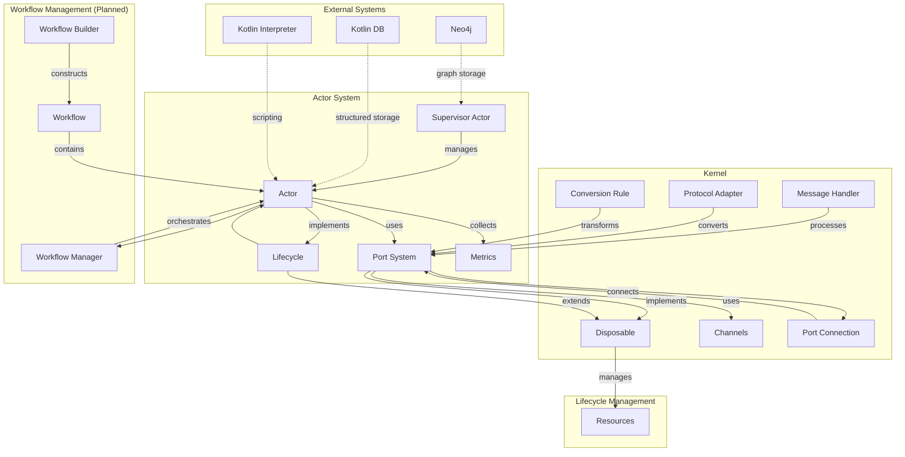
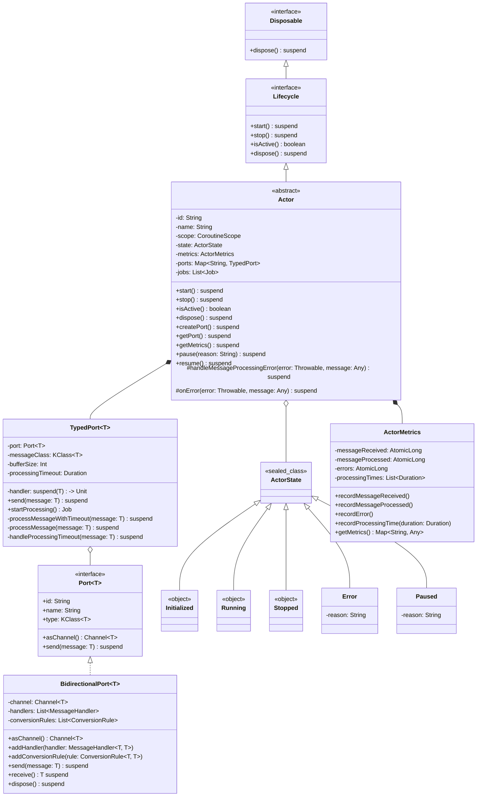
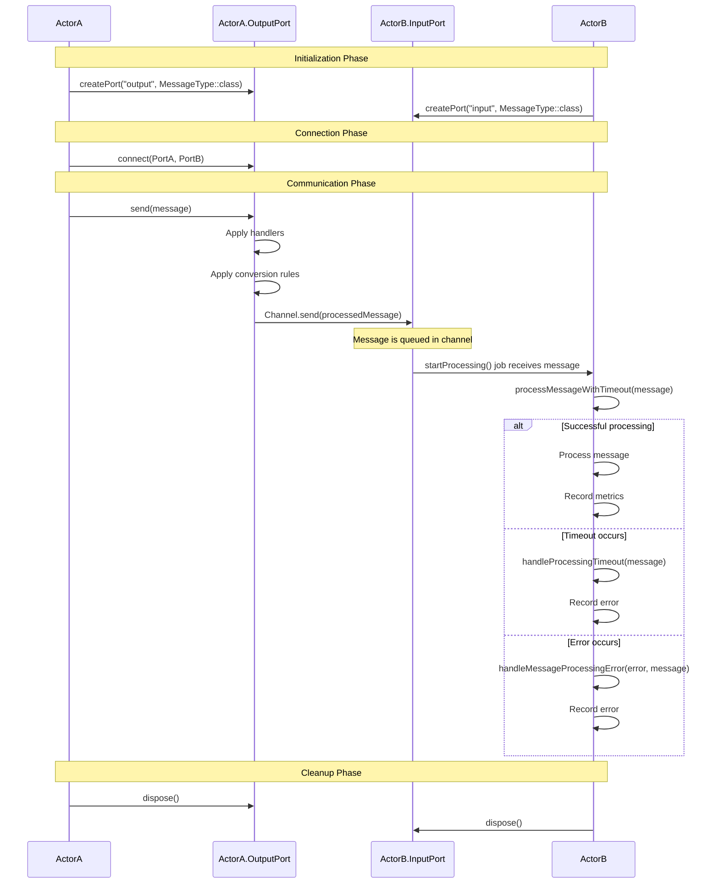

# Solace Core Framework - Architectural Document

## Executive Summary

The Solace Core Framework is an innovative, actor-based platform built using Kotlin and Ktor, designed to enable the development of flexible, resilient, and dynamically adaptable applications. The architecture follows a hot-pluggable component model that allows for runtime modification of system behavior without service interruption. This document provides a comprehensive technical overview of the framework's architecture, design principles, implementation details, and future development roadmap.

## 1. Architectural Vision

### 1.1 Core Design Philosophy

The Solace Core Framework is built on the following foundational principles:

- **Hot-Pluggable Components**: Enable dynamic addition, removal, and modification of system components during runtime without requiring system restarts
- **Actor-Based Architecture**: Leverage the actor model for scalable, concurrent processing with isolated state
- **Type-Safe Communication**: Ensure robust message passing between components with strict interface contracts
- **Lifecycle Management**: Standardize component lifecycle handling for consistent resource management
- **Observability**: Integrate comprehensive monitoring and metrics collection throughout the system

### 1.2 Key Architectural Goals

1. **Flexibility**: Create a framework that can adapt to changing requirements through hot-pluggable actors
2. **Resilience**: Design for fault tolerance with robust error handling and recovery mechanisms
3. **Scalability**: Support horizontal scaling through containerization and clustering capabilities
4. **Developer Experience**: Provide intuitive interfaces for creating and composing actors into workflows
5. **Operational Excellence**: Enable comprehensive monitoring, debugging, and maintenance capabilities

## 2. System Architecture

### 2.1 High-Level Architecture

The Solace Core Framework consists of several key components organized in a layered architecture:

```
+---------------------------------------------------+
|                   Applications                     |
+---------------------------------------------------+
|                     Workflows                      |
+---------------------------------------------------+
|                    Actor System                    |
+---------------------------------------------------+
|                      Kernel                        |
+---------------------------------------------------+
|                    Data Storage                    |
+---------------------------------------------------+
```

- **Kernel**: The foundational layer providing communication primitives, resource management, and lifecycle control
- **Actor System**: The core runtime environment for actor creation, management, and message passing
- **Workflows**: Higher-level orchestration of actors into processing pipelines
- **Applications**: Domain-specific implementations built on the framework
- **Data Storage**: Persistence layer using graph and relational databases

### 2.2 Component Overview

The framework comprises the following major components:

1. **Actor System**: Manages the creation, lifecycle, and communication of actors
2. **Port System**: Enables type-safe message passing between actors
3. **Supervisor**: Oversees actor lifecycles and manages system resources
4. **Workflow Manager**: Orchestrates the execution of actors in defined workflows
5. **Storage System**: Provides persistence capabilities for actor state and system data

## 3. Actor System

### 3.1 Actor Model Implementation

The actor model forms the backbone of the Solace Core Framework, providing a concurrency model based on message passing rather than shared state. Each actor is an independent unit of computation with the following characteristics:

- **Encapsulated State**: Actors maintain their own state, which is not directly accessible by other actors
- **Message-Driven**: Actors communicate exclusively through asynchronous message passing
- **Reactive Processing**: Actors respond to incoming messages, process them, and potentially send messages to other actors
- **Lifecycle Management**: Actors follow a defined lifecycle (initialization, running, paused, stopped, error)

### 3.2 Actor Structure

The base `Actor` class implements the following interfaces and components:

- **Lifecycle Interface**: Defines methods for starting, stopping, and checking the active state of an actor
- **Disposable Interface**: Ensures proper resource cleanup when an actor is no longer needed
- **Coroutine Scope**: Each actor operates within its own coroutine scope for asynchronous processing
- **Ports**: Actors expose typed ports for input and output communication
- **Metrics Collection**: Built-in mechanisms for gathering performance metrics

### 3.3 Actor Lifecycle

Actors in the framework follow a well-defined lifecycle:

1. **Initialization**: Actor is created and resources are allocated
2. **Starting**: Actor begins processing messages and transitions to the Running state
3. **Running**: Actor actively processes messages
4. **Paused**: Actor temporarily suspends processing but maintains state
5. **Stopped**: Actor ceases processing and prepares for disposal
6. **Error**: Actor enters an error state when exceptions occur
7. **Disposal**: Actor releases all resources and terminates

### 3.4 Actor Communication

Actors communicate through a port system that provides type-safe message passing:

- **Typed Ports**: Each port is associated with a specific message type
- **Channels**: Kotlin coroutine channels provide the underlying message passing mechanism
- **Message Handlers**: Custom processing logic can be applied to messages during transmission
- **Conversion Rules**: Enable type transformations between compatible message types

## 4. Port System

### 4.1 Port Design

The port system enables type-safe communication between actors through a well-defined interface:

- **Port Interface**: Defines methods for sending messages and accessing the underlying channel
- **BidirectionalPort Implementation**: Concrete implementation supporting bidirectional communication
- **TypedPort Wrapper**: Associates a port with a specific message type and processing handler

### 4.2 Port Connections

Ports are connected to establish communication pathways between actors:

- **Type Compatibility**: Connections are only allowed between ports with compatible message types
- **Validation**: The system validates port connections to ensure type safety
- **Multiple Connections**: Ports can be connected to multiple other ports

### 4.3 Message Processing

Messages flowing through ports undergo several processing stages:

1. **Sending**: Actor sends a message through an output port
2. **Handler Application**: Message handlers process the message
3. **Conversion**: Type conversion rules transform the message if needed
4. **Channel Transmission**: Message is sent through the underlying channel
5. **Reception**: Receiving actor's input port receives the message
6. **Processing**: Message is processed by the receiving actor

## 5. Hot-Pluggable System

### 5.1 Dynamic Actor Management

The framework supports hot-pluggable actors through several mechanisms:

- **Dynamic Registration**: Actors can register and unregister with the supervisor at runtime
- **Interface Discovery**: The system can discover actor interfaces to determine compatibility
- **Connection Management**: Dynamic creation and modification of connections between actors

### 5.2 Supervisor Role

The supervisor actor plays a critical role in enabling hot-pluggable capabilities:

- **Actor Registry**: Maintains a registry of available actors and their interfaces
- **Lifecycle Management**: Controls actor lifecycles, including creation, starting, stopping, and disposal
- **Resource Allocation**: Manages system resources to ensure efficient operation
- **Error Handling**: Monitors actors for errors and takes appropriate recovery actions

### 5.3 Implementation Challenges

Implementing a hot-pluggable actor system presents several challenges:

- **State Transfer**: Transferring state from an old actor to a new version during hot-swapping
- **Message Continuity**: Ensuring no messages are lost during actor replacement
- **Reference Management**: Updating references to actors across the system
- **Version Compatibility**: Managing compatibility between different versions of actors

## 6. Workflow Management

### 6.1 Workflow Design

Workflows provide a higher-level abstraction for composing actors into processing pipelines:

- **Actor Composition**: Connecting actors to form directed processing graphs
- **Data Flow**: Defining the flow of data between actors in a workflow
- **State Management**: Tracking and managing workflow state throughout execution

### 6.2 Workflow Manager

The Workflow Manager orchestrates the execution of workflows:

- **Workflow Creation**: Building workflows by connecting compatible actors
- **Execution Control**: Starting, stopping, pausing, and resuming workflows
- **Error Handling**: Managing errors that occur during workflow execution
- **Monitoring**: Tracking workflow progress and performance

### 6.3 Current Implementation Status

The workflow management system is partially implemented:

- **Completed**: Basic workflow management and actor composition
- **In Progress**: Advanced state management and error handling
- **Planned**: Workflow pause/resume functionality and state persistence

## 7. Data Storage and Management

### 7.1 Storage Architecture

The framework uses a hybrid storage approach:

- **Graph Database (Neo4j)**: For storing relationships between actors, knowledge nodes, and data flow
- **Kotlin-Native Storage**: For structured data needs, supporting tabular or relational-style data

### 7.2 Persistence Mechanisms

Actor state persistence is a key capability:

- **State Serialization**: Converting actor state to a serializable format
- **Storage Integration**: Saving and loading state from the storage system
- **Recovery Mechanisms**: Restoring actor state after system restarts or failures

### 7.3 Implementation Plan

Storage integration is currently in the planning phase:

- **Neo4j Integration**: Planned for representing actor relationships and knowledge graphs
- **Kotlin-Native Storage**: Planned for structured data and actor state persistence
- **Data Synchronization**: Mechanisms for keeping data consistent across the system

## 8. Concurrency and Communication

### 8.1 Coroutine Usage

Kotlin coroutines provide the foundation for asynchronous processing:

- **Actor Scopes**: Each actor operates within its own coroutine scope
- **Asynchronous Processing**: Non-blocking message handling using suspend functions
- **Structured Concurrency**: Managing the lifecycle of concurrent operations

### 8.2 Channel-Based Communication

Coroutine channels enable type-safe message passing between actors:

- **Channel Types**: Different channel types (buffered, conflated, etc.) for various use cases
- **Flow Control**: Handling backpressure and preventing overflow
- **Message Ordering**: Preserving message order when required

### 8.3 Concurrency Control

The framework includes mechanisms for controlling concurrency:

- **Mutex**: For thread-safe access to shared resources
- **Rate Limiting**: Preventing actors from being overwhelmed by messages
- **Timeout Handling**: Managing long-running operations with timeouts

## 9. Deployment and Containerization

### 9.1 Docker Integration

The framework is designed for containerized deployment:

- **Docker Containers**: Encapsulating framework components in Docker containers
- **Supervisor-Worker Architecture**: Separating the supervisor and worker instances
- **Resource Management**: Controlling resource allocation for containerized components

### 9.2 Clustering Capabilities

Clustering support enables horizontal scaling:

- **Node Discovery**: Mechanisms for nodes to discover and connect to each other
- **State Synchronization**: Keeping actor state consistent across cluster nodes
- **Load Distribution**: Distributing workload across multiple nodes

### 9.3 Kubernetes Integration

Kubernetes provides orchestration for containerized deployment:

- **Pod Management**: Defining and managing pods for framework components
- **Service Discovery**: Enabling components to discover and communicate with each other
- **Scaling**: Horizontal scaling based on workload demands

## 10. Observability and Monitoring

### 10.1 Metrics Collection

The framework includes comprehensive metrics collection:

- **Actor Metrics**: Message throughput, processing times, error rates, etc.
- **System Metrics**: CPU, memory, and network usage
- **Workflow Metrics**: Execution times, success rates, and bottlenecks

### 10.2 Logging Strategy

A structured logging approach provides visibility into system operation:

- **Log Levels**: Different levels of logging for various operational contexts
- **Contextual Information**: Including relevant context in log messages
- **Correlation IDs**: Tracking requests across multiple actors and components

### 10.3 Monitoring Integration

The framework integrates with monitoring systems:

- **Prometheus**: For metrics collection and alerting
- **Micrometer**: For application metrics gathering
- **JMX**: For Java-based monitoring and management

## 11. Current Implementation Status

### 11.1 Completed Components

The following components are fully implemented:

- **Basic Actor Structure**: Core actor functionality and lifecycle management
- **Port System**: Type-safe message passing and port connections
- **Error Handling**: Basic error handling and timeout mechanisms
- **Performance Metrics**: Collection of actor performance metrics

### 11.2 Partially Implemented Components

The following components are partially implemented:

- **Dynamic Actor Registration**: Mechanisms for runtime actor registration
- **Hot-Swapping**: Capabilities for replacing actors at runtime
- **Dynamic Port Management**: Creation and disconnection of ports at runtime
- **Comprehensive Error Handling**: Advanced error recovery mechanisms
- **Basic Workflow Management**: Initial workflow construction and execution

### 11.3 Planned Components

The following components are planned but not yet implemented:

- **Neo4j Integration**: Graph database for actor relationships
- **Kotlin-Native Storage**: Structured data storage
- **Advanced State Management**: Sophisticated workflow state handling
- **Workflow Pause/Resume**: Functionality to pause and resume workflows
- **State Persistence**: Mechanisms for persisting workflow state

## 12. Development Roadmap

### 12.1 Short-Term Goals

The following goals are targeted for completion in the near term:

1. **Complete Dynamic Actor Registration**: Finalize the mechanisms for runtime actor registration
2. **Enhance Hot-Swapping Capabilities**: Improve actor replacement during runtime
3. **Implement Comprehensive Error Handling**: Develop advanced error recovery mechanisms
4. **Finalize Basic Workflow Management**: Complete workflow construction and execution

### 12.2 Medium-Term Goals

The following goals are targeted for completion in the medium term:

1. **Implement Neo4j Integration**: Connect Neo4j for graph-based actor relationships
2. **Develop Kotlin-Native Storage**: Create structured data storage solution
3. **Enhance Workflow Management**: Add advanced workflow state handling
4. **Implement Workflow Pause/Resume**: Add functionality to pause and resume workflows

### 12.3 Long-Term Vision

The long-term vision for the framework includes:

1. **Full Clustering Support**: Enable comprehensive clustering capabilities
2. **Advanced Hot-Plugging**: Support seamless replacement of any component
3. **Intelligent Workflow Optimization**: Automatically optimize workflow execution
4. **Ecosystem Development**: Build a rich ecosystem of reusable actors and workflows

## 13. Conclusion

The Solace Core Framework represents a significant advancement in the development of flexible, resilient, and dynamically adaptable systems. By combining an actor-based architecture with hot-pluggable components, the framework enables the creation of highly modular applications that can evolve and adapt during runtime. While some components are still under development, the current implementation provides a solid foundation for building scalable, concurrent applications with type-safe communication and comprehensive lifecycle management.

The ongoing development of the framework will focus on completing the planned components, enhancing the existing functionality, and expanding the capabilities to support more advanced use cases. With its innovative design and robust architecture, the Solace Core Framework is well-positioned to meet the challenges of modern application development and provide a powerful platform for building the next generation of adaptive, resilient systems.

## Appendix A: Technical Diagrams

### System Architecture Diagram



### Actor System Class Diagram



### Actor Communication Sequence Diagram



## Appendix B: References

1. [Kotlin Coroutines Documentation](https://kotlinlang.org/docs/coroutines-overview.html)
2. [Ktor Framework Documentation](https://ktor.io/docs/welcome.html)
3. [Actor Model - Wikipedia](https://en.wikipedia.org/wiki/Actor_model)
4. [Neo4j Graph Database](https://neo4j.com/)
5. [Docker Documentation](https://docs.docker.com/)
6. [Kubernetes Documentation](https://kubernetes.io/docs/home/)
