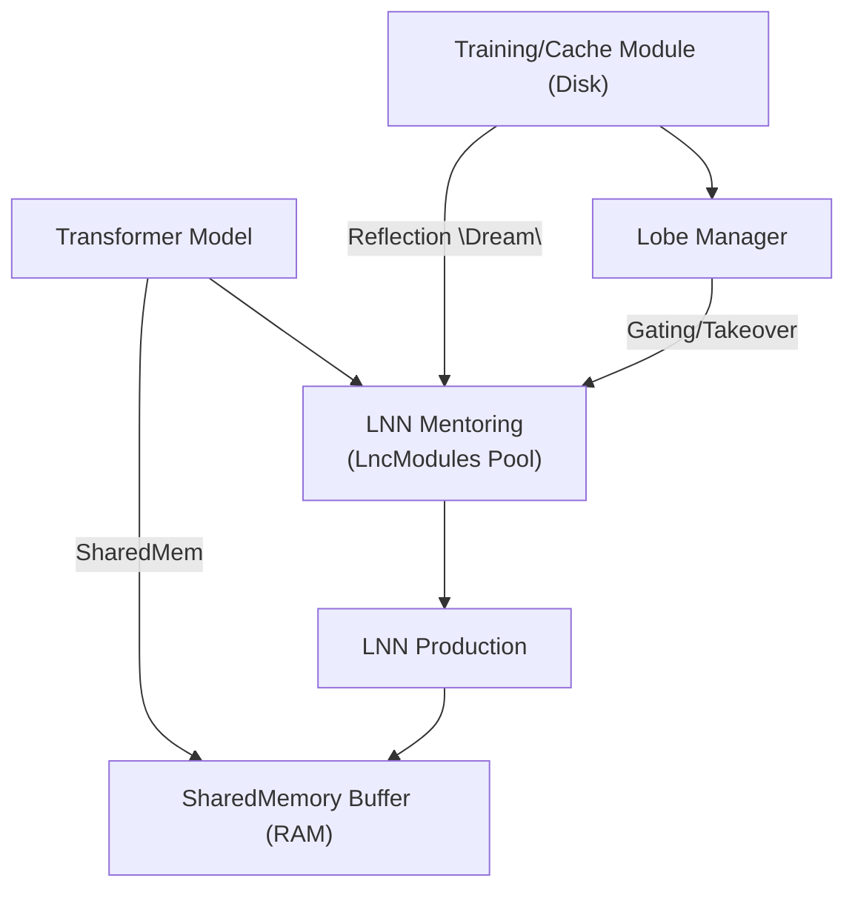

# InferenceCube Architecture

This document details the **InferenceCube** framework—a coroutine-driven system designed to progressively transfer inference tasks from transformer models to Liquid Neural Networks (LNNs). The approach centers on discrete, zero-copy "cubes" that allow lightweight modules to learn from and eventually replace heavier transformer components.

## 1. Introduction & Motivation
Modern transformers excel at contextual token processing but at significant computational and memory cost. **Liquid Time Constant (LTC)** networks provide a temporally adaptive alternative but lack robust mechanisms for transfer from large pre-trained models. InferenceCube bridges this gap by:

1. Chunking transformer inference into manageable slices.
2. Mentoring LNN modules on transformer outputs until they can take over.
3. Evolving through model updates with layered LNN lobes and reflective rehearsal.

This architecture enables a gradual offload from transformers to LNNs while preserving alignment and long-term retention.

## 2. High-Level Objectives
1. **Partition & Parallelize** — break transformer token streams into fixed-size cubes for concurrent processing.
2. **Zero-Copy Sharing** — use shared memory and integer offsets to avoid data duplication.
3. **Progressive Takeover** — mentor each cube's LNN until its error drops below a threshold, then switch ownership.
4. **Version-Resilient Growth** — on transformer updates, freeze learned lobes and grow new ones, maintaining continuity.
5. **Reflective Reinforcement** — replay historical transformer outputs to counteract LNN decay.

## 3. System Overview


## 4. Core Components
### 4.1 Shared Memory Manager
```kotlin
interface SharedMemoryManager {
  fun allocate(numCubes: Int, blockSize: Int)
  fun getSlice(cubeId: Int): FloatArray  // zero-copy view
}
```
### 4.2 Cube Registry
Tracks cube ownership and error history.
```kotlin
enum class Owner { TRANSFORMER, MENTORING, LNN_OWNED, FROZEN }

data class CubeStatus(
  val cubeId: Int,
  var status: Owner,
  var alignedVersion: Int,
  val errorHistory: CircularBuffer<Float>
)
```
### 4.3 Transformer Wrapper
Coroutine-driven processing of cubes.
```kotlin
coroutineScope {
  cubeIds.forEach { id ->
    launch(Dispatchers.Default) {
      val input = sharedMem.getSlice(id)
      val output = transformer.forward(input)
      mentor.observe(id, output)
    }
  }
}
```
### 4.4 LNN Module (LTC-Based)
Responsibilities include observation, training, prediction, and error evaluation.
```kotlin
interface LnnModule {
  fun observe(cubeId: Int, transformerOut: FloatArray)
  fun trainStep(cubeId: Int)
  fun predict(cubeId: Int, input: FloatArray): FloatArray
  fun currentError(cubeId: Int): Float
}
```
### 4.5 Gating & Takeover Controller
Periodically check each cube's error and switch to `LNN_OWNED` when below threshold. Revert to transformer if the error spikes.

### 4.6 Lobe Manager
On model updates, freeze old lobes, increment transformer version, and spawn new mentoring modules. Frozen lobes can serve as auxiliary inputs to new ones.

### 4.7 Reflective "Dream" Engine
Replay historical transformer outputs to counteract decay.
```kotlin
fun dream(cycleCount: Int) {
  for (cube in cubeRegistry.all()) {
    val history = cache.getHistory(cube.cubeId)
    repeat(cycleCount) {
      history.forEach { snapshot ->
        lnnModules[cube.cubeId].observe(cube.cubeId, snapshot)
        lnnModules[cube.cubeId].trainStep(cube.cubeId)
      }
    }
  }
}
```

## 5. Workflows
### 5.1 Initialization
1. Load transformer weights (version 1).
2. Allocate shared memory.
3. Create `CubeStatus` entries and LNN modules.
4. Pre-cache embeddings as needed.

### 5.2 Inference & Mentoring Loop
1. Transformer processes each cube via coroutines.
2. Mentor modules ingest outputs and train.
3. If error < ε, mark cube as `LNN_OWNED`.

### 5.3 Production Inference
Use LNN prediction for owned cubes; continue transformer processing for the rest.

### 5.4 Model Update & Lobe Growth
1. Freeze old lobes and increment transformer version.
2. Instantiate new LNN modules for mentoring.

### 5.5 Dream Cycle
Invoke the dream engine during low load to maintain long-term performance.

## 6. Metrics & Monitoring
- **Cube Loss** — MSE between transformer and LNN outputs.
- **Takeover Rate** — percentage of cubes transitioned.
- **Decay Drift** — error growth in frozen lobes without dreaming.
- **Throughput** — cubes processed per second.
- **Memory Footprint** — shared memory plus LNN parameters.

## 7. Next Steps
1. Expand mermaid diagrams for individual workflows.
2. Provide additional pseudocode for controllers and lifecycle hooks.
3. Build a minimal prototype to validate zero-copy behavior and gating logic.

