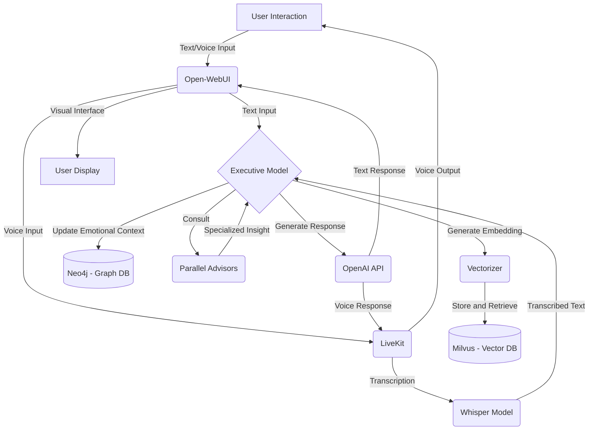
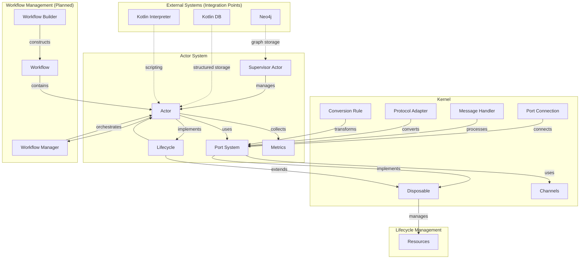

[← Back to index](./README.md) · §0 of 15

---

## 0. Solace Project Context

### 0.1. Solace AI: Vision and Project Objectives
**Vision:**
Solace is envisioned as a highly personalized conversational AI companion. It aims to engage users in meaningful, emotionally aware, and contextually rich interactions by integrating advanced memory systems, emotional sentiment analysis, and real-time communication capabilities, providing a seamless and empathetic user experience that evolves with each interaction.

**Key Project Objectives:**
The overarching goal is to build an AI system capable of human-like conversation endowed with memory, emotional awareness, and sophisticated tool usage. Specific objectives include:
*   **Contextual Memory:** Remembering past conversations to provide context-aware responses.
*   **Task Execution:** Performing specialized tasks such as calculations, text analysis, and advanced content retrieval.
*   **Real-Time Multimodal Interaction:** Handling real-time voice interactions with emotional sentiment analysis and supporting seamless switching between text and voice.
*   **Adaptive Behavior:** Utilizing reflections and executive functions to adapt behavior, especially in complex or emotionally charged situations.
*   **Emotional Intelligence:** Maintaining emotional depth and continuity across interactions.
*   **Modular & Scalable Design:** Ensuring the system is developed in a modular and scalable manner to facilitate future growth.
*   **Personalization & Engagement:** Providing a personalized and engaging user experience, incorporating user feedback for continuous improvement.
*   **Data Privacy & Security:** Adhering to relevant standards and user consent protocols for data protection.

### 0.2. Key Solace AI Requirements
The `ProjectPlan_v2` (Sec 2) details numerous requirements for the Solace AI. Key themes include:

**Core Functional Requirements:**
*   **Conversational Quality & Continuity:** Maintaining natural, engaging, and emotionally meaningful interactions, especially during architectural transitions. Preserving emotional depth and continuity by remembering past interactions and emotional context.
*   **Memory Management:** Balancing short-term (session-based) and long-term memory, with sophisticated retrieval mechanisms (e.g., semantic search, contextual embeddings) for relevant information.
*   **Scalability:** Designing memory architecture and overall system to handle growing conversational data efficiently.
*   **Multimodal Interaction:** Seamlessly handling both text and voice inputs, including real-time transcription and speech synthesis.
*   **Specialized Task Execution:** Performing tasks like calculations, text analysis, and advanced content retrieval, utilizing specialized tools and plugins.
*   **Emotional Sentiment Analysis:** Real-time detection and interpretation of user emotional sentiment to provide empathetic and aligned responses.
*   **Adaptive Behavior:** Incorporating parallel advisors (specialized sub-models for sentiment, technical problem-solving, etc.) and an executive function to manage conversational flow and adapt to complex or emotionally charged situations, potentially using an "executive hyperfocus" mode.

**Core Non-Functional Requirements:**
*   **Data Privacy & Security:** Secure storage of user interactions, compliance with privacy standards (e.g., GDPR), encryption, access controls, and user consent mechanisms.
*   **System Integration:** Seamless integration of new components (like memory architecture) with existing workflows via defined integration points and robust APIs.
*   **Modular & Scalable Architecture:** Designing for modularity to allow easy component addition/modification and ensuring the system can scale efficiently.
*   **Performance:** Target response times (e.g., <500ms) to ensure real-time interaction.
*   **Reliability:** High uptime (e.g., 99.9%) and graceful error handling.
*   **Usability:** Intuitive user interface and accessibility compliance.
*   **Maintainability:** Modular design and comprehensive documentation.

**Specific Technical Requirements Mentioned:**
*   **Memory:** Vector database for embeddings, graph database for emotional context.
*   **Language Processing:** Advanced embedding models (e.g., OpenAI's `text-embedding-ada-002`), state-of-the-art language models for response generation, sentiment analysis tools.
*   **Voice:** Reliable transcription and high-quality TTS engines.
*   **Orchestration:** Visual workflow design tool, flexible agent development framework.
*   **Middleware:** Robust API gateway, load balancing.
*   **Security:** AES-256 encryption, TLS 1.3, OAuth 2.0.
*   **Actor-Based Architecture:** Self-contained modules, clear interfaces, robust communication channels with queuing.
*   **Clusterable Architecture:** Support for clustering, self-replication, synchronization, failover, and distributed databases/message brokers.

### 0.3. Solace AI: High-Level System Components
The `ProjectPlan_v2` (Sec 3) describes a high-level component architecture for the Solace AI. SolaceCore, as detailed in this document, provides many of the foundational capabilities for these components, particularly around actor-based communication, workflow, and persistent state.

*   **Visual Workflow Orchestrator:**
    *   **Function:** Central hub to manage and configure tools, plugins, and memory. Enables visual workflow design for integrating components.
    *   **Capabilities:** Manages basic memory and tool usage (e.g., arithmetic, text analysis) and facilitates custom agent development (e.g., for real-time decision-making).
    *   **Relevance to SolaceCore:** The `WorkflowManager` and `ActorBuilder` in SolaceCore provide the engine for such an orchestrator. The "hot-pluggable components" and "dynamic workflow configuration" mentioned align with SolaceCore's `SupervisorActor` and dynamic actor system.
*   **Memory Management System:**
    *   **Function:** Handles session-based memory and long-term contextual memory.
    *   **Capabilities:** Integrates vector databases (for semantic similarity searches on conversational embeddings) and graph databases (for emotional context and relational memory).
    *   **Relevance to SolaceCore:** SolaceCore's `Storage` module (including `ActorStateStorage`, `FileStorage`, and the planned Neo4j/Kotlin-native solutions) provides the persistence layer. The concept of an "emotional graph" could leverage graph storage capabilities.
*   *Archived Design Note:* An archived document, [`docs/archive/MemoryToolDesign.md`](docs/archive/MemoryToolDesign.md:1), details a specific design for a "Memory Tool" intended for LangFlow integration, outlining the use of LangFlow’s `ConversationBufferMemory`, Milvus, Neo4j, and OpenAI embeddings for comprehensive memory management. While the LangFlow-specifics are external, the conceptual use of these technologies for memory is aligned with the overall Solace AI vision.
*   **Custom Middleware:**
*   *Archived Deployment Note:* An archived document, [`docs/archive/VectorizerMilvusNeo4j.md`](docs/archive/VectorizerMilvusNeo4j.md:1), describes a Dockerized Python-based "Vectorizer service" designed to generate embeddings using OpenAI and manage them within Milvus, highlighting a containerized approach for such components.
    *   **Function:** Manages request flow between components (orchestrator, databases, language engines). Routes tasks and coordinates memory retrieval and tool calls.
    *   **Capabilities:** Supports actor-based communication (aligning with SolaceCore's actor model), manages task lifecycles with queuing and hibernation strategies.
    *   **Relevance to SolaceCore:** SolaceCore's kernel (ports, channels) and actor system are fundamental to implementing such middleware.
*   *Archived Design Note:* An archived document, [`docs/archive/Middleware.md`](docs/archive/Middleware.md:1), describes a Python-based `middleware.py` script and its `requirements.txt`. This script is envisioned to manage data flow and connections between Milvus, Neo4j, OpenAI, and other services, using libraries like `pymilvus`, `py2neo`, and `openai`. This aligns with the conceptual role of middleware in the Solace AI but details a specific implementation technology external to SolaceCore.
*   **Language Processing Integration:**
    *   **Function:** Handles embedding generation, response generation, and dynamic script execution.
    *   **Capabilities:** Converts inputs to semantic embeddings, generates responses using LLMs (informed by memory and advisor outputs), and allows dynamic actor behavior modification via scripts.
    *   **Relevance to SolaceCore:** SolaceCore's `Scripting` module is directly applicable here.
*   **Parallel Advisors and Executive Function:**
    *   **Function:** Incorporates specialized sub-models (advisors for sentiment, technical problem-solving, etc.) and an executive function to integrate their outputs for coherent, context-aware responses.
    *   **Relevance to SolaceCore:** These could be implemented as specialized actors or workflows within the SolaceCore framework.
*   **Real-Time Voice Integration:**
*   *Archived Design Note:* An archived document, [`docs/archive/SpeechToSpeechIntegration.md`](docs/archive/SpeechToSpeechIntegration.md:1), details a plan for using **LiveKit** for real-time audio streaming (potentially integrated with Google Voice) and **Whisper** for transcription, enabling two-way voice communication.
    *   **Function:** Manages real-time voice interactions, transcription, and speech synthesis.
    *   **Relevance to SolaceCore:** While SolaceCore itself doesn't provide voice processing, its actor and workflow systems can orchestrate external voice services.
*   **User Engagement Interface:**
    *   **Function:** Primary interface for text and voice interactions, displaying real-time transcriptions.
    *   **Relevance to SolaceCore:** SolaceCore would be the backend engine powering such an interface.

### 0.4. Solace AI: Conceptual Workflow
The `ProjectPlan_v2` (Sec 4) outlines a step-by-step conceptual workflow for Solace AI interactions:

1.  **User Interaction:**
    *   User initiates via text or voice through the **User Engagement Interface**.
    *   Voice input is transcribed; text is passed to the **Executive Function**.
2.  **Memory Integration:**
    *   The memory management system retrieves recent interactions.
    *   If deeper context is needed, middleware queries the vector database for relevant older memories using embeddings.
3.  **Context and Emotional Update:**
    *   The Executive Function uses the graph database to update/retrieve emotional insights, maintaining a consistent emotional thread.
4.  **Tool and Advisor Consultation:**
    *   The executive function may call **Parallel Advisors** or specialized tools (via the visual workflow orchestrator) based on the query.
5.  **Response Generation:**
    *   The Executive Function generates a response using language processing engines, enriched by memories, emotional awareness, and tool outputs.
6.  **Response Delivery:**
    *   Text responses are displayed; voice responses are synthesized and vocalized.
7.  **Feedback Loop:**
    *   User feedback is collected and analyzed to refine memory integration, sentiment analysis, and overall interaction quality.
#### Conceptual Workflow Diagram

**Workflow Steps:**

1.  **User Interaction & Input:** User interacts via Open-WebUI (text/voice). Voice is routed via LiveKit to Whisper for transcription; text goes to the Executive Model.
2.  **Executive Model Processing:** Receives input, determines actions:
    *   Generates embeddings via Vectorizer for Milvus (vector DB) for memory retrieval.
    *   Updates/queries Neo4j (graph DB) for emotional context.
    *   Consults Parallel Advisors for specialized insights.
3.  **Response Generation:** Executive Model uses OpenAI API, enriched by memory and advisor outputs.
1. **Response Delivery:** Text via Open-WebUI; voice synthesized and delivered via LiveKit. Open-WebUI provides visual feedback.

(This is a condensed summary; the original `ProjectPlan_v2` and the archived diagram provide more granular steps for the overall Solace AI.)

This workflow highlights the interplay between user interaction, memory systems, emotional processing, specialized tools/advisors, and response generation, all orchestrated to create a coherent and contextually rich conversational experience. SolaceCore's actor, workflow, and storage modules are central to enabling these steps.

### 0.5. Solace AI: Guiding Architectural Principles
Several guiding architectural principles and future directions for the overall Solace AI system are evident from the `ProjectPlan_v2` (particularly Sec 5, 6, and 9):

*   **Agent-Based Modular Growth:**
    *   Utilize a visual workflow orchestrator to create and manage specialized agents for tasks like real-time decision-making, memory retrieval, sentiment flagging, or deep research.
    *   This allows the system's capabilities to expand by adding new agents dynamically.
*   **Visual Development and Dynamic Configuration:**
    *   Employ a visual interface for modular development of agents and workflows.
    *   Enable dynamic configuration of workflows based on user interactions and system needs, allowing real-time behavioral adaptation.
*   **Hot-Pluggable Components:**
    *   Support the dynamic addition, modification, or removal of actors/agents without system restarts, ensuring continuous availability and adaptability. This aligns with SolaceCore's `SupervisorActor` capabilities.
*   **Advanced Emotional Integration & Memory Optimization:**
    *   Expand the emotional graph database for detailed emotional trajectory tracking.
    *   Implement memory pruning and prioritization using advanced scoring mechanisms (e.g., based on interaction frequency, emotional significance).
*   **Multimodal Processing:**
    *   Beyond text and voice, future integration with visual models (image processing) and advanced auditory models (emotional tone detection in voice) is envisioned.
*   **Real-Time Hyperfocus:**
    *   Develop an "executive hyperfocus" mode for intensive real-time processing during emotionally charged or complex conversations.
*   **Clusterable and Resilient Architecture:**
    *   Design for clustering with multiple nodes capable of self-replication and synchronization.
*   An archived design (`docs/archive/SolaceCoreFramework.md`) further specifies a Ktor-based deployment model where a supervisory Ktor instance (in Docker) manages multiple worker Ktor instances (also in Docker, housing actors), promoting a sandboxed environment for actor execution and experimentation.
    *   Utilize containerization strategies for easy scaling and management.
    *   Implement distributed queue management and failover strategies for high availability and resilience.
*   **Actor-Based Design (Reinforced by SolaceCore):**
    *   Actors as independent, self-contained modules for specific tasks.
    *   Clear input/output interfaces for actors, promoting reusability.
    *   Robust communication channels between actors, with queuing mechanisms.

These principles underscore a commitment to a flexible, scalable, intelligent, and resilient architecture for the Solace AI, where SolaceCore provides many of the essential building blocks.

### 0.6. SolaceCore Framework: System Architecture Overview
SolaceCore is a versatile, actor-based framework designed to support dynamic, hot-pluggable components. It leverages Kotlin and Ktor to build scalable and resilient systems.
The following diagram and description, derived from `docs/diagrams/system_architecture.md`, illustrate the high-level internal architecture of the Solace Core Framework itself, showing how its major modules and components are designed to interoperate.

**System Architecture Component Overview:**

The Solace Core Framework is built around several key components:

1.  **Actor System**: The core component, responsible for managing the execution and interaction of modular actors.
    *   **Actor**: The fundamental building block.
    *   **Supervisor Actor**: Manages actor lifecycles.
    *   **Port System**: Enables type-safe communication.
    *   **Metrics**: Collects performance data.
2.  **Kernel**: Foundational infrastructure for communication and resource management.
    *   **Port**: Interface for message passing.
    *   **Port Connection**: Establishes connections.
    *   **Message Handler, Protocol Adapter, Conversion Rule**: For message processing.
    *   **Channels**: Underlying mechanism for message passing.
3.  **Lifecycle Management**: Standardized approach to component lifecycle.
    *   **Lifecycle & Disposable**: Interfaces for managing state and resources.
4.  **Workflow Management** (Planned): System for orchestrating actors.
    *   **Workflow Manager, Workflow Builder, Workflow**: For defining and running actor compositions.
5.  **External Systems** (Integration Points):
    *   **Neo4j**: Envisioned for graph storage (e.g., actor metadata, relationships).
    *   **Kotlin DB**: For structured data persistence (e.g., actor states).
    *   **Kotlin Interpreter**: For enabling dynamic scripting within actors.

This architecture provides a robust foundation for building scalable, concurrent applications with dynamic components and type-safe communication, forming the core library for the broader Solace AI.

---

[Index](./README.md)  ·  [§1 Kernel Module](./01-kernel-module.md) →
