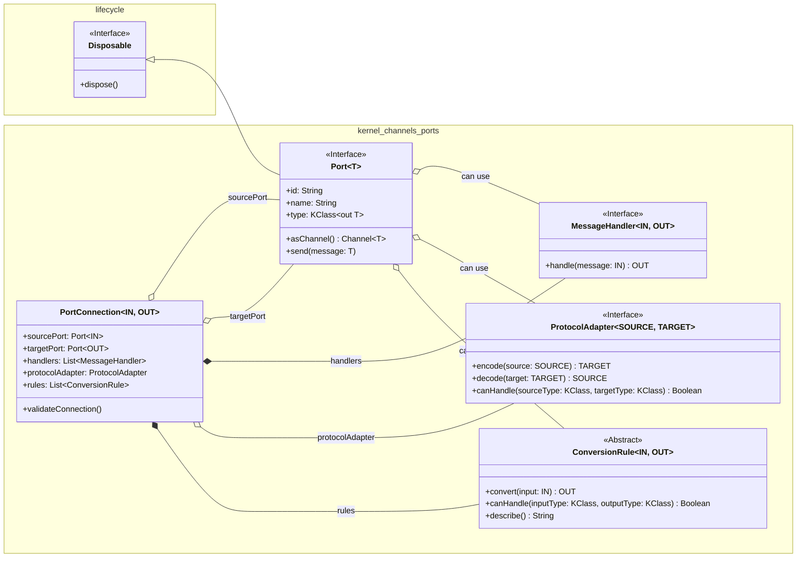

[← Architecture Overview](../../wiki/Architecture-Overview.md) · §1 of 15

---

## 1. Kernel Module
### 1.0. Kernel Design Principles and Overview
The kernel is a foundational component of the Solace Core Framework, providing the underlying infrastructure for communication and resource management. It includes the channels and ports system, which enables type-safe message passing between actors and other components. The kernel's design is guided by the following principles:

*   **Type Safety:** All communication is strongly typed to ensure compatibility.
*   **Resource Management:** Proper cleanup of resources through the `Disposable` interface is a key consideration.
*   **Flexibility:** The system supports different types of communication patterns.
*   **Extensibility:** It is designed to be easy to extend with new port types and protocol adapters.
*   **Concurrency:** Built for concurrent operations using Kotlin coroutines.

The `kernel` module forms the foundational layer of SolaceCore's common library, providing core abstractions and services primarily focused on its robust channels and ports system.

### 1.1. Channel System (`io.github.solaceharmony.core.kernel.channels`)
The Channel System, located within the `kernel` module, is responsible for enabling type-safe, resource-managed, and distributed message passing between various components of the SolaceCore framework. It is designed with platform independence as a key consideration.

#### 1.1.1. Overview and Purpose
The primary goal of the Channel System is to provide a robust and flexible mechanism for inter-component communication. It emphasizes:
*   **Type Safety:** Ensuring that messages conform to expected types at both compile-time and runtime.
*   **Resource Management:** Proper handling and cleanup of resources associated with channels and ports, often leveraging a `Disposable` pattern.
*   **Distributed Operation:** Designed to function effectively in distributed environments with minimal shared state and low-overhead message passing.
*   **Platform Independence:** Core channel logic is intended to be common across all supported platforms.

#### 1.1.2. Core Abstractions and Interfaces
The foundation of the Channel System is the `Port.kt` file, which defines the primary `Port<T>` interface and several crucial nested interfaces and classes for message handling, protocol adaptation, type conversion, and connection management. It leverages `kotlinx.coroutines.channels.Channel` for its underlying asynchronous communication and `io.github.solaceharmony.core.lifecycle.Disposable` for resource management.

##### 1.1.2.1. Port System Conceptual Roles
Drawing from the `Interface_and_Port_System_Design.md`, the port system is a cornerstone of the actor interface within SolaceCore. It's engineered for flexible, type-safe connections between actors. Conceptually, while the underlying `Port<T>` interface is generic, ports fulfill distinct roles such as:
*   **Input Ports:** Designated for receiving messages.
*   **Output Ports:** Designated for sending messages.
*   **Tool Ports:** Potentially used for specialized request/response interactions or utility functions (though less explicitly defined in the current codebase compared to input/output patterns observed in actor examples).

The design emphasizes dynamic connection capabilities between compatible output and input ports, leveraging Kotlin's `KClass` for type safety. This dynamism is vital for constructing adaptable and reconfigurable actor-based systems. The design document also noted that dynamic port creation and disconnection were areas of ongoing development, aiming to further enhance this flexibility.

##### 1.1.2.2. `Port<T : Any>` Interface
This is the central interface for any communication endpoint in the system.

*   **Inheritance:** Implements `io.github.solaceharmony.core.lifecycle.Disposable`.
*   **Key Properties:**
    *   `id: String`: A unique identifier for the port, automatically generatable.
    *   `name: String`: A human-readable name for the port.
    *   `type: KClass<out T>`: Specifies the Kotlin class of messages the port handles, ensuring type safety.
*   **Key Methods:**
    *   `suspend fun send(message: T)`: Sends a message through the port. Can throw `PortException.Validation`.
    *   `fun asChannel(): Channel<T>`: Returns the underlying `kotlinx.coroutines.channels.Channel` associated with this port.
*   **Companion Object (`Port.Companion`):**
    *   `fun generateId(): String`: Generates a unique ID string (e.g., "port-xxxxxxxxxxxxxxxx").
    *   `fun <IN : Any, OUT : Any> connect(...)`: Factory method to create and validate a `PortConnection` (see below).

##### 1.1.2.3. `Port.MessageHandler<in IN : Any, out OUT : Any>` Interface
Defines a contract for processing messages.
*   **Key Method:**
    *   `suspend fun handle(message: IN): OUT`: Processes an input message of type `IN` and returns an output of type `OUT`.

##### 1.1.2.4. `Port.ProtocolAdapter<SOURCE : Any, TARGET : Any>` Interface
Facilitates conversion between different data protocols or formats.
*   **Key Methods:**
    *   `suspend fun encode(source: SOURCE): TARGET`: Encodes a source object to the target type.
    *   `suspend fun decode(target: TARGET): SOURCE`: Decodes a target object back to the source type.
    *   `fun canHandle(sourceType: KClass<*>, targetType: KClass<*>) : Boolean`: Checks if the adapter can handle conversion between specified types.

##### 1.1.2.5. `Port.ConversionRule<in IN : Any, out OUT : Any>` Abstract Class
Represents a rule for converting an input type `IN` to an output type `OUT`.
*   **Key Abstract Methods:**
    *   `abstract suspend fun convert(input: IN): OUT`: Performs the conversion. Can throw `PortException.Validation`.
    *   `abstract fun canHandle(inputType: KClass<*>, outputType: KClass<*>) : Boolean`: Checks if the rule applies to the given types.
    *   `abstract fun describe(): String`: Provides a description of the rule.
*   **Companion Object (`Port.ConversionRule.Companion`):**
    *   `internal inline fun <reified IN : Any, reified OUT : Any> create(...)`: Factory method to create `ConversionRule` instances.

##### 1.1.2.6. `Port.PortConnection<in IN : Any, out OUT : Any>` Data Class
> **Note — verify against source:** §1.1.2.6 below describes `PortConnection` as a validated connection wrapper. The wiki [Kernel & Ports](../../wiki/Kernel-and-Ports.md) page describes the same type as additionally **actively routing messages when started**, while §1.1.7 (Future Enhancements) below says message piping is *not* implemented. These three claims need reconciling against the current `Port.kt` source — recorded here so it isn't lost.

Represents a validated connection between a source port and a target port, potentially involving handlers, a protocol adapter, and conversion rules.
*   **Key Properties:**
    *   `sourcePort: Port<@UnsafeVariance IN>`
    *   `targetPort: Port<@UnsafeVariance OUT>`
    *   `handlers: List<Port.MessageHandler<IN, Any>>`
    *   `protocolAdapter: Port.ProtocolAdapter<*, @UnsafeVariance OUT>?`
    *   `rules: List<Port.ConversionRule<IN, OUT>>`
*   **Key Methods:**
    *   `fun validateConnection()`: Validates if the connection is possible based on types, adapter, and rules. Throws `PortConnectionException` on failure.
    *   Internal methods `canConnect()`, `validateConversionChain()`, and `buildConnectionErrorMessage()` support the validation logic.

The relationships between these core abstractions can be visualized as follows:



#### 1.1.3. Concrete Implementations and Utilities
The `io.github.solaceharmony.core.kernel.channels.ports` package also provides concrete implementations and utilities.

##### 1.1.3.1. `BidirectionalPort<T : Any>` Class
A concrete implementation of the `Port<T>` interface that supports both sending and receiving messages.
*   **Implements:** `Port<T>`.
*   **Constructor:** `name: String`, `id: String = Port.generateId()`, `type: KClass<out T>`, `bufferSize: Int = Channel.BUFFERED`.
*   **Key Features:**
    *   Manages an internal `kotlinx.coroutines.channels.Channel<T>`.
    *   Allows registration of `Port.MessageHandler<T, T>` instances via `addHandler()`.
    *   Allows registration of `Port.ConversionRule<T, T>` instances via `addConversionRule()`.
    *   The `send(message: T)` method applies registered handlers and conversion rules sequentially before sending to the internal channel.
    *   Provides a `suspend fun receive(): T` method to receive messages from the internal channel.
    *   Implements `dispose()` by closing the internal channel.
*   **Companion Object (`BidirectionalPort.Companion`):**
    *   `inline fun <reified T : Any> create(name: String, id: String = Port.generateId()): BidirectionalPort<T>`: Factory method.

##### 1.1.3.2. `StringProtocolAdapter<T : Any>` Class
An `open class` providing a base for protocol adapters that convert to/from `String`.
*   **Implements:** `Port.ProtocolAdapter<T, String>`.
*   **`encode(source: T): String`:** Converts the source object to its string representation (`source.toString()`).
*   **`decode(target: String): T`:** Throws `UnsupportedOperationException`; meant to be implemented by concrete subclasses.
*   **`canHandle(sourceType: KClass<*>, targetType: KClass<*>) : Boolean`:** Returns `true` if `targetType` is `String::class`.
*   **Companion Object (`StringProtocolAdapter.Companion`):**
    *   `inline fun <reified T : Any> create(crossinline decoder: (String) -> T): Port.ProtocolAdapter<T, String>`: Factory method that creates an anonymous subclass overriding `decode` and refining `canHandle`.

#### 1.1.4. Exception Handling
The system defines a hierarchy of `internal` custom exceptions for port-related errors, all extending a base `PortException`.

*   **`internal open class PortException(message: String, cause: Throwable? = null) : Exception(message, cause)`**
    The base class for all port-specific exceptions.

*   **`internal class PortException.Validation(message: String, cause: Throwable? = null) : PortException(message, cause)`**
    Thrown during validation failures, such as in type conversion or message handling within a port.

*   **`internal class PortConnectionException(val sourceId: String, val targetId: String, message: String, details: Map<String, Any> = emptyMap(), cause: Throwable? = null) : PortException(...)`**
    Thrown when establishing a connection between two ports fails (e.g., due to incompatible types, failing protocol adapter, or invalid conversion rule chain). Includes `sourceId` and `targetId`.

*   **`internal class SendMessageException(message: String, cause: Throwable? = null) : PortException(message, cause)`**
    Thrown if an error occurs specifically during the message sending process through a port.

#### 1.1.5. Design Principles
The architecture of the Channel System adheres to the following core principles (as outlined in `CHANNELS_README.md` and reflected in the code):

1.  **Distributed First:**
    *   State sharing between components is minimized.
    *   Operations are designed to be decentralized.
    *   Message passing mechanisms aim for low overhead.

2.  **Resource Safety:**
    *   The `Disposable` interface ensures that resources are properly released when a port is no longer needed (e.g., `BidirectionalPort.dispose()` closes its channel).
    *   Lifecycles of ports and connections are actively managed.
    *   Connection handling is designed to be robust and prevent resource leaks.

3.  **Type Safety:**
    *   Leverages Kotlin's type system (`KClass`, generics) for compile-time checks.
    *   Includes runtime type verification where necessary (e.g., in `PortConnection.canConnect()`, `Port.ConversionRule.canHandle()`).
    *   Provides clear and informative error messages for type mismatches or other type-related issues via custom exceptions.

#### 1.1.6. Basic Usage Example
The following example illustrates how ports might be created using the `BidirectionalPort` implementation and connected using `Port.connect`:

```kotlin
// import io.github.solaceharmony.core.kernel.channels.ports.BidirectionalPort
// import io.github.solaceharmony.core.kernel.channels.ports.Port // For Port.connect

suspend fun main() { // Example, typically run in a coroutine scope
    // Create ports using BidirectionalPort concrete implementation
    val outputPort = BidirectionalPort.create<String>("sourceOutputChannel")
    val inputPort = BidirectionalPort.create<String>("targetInputChannel")

    try {
        // Establish a connection using Port.connect
        // Assuming no complex handlers, adapters, or rules for this basic example
        val connection = Port.connect(outputPort, inputPort)
        println("Successfully connected ${connection.sourcePort.name} to ${connection.targetPort.name}")

        // Send a message from outputPort
        val messageToSend = "Hello from ${outputPort.name}!"
        println("Sending: '$messageToSend'")
        outputPort.send(messageToSend)

        // Receive the message on inputPort
        val receivedMessage = inputPort.receive()
        println("Received on ${inputPort.name}: '$receivedMessage'")

    } catch (e: Exception) {
        println("An error occurred: ${e.message}")
        e.printStackTrace()
    } finally {
        // Dispose of ports to release resources
        outputPort.dispose()
        inputPort.dispose()
        println("Ports disposed.")
    }
}
```

#### 1.1.7. Future Enhancements & Considerations
The `CHANNELS_README.md` and the wiki [Kernel & Ports](../../wiki/Kernel-and-Ports.md) page also outline several areas for future development and refinement, which remain relevant:
*   **Connection Implementation Details:**
    *   Implementing the actual message passing mechanism (the current `Port.connect` establishes the connection data class but doesn't actively pipe messages; this is typically handled by higher-level constructs or actor systems that use these ports).
    *   Supporting multiple subscribers for a single `OutputPort`.
    *   Handling backpressure to prevent overwhelming consumers.
*   **Testing Strategy:**
    *   Developing comprehensive unit tests for core port and channel functionality.
    *   Creating integration tests to verify communication between connected ports.
    *   Conducting performance tests, especially for distributed scenarios.
*   **Documentation Enhancements:**
    *   Generating detailed API documentation (e.g., KDoc for all public/internal members).
    *   Providing more extensive usage examples for various Channel System scenarios, including handlers, adapters, and conversion rules.
    *   Establishing best practices for using the Channel System effectively.
*   **Advanced Type Checking:**
    *   Develop more sophisticated type checking mechanisms beyond the current `KClass`-based checks, potentially for more complex generic scenarios or runtime compatibility assessments.
*   **Performance Optimization:**
    *   Focus on improving message passing performance, especially in high-throughput or concurrent scenarios.
*   **Monitoring:**
    *   Add comprehensive monitoring capabilities for message flow, port activity, and channel health.

This detailed exploration of the Channel System's ports, handlers, and exceptions, derived directly from the source code, provides a comprehensive understanding of its current implementation. Further investigation into specific usage patterns and interactions with other modules will continue to refine this documentation.
### 1.2. Target Testing Strategy (Kernel)
A robust and comprehensive testing strategy is paramount for the Kernel module, given its foundational role in SolaceCore's communication and resource management. The target architecture mandates rigorous testing to ensure reliability, correctness, and performance of its components.

*   **Unit Testing:**
    *   **Ports (`Port<T>`, `BidirectionalPort<T>`):** Thorough unit tests must verify all aspects of port functionality, including:
        *   Correct instantiation and ID/name assignment.
        *   Type safety enforcement (e.g., attempts to send/receive incompatible types).
        *   Message sending and reception via the underlying channels.
        *   Proper behavior of `asChannel()`.
        *   Correct disposal and resource cleanup, ensuring channels are closed and no leaks occur.
        *   Functionality of registered `MessageHandler`s, `ProtocolAdapter`s, and `ConversionRule`s when used with `BidirectionalPort`.
    *   **Port Connection (`Port.PortConnection<IN, OUT>`):**
        *   Extensive unit tests for the `validateConnection()` logic, covering all valid and invalid connection scenarios (type compatibility, adapter applicability, rule chain validation).
        *   Verification that `PortConnectionException` is thrown with appropriate error messages for invalid connections.
    *   **Handlers, Adapters, and Rules:**
        *   `Port.MessageHandler<IN, OUT>`: Unit tests for various implementations to ensure correct message processing logic.
        *   `Port.ProtocolAdapter<SOURCE, TARGET>`: Tests for `encode`, `decode`, and `canHandle` methods across different adapter implementations (e.g., `StringProtocolAdapter`).
        *   `Port.ConversionRule<IN, OUT>`: Tests for `convert`, `canHandle`, and `describe` methods for various conversion rule implementations.
    *   **Exception Handling (`PortException.kt`):** Tests to ensure custom port exceptions are thrown under the correct conditions.

*   **Integration Testing:**
    *   **Port-to-Port Communication:** Integration tests must validate end-to-end message flow between connected ports:
        *   Direct connections between compatible `BidirectionalPort` instances.
        *   Connections involving one or more `MessageHandler`s.
        *   Connections utilizing `ProtocolAdapter`s for data format transformation.
        *   Connections employing `ConversionRule`s for type conversion.
        *   Scenarios with chains of handlers, adapters, and rules.
        *   Verification of message integrity and order.
    *   **Concurrency:** Tests for concurrent send/receive operations on ports and concurrent connection establishments, if applicable to the design.

*   **Property-Based Testing:**
    *   The port type conversion system, involving `ProtocolAdapter`s and `ConversionRule`s, is an ideal candidate for property-based testing. This approach can generate a wide range of input types and conversion scenarios to uncover edge cases and ensure the robustness of the type handling logic. For example, properties could assert that if a value is encoded and then decoded, the result is equivalent to the original (where applicable).

*   **Performance Testing (Future Consideration):**
    *   While not an immediate priority for initial unit/integration testing, the target architecture should eventually include performance benchmarks for the port system, especially if it's intended for high-throughput or low-latency scenarios, or if distributed channel capabilities are realized. This would involve measuring message throughput, latency, and resource utilization under various loads.

*   **Test Coverage:**
    *   The target is to achieve high unit and integration test coverage for all critical paths and functionalities within the Kernel module. This ensures that regressions are caught early and that the foundational communication layer remains stable and reliable.

This detailed testing strategy, once implemented, will provide strong assurances about the correctness and stability of the SolaceCore Kernel.

---

← [Vision & Solace AI](../../wiki/Vision-and-Solace-AI.md)  ·  [Architecture Overview](../../wiki/Architecture-Overview.md)  ·  [§2 Lifecycle Module (`io.github.solaceharmony.core.lifecycle`)](./02-lifecycle-module-io-github-solaceharmony-core-lifecycle.md) →
