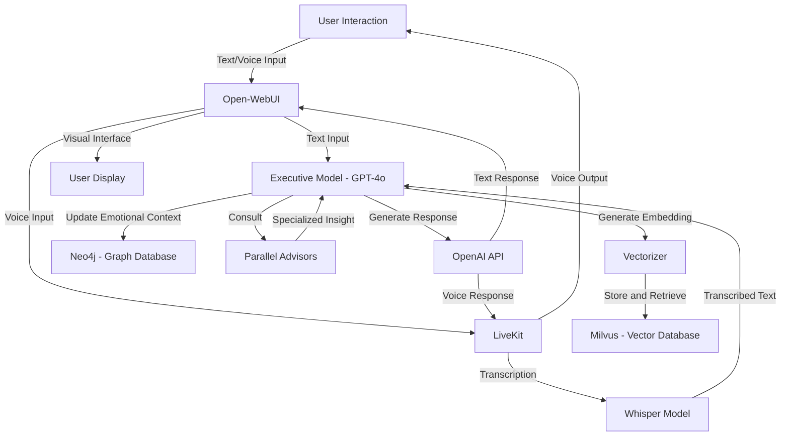

**Overall System Workflow - Diagram and Description**

This document provides a **high-level workflow diagram** and a detailed **description** to illustrate how different components of the Solace architecture interact to create a seamless and coherent conversational AI experience. The diagram uses **Mermaid** format to clearly depict the connections between key components and the flow of data within the system.

### Workflow Diagram (Mermaid Format)

### Workflow Description

1. **User Interaction (A)**
    - The user begins the interaction with Solace by providing either **text** or **voice input**. This initial engagement can take place via the **Open-WebUI** interface or through a voice channel such as Google Voice.

2. **Open-WebUI (B)**
    - The **Open-WebUI** is the primary interface handling **textual and voice inputs**. For text input, it sends the information directly to the **Executive Model (GPT-4o)** for processing. If the user provides voice input, it is routed through **LiveKit**.

3. **LiveKit (D) and Whisper Model (E)**
    - **LiveKit** handles real-time audio management, streaming the user’s voice to be transcribed. It passes the incoming audio to the **Whisper Model**, which converts the speech into text. This transcribed text is then passed to the **Executive Model** to continue processing.

4. **Executive Model - GPT-4o (C)**
    - The **Executive Model** is responsible for managing the conversation. It receives the transcribed text or direct user input and determines the appropriate actions. These actions could include:
        - **Generating Embeddings** using the **Vectorizer**.
        - **Updating Emotional Context** in **Neo4j** to maintain continuity of emotional intelligence.
        - **Consulting Parallel Advisors** for specialized insights (e.g., emotional sentiment analysis, technical suggestions).
        - Generating the conversational response using **OpenAI's text models**.

5. **Vectorizer (F) and Milvus (G)**
    - The **Vectorizer** generates **embeddings** of the user input, which are then stored in or retrieved from **Milvus**, the vector database. This process allows the AI to access similar past interactions, adding **contextual continuity** to the conversation.

6. **Neo4j - Graph Database (H)**
    - **Neo4j** is used to maintain a graph representation of **emotional context**. The executive model updates this database to track how user interactions evolve emotionally, ensuring that future responses reflect an understanding of the user’s emotional journey.

7. **Parallel Advisors (I)**
    - The **Parallel Advisors** are specialized models that offer expertise in specific areas, such as technical problem-solving or emotional sentiment analysis. The executive model consults these advisors to enrich its response, ensuring it is both accurate and empathetic.

8. **OpenAI API for Response Generation (J)**
    - Once all relevant insights are gathered, the **Executive Model** uses the **OpenAI API** to generate a coherent, contextually rich response. This response could be delivered in text form or converted into voice for the user.

9. **LiveKit and Voice Output (D)**
    - If the response is to be vocalized, **LiveKit** manages the voice output. The response is synthesized into natural speech and delivered back to the user via the **audio channel**.

10. **User Display - Open-WebUI Interface (K)**
    - Throughout the interaction, the **Open-WebUI** provides a visual display for the user, showing **transcriptions**, **text outputs**, and **interactive options**. This allows the user to view the conversation history, understand AI responses, and easily switch between **text and voice modes**.

### Summary
The Solace project’s architecture is designed for **real-time, dynamic conversational AI** experiences that combine voice and text modalities. By integrating tools like **LiveKit**, **Whisper**, **Milvus**, **Neo4j**, and **Open-WebUI**, along with **parallel advisors** and **OpenAI language models**, Solace can maintain a coherent and contextually aware conversation that adapts to user needs. This workflow ensures that every interaction is **responsive**, **emotionally intelligent**, and **rich in context**, bringing the AI closer to a human-like companion.

