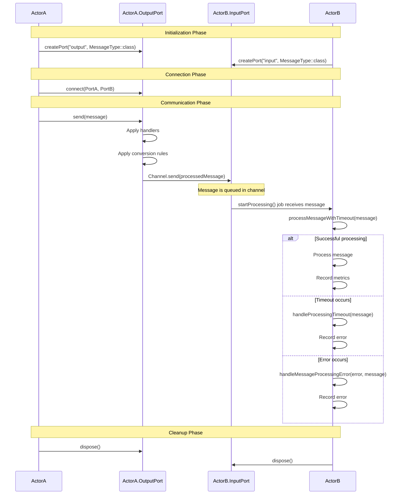

# Actor Communication Sequence Diagram

This sequence diagram illustrates the communication flow between two actors:

1. **Initialization Phase**:
   - Actor A creates an output port
   - Actor B creates an input port

2. **Connection Phase**:
   - A connection is established between the output port of Actor A and the input port of Actor B

3. **Communication Phase**:
   - Actor A sends a message through its output port
   - The message is processed by handlers and conversion rules
   - The processed message is sent through the channel to Actor B's input port
   - Actor B receives and processes the message
   - Different paths are shown for successful processing, timeout, and error scenarios

4. **Cleanup Phase**:
   - Both actors dispose of their ports when they're no longer needed

This diagram demonstrates the asynchronous, message-passing nature of the actor system and how type-safe communication is maintained between actors.