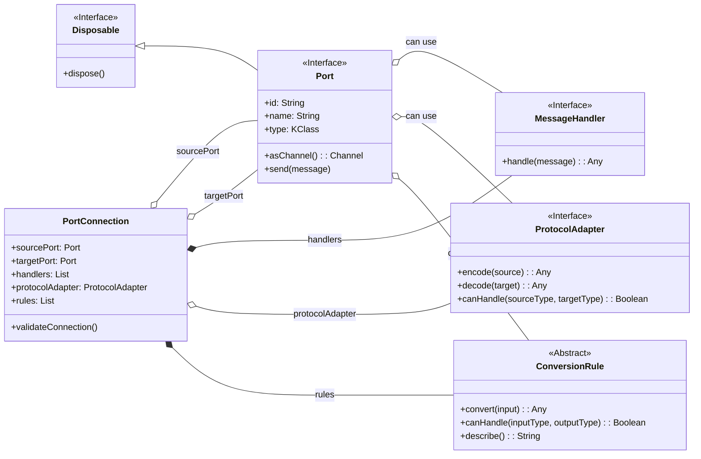

# Channel System

## Overview and Purpose

The Channel System, located within the `kernel` module, is responsible for enabling type-safe, resource-managed, and distributed message passing between various components of the SolaceCore framework. It is designed with platform independence as a key consideration.

The primary goal of the Channel System is to provide a robust and flexible mechanism for inter-component communication. It emphasizes:
*   **Type Safety:** Ensuring that messages conform to expected types at both compile-time and runtime.
*   **Resource Management:** Proper handling and cleanup of resources associated with channels and ports, often leveraging a `Disposable` pattern.
*   **Distributed Operation:** Designed to function effectively in distributed environments with minimal shared state and low-overhead message passing.
*   **Platform Independence:** Core channel logic is intended to be common across all supported platforms.

## Core Abstractions and Interfaces

The foundation of the Channel System is the `Port.kt` file, which defines the primary `Port<T>` interface and several crucial nested interfaces and classes for message handling, protocol adaptation, type conversion, and connection management. It leverages `kotlinx.coroutines.channels.Channel` for its underlying asynchronous communication and `ai.solace.core.lifecycle.Disposable` for resource management.

### `Port<T : Any>` Interface

This is the central interface for any communication endpoint in the system.

*   **Inheritance:** Implements `ai.solace.core.lifecycle.Disposable`.
*   **Key Properties:**
    *   `id: String`: A unique identifier for the port, automatically generatable.
    *   `name: String`: A human-readable name for the port.
    *   `type: KClass<out T>`: Specifies the Kotlin class of messages the port handles, ensuring type safety.
*   **Key Methods:**
    *   `suspend fun send(message: T)`: Sends a message through the port. Can throw `PortException.Validation`.
    *   `fun asChannel(): Channel<T>`: Returns the underlying `kotlinx.coroutines.channels.Channel` associated with this port.
*   **Companion Object (`Port.Companion`):**
    *   `fun generateId(): String`: Generates a unique ID string (e.g., "port-xxxxxxxxxxxxxxxx").
    *   `fun <IN : Any, OUT : Any> connect(...)`: Factory method to create and validate a `PortConnection` (see below).

### `Port.MessageHandler<in IN : Any, out OUT : Any>` Interface

Defines a contract for processing messages.
*   **Key Method:**
    *   `suspend fun handle(message: IN): OUT`: Processes an input message of type `IN` and returns an output of type `OUT`.

### `Port.ProtocolAdapter<SOURCE : Any, TARGET : Any>` Interface

Facilitates conversion between different data protocols or formats.
*   **Key Methods:**
    *   `suspend fun encode(source: SOURCE): TARGET`: Encodes a source object to the target type.
    *   `suspend fun decode(target: TARGET): SOURCE`: Decodes a target object back to the source type.
    *   `fun canHandle(sourceType: KClass<*>, targetType: KClass<*>) : Boolean`: Checks if the adapter can handle conversion between specified types.

### `Port.ConversionRule<in IN : Any, out OUT : Any>` Abstract Class

Represents a rule for converting an input type `IN` to an output type `OUT`.
*   **Key Abstract Methods:**
    *   `abstract suspend fun convert(input: IN): OUT`: Performs the conversion. Can throw `PortException.Validation`.
    *   `abstract fun canHandle(inputType: KClass<*>, outputType: KClass<*>) : Boolean`: Checks if the rule applies to the given types.
    *   `abstract fun describe(): String`: Provides a description of the rule.
*   **Companion Object (`Port.ConversionRule.Companion`):**
    *   `internal inline fun <reified IN : Any, reified OUT : Any> create(...)`: Factory method to create `ConversionRule` instances.

### `Port.PortConnection<in IN : Any, out OUT : Any>` Data Class

Represents a validated connection between a source port and a target port, potentially involving handlers, a protocol adapter, and conversion rules.
*   **Key Properties:**
    *   `sourcePort: Port<@UnsafeVariance IN>`
    *   `targetPort: Port<@UnsafeVariance OUT>`
    *   `handlers: List<Port.MessageHandler<IN, Any>>`
    *   `protocolAdapter: Port.ProtocolAdapter<*, @UnsafeVariance OUT>?`
    *   `rules: List<Port.ConversionRule<IN, OUT>>`
*   **Key Methods:**
    *   `fun validateConnection()`: Validates if the connection is possible based on types, adapter, and rules. Throws `PortConnectionException` on failure.
    *   Internal methods `canConnect()`, `validateConversionChain()`, and `buildConnectionErrorMessage()` support the validation logic.

The relationships between these core abstractions can be visualized as follows:



## Concrete Implementations and Utilities

The `ai.solace.core.kernel.channels.ports` package also provides concrete implementations and utilities.

### `BidirectionalPort<T : Any>` Class

A concrete implementation of the `Port<T>` interface that supports both sending and receiving messages.
*   **Implements:** `Port<T>`.
*   **Constructor:** `name: String`, `id: String = Port.generateId()`, `type: KClass<out T>`, `bufferSize: Int = Channel.BUFFERED`.
*   **Key Features:**
    *   Manages an internal `kotlinx.coroutines.channels.Channel<T>`.
    *   Allows registration of `Port.MessageHandler<T, T>` instances via `addHandler()`.
    *   Allows registration of `Port.ConversionRule<T, T>` instances via `addConversionRule()`.
    *   The `send(message: T)` method applies registered handlers and conversion rules sequentially before sending to the internal channel.
    *   Provides a `suspend fun receive(): T` method to receive messages from the internal channel.
    *   Implements `dispose()` by closing the internal channel.
*   **Companion Object (`BidirectionalPort.Companion`):**
    *   `inline fun <reified T : Any> create(name: String, id: String = Port.generateId()): BidirectionalPort<T>`: Factory method.

### `StringProtocolAdapter<T : Any>` Class

An `open class` providing a base for protocol adapters that convert to/from `String`.
*   **Implements:** `Port.ProtocolAdapter<T, String>`.
*   **`encode(source: T): String`:** Converts the source object to its string representation (`source.toString()`).
*   **`decode(target: String): T`:** Throws `UnsupportedOperationException`; meant to be implemented by concrete subclasses.
*   **`canHandle(sourceType: KClass<*>, targetType: KClass<*>) : Boolean`:** Returns `true` if `targetType` is `String::class`.
*   **Companion Object (`StringProtocolAdapter.Companion`):**
    *   `inline fun <reified T : Any> create(crossinline decoder: (String) -> T): Port.ProtocolAdapter<T, String>`: Factory method that creates an anonymous subclass overriding `decode` and refining `canHandle`.

## Exception Handling

The system defines a hierarchy of `internal` custom exceptions for port-related errors, all extending a base `PortException`.

*   **`internal open class PortException(message: String, cause: Throwable? = null) : Exception(message, cause)`**
    The base class for all port-specific exceptions.

*   **`internal class PortException.Validation(message: String, cause: Throwable? = null) : PortException(message, cause)`**
    Thrown during validation failures, such as in type conversion or message handling within a port.

*   **`internal class PortConnectionException(val sourceId: String, val targetId: String, message: String, details: Map<String, Any> = emptyMap(), cause: Throwable? = null) : PortException(...)`**
    Thrown when establishing a connection between two ports fails (e.g., due to incompatible types, failing protocol adapter, or invalid conversion rule chain). Includes `sourceId` and `targetId`.

*   **`internal class SendMessageException(message: String, cause: Throwable? = null) : PortException(message, cause)`**
    Thrown if an error occurs specifically during the message sending process through a port.

## Design Principles

The architecture of the Channel System adheres to the following core principles:

1.  **Distributed First:**
    *   State sharing between components is minimized.
    *   Operations are designed to be decentralized.
    *   Message passing mechanisms aim for low overhead.

2.  **Resource Safety:**
    *   The `Disposable` interface ensures that resources are properly released when a port is no longer needed (e.g., `BidirectionalPort.dispose()` closes its channel).
    *   Lifecycles of ports and connections are actively managed.
    *   Connection handling is designed to be robust and prevent resource leaks.

3.  **Type Safety:**
    *   Leverages Kotlin's type system (`KClass`, generics) for compile-time checks.
    *   Includes runtime type verification where necessary (e.g., in `PortConnection.canConnect()`, `Port.ConversionRule.canHandle()`).
    *   Provides clear and informative error messages for type mismatches or other type-related issues via custom exceptions.

## Basic Usage Example

The following example illustrates how ports might be created using the `BidirectionalPort` implementation and connected using `Port.connect`:

```kotlin
suspend fun main() { // Example, typically run in a coroutine scope
    // Create ports using BidirectionalPort concrete implementation
    val outputPort = BidirectionalPort.create<String>("sourceOutputChannel")
    val inputPort = BidirectionalPort.create<String>("targetInputChannel")

    try {
        // Establish a connection using Port.connect
        // Assuming no complex handlers, adapters, or rules for this basic example
        val connection = Port.connect(outputPort, inputPort)
        println("Successfully connected ${connection.sourcePort.name} to ${connection.targetPort.name}")

        // Send a message from outputPort
        val messageToSend = "Hello from ${outputPort.name}!"
        println("Sending: '$messageToSend'")
        outputPort.send(messageToSend)

        // Receive the message on inputPort
        val receivedMessage = inputPort.receive()
        println("Received on ${inputPort.name}: '$receivedMessage'")

    } catch (e: Exception) {
        println("An error occurred: ${e.message}")
        e.printStackTrace()
    } finally {
        // Dispose of ports to release resources
        outputPort.dispose()
        inputPort.dispose()
        println("Ports disposed.")
    }
}
```

## Future Enhancements & Considerations

Several areas for future development and refinement include:
*   **Connection Implementation Details:**
    *   Implementing the actual message passing mechanism (the current `Port.connect` establishes the connection data class but doesn't actively pipe messages; this is typically handled by higher-level constructs or actor systems that use these ports).
    *   Supporting multiple subscribers for a single `OutputPort`.
    *   Handling backpressure to prevent overwhelming consumers.
*   **Testing Strategy:**
    *   Developing comprehensive unit tests for core port and channel functionality.
    *   Creating integration tests to verify communication between connected ports.
    *   Conducting performance tests, especially for distributed scenarios.
*   **Documentation Enhancements:**
    *   Generating detailed API documentation (e.g., KDoc for all public/internal members).
    *   Providing more extensive usage examples for various Channel System scenarios, including handlers, adapters, and conversion rules.
    *   Establishing best practices for using the Channel System effectively.
*   **Advanced Type Checking:**
    *   Develop more sophisticated type checking mechanisms beyond the current `KClass`-based checks, potentially for more complex generic scenarios or runtime compatibility assessments.
*   **Performance Optimization:**
    *   Focus on improving message passing performance, especially in high-throughput or concurrent scenarios.
*   **Monitoring:**
    *   Add comprehensive monitoring capabilities for message flow, port activity, and channel health.
