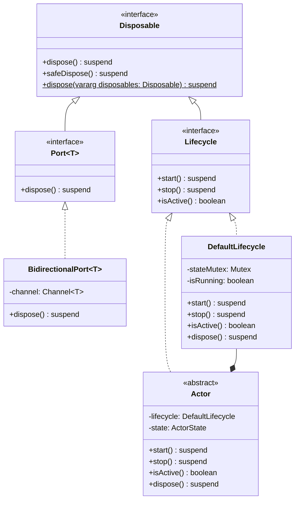

# Lifecycle Class Diagram

## Description of Key Relationships

1. **`Disposable`** is the base interface for resource management, providing methods for disposing of resources.
2. **`Lifecycle`** extends **`Disposable`** and adds methods for starting, stopping, and checking the active status of components.
3. **`DefaultLifecycle`** is a concrete implementation of the **`Lifecycle`** interface, potentially used by classes like **`Actor`**.
4. **`Actor`** implements the **`Lifecycle`** interface (possibly via delegation to a `DefaultLifecycle` instance).
5. **`Port`** implements the **`Disposable`** interface for resource management.
6. **`BidirectionalPort`** (as an example implementation of `Port`) would also handle disposal.

This lifecycle management system provides a consistent approach to managing the lifecycle of components throughout the Solace Core Framework, ensuring proper resource management and system stability.