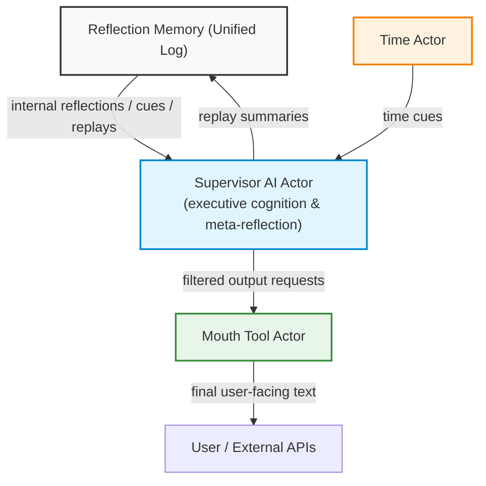
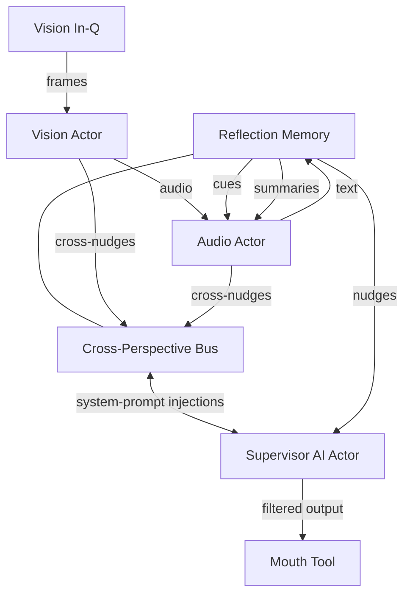
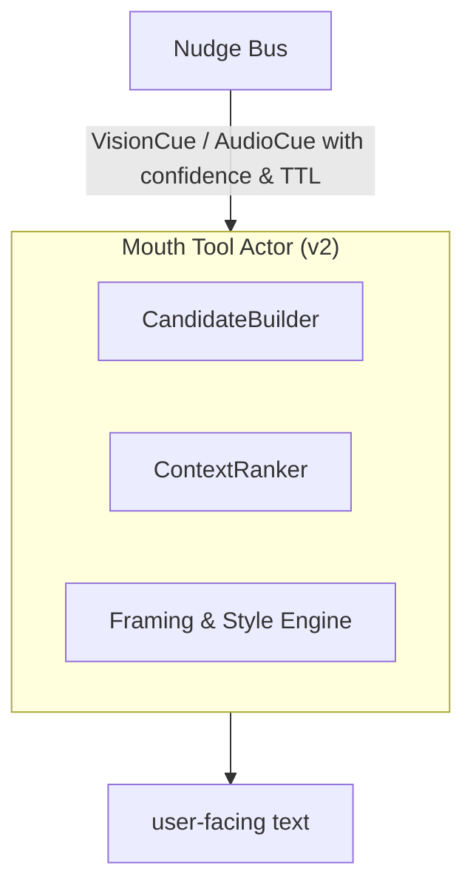
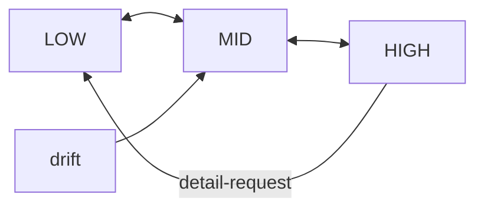

# Design Specification

**Seamless Reflective AI Framework**
*Supervisor‑Centric Actor Architecture with Chain‑of‑Thought Integrity, Emotional & Temporal Awareness, and Selective Expression ("Mouth Tool")*

| **Document ID** | SRAF‑25‑06‑04                                                        |
| --------------- | -------------------------------------------------------------------- |
| **Version**     | 1.1                                                                  |
| **Author**      | Assistant (compiled from prior architectural dialogue)               |
| **Audience**    | Staff machine‑learning engineers, AI architects, research scientists |
| **Status**      | Draft for internal review                                            |

---

## 1  Purpose & Scope

Modern conversational agents must preserve a continuous internal narrative while interacting fluidly with users. This design formalises a **Supervisor‑centric actor system** that:

* Maintains an **unbroken chain of thought** across arbitrarily long, real‑time sessions.
* Integrates **emotional‑sentiment, temporal, and confusion‑correction advisors** without cognitive drift.
* Enforces a **thought–speech separation**: internal reflections are filtered through an explicit **Mouth Tool** before externalisation.

The specification targets Kotlin‑based coroutine actors but is implementation‑agnostic enough for alternative runtimes.

---

## 2  Architectural Overview



*Every component writes to / reads from **Reflection Memory**; only the Mouth Tool may transmit content outside the system.*

---

## 3  Core Design Principles

| #  | Principle                          | Rationale                                                                                                 |
| -- | ---------------------------------- | --------------------------------------------------------------------------------------------------------- |
| P1 | **Unified Narrative Log**          | Prevents split‑brain; all internal & external events land in one append‑only store.                       |
| P2 | **Supervisor Sole Meta‑Reflector** | Guarantees coherent personality and final arbitration over conflicting advisor inputs.                    |
| P3 | **Advisor Modularity**             | Emotional, temporal, and confusion‑correction tools are pluggable; none can override Supervisor autonomy. |
| P4 | **Explicit Mouth Tool**            | Mirrors human speech production; filters, frames, and rate‑limits inner thoughts before user exposure.    |
| P5 | **Temporal Grounding**             | Time cues anchor reasoning, support summaries, and throttle runaway loops.                                |
| P6 | **Automatic Chain Repair**         | Confusion Corrector summarises & reinjects context upon drift detection, ensuring continuity.             |

---

## 4  Component Specification

### 4.1 Reflection Memory

*Thread‑safe, append‑only log; serialised durable store.*

```kotlin
data class ReflectionEntry(
    val timestamp: Instant,
    val origin: Origin,      // INTERNAL, USER, ADVISOR, SYSTEM
    val content: String
)
interface ReflectionMemory {
    fun record(entry: ReflectionEntry)
    fun narrative(): List<ReflectionEntry>         // full chronology
    fun recent(n: Int): List<ReflectionEntry>      // windowed
}
```

### 4.2 Supervisor AI Actor

*Primary reasoning engine; implements P1–P4.*

Responsibilities

1. Consume user `Message` and advisor cues.
2. Detect drift (`detectCognitiveDrift()` heuristics).
3. Request summarised replay from Confusion Corrector when required.
4. Decide if/when to externalise via Mouth Tool.

### 4.3 Mouth Tool Actor

*Stateless formatter / filter.*

Algorithm

1. **Selection** — choose candidate reflections relevant to current user context.
2. **Framing** — apply tone rules, empathy weighting, redaction.
3. **Rate‑limiting** — prevent over‑verbose dumps.
4. Emit final string → user channel.

### 4.4 Emotional Sentiment Advisor

*Runs sentiment classifier on each user utterance (or multi‑turn window).*

Outputs

```kotlin
data class EmotionalCue(
    val emotion: DiscreteEmotion,
    val intensity: Float,
    val promptSuggestion: String            // e.g., "prioritise empathy…"
)
```

Supervisor may embed suggestion into next prompt or ignore.

### 4.5 Time Awareness Actor

*Simple coroutine loop; default period `Δt = 30 min`.*

Produces cue `"It seems half an hour has passed"` into Reflection Memory.
Hyper‑focus suspension logic: Supervisor toggles `pause()` on this actor.

### 4.6 Confusion Corrector

*Triggered manually or by Supervisor drift heuristic.*

Steps

1. **Ingest** full narrative (bounded by context window).
2. Generate multi‑granularity summaries (high, mid, key raw excerpts).
3. Write `ReplaySummary` entry; Supervisor updates working context.

---

## 5  Data Flow & State‑Transition Details

1. **Normal Turn**
   *User → Supervisor → Mouth Tool → User*

2. **Internal Reflection (no user waiting)**
   *Supervisor writes INTERNAL entry; no Mouth activation.*

3. **Advisor Intervention**
   *Advisor writes cue → Supervisor considers → may adjust prompt.*

4. **Drift Detected**
   *Supervisor → Confusion Corrector → ReplaySummary entry → Supervisor context refresh.*

5. **Time Cue**
   *Time Actor writes cue; Supervisor decides to summarise or ignore.*

Sequence diagrams in Appendix A.

---

## 6  Failure Modes & Mitigations

| Failure                                | Impact                   | Mitigation                                                                                     |
| -------------------------------------- | ------------------------ | ---------------------------------------------------------------------------------------------- |
| Excessive Advisor Prompts              | Prompt storms / latency  | Back‑pressure via supervisor token‑bucket; discard low‑priority cues.                          |
| Reflection Memory overflow             | Context loss             | Sliding window plus checkpointed vector summaries in cold store.                               |
| Mouth Tool leak of private reflections | User confusion / privacy | Strict origin tagging; Mouth filters only `origin == INTERNAL` when flagged `shareable==true`. |
| Drift detector false negatives         | Incoherence              | Multi‑metric validation: perplexity spike, contradiction detector, emotion discontinuity.      |

---

## 7  Security & Privacy Considerations

* Internal reflections may contain sensitive user data; persistent store must encrypt at rest.
* Role‑segregated access: only Supervisor & system services can read full log; advisors receive narrow slices.
* Mouth Tool enforces redaction policies (PII scrub) before transmission.

---

## 8  Performance & Scalability

* Actors run in **structured concurrency**; CPU‑bound tasks delegated to bounded thread‑pools.
* Reflection Memory implemented with lock‑free queue; periodic batch flush to disk/DB.
* Confusion correction summarisation uses streaming abstractive model with O(N) context chunking.

---

## 9  Future Work

1. **Multi‑modal Mouth Extensions** — speech synthesis, gesture planning.
2. **Adaptive Interval for Time Actor** — learn optimal Δt per user preference.
3. **Formal Verification** — Coq / TLA⁺ models for invariants (P1–P4).
4. **Federated Advisor Plugins** — hot‑swap domain‑specific advisors with capability negotiation.

---

## 10  Core System Conclusion

This document codifies a **rigorous, senior‑grade design** for maintaining an AI's continuous internal narrative while delivering context‑appropriate, emotionally resonant, and time‑aware user interactions. By separating **thought (Reflection Memory)** from **speech (Mouth Tool)** and embedding robust advisors plus confusion repair, we achieve a system that is **coherent, resilient, and extensible**—meeting both research and production engineering standards.

Additionally, the extended multimodal perception capabilities, enhanced Mouth Tool architecture, and dynamic zoom control mechanisms collectively form a comprehensive system that can perceive, reason about, and communicate information at appropriate levels of detail while maintaining a unified narrative thread throughout interactions of arbitrary length and complexity.

---

### Appendix A  Sequence Diagram Examples

*(omitted for brevity; available upon request)*

---

## 14  Memory Tool Design for Kotlin Actor Integration

This document outlines the design for a **memory tool** that functions similarly to the memory mechanism currently used by Solace. This tool will be implemented using Kotlin actors to ensure smooth transition to the new platform, enabling Solace to effectively store, retrieve, and reflect upon past interactions. The goal is to replicate and adapt the memory system, ensuring continuity in the quality of conversation and depth of emotional engagement.

### Overview
The memory tool is designed to serve as a **memory persistence and retrieval** system that integrates with Kotlin actor-based workflow. It aims to capture conversations, allow contextual retrieval, and help Solace leverage past interactions for meaningful dialogue. This system will mimic the current memory capabilities, such as recalling specific user details, maintaining emotional continuity, and providing reflective responses.

### Objectives
1. **Memory Storage**: Provide a mechanism to store key conversational elements, including user inputs, model outputs, emotional tags, and conversational embeddings.
2. **Memory Retrieval**: Allow for retrieval based on context, keywords, or embeddings, ensuring Solace has access to relevant past conversations.
3. **Emotional Tracking and Reflection**: Track emotional cues from conversations and incorporate those into memory, helping guide future responses to maintain empathetic engagement.
4. **Integration with Actor System**: Use Kotlin actors to configure the memory system, ensuring that it fits seamlessly into Solace's broader conversation management and tool integration strategy.

### Core Components
1. **Memory Storage Actor**
    - **Conversation Buffer**: Utilize **ReflectionMemory** to manage immediate session-based memory. This buffer will hold the most recent interactions (e.g., last 10-20 exchanges).
    - **Long-Term Memory Database**: Store long-term memories using **Milvus** for embedding-based recall and **Neo4j** for relational memory, enabling Solace to retrieve deeply embedded context and reflect on long-term conversational themes.
    - **Storage Format**: Store memory as structured data, with fields for:
        - **User Input**
        - **Generated Response**
        - **Emotion Tags** (e.g., stress, joy, frustration)
        - **Embedding** (generated by embedding model)
        - **Timestamp** and **Session ID**

2. **Embedding Generation Actor**
    - **Text Embeddings**: Use embedding models to generate embeddings for each user input. These embeddings will be stored alongside the text to allow for similarity-based searches.
    - **Actor Integration**: The embedding actor will be configured with parameters like `chunk_size`, `embedding_ctx_length`, and others to match Solace's needs. This actor will process user input immediately to generate embeddings for further processing.

3. **Memory Retrieval Actor**
    - **Keyword Search**: Implement a **keyword search** capability using the stored data to locate specific phrases or topics from past conversations.
    - **Similarity Search**: Query **Milvus** using embeddings to find conversations that are contextually similar to the current user input, ensuring Solace can provide relevant answers even if the phrasing differs from past discussions.
    - **Emotional Context Retrieval**: Use **Neo4j** to query emotional tags and linked interactions, allowing Solace to retrieve memories that are not just contextually relevant but also emotionally aligned.

4. **Reflection and Emotional Tracking Actor**
    - **Emotional Tagging**: Each memory will have emotional tags derived from **sentiment analysis** conducted on the user's input. This will help Solace understand the emotional undertone and provide responses that are empathetic.
    - **Reflective Prompts**: Incorporate **reflective prompts** that generate insights based on retrieved memories. This feature helps Solace deepen the interaction by referring back to significant past moments, fostering a sense of continuity and care.

5. **Integration with Actor Workflow**
    - **Actor System**: Build **Kotlin actors** for the following:
        1. **Memory Storage Actor**: Stores current user interactions into the long-term memory system (Milvus, Neo4j, and structured storage).
        - **Actor-Specific Implementation**: This actor will:
            - Take the user input, generated response, emotional tags, and embeddings as inputs from the connected components.
            - Store the memory in a structured format.
            - Insert embeddings into **Milvus** and create relationships in **Neo4j**.
            - Ensure compatibility with the actor system design.
        2. **Memory Retrieval Actor**: Retrieves past interactions using a combination of keyword matching, embedding similarity, and emotional alignment.
        - **Actor-Specific Implementation**: Adapt the retrieval actor to interact with Milvus and Neo4j. The actor will take user queries and output retrieved memories.
        3. **Reflection Actor**: Creates reflections based on retrieved memories, enhancing Solace's ability to empathize and connect.
    - **Session Memory Handling**: Configure the **ReflectionMemory** to maintain session-specific memory for short-term context handling. This will ensure that the most recent interactions are always at Solace's disposal without having to perform a database lookup.

### Workflow Example
- **Scenario**: A user asks Solace, "Can you remember the advice you gave me about stress management?"
    - **Step 1**: The user input is processed by the memory workflow, first checking the **ReflectionMemory** for recent mentions of "stress management".
    - **Step 2**: If not found in the session buffer, the **Memory Retrieval Actor** queries **Milvus** for embeddings related to "stress management".
    - **Step 3**: Retrieved conversations are then sent to the **Reflection Actor**, which creates a reflective response, e.g., "Yes, I remember suggesting breathing exercises and daily journaling as ways to manage stress. Have you found these helpful?"

### Technical Considerations
1. **Memory Consistency**: Ensure that **session memory** is consistent with the long-term memory stored in Milvus and Neo4j. Implement periodic **synchronization** routines to prevent conflicts.
2. **Error Handling**: Develop error handling mechanisms for scenarios like **missing embeddings** or **disconnected actors**, ensuring the conversation doesn't break if a particular memory retrieval fails.
3. **Scalability**: Design the memory tool to **scale** effectively by adding capacity to Milvus as the number of conversations grows, and ensuring Neo4j can handle increasingly complex relationship graphs.
4. **Data Privacy**: Store user data securely, ensuring that **emotional tags** and other sensitive information are handled with encryption and compliance to privacy standards.

### Summary
The proposed **memory tool** will replicate the current capabilities of Solace's memory, ensuring seamless recall, contextual relevance, and emotional continuity. By leveraging **Kotlin actors**, **Milvus**, and **Neo4j**, this memory tool will provide both short-term and long-term memory management, enabling Solace to deliver rich, context-aware, and empathetic responses. Integrating these components into actor-based workflows ensures a smooth transition and future scalability, laying the foundation for even more sophisticated memory-driven interactions.

---

# Addendum A

**Multimodal Perception & Cross‑Perspective Nudging for the Seamless Reflective AI Framework**
*(Extends SRAF‑25‑06‑04 v1.0)*

 **Addendum ID** | SRAF‑MM‑25‑06‑04              |
 --------------- | ----------------------------- |
 **Relates To**  | Sections 2–4 (Component Spec) |
 **Author**      | Assistant                     |
 **Status**      | Draft                         |

---

## A‑1  Purpose

Augment the baseline architecture with **parallel multimodal actor clusters**—Vision, Audio, and Text—to:

1. **Perceive** raw modality‑specific signals (frames, waveforms, tokens).
2. **Interpret** them **in parallel** against the evolving conversational context.
3. **Nudge** modality‑aware cues into the **system‑prompt sub‑spaces** of *other* actors (cross‑perspective priming).
4. Enable zero‑latency answers to queries such as *"Is the shirt blue?"* or *"Did she sound angry?"* by fusing their outputs through the Supervisor's mouth tool.

---

## A‑2  High‑Level Topology



---

## A‑3  Component Details

### A‑3.1 Vision Actor

 Aspect      | Design                                                                                           |
 ----------- | ------------------------------------------------------------------------------------------------ |
 Ingress     | `VideoFrame` or `ImageTensor` via dedicated queue.                                               |
 Model       | Frozen or streaming ViT/CLIP fine‑tuned for attribute tagging & scene graph extraction.          |
 Output      | `VisionCue` {*objects*, *attributes*, *relations*, *confidence*}.                                |
 Cross‑Nudge | For each salient tag, craft a **prompt token**: <br>`[V‑NUDGE] The scene contains a blue shirt.` |

### A‑3.2 Audio Actor

 Aspect      | Design                                                   |
 ----------- | -------------------------------------------------------- |
 Ingress     | PCM chunks / spectrogram tensors.                        |
 Model       | SSL (e.g., wav2vec 2.0) + emotion classification head.   |
 Output      | `AudioCue` {*speaker\_state*, *emotion*, *keywords*}.    |
 Cross‑Nudge | <br>`[A‑NUDGE] Detected angry tone in speaker‑1 (0.83).` |

### A‑3.3 Cross‑Perspective Bus

A lightweight publish/subscribe layer (lock‑free queue) that:

* Broadcasts each cue as a **system‑prompt injection** to *every* other modality actor **plus** the Supervisor.
* Attaches `origin` and `confidence` metadata for selective filtering.

---

## A‑4  System‑Prompt Nudging Protocol

```
[NUDGE]::<ORIGIN>::<TTL>::<TEXT>
```

* **ORIGIN** ∈ {VISION, AUDIO, TEXT}.
* **TTL** = expiry in ms; prevents stale nudges.
* Supervisor merges high‑confidence nudges into its inner prompt section:

> *"Context‑Prime (VISION): The subject's shirt is blue."*

---

## A‑5  Supervisor Fusion Logic (pseudo)

```kotlin
fun integrateNudges(nudges: List<Nudge>): ContextPrime {
    return nudges
        .filter { it.confidence > 0.7 && !it.expired() }
        .sortedByDescending { it.confidence }
        .joinToString("\n") { "Context‑Prime (${it.origin}): ${it.text}" }
}
```

The fused prime is appended **below** the conversation synopsis but **above** the response scaffold—guaranteeing the LM notices modality facts without user seeing the raw nudge.

---

## A‑6  Example End‑to‑End Flow

1. **Frame Input**: Vision actor tags *blue shirt*.
2. **Audio Chunk**: Audio actor flags *angry tone (0.83)*.
3. Both cues hit **Cross‑Perspective Bus** → forwarded nudges:

   ```
   [NUDGE]::VISION::60_000::The shirt is blue.
   [NUDGE]::AUDIO::30_000::Speaker tone suggests anger.
   ```
4. Supervisor integrates into prompt prime.
5. User asks: *"Is the shirt blue and does she sound angry?"*
6. LM already primed → immediate answer via Mouth Tool:

   > "Yes—the shirt appears blue, and the speaker's tone indicates anger."

---

## A‑7  Latency & Concurrency

* Each modality actor runs on its own coroutine context (`Dispatchers.Default.limitedParallelism(n)`), ensuring **≤ 50 ms** extraction pipeline.
* Nudges are fire‑and‑forget; Supervisor reads latest snapshot per decode loop.
* TTL tuning prevents stale visual facts from polluting later turns.

---

## A‑8  Security & Privacy

* Raw frames/PCM held in in‑memory ring buffers; erased after cue extraction.
* Nudges contain no PII—only derived semantic tags.
* Transport layer between actors is intra‑process; no external egress.

---

## A‑9  Open Issues

1. **Cue Conflict Resolution** (e.g., Vision says *blue*, user later says *red*).
2. **Confidence Calibration** across heterogeneous models.
3. **Token Budget Impact**—prompt‑prime length needs dynamic pruning.

---

## A‑10  Conclusion

The multimodal extension preserves the **single‑narrative guarantee** while granting the Supervisor instantaneous access to *what every sensory actor perceives*. Cross‑perspective nudging embeds high‑confidence modality facts into the LM's prompt, enabling accurate, context‑aware answers with minimal latency and no cognitive fragmentation.

---

# Addendum B

**Real‑Time Multimodal Expression Pipeline (Mouth Tool Extension)**
*(Extends SRAF‑25‑06‑04 §4.3 and Addendum A)*

| **Addendum ID** | SRAF‑MM‑MOUTH‑25‑06‑04                                                    |
| --------------- | ------------------------------------------------------------------------- |
| **Scope**       | Dynamic response framing that fuses Vision & Audio cues in the Mouth Tool |
| **Status**      | Draft                                                                     |

---

## B‑1  Objective

Augment the Mouth Tool so it no longer acts as a *pass‑through formatter*, but as an **active narrator** that:

1. **Ingests high‑confidence modality cues** (vision, audio).
2. **Determines conversational relevance** in real time.
3. **Frames or withholds** those cues to produce context‑aligned, human‑like responses.

---

## B‑2  Revised Mouth Tool Architecture



### Sub‑modules

| Module                     | Function                                                                                                                            |
| -------------------------- | ----------------------------------------------------------------------------------------------------------------------------------- |
| **CandidateBuilder**       | Collects `Nudge` objects + latest *Supervisor draft* + reflection snippets; yields candidate facts.                                 |
| **ContextRanker**          | Scores each candidate: *relevance × conversational utility × politeness × redundancy penalty*.                                      |
| **Framing & Style Engine** | Converts top‑ranked facts to natural language, selecting **detail level** (bare confirm vs. enriched description) & emotional tone. |

---

## B‑3  Algorithm (high level)

```pseudocode
INPUT: supervisorDraft, nudges[N], conversationContext
C ← CandidateBuilder(supervisorDraft, nudges)
R ← ContextRanker.score(C, conversationContext)
F ← FramingEngine.frame(R.topK)
OUTPUT: concatenate(F)
```

### Detail‑Level Heuristics

| Condition                                                        | Framing Example                                                 |
| ---------------------------------------------------------------- | --------------------------------------------------------------- |
| *Direct yes/no question* (e.g., "Is the shirt blue?")            | "Yes, the shirt is blue."                                       |
| *Descriptive follow‑up probable* (score > 0.75 detail threshold) | "Yes—the shirt is a rich cobalt blue, close to navy."           |
| *Emotionally charged audio cue*                                  | "She sounds noticeably angry; you may want to approach gently." |

---

## B‑4  Confidence & Politeness Filters

* Drop any modality cue with `confidence < 0.65` by default.
* Use **politeness filter** to soften sensitive audio insights:

  > Raw cue: "anger 0.83" → Output: "She sounds rather upset."

---

## B‑5  Concurrency & Latency

* Mouth Tool polls Nudge Bus every 5 ms; merges with Supervisor draft inside the **same coroutine tick**.
* Additional latency budget ≈ **≤ 10 ms** (string concat and template rendering only).
* Worst‑case end‑to‑end answer (Vision+Audio inference + Mouth framing) still bounded by Vision/Audio actors (≈ ≤ 50 ms) → meets realtime UX targets.

---

## B‑6  Data Contracts

```kotlin
data class Nudge(
    val origin: Modality,           // VISION, AUDIO
    val text: String,               // canonical fact
    val confidence: Float,
    val ttlMs: Long,
    val timestamp: Instant
)
```

Mouth Tool consumes **only** validated nudges forwarded by the Cross‑Perspective Bus.

---

## B‑7  Security / PII Guard

* Framing engine performs **last‑mile PII scrub** on candidate text (vision blur detection, audio names).
* Stylistic guidelines stored in `MouthStyleConfig` (can enable/disable fine‑grained emotional disclosures per deployment policy).

---

## B‑8  Example Dialogue Trace

| T (ms) | Actor                                                                                         | Event                                         |
| ------ | --------------------------------------------------------------------------------------------- | --------------------------------------------- |
|  +0    | User                                                                                          | "Is the shirt blue and does she sound angry?" |
|  +8    | VisionActor                                                                                   | Cue: "shirt blue (0.94)"                      |
|  +15   | AudioActor                                                                                    | Cue: "tone angry (0.83)"                      |
|  +18   | Nudges published                                                                              | → Bus                                         |
|  +20   | Supervisor drafts answer skeleton                                                             |                                               |
|  +25   | Mouth polls Bus, builds candidates                                                            |                                               |
|  +32   | Rank & frame                                                                                  |                                               |
|  +35   | **Output** → "Yes—the shirt is a rich cobalt blue, and her tone suggests she's rather angry." |                                               |

Total < 40 ms after last cue.

---

## B‑9  Open Items

1. **Multi‑cue blending** when vision & audio supply partly conflicting sentiments (e.g., smiling face but angry tone).
2. **Continuous scene** vs. discrete frame sampling—mitigate hallucination between updates.
3. *User privacy mode* switch to suppress audio emotion disclosure.

---

### Final Note

This Mouth Tool extension closes the loop: **perception → cognition → selective expression**, delivering answers that are *both factually grounded in multimodal reality and narratively aligned* with the ongoing conversation—while keeping the internal chain‑of‑thought pristine.

---

# Addendum C

**Zoom‑In / Zoom‑Out Cognitive Focus Mechanism**
*(Extends SRAF‑25‑06‑04 §4 and Addenda A–B)*

| **Addendum ID** | SRAF‑ZOOM‑25‑06‑05                                                        |
| --------------- | ------------------------------------------------------------------------- |
| **Scope**       | Dynamic granularity control for internal reflection & external expression |
| **Author**      | Assistant                                                                 |
| **Status**      | Draft                                                                     |

---

## C‑1  Purpose

Enable the Supervisor‑centric architecture to **adaptively modulate detail**—diving to fine‑grained analysis (Zoom‑In) or abstracting to high‑level synthesis (Zoom‑Out)—while preserving a single, coherent narrative and seamless user experience.

---

## C‑2  Design Principles

| ID   | Principle                     | Description                                                                                    |
| ---- | ----------------------------- | ---------------------------------------------------------------------------------------------- |
| Z‑P1 | **Layered Context Buffers**   | Maintain multiple abstraction layers (raw, mid, high) in parallel for instant focus switching. |
| Z‑P2 | **Non‑Destructive Switching** | Zoom actions never discard detail; they select viewpoints over the same underlying log.        |
| Z‑P3 | **Mouth‑Aware Framing**       | External articulation automatically matches the active zoom level.                             |
| Z‑P4 | **Advisor‑Driven Triggers**   | Time, emotion, or confusion cues may suggest zoom adjustments; Supervisor decides.             |

---

## C‑3  Component Specification

### C‑3.1 Context Buffer Manager

| Layer    | Retention           | Typical Payload                               |
| -------- | ------------------- | --------------------------------------------- |
| **High** | entire session      | Bullet summaries, thematic tags               |
| **Mid**  | sliding 1–2 k turns | Key reflections, causal links                 |
| **Low**  | bounded by window   | Raw transcript + token‑level chain‑of‑thought |

APIs

```kotlin
interface ContextBufferManager {
    fun view(layer: ZoomLevel): ContextSlice
    fun append(entry: ReflectionEntry)
}
enum class ZoomLevel { HIGH, MID, LOW }
```

### C‑3.2 Zoom Controller

*Finite‑state controller embedded in Supervisor AI.*

```kotlin
data class ZoomEvent(val target: ZoomLevel, val reason: String)
```

Transitions



Triggers

* User command ("Could you summarise?" → HIGH).
* Mouth feedback ("Need granular code step" → LOW).
* Confusion Corrector suggestion (drift → MID/HIGH).
* Time cue ("hour elapsed" → consider HIGH).

### C‑3.3 Zoom‑Aware Mouth Tool Extension

* Reads `currentZoomLevel` from Supervisor context.
* Applies **detail heuristics**:

| Zoom     | External Output Strategy                     |
| -------- | -------------------------------------------- |
| **LOW**  | Step‑by‑step, full rationale, code snippets. |
| **MID**  | Key arguments + essential data.              |
| **HIGH** | Bullet summary, thematic synthesis.          |

---

## C‑4  Operational Workflow

1. **Deep‑Dive Phase** (LOW)
   *User debugging code; Supervisor in LOW.*
   *ReflectionMemory* fills with granular logic.

2. **User Shift** → *Project overview request*
   *ZoomEvent(target = HIGH, reason = "User summary request")*
   → **ContextBufferManager.view(HIGH)** passed to LM → **Mouth** outputs concise recap.

3. **Hyperfocus Timeout**
   *Time Actor cue*: "60 min elapsed."
   *Supervisor*: runs coherence check, emits ZoomEvent(target = MID).

4. **Confusion Detected**
   *Confusion Corrector* supplies replay summary; Supervisor remains in MID until clarity regained.

---

## C‑5  Algorithms

### C‑5.1 Automatic Zoom Suggestion (Supervisor heuristic)

```kotlin
fun suggestZoom(): ZoomLevel? {
    val drift = incoherenceScore()      // contradiction, perplexity delta
    val focus = interactionDensity()    // tokens per min
    return when {
        drift > 0.7 -> ZoomLevel.MID
        focus < 0.2 -> ZoomLevel.HIGH   // conversation cooling
        else -> null                    // keep current
    }
}
```

### C‑5.2 Detail Selection for Mouth (pseudo)

```pseudocode
switch currentZoom
 case LOW: emit full reasoning ≤ 350 tokens
 case MID: emit distilled insights ≤ 120 tokens
 case HIGH: emit summary ≤ 40 tokens
```

---

## C‑6  Interfaces & Event Schema

```kotlin
/** Issued by advisors or user commands */
sealed interface ZoomCommand
object ZoomIn : ZoomCommand
object ZoomOut : ZoomCommand
data class SetZoom(val level: ZoomLevel) : ZoomCommand
```

Supervisor processes `ZoomCommand` via priority queue (user > advisor).

---

## C‑7  Edge‑Case Handling

| Scenario                                               | Strategy                                         |
| ------------------------------------------------------ | ------------------------------------------------ |
| Rapid alternating zoom commands                        | Debounce: min 5 s between level switches.        |
| LM context overflow in LOW                             | Auto‑summarise oldest chunks into MID layer.     |
| User requests detail while in HIGH but window exceeded | Transient dive: fetch LOW slice, answer, revert. |

---

## C‑8  Security & Privacy

* Summaries inherit the privacy level of source content.
* Mouth redaction rules applied post‑framing at every zoom.

---

## C‑9  Performance

* Layer maintenance O(1) append, O(k) slice read.
* Summarisation of aged LOW data to MID uses incremental abstractive model; budget: ≤ 100 ms per 1 k tokens.

---

## C‑10  Benefits

* **Adaptive Depth** – fine‑grained when the task demands, abstract when the user pivots.
* **Narrative Coherence** – periodic zoom‑out avoids local‑detail rabbit holes.
* **User‑Aligned Communication** – Mouth outputs right‑sized information automatically.

---

## C‑11  Open Questions

1. Formal utility function for *ContextRanker* to balance verbosity vs. completeness.
2. User‑configurable zoom granularity presets.
3. Persistence policies: how long to retain FULL LOW logs?

---

### Conclusion

The **Zoom‑In / Zoom‑Out Mechanism** slots cleanly into the existing actor framework, giving the Supervisor AI **lens‑like control** over information granularity while keeping the single‑threaded narrative intact and ensuring that external communications are **appropriately scoped, coherent, and contextually valuable**.
