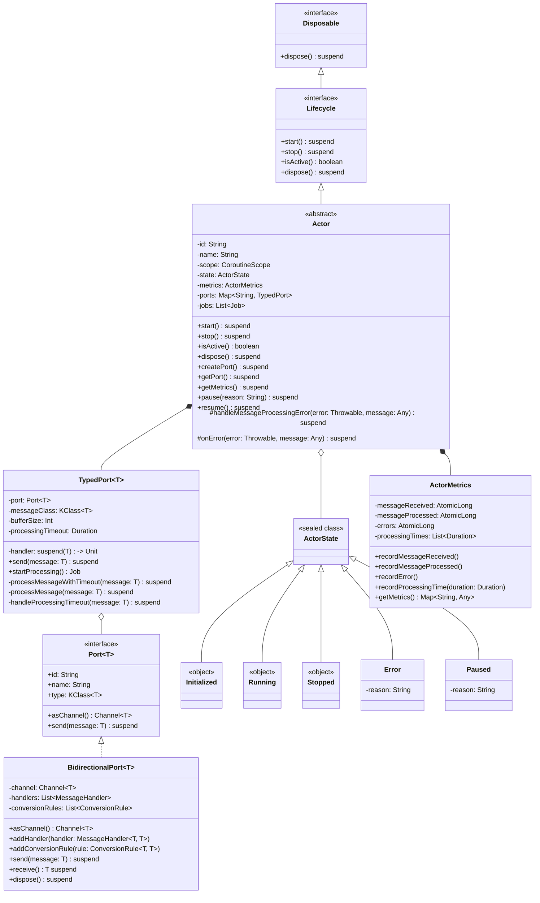

# Actor System Class Diagram

This class diagram illustrates the key classes in the actor system and their relationships:

1. **Actor** implements the **Lifecycle** interface, which extends **Disposable**
2. **Actor** contains multiple **TypedPort** instances for communication
3. **TypedPort** wraps a **Port** interface, which is implemented by **BidirectionalPort**
4. **Actor** maintains an **ActorState** (which can be Initialized, Running, Stopped, Error, or Paused)
5. **Actor** uses **ActorMetrics** for performance monitoring

The diagram shows the inheritance relationships (solid lines with triangular arrowheads), composition relationships (solid lines with filled diamonds), and aggregation relationships (solid lines with empty diamonds).