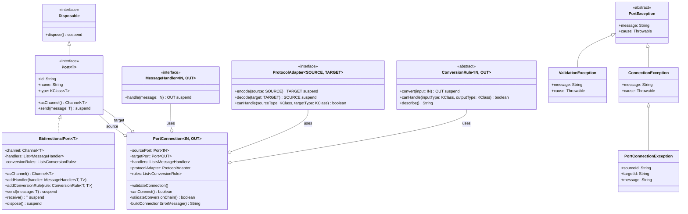

# Kernel Class Diagram

This class diagram illustrates the key classes in the kernel component and their relationships:

1. **Port** interface extends **Disposable** and defines the contract for communication ports
2. **BidirectionalPort** implements the **Port** interface, providing concrete functionality
3. **PortConnection** represents a connection between two ports, using **MessageHandler**, **ProtocolAdapter**, and **ConversionRule** for message processing
4. **MessageHandler**, **ProtocolAdapter**, and **ConversionRule** define interfaces for message processing and conversion
5. **PortException** and its subclasses represent various error conditions in the port system

The diagram shows the inheritance relationships (solid lines with triangular arrowheads), implementation relationships (dashed lines with triangular arrowheads), and aggregation relationships (solid lines with diamond arrowheads).