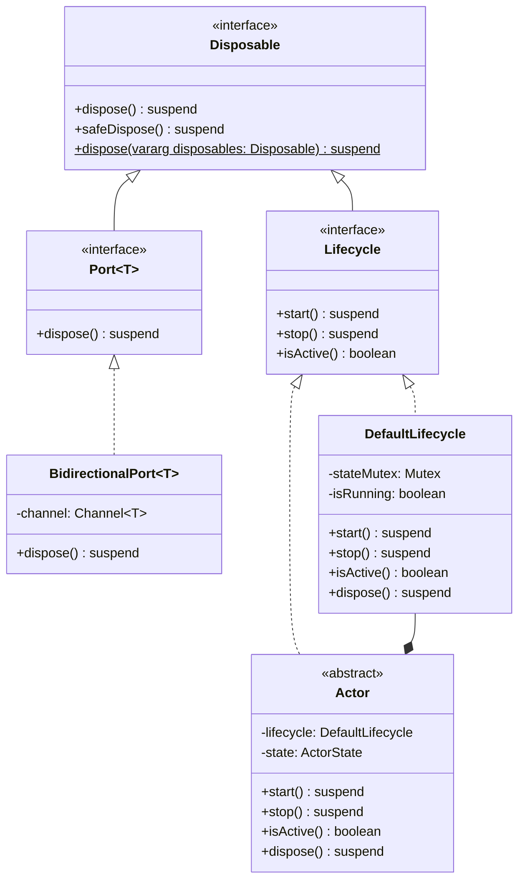

# Lifecycle Management Class Diagram

This class diagram illustrates the key interfaces and classes in the lifecycle management system and their relationships:

1. **Disposable** is the base interface for resource management, providing methods for disposing of resources
2. **Lifecycle** extends **Disposable** and adds methods for starting, stopping, and checking the active status of components
3. **DefaultLifecycle** is a concrete implementation of the **Lifecycle** interface used by the **Actor** class
4. **Actor** implements the **Lifecycle** interface and uses a **DefaultLifecycle** instance for lifecycle management
5. **Port** implements the **Disposable** interface for resource management
6. **BidirectionalPort** implements the **Port** interface and provides concrete resource disposal functionality

The diagram shows the inheritance relationships (solid lines with triangular arrowheads), implementation relationships (dashed lines with triangular arrowheads), and composition relationships (solid lines with filled diamonds).

This lifecycle management system provides a consistent approach to managing the lifecycle of components throughout the Solace Core Framework, ensuring proper resource management and system stability.