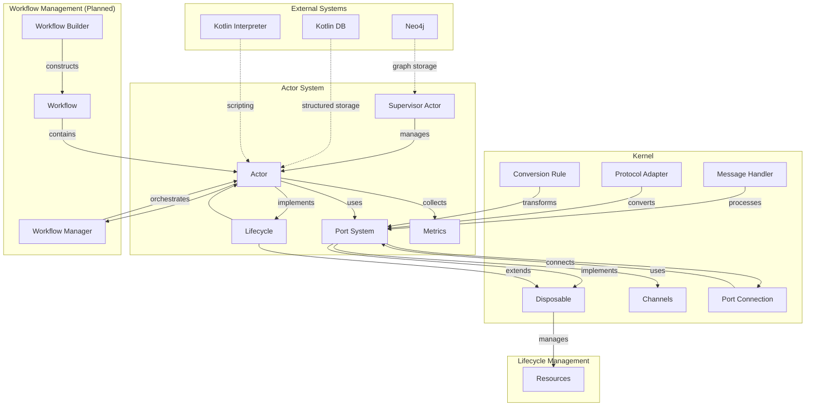

# Solace Core Framework System Architecture

## System Architecture Overview

The Solace Core Framework is built around several key components that work together to provide a flexible, resilient, and extendable platform:

1. **Actor System**: The core component of the framework, responsible for managing the execution and interaction of modular actors.
   - **Actor**: The fundamental building block, encapsulating specific functionality
   - **Supervisor Actor**: Manages the lifecycle of other actors
   - **Port System**: Enables type-safe communication between actors
   - **Metrics**: Collects performance data for monitoring and optimization

2. **Kernel**: The foundational infrastructure for communication and resource management.
   - **Port**: Interface for sending and receiving messages
   - **Port Connection**: Establishes connections between compatible ports
   - **Message Handler**: Processes messages during transmission
   - **Protocol Adapter**: Converts between different message types
   - **Conversion Rule**: Transforms messages from one format to another
   - **Channels**: Underlying mechanism for message passing

3. **Lifecycle Management**: Standardized approach to component lifecycle management.
   - **Lifecycle**: Interface for managing component lifecycles
   - **Disposable**: Interface for resource management
   - **Resources**: Various resources managed by components

4. **Workflow Management** (Planned): System for orchestrating the execution of actors.
   - **Workflow Manager**: Orchestrates the execution of workflows
   - **Workflow Builder**: Constructs workflows from actors
   - **Workflow**: A composition of actors with defined connections

5. **External Systems** (Planned/Partially Implemented):
   - **Neo4j**: Graph database for storing relationships between actors and knowledge
   - **Kotlin DB**: Native storage for structured data
   - **Kotlin Interpreter**: For embedded scripting within actors

This architecture provides a robust foundation for building scalable, concurrent applications with dynamic, hot-pluggable components and type-safe communication.
