# SolaceCore Architecture Overview

**Document Version:** 1.0.0
**Last Updated:** 2026-02-04
**Status:** Development - Kotlin Implementation
**Classification:** Technical Specification

---

## Executive Summary

SolaceCore is a **unified agentic development platform with genuine emotional intelligence** that bridges AI models
with development tools through sophisticated actor orchestration. Unlike traditional AI assistants that simulate
personality, SolaceCore implements authentic emotional awareness through biologically-inspired neural processing.

### Core Capabilities

- **Dual-Model Cognition**: Technical reasoning (Qwen-3) paired with emotional intelligence (Gemma3-CSM)
- **Provider Integration**: Focused Ollama support with OpenAI protocol compatibility
- **Universal Tool System**: MCP-based structured tools with comprehensive safety controls
- **Pipeline Architecture**: Block-based composable request shaping and model adaptation
- **Neutral History**: Provider-agnostic XML event storage with full provenance tracking
- **Safety-First Design**: Multi-layered approval workflows with intelligent risk assessment

### Key Innovation

SolaceCore's emotional intelligence is not simulated - emotions emerge naturally from a three-layer spiking neural
network that modulates attention and memory through emotional valence. The system maintains separate emotional and
technical memory streams that fuse through arousal-based retrieval, creating authentic emotional context that informs (
but doesn't overwhelm) technical reasoning.

---

## System Architecture

### High-Level Architecture

```mermaid
graph TB
    subgraph "User Interfaces"
        CLI[Solace CLI<br/>Compose Multiplatform<br/>composeApp/src/desktopMain/]
        WebUI[Solace Web UI<br/>Compose HTML<br/>composeApp/src/webMain/]
        MobileUI[Solace Mobile<br/>Compose Android/iOS<br/>composeApp/src/androidMain/]
    end

    subgraph "Core Actor System"
        ActorSystem[Actor System<br/>lib/src/commonMain/kotlin/com/solacecore/actor/<br/>ActorSystem.kt]
        ActorSupervisor[Actor Supervisor<br/>lib/src/commonMain/kotlin/com/solacecore/actor/<br/>ActorSupervisor.kt]
        ActorLifecycle[Actor Lifecycle<br/>docs/components/lifecycle/<br/>ActorLifecycle.kt]
        ActorInference[Actor Inference Engine<br/>docs/components/actor_inference_engine/<br/>InferenceEngine.kt]
    end

    subgraph "Emotional Intelligence"
        MoodManager[Mood Manager<br/>lib/src/commonMain/kotlin/com/solacecore/mood/<br/>MoodManager.kt]
        SNN[Spiking Neural Network<br/>3-layer integrate-and-fire<br/>lib/src/commonMain/kotlin/com/solacecore/mood/snn/]
        MoodOrchestrator[Mood Orchestrator<br/>Decision making<br/>lib/src/commonMain/kotlin/com/solacecore/mood/]
        MemoryConsolidation[Memory Consolidation<br/>docs/components/memory/<br/>MemoryConsolidation.kt]
        EmotionalContext[Emotional Context<br/>lib/src/commonMain/kotlin/com/solacecore/mood/<br/>EmotionalContext.kt]
    end

    subgraph "Pipeline System"
        PipelineEngine[Pipeline Engine<br/>lib/src/commonMain/kotlin/com/solacecore/pipeline/<br/>PipelineEngine.kt]
        PipelineConfig[Pipeline Config<br/>lib/src/commonMain/kotlin/com/solacecore/pipeline/<br/>PipelineConfig.kt]
        Blocks[13 Pipeline Blocks<br/>lib/src/commonMain/kotlin/com/solacecore/pipeline/blocks/]
    end

    subgraph "Provider Layer"
        OllamaProvider[Ollama Provider<br/>lib/src/commonMain/kotlin/com/solacecore/providers/<br/>OllamaProvider.kt]
        OllamaClient[Ollama Client<br/>lib/src/commonMain/kotlin/com/solacecore/providers/<br/>OllamaClient.kt]
        BaseProvider[Base Provider<br/>lib/src/commonMain/kotlin/com/solacecore/providers/<br/>BaseProvider.kt]
    end

    subgraph "Tool System - MCP"
        MCPCore[MCP Core<br/>lib/src/commonMain/kotlin/com/solacecore/mcp/]
        MCPConverters[Format Converters<br/>lib/src/commonMain/kotlin/com/solacecore/mcp/<br/>McpConverters.kt]
        MCPExecutor[Tool Executor<br/>lib/src/commonMain/kotlin/com/solacecore/mcp/<br/>McpToolExecutor.kt]
        MCPRegistry[Tool Registry<br/>lib/src/commonMain/kotlin/com/solacecore/mcp/<br/>McpToolRegistry.kt]
        MCPRouter[Tool Router<br/>lib/src/commonMain/kotlin/com/solacecore/mcp/<br/>McpToolRouter.kt]
        StructuredTools[Structured Tools<br/>lib/src/commonMain/kotlin/com/solacecore/mcp/<br/>StructuredTools.kt]
    end

    subgraph "Data & History"
        Config[Configuration<br/>lib/src/commonMain/kotlin/com/solacecore/config/<br/>.solace-dev/]
        NeutralXML[Neutral History XML<br/>lib/src/commonMain/kotlin/com/solacecore/neutral/<br/>NeutralHistoryXml.kt]
        NeutralMessages[Neutral Messages<br/>lib/src/commonMain/kotlin/com/solacecore/neutral/<br/>NeutralMessages.kt]
        EventBus[Event Bus<br/>lib/src/commonMain/kotlin/com/solacecore/neutral/<br/>EventBus.kt]
        Converters[Format Converters<br/>lib/src/commonMain/kotlin/com/solacecore/neutral/<br/>Converters.kt]
    end

    subgraph "Safety & Approvals"
        Approvals[Approval System<br/>lib/src/commonMain/kotlin/com/solacecore/safety/<br/>ApprovalSystem.kt]
        RiskAssessment[Risk Assessment<br/>lib/src/commonMain/kotlin/com/solacecore/safety/<br/>RiskAssessment.kt]
    end

    subgraph "Storage & Workflow"
        StorageSystem[Storage System<br/>docs/components/storage/<br/>StorageSystem.kt]
        WorkflowEngine[Workflow Engine<br/>docs/components/workflow/<br/>WorkflowEngine.kt]
        ScriptingEngine[Scripting Engine<br/>docs/components/scripting/<br/>ScriptingEngine.kt]
    end

    CLI --> ActorSystem
    WebUI --> ActorSystem
    MobileUI --> ActorSystem
    ActorSystem --> ActorSupervisor
    ActorSystem --> ActorLifecycle
    ActorSystem --> MoodManager
    ActorSupervisor --> ActorInference
    ActorSupervisor --> WorkflowEngine
    MoodManager --> SNN
    MoodManager --> MoodOrchestrator
    MoodManager --> MemoryConsolidation
    MoodManager --> EmotionalContext
    ActorSystem --> PipelineEngine
    PipelineEngine --> PipelineConfig
    PipelineEngine --> Blocks
    Blocks --> OllamaProvider
    OllamaProvider --> OllamaClient
    OllamaProvider --> BaseProvider
    ActorInference --> MCPCore
    WorkflowEngine --> MCPCore
    MCPCore --> MCPConverters
    MCPCore --> MCPExecutor
    MCPCore --> MCPRegistry
    MCPCore --> MCPRouter
    MCPExecutor --> StructuredTools
    ActorSystem --> NeutralXML
    NeutralXML --> EventBus
    NeutralXML --> NeutralMessages
    NeutralXML --> Converters
    ActorSystem --> Config
    WorkflowEngine --> Approvals
    Approvals --> RiskAssessment
    ActorSystem --> StorageSystem
    ActorSystem --> ScriptingEngine
```



---

## Core Architectural Principles

### 1. Actor-Based Architecture ⭐

**Status:** Production Implementation
**Location:** `lib/src/commonMain/kotlin/com/solacecore/actor/` (15 files, 85KB)

SolaceCore implements a sophisticated actor-based architecture where every component is an actor with:

**Actor Supervisor**: Manages actor lifecycle, communication, and fault tolerance
**Actor Inference Engine**: Handles AI model interactions and reasoning
**Actor Lifecycle**: Manages actor creation, supervision, and termination
**Message Passing**: All communication happens via typed messages with Flow-based streams

### 2. Dual-Model Cognition ⭐

**Status:** Production Implementation
**Location:** `lib/src/commonMain/kotlin/com/solacecore/mood/` (18 files, 144KB)

SolaceCore implements genuine dual-model cognition where every agent has two interconnected processing streams:

**Technical Brain** (e.g., Qwen-3, Claude)

- Handles reasoning, coding, tool use, problem-solving
- Receives emotional context as light-touch prompt nudges
- Maintains focus on technical tasks
- Makes final execution decisions

**Emotional Core** (Gemma3-CSM)

- Provides emotional awareness through spiking neural network
- Generates authentic emotional responses
- Modulates attention and memory through valence
- Influences technical decision-making through emotional context

### 3. Kotlin-First Design

**Status:** Production Implementation
**Location:** `lib/src/commonMain/kotlin/com/solacecore/`

All components are built with Kotlin best practices:

**Coroutines & Flow**: Async operations and reactive streams
**Sealed Classes**: Type-safe message passing and state management
**DSL Builders**: Configuration and pipeline construction
**Inline Functions**: Performance-critical operations
**Operator Overloading**: Domain-specific operators
**Null Safety**: Comprehensive null checking and smart casts

### 4. Multiplatform Support

**Status:** Production Implementation
**Targets:** JVM, JS, Native, Android, iOS

```kotlin
// Common code that runs everywhere
interface PlatformProvider {
    fun getPlatformName(): String
    fun createHttpClient(): HttpClient
}

// Platform-specific implementations
class JvmPlatformProvider : PlatformProvider {
    override fun getPlatformName() = "JVM"
    override fun createHttpClient() = JvmHttpClient()
}

class JsPlatformProvider : PlatformProvider {
    override fun getPlatformName() = "JavaScript"
    override fun createHttpClient() = JsHttpClient()
}
```

### 5. Component Architecture

**Status:** Production Implementation
**Location:** `docs/components/`

Modular component system with clear interfaces:

```kotlin
interface SolaceComponent {
    val name: String
    val version: String
    val dependencies: Set<String>

    suspend fun initialize(): Result<Unit>
    suspend fun shutdown(): Result<Unit>
    fun healthCheck(): HealthStatus
}

data class HealthStatus(
    val status: ComponentStatus,
    val message: String? = null,
    val metrics: Map<String, Any> = emptyMap()
)

enum class ComponentStatus {
    HEALTHY, DEGRADED, UNHEALTHY, UNKNOWN
}
```

---

## Kotlin Implementation Details

### Actor System Implementation

```kotlin
// Actor definition
abstract class Actor(
    val actorId: String,
    val supervisor: ActorSupervisor
) {
    protected val mailbox = Channel<ActorMessage>(capacity = Channel.UNLIMITED)

    suspend fun start() {
        supervisor.register(this)
        messageLoop()
    }

    private suspend fun messageLoop() {
        for (message in mailbox) {
            try {
                handleMessage(message)
            } catch (e: Exception) {
                supervisor.handleFailure(this, e)
            }
        }
    }

    abstract suspend fun handleMessage(message: ActorMessage)
}

// Message types
sealed class ActorMessage {
    data class UserRequest(val content: String) : ActorMessage()
    data class ToolResult(val toolId: String, val result: Any) : ActorMessage()
    data class SystemEvent(val event: SystemEventType) : ActorMessage()
}
```

### Pipeline DSL

```kotlin
// Pipeline DSL in Kotlin
class PipelineBuilder {
    private val blocks = mutableListOf<PipelineBlock>()

    fun block(name: String, config: Map<String, Any> = emptyMap()) {
        blocks.add(PipelineBlock(name, config))
    }

    fun build(): Pipeline = Pipeline(blocks)
}

// Usage
val pipeline = pipeline {
    block("protocol.ollama")
    block("codec.mcp_over_xml")
    block("tools.negotiation_advertise")
    block("family.qwen3")
}
```

### Neutral History with Kotlin

```kotlin
// Neutral History implementation
class NeutralHistoryXml : NeutralHistory {
    private val events = mutableListOf<NeutralEvent>()

    override suspend fun store(event: NeutralEvent) {
        events.add(event)
        // XML serialization would happen here
    }

    override fun retrieve(query: NeutralQuery): Flow<NeutralEvent> = flow {
        events.filter { matchesQuery(it, query) }
            .forEach { emit(it) }
    }
}
```

### End-to-End Data Flow (Kotlin)

- **Ingress**: UI (Compose desktop/web/mobile) or CLI sends a `UserRequest` to `ActorSystem`.
- **Routing**: `ActorSupervisor` delegates to Main/Advisor/Supervisor actors using channel-based mailboxes.
- **Negotiation**: `PipelineEngine` selects blocks and `MCPCore` negotiates the tool format (MCP → functions → XML).
- **Execution**: `MCPExecutor` invokes providers (e.g., Ollama) via provider-specific clients; results stream through Flow.
- **Safety Loop**: `ApprovalSystem` must approve requests; `RiskAssessment` annotates actions before dispatch.
- **Persistence**: `NeutralHistoryXml` records every event (tool calls, responses, mood changes) with lane attribution.
- **Feedback**: `MoodManager` updates emotional state; outputs modulate future prompt shaping.
- **Egress**: Composed response sent back through the initiating actor to UI/CLI.

### Concurrency & Threading Model

- **Coroutines everywhere**: All actors use structured concurrency; long-running work lives on `Dispatchers.IO` or custom dispatchers.
- **Backpressure**: Channel capacities kept small for control planes; heavy payloads stream via Flow to avoid mailbox bloat.
- **Neutral History writes**: Buffered, ordered by timestamp; persistence handled off the main actor dispatcher.
- **SNN compute**: Spiking network runs on a dedicated dispatcher to avoid starving actor control messages.

### Safety Path (Mandatory)

- **Supervisor as gatekeeper**: Every tool call path must traverse Supervisor approval.
- **Risk scoring**: `RiskAssessment` attaches risk metadata; high-risk paths require explicit confirmation.
- **Auditability**: All approvals and denials persisted in Neutral History with provenance.

### Kotlin Multiplatform Integration

- **Common-first**: Business logic in `lib/src/commonMain`; platform shims only wrap IO (HTTP, storage, UI bridges).
- **Providers**: HTTP clients abstracted through expect/actual to support JVM and JS.
- **Storage**: Neutral History storage interface is common; file/DB backends implemented per platform.
- **UI Bridges**: Compose screens consume Flows from actors; no platform-specific business rules in UI.

---

## Development Workflow

### Building the Project

```bash
# Full build
./gradlew build

# Run tests
./gradlew test

# Run specific platform
./gradlew desktopRun
./gradlew jsBrowserRun
./gradlew androidApp
```

### Project Structure

```
SolaceCore/
├── lib/                          # Shared library
│   └── src/commonMain/kotlin/com/solacecore/
│       ├── actor/               # Actor system
│       ├── mood/                # Emotional intelligence
│       ├── mcp/                 # Tool system
│       ├── neutral/             # History system
│       ├── pipeline/            # Pipeline engine
│       ├── providers/           # AI providers
│       └── safety/              # Safety controls
├── composeApp/                   # UI application
│   ├── src/commonMain/          # Shared UI logic
│   ├── src/desktopMain/         # Desktop UI
│   ├── src/webMain/             # Web UI
│   └── src/androidMain/         # Android UI
├── docs/                        # Documentation
│   ├── components/              # Component docs
│   └── kotlin-plans/            # Kotlin implementations
└── build.gradle.kts             # Build configuration
```

### Key Kotlin Features Used

- **Coroutines**: For async operations and concurrency
- **Flow**: For reactive data streams
- **Sealed Classes**: For type-safe message passing
- **Inline Functions**: For performance optimization
- **DSL Builders**: For configuration APIs
- **Operator Overloading**: For domain-specific operations
- **Context Receivers**: For scoped operations
- **Contracts**: For optimization hints

This architecture provides a solid foundation for building sophisticated AI-powered applications with genuine emotional intelligence, all built with Kotlin's modern features and best practices.