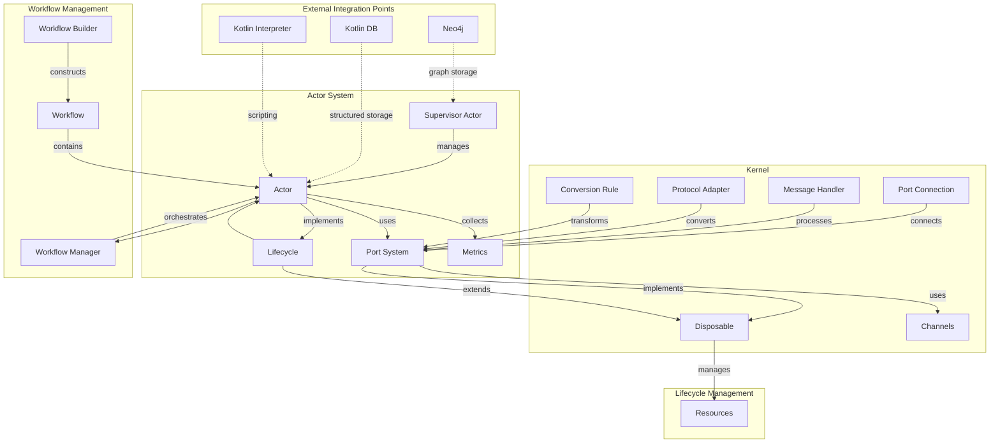

<!-- topic: Orientation -->

# Architecture Overview

SolaceCore is organized as a layered runtime for building hot-pluggable actor systems. This page is the map: it shows how the major runtime layers relate, where each topic page fits, and which deeper design sources are being folded into the wiki.

## Layered Model

```text
+---------------------------------------------------+
|                   Applications                     |
+---------------------------------------------------+
|                     Workflows                      |
+---------------------------------------------------+
|                    Actor System                    |
+---------------------------------------------------+
|                      Kernel                        |
+---------------------------------------------------+
|                    Data Storage                    |
+---------------------------------------------------+
```

**Applications** are the domain-specific systems built on top of SolaceCore. The Solace AI companion is the project that gives this runtime its north star.

**Workflows** compose actors into repeatable processing paths. See [Workflow Orchestration](Workflow-Orchestration).

**Actor System** provides isolated state, message-driven processing, metrics, and lifecycle-aware actor behavior. See [Actor System](Actor-System) and [Supervisor & Hot-Swap](Supervisor-and-Hot-Swap).

**Kernel** provides the communication substrate: ports, channels, message handlers, and type-aware wiring. See [Kernel & Ports](Kernel-and-Ports).

**Data Storage** provides persistence for actor state and system data. The current implementation covers in-memory, file, transactional, cached, recoverable, and serialized storage; Neo4j remains part of the broader design direction. See [Storage & Persistence](Storage-and-Persistence).

## How To Read The Wiki

Start with the concept, then move down the stack:

1. [Vision & Solace AI](Vision-and-Solace-AI) explains the companion-level reason the runtime exists.
2. [Architecture Overview](Architecture-Overview) gives the layered map.
3. [Kernel & Ports](Kernel-and-Ports), [Lifecycle & Resources](Lifecycle-and-Resources), and [Actor System](Actor-System) explain the runtime primitives.
4. [Workflow Orchestration](Workflow-Orchestration), [Scripting Engine](Scripting-Engine), and [Storage & Persistence](Storage-and-Persistence) explain composition, dynamic behavior, and persistence.
5. [Design vs Implementation](Design-vs-Implementation) and [Project Status](Project-Status) keep the aspirational design honest against the implementation.

Specialized Solace AI topics sit above the runtime:

- [Solace AI Overview](Solace-AI-Overview)
- [Memory & Reflection](Memory-and-Reflection)
- [Mood & Emotional Model](Mood-and-Emotional-Model)
- [Voice & Mouth Tool](Voice-and-Mouth-Tool)
- [Inference Cube](Inference-Cube)
- [Providers & MCP Tools](Providers-and-MCP-Tools)
- [Perception Actors](Perception-Actors)

## Deep Architecture Source

The original architecture material is being curated into topic pages rather than carried forward as a maze of parallel indexes. The old numbered Rosetta structure mapped these source sections:

| Section | Topic Landing Page |
|---|---|
| Solace project context | [Vision & Solace AI](Vision-and-Solace-AI) |
| Kernel module | [Kernel & Ports](Kernel-and-Ports) |
| Lifecycle module | [Lifecycle & Resources](Lifecycle-and-Resources) |
| Storage module | [Storage & Persistence](Storage-and-Persistence) |
| Actor module | [Actor System](Actor-System) |
| Workflow module | [Workflow Orchestration](Workflow-Orchestration) |
| Scripting module | [Scripting Engine](Scripting-Engine) |
| InferenceCube architecture | [Inference Cube](Inference-Cube) |
| Build, testing, tooling, status | [Roadmap](Roadmap), [Project Status](Project-Status), and [Documentation Catalog](Documentation-Catalog) |

## Runtime Component Graph



The diagram’s major regions map directly to the runtime wiki pages: [Actor System](Actor-System), [Kernel & Ports](Kernel-and-Ports), [Lifecycle & Resources](Lifecycle-and-Resources), [Workflow Orchestration](Workflow-Orchestration), [Storage & Persistence](Storage-and-Persistence), and [Scripting Engine](Scripting-Engine).

## Curation Ledger

Source coverage is tracked in [curation-tracker.csv](curation-tracker.csv). That ledger records the wiki article, source document, source line range, and current processing status for each chunk.

---
This page currently covers `docs/ARCHITECTURE_READING_GUIDE.md`, `docs/architecture/README.md`, `docs/architecture/12-system-architecture-overview.md`, the runtime graph from `docs/architecture/00-solace-project-context.md`, and `docs/components/kernel/system_architecture.md`.

---

[← Architecture Overview](Architecture-Overview) · §12 of 15

---

## 12. System Architecture Overview

A high-level view of the Solace Core Framework's architecture follows.

### 12.1. Layered Architecture
The framework has a layered architecture:

```
+---------------------------------------------------+
|                   Applications                     |
+---------------------------------------------------+
|                     Workflows                      |
+---------------------------------------------------+
|                    Actor System                    |
+---------------------------------------------------+
|                      Kernel                        |
+---------------------------------------------------+
|                    Data Storage                    |
+---------------------------------------------------+
```

*   **Applications:** Domain-specific implementations built using the Solace Core Framework.
*   **Workflows:** Higher-level orchestration of actors into processing pipelines. This aligns with our findings on the `WorkflowManager`.
*   **Actor System:** The core runtime environment for actor creation, management, and message passing. This corresponds to the `actor` module we've detailed.
*   **Kernel:** The foundational layer providing communication primitives (like the Port System and Channels), resource management, and lifecycle control. This aligns with our `kernel` and `lifecycle` module findings.
*   **Data Storage:** The persistence layer. The ADSCF document mentions plans for graph databases (Neo4j) and Kotlin-Native storage, which is a broader vision than the current file-based and in-memory implementations we've documented in the `storage` module.

### 12.2. Major Component Overview
The ADSCF document identifies the following major components:

1.  **Actor System:** Manages actor creation, lifecycle, and communication. (Corresponds to our `actor` module documentation).
2.  **Port System:** Enables type-safe message passing between actors. (Corresponds to our `kernel.channels.ports` documentation).
3.  **Supervisor:** Oversees actor lifecycles and manages system resources. (Corresponds to our `actor.supervisor.SupervisorActor` documentation).
4.  **Workflow Manager:** Orchestrates actor execution in defined workflows. (Corresponds to our `workflow.WorkflowManager` documentation).
5.  **Storage System:** Provides persistence for actor state and system data. (Corresponds to our `storage` module documentation, with ADSCF noting future plans for Neo4j and Kotlin-Native storage).

This high-level structure from the existing documentation generally aligns with the detailed components we have uncovered from the source code, providing a useful conceptual framework. We will continue to integrate more specific details from these existing documents into the relevant module sections of this `Architectural_Deepdive.md`.

---

← [§11 Architectural Vision](Vision-and-Solace-AI)  ·  [Architecture Overview](Architecture-Overview)  ·  [§13 Storage Thread Safety and Deadlock Prevention](Storage-and-Persistence) →
