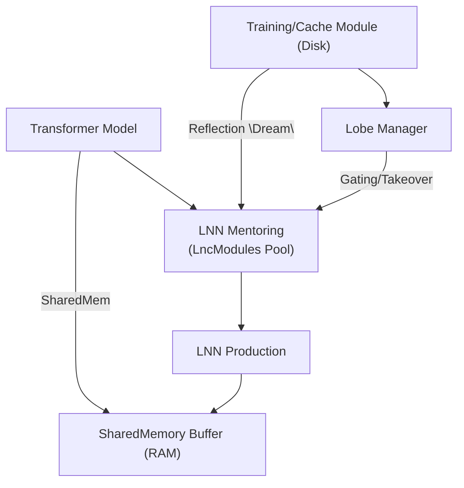

<!-- topic: Solace AI -->
<!-- title: Inference Cube Technical Architecture -->

# InferenceCube Architecture

This document details the **InferenceCube** framework—a coroutine-driven system designed to progressively transfer inference tasks from transformer models to Liquid Neural Networks (LNNs). The approach centers on discrete, zero-copy "cubes" that allow lightweight modules to learn from and eventually replace heavier transformer components.

## 1. Introduction & Motivation
Modern transformers excel at contextual token processing but at significant computational and memory cost. **Liquid Time Constant (LTC)** networks provide a temporally adaptive alternative but lack robust mechanisms for transfer from large pre-trained models. InferenceCube bridges this gap by:

1. Chunking transformer inference into manageable slices.
2. Mentoring LNN modules on transformer outputs until they can take over.
3. Evolving through model updates with layered LNN lobes and reflective rehearsal.

This architecture enables a gradual offload from transformers to LNNs while preserving alignment and long-term retention.

## 2. High-Level Objectives
1. **Partition & Parallelize** — break transformer token streams into fixed-size cubes for concurrent processing.
2. **Zero-Copy Sharing** — use shared memory and integer offsets to avoid data duplication.
3. **Progressive Takeover** — mentor each cube's LNN until its error drops below a threshold, then switch ownership.
4. **Version-Resilient Growth** — on transformer updates, freeze learned lobes and grow new ones, maintaining continuity.
5. **Reflective Reinforcement** — replay historical transformer outputs to counteract LNN decay.

## Related Topics

- [Shared Memory](Shared-Memory): zero-copy substrate for cube slices.
- [Memory & Reflection](Memory-and-Reflection): replay and reinforcement source for reflective training cycles.
- [Reflection Memory](Reflection-Memory): durable record used by dream/replay mechanisms.
- [Pipeline DSL](Pipeline-DSL): request-shaping layer that can route model-family behavior.
- [Provider Specs](Providers-and-MCP-Tools): model/provider integration layer around inference.
- [Hybrid notebook](notebooks/liquid-neural-networks-hybrid-transformer.ipynb): proof artifact for the liquid/transformer direction.

## 3. System Overview


## 4. Core Components
### 4.1 Shared Memory Manager
```kotlin
interface SharedMemoryManager {
  fun allocate(numCubes: Int, blockSize: Int)
  fun getSlice(cubeId: Int): FloatArray  // zero-copy view
}
```
### 4.2 Cube Registry
Tracks cube ownership and error history.
```kotlin
enum class Owner { TRANSFORMER, MENTORING, LNN_OWNED, FROZEN }

data class CubeStatus(
  val cubeId: Int,
  var status: Owner,
  var alignedVersion: Int,
  val errorHistory: CircularBuffer<Float>
)
```
### 4.3 Transformer Wrapper
Coroutine-driven processing of cubes.
```kotlin
coroutineScope {
  cubeIds.forEach { id ->
    launch(Dispatchers.Default) {
      val input = sharedMem.getSlice(id)
      val output = transformer.forward(input)
      mentor.observe(id, output)
    }
  }
}
```
### 4.4 LNN Module (LTC-Based)
Responsibilities include observation, training, prediction, and error evaluation.
```kotlin
interface LnnModule {
  fun observe(cubeId: Int, transformerOut: FloatArray)
  fun trainStep(cubeId: Int)
  fun predict(cubeId: Int, input: FloatArray): FloatArray
  fun currentError(cubeId: Int): Float
}
```
### 4.5 Gating & Takeover Controller
Periodically check each cube's error and switch to `LNN_OWNED` when below threshold. Revert to transformer if the error spikes.

### 4.6 Lobe Manager
On model updates, freeze old lobes, increment transformer version, and spawn new mentoring modules. Frozen lobes can serve as auxiliary inputs to new ones.

### 4.7 Reflective "Dream" Engine
Replay historical transformer outputs to counteract decay.
```kotlin
fun dream(cycleCount: Int) {
  for (cube in cubeRegistry.all()) {
    val history = cache.getHistory(cube.cubeId)
    repeat(cycleCount) {
      history.forEach { snapshot ->
        lnnModules[cube.cubeId].observe(cube.cubeId, snapshot)
        lnnModules[cube.cubeId].trainStep(cube.cubeId)
      }
    }
  }
}
```

## 5. Workflows
### 5.1 Initialization
1. Load transformer weights (version 1).
2. Allocate shared memory.
3. Create `CubeStatus` entries and LNN modules.
4. Pre-cache embeddings as needed.

### 5.2 Inference & Mentoring Loop
1. Transformer processes each cube via coroutines.
2. Mentor modules ingest outputs and train.
3. If error < ε, mark cube as `LNN_OWNED`.

### 5.3 Production Inference
Use LNN prediction for owned cubes; continue transformer processing for the rest.

### 5.4 Model Update & Lobe Growth
1. Freeze old lobes and increment transformer version.
2. Instantiate new LNN modules for mentoring.

### 5.5 Dream Cycle
Invoke the dream engine during low load to maintain long-term performance.

## 6. Metrics & Monitoring
- **Cube Loss** — MSE between transformer and LNN outputs.
- **Takeover Rate** — percentage of cubes transitioned.
- **Decay Drift** — error growth in frozen lobes without dreaming.
- **Throughput** — cubes processed per second.
- **Memory Footprint** — shared memory plus LNN parameters.

## 7. Next Steps
1. Expand mermaid diagrams for individual workflows.
2. Provide additional pseudocode for controllers and lifecycle hooks.
3. Build a minimal prototype to validate zero-copy behavior and gating logic.


---

[← Architecture Overview](Architecture-Overview) · §14 of 15

---

## 14. InferenceCube Architecture
The wiki [Inference Cube](Inference-Cube) page describes a specialized framework or application named "InferenceCube," designed for progressively migrating inference tasks from transformer models to Liquid Neural Networks (LNNs), specifically Liquid Time Constant (LTC) networks. While distinct from the core Solace Core Framework modules, its description provides insight into potential advanced applications or systems that could be built leveraging Solace Core's actor-based and modular nature.

### 14.1. Motivation and Goals
*   **Problem:** High computational and memory costs of transformer models for inference.
*   **Proposed Solution:** A system to gradually offload inference tasks to more efficient LNNs while maintaining performance and alignment with the original transformer.
*   **Key Objectives:**
    *   **Partition & Parallelize:** Break down transformer token streams into manageable, fixed-size "cubes" for concurrent processing.
    *   **Zero-Copy Sharing:** Utilize shared memory for efficient data handling between components.
    *   **Progressive Takeover:** Mentor LNN modules (one per cube) using transformer outputs until the LNN's error rate falls below a threshold, at which point the LNN takes over inference for that cube.
    *   **Version-Resilient Growth:** Adapt to updates in the base transformer model by freezing already learned LNN "lobes" and training new ones, ensuring continuity.
    *   **Reflective Reinforcement:** Periodically replay historical transformer outputs to LNNs ("dreaming") to counteract knowledge decay.

### 14.2. Core Components (Conceptual)
The InferenceCube architecture outlines several key components:

*   **Shared Memory Manager:** Manages allocation and zero-copy access to data "cubes."
*   **Cube Registry:** Tracks the status and ownership of each cube (e.g., `TRANSFORMER`, `MENTORING`, `LNN_OWNED`, `FROZEN`) and its error history.
*   **Transformer Wrapper:** A coroutine-driven component that processes cubes using the main transformer model and feeds outputs to LNN mentor modules.
*   **LNN Module (LTC-Based):** An interface for LNNs responsible for observing transformer outputs, training, predicting, and evaluating their error.
*   **Gating & Takeover Controller:** Monitors LNN module errors and manages the transition of cube ownership from transformer to LNN.
*   **Lobe Manager:** Handles the "freezing" of LNN lobes corresponding to older transformer versions and the creation of new LNN modules for new transformer versions.
*   **Reflective "Dream" Engine:** Manages the replay of historical data to LNNs for reinforcement.

### 14.3. High-Level Workflows
The document describes several operational workflows:
*   Initialization (loading models, allocating memory, creating LNN modules).
*   Inference & Mentoring Loop (transformer processes, LNNs learn, takeover occurs).
*   Production Inference (LNNs handle owned cubes, transformer handles others).
*   Model Update & Lobe Growth (adapting to new transformer versions).
*   Dream Cycle (reinforcement during low-load periods).

### 14.4. Potential Relation to Solace Core Framework
While InferenceCube is a distinct architectural concept, its design principles (modularity, coroutine-driven processing, potential for distributed components) suggest it could be implemented using the Solace Core Framework. For example:
*   The Transformer Wrapper, LNN Modules, Controllers, and Managers could be implemented as Solace Core Actors.
*   The described workflows could be orchestrated by Solace Core's `WorkflowManager`.
*   Solace Core's `Storage` module could be used for the "Training/Cache Module (Disk)" mentioned for storing historical outputs and managing LNN lobe data.

This InferenceCube architecture represents an advanced application of AI model optimization and could leverage the foundational capabilities of the Solace Core Framework for its implementation.

---

← [§13 Storage Thread Safety and Deadlock Prevention](Storage-Thread-Safety-and-Deadlock-Prevention)  ·  [Architecture Overview](Architecture-Overview)


[← Inference Cube](Inference-Cube)
