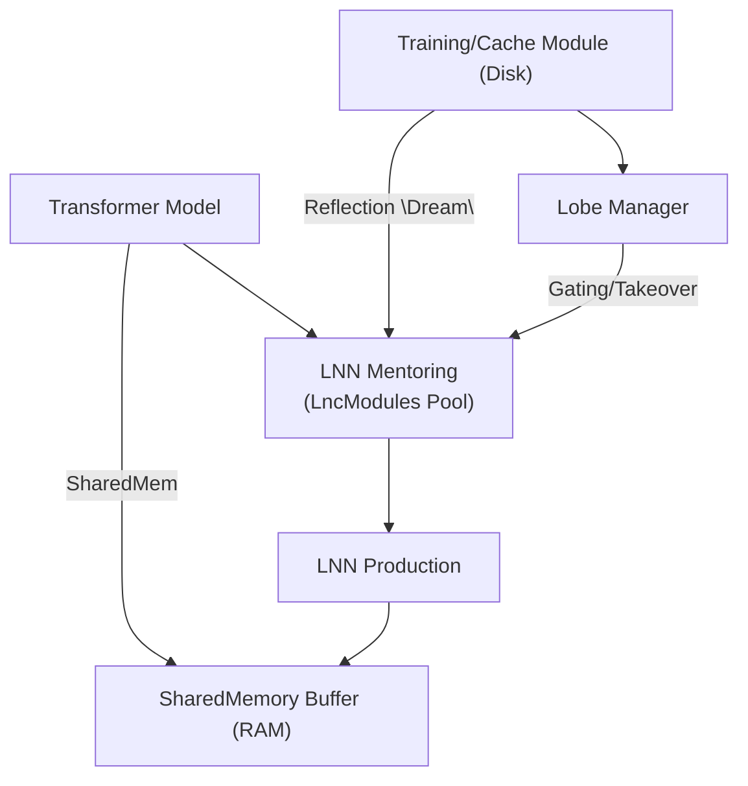

<!-- topic: Solace AI -->
<!-- title: Inference Cube -->

# InferenceCube Architecture

This document details the **InferenceCube** framework—a coroutine-driven system designed to progressively transfer inference tasks from transformer models to Liquid Neural Networks (LNNs). The approach centers on discrete, zero-copy "cubes" that allow lightweight modules to learn from and eventually replace heavier transformer components.

## 1. Introduction & Motivation
Modern transformers excel at contextual token processing but at significant computational and memory cost. **Liquid Time Constant (LTC)** networks provide a temporally adaptive alternative but lack robust mechanisms for transfer from large pre-trained models. InferenceCube bridges this gap by:

1. Chunking transformer inference into manageable slices.
2. Mentoring LNN modules on transformer outputs until they can take over.
3. Evolving through model updates with layered LNN lobes and reflective rehearsal.

This architecture enables a gradual offload from transformers to LNNs while preserving alignment and long-term retention.

## 2. High-Level Objectives
1. **Partition & Parallelize** — break transformer token streams into fixed-size cubes for concurrent processing.
2. **Zero-Copy Sharing** — use shared memory and integer offsets to avoid data duplication.
3. **Progressive Takeover** — mentor each cube's LNN until its error drops below a threshold, then switch ownership.
4. **Version-Resilient Growth** — on transformer updates, freeze learned lobes and grow new ones, maintaining continuity.
5. **Reflective Reinforcement** — replay historical transformer outputs to counteract LNN decay.

## 3. System Overview


## 4. Core Components
### 4.1 Shared Memory Manager
```kotlin
interface SharedMemoryManager {
  fun allocate(numCubes: Int, blockSize: Int)
  fun getSlice(cubeId: Int): FloatArray  // zero-copy view
}
```
### 4.2 Cube Registry
Tracks cube ownership and error history.
```kotlin
enum class Owner { TRANSFORMER, MENTORING, LNN_OWNED, FROZEN }

data class CubeStatus(
  val cubeId: Int,
  var status: Owner,
  var alignedVersion: Int,
  val errorHistory: CircularBuffer<Float>
)
```
### 4.3 Transformer Wrapper
Coroutine-driven processing of cubes.
```kotlin
coroutineScope {
  cubeIds.forEach { id ->
    launch(Dispatchers.Default) {
      val input = sharedMem.getSlice(id)
      val output = transformer.forward(input)
      mentor.observe(id, output)
    }
  }
}
```
### 4.4 LNN Module (LTC-Based)
Responsibilities include observation, training, prediction, and error evaluation.
```kotlin
interface LnnModule {
  fun observe(cubeId: Int, transformerOut: FloatArray)
  fun trainStep(cubeId: Int)
  fun predict(cubeId: Int, input: FloatArray): FloatArray
  fun currentError(cubeId: Int): Float
}
```
### 4.5 Gating & Takeover Controller
Periodically check each cube's error and switch to `LNN_OWNED` when below threshold. Revert to transformer if the error spikes.

### 4.6 Lobe Manager
On model updates, freeze old lobes, increment transformer version, and spawn new mentoring modules. Frozen lobes can serve as auxiliary inputs to new ones.

### 4.7 Reflective "Dream" Engine
Replay historical transformer outputs to counteract decay.
```kotlin
fun dream(cycleCount: Int) {
  for (cube in cubeRegistry.all()) {
    val history = cache.getHistory(cube.cubeId)
    repeat(cycleCount) {
      history.forEach { snapshot ->
        lnnModules[cube.cubeId].observe(cube.cubeId, snapshot)
        lnnModules[cube.cubeId].trainStep(cube.cubeId)
      }
    }
  }
}
```

## 5. Workflows
### 5.1 Initialization
1. Load transformer weights (version 1).
2. Allocate shared memory.
3. Create `CubeStatus` entries and LNN modules.
4. Pre-cache embeddings as needed.

### 5.2 Inference & Mentoring Loop
1. Transformer processes each cube via coroutines.
2. Mentor modules ingest outputs and train.
3. If error < ε, mark cube as `LNN_OWNED`.

### 5.3 Production Inference
Use LNN prediction for owned cubes; continue transformer processing for the rest.

### 5.4 Model Update & Lobe Growth
1. Freeze old lobes and increment transformer version.
2. Instantiate new LNN modules for mentoring.

### 5.5 Dream Cycle
Invoke the dream engine during low load to maintain long-term performance.

## 6. Metrics & Monitoring
- **Cube Loss** — MSE between transformer and LNN outputs.
- **Takeover Rate** — percentage of cubes transitioned.
- **Decay Drift** — error growth in frozen lobes without dreaming.
- **Throughput** — cubes processed per second.
- **Memory Footprint** — shared memory plus LNN parameters.

## 7. Next Steps
1. Expand mermaid diagrams for individual workflows.
2. Provide additional pseudocode for controllers and lifecycle hooks.
3. Build a minimal prototype to validate zero-copy behavior and gating logic.


# InferenceCube — From Transformer to Liquid, Cube by Cube

A transformer is, computationally speaking, an extravagance. It
delivers extraordinary contextual reasoning by paying for it in
attention matrices that scale poorly, weights that don't fit on
modest hardware, and an inference cost per token that makes
real-time anything expensive. For most of what an agent does, the
transformer is the right tool. For some of what an agent does — the
small, repetitive, temporally-structured inferences that happen
many times per second — it's more compute than the work
deserves.

A **Liquid Time Constant** (LTC) network is a different
proposition. It's small, it's continuous-time, it integrates
naturally with event-driven inputs, and once it's been *taught*
what a particular inference looks like, it can produce that
inference at a fraction of the transformer's cost. The catch is
the teaching: LTCs don't pre-train on giant text corpora. They
have to be mentored. Something has to show them the right answer
until they learn to produce it themselves.

The InferenceCube architecture is the framework for that mentoring.
It partitions transformer inference into fixed-size cubes,
mentors an LTC on each cube's outputs, and progressively transfers
ownership of the cube from transformer to LTC as the LTC's error
drops below threshold. Over time, more and more of the agent's
inference shifts from the heavy general-purpose model to the small
specialised LTCs that have learned to do the specific work.

This is one of the genuinely Magentic-lineage contributions to
SolaceCore. It traces back to the Liquid Neural Network experiments
on the Magentic side, and the Kaggle proof notebook
(`liquid-neural-networks-hybrid-transformer.ipynb`) that
demonstrated the LTC + attention composition is sound. The
InferenceCube architecture turns that proof into a structural
substrate.

## What a cube is

A cube is a fixed-size slice of a transformer's inference task.
The transformer processes the whole input, but its output is
*partitioned* into cubes — concrete spans of the output tensor
that the system can hand off independently. Each cube has:

- A unique `cubeId`.
- A `status` describing who currently owns it
  (`TRANSFORMER`, `MENTORING`, `LNN_OWNED`, `FROZEN`).
- An `alignedVersion` indicating which transformer version the
  cube was last aligned to. (When the transformer updates, the
  alignment becomes stale and the cube needs re-mentoring.)
- An `errorHistory` — a circular buffer of recent
  transformer-vs-LTC errors that the gating controller reads to
  decide whether the LTC is ready.

```kotlin
enum class Owner { TRANSFORMER, MENTORING, LNN_OWNED, FROZEN }

data class CubeStatus(
    val cubeId: Int,
    var status: Owner,
    var alignedVersion: Int,
    val errorHistory: CircularBuffer<Float>
)
```

The cube is the unit of progressive takeover. A single cube may
graduate to LNN ownership while neighbouring cubes still belong to
the transformer; the system runs in a hybrid state for as long as
that hybrid is the right answer for that cube's specific work.

## The five components

The framework names five components that interact through the
shared-memory substrate.

### Shared Memory Manager

```kotlin
interface SharedMemoryManager {
    fun allocate(numCubes: Int, blockSize: Int)
    fun getSlice(cubeId: Int): FloatArray   // zero-copy view
}
```

The slice abstraction is the load-bearing performance trick. The
transformer's output for cube N and the LTC's input for cube N
are *the same memory*, viewed through different slices of one
underlying buffer. No copy happens between transformer output and
LTC input. The `SharedMemoryManager` lives in the
[shared-memory primitives](../../../wiki/Shared-Memory.md) layer; this
component is its primary inference-side consumer.

### Cube Registry

The registry tracks every cube's status, version, and error
history. It's the source of truth for the gating controller and
the lobe manager. Reads are lock-free (atomic loads on the status
fields); writes are per-cube and serialised by the cube's owning
coroutine.

### Transformer Wrapper

A coroutine-driven processor that runs the transformer over each
cube's input slice and writes its output back into shared memory.

```kotlin
coroutineScope {
    cubeIds.forEach { id ->
        launch(Dispatchers.Default) {
            val input = sharedMem.getSlice(id)
            val output = transformer.forward(input)
            mentor.observe(id, output)
        }
    }
}
```

Cubes are processed in parallel. The mentoring step happens
in-line: every transformer output flows directly into the
mentoring stream for that cube's LTC.

### LNN Module (LTC-based)

```kotlin
interface LnnModule {
    fun observe(cubeId: Int, transformerOut: FloatArray)
    fun trainStep(cubeId: Int)
    fun predict(cubeId: Int, input: FloatArray): FloatArray
    fun currentError(cubeId: Int): Float
}
```

Each cube has an LTC module dedicated to it. The module observes
transformer output, trains on it incrementally, and produces its
own predictions. `currentError` is what the gating controller
reads to decide whether the module is ready to take over.

The LTC's hidden state matters beyond inference. For cubes that
process emotionally-charged inputs, the hidden state at write-time
becomes the [MoodSignature](Mood-and-Emotional-Model) of the corresponding
Reflection Memory entry — the affective fingerprint the
[memory](../../../wiki/Memory-Feature-Overview.md) tier indexes against. The LTC isn't just
producing output; it's producing a state that the rest of the
architecture treats as semantically meaningful.

### Gating & Takeover Controller

The controller polls each cube's `errorHistory` periodically and
makes the takeover decision:

```
if (cube.status == MENTORING and avg(errorHistory) < ε):
    cube.status = LNN_OWNED
if (cube.status == LNN_OWNED and recent_error > ε * margin):
    cube.status = MENTORING            // revert
```

The takeover is a state transition. After it, the transformer no
longer runs for that cube; the LTC produces the cube's output
directly. If the LTC's error spikes (drift, distribution shift,
unusual input), the controller can revert to mentoring, where the
transformer resumes and the LTC re-learns.

The reversion path is what makes the takeover safe. Without it,
an LTC that has graduated and then drifts produces wrong output
indefinitely. With it, drift is detectable and recoverable.

## The Lobe Manager and version resilience

When the transformer updates — a new model version, a fine-tune, a
weight change — every LTC that was mentored against the previous
version is now misaligned. Its predictions are based on what the
old transformer produced; the new transformer produces something
different.

The naive answer is to throw away the LTCs and start over. The
architecture refuses to do that, because the LTCs encode hours or
days of mentoring work that has produced real performance benefits.
The Lobe Manager handles the version transition by:

1. **Freezing old lobes.** Every LTC currently in `LNN_OWNED` or
   `MENTORING` status gets its parameters frozen. Frozen lobes are
   no longer trained, but they're still readable.
2. **Incrementing the transformer version** in the registry.
3. **Spawning new mentoring modules** for the new version. These
   start fresh and mentor against the updated transformer's
   outputs.
4. **Frozen lobes serve as auxiliary inputs.** The new mentoring
   modules can read the frozen lobes' predictions as a soft prior,
   accelerating their convergence.

This is the architectural commitment to *cumulative learning* across
model versions. The system doesn't lose what it learned just
because the underlying transformer changed; the old work persists
as frozen lobes that contribute even after they've been superseded.

## The Dream Engine

LTCs decay. Without continuous reinforcement, an LTC's parameters
drift and the cube's error climbs above threshold. In a busy
agent, the mentoring stream keeps everything fresh; in an idle
agent, the LTCs go un-trained for long stretches and the decay
accumulates.

The Dream Engine prevents that. During low load — when the agent
isn't actively reasoning — the engine replays cached transformer
outputs back through the LTCs in mentoring mode:

```kotlin
fun dream(cycleCount: Int) {
    for (cube in cubeRegistry.all()) {
        val history = cache.getHistory(cube.cubeId)
        repeat(cycleCount) {
            history.forEach { snapshot ->
                lnnModules[cube.cubeId].observe(cube.cubeId, snapshot)
                lnnModules[cube.cubeId].trainStep(cube.cubeId)
            }
        }
    }
}
```

The metaphor is deliberate. Biological brains consolidate
learning during sleep by replaying the day's experiences in
sped-up form. The LTCs' decay-prevention has the same shape:
replay historical transformer outputs during idle periods to
keep the LTCs aligned even when no fresh mentoring is happening.

The cache that backs the Dream Engine is the durable
[Reflection Memory](../../../wiki/Reflection-Memory.md) substrate or a
specialised LTC-output cache that grows alongside it. Either way,
the dream is reading from the same record of what happened that
the rest of the architecture indexes over.

## Workflows

The five canonical flows the architecture defines:

1. **Initialisation.** Load transformer weights (version 1).
   Allocate shared memory. Create CubeStatus entries and LNN
   modules. Pre-cache embeddings as needed.
2. **Inference & Mentoring Loop.** Transformer processes each
   cube via coroutines. Mentor modules ingest outputs and train.
   If error drops below ε, mark the cube `LNN_OWNED`.
3. **Production Inference.** Use LNN prediction for owned cubes;
   continue transformer processing for the rest. The hybrid
   runs continuously.
4. **Model Update & Lobe Growth.** Freeze old lobes, increment
   transformer version, instantiate new LNN modules for
   mentoring against the new version.
5. **Dream Cycle.** Invoke the Dream Engine during low load to
   maintain long-term performance.

## Metrics

The architecture defines five monitored signals:

- **Cube Loss** — MSE between transformer and LNN outputs. The
  primary mentoring signal.
- **Takeover Rate** — percentage of cubes transitioned to
  `LNN_OWNED`. Trends over time tell the story of how much
  inference has shifted off the transformer.
- **Decay Drift** — error growth in frozen lobes without
  dreaming. The Dream Engine's effectiveness signal.
- **Throughput** — cubes processed per second. The performance
  signal that justifies the takeover.
- **Memory Footprint** — shared memory plus LNN parameters. The
  cost signal.

These are operational metrics, monitored continuously. They
inform tuning of ε, of the Dream cycle frequency, and of the
takeover-revert hysteresis margin.

## Why this matters for SolaceCore

The InferenceCube architecture is what makes the rest of the
SolaceCore design *affordable* at scale. The Supervisor's
constant reasoning, the modality actors' continuous perception,
the Mood Advisor's per-turn classification, the Mouth Tool's
framing — all of these are inference loads that, run on a single
unified transformer, would dominate a deployment's compute budget.

With the InferenceCube architecture, every recurring inference
that happens often enough to be worth specialising can graduate
to an LTC and run at fractional cost. The transformer remains
available for the open-ended reasoning that benefits from its
generality. The hybrid is what scales.

This is also where the [mood module](Mood-and-Emotional-Model) becomes more than
a lexical classifier. The eventual `SpikingEmotionalAdvisor` and
`LTCSignatureExtractor` are specific applications of the
InferenceCube framework: spike train substrate as a cube, LTC as
the cube's owning module, hidden state as the affective
signature stamped onto Reflection Memory. The mood module's
`MoodSignature` interface anticipates exactly this integration.

## Implementation status

**Designed, not built.** The component definitions exist in
`wiki/Inference-Cube.md`
and the Kaggle proof notebook demonstrates the LTC + attention
composition is mathematically sound. The actual scaffolding —
SharedMemoryManager (the inference-data form), CubeRegistry,
TransformerWrapper, LnnModule implementations, Gating Controller,
Lobe Manager, Dream Engine — is not in `lib/` yet.

The work order:

1. Build the `SharedMemoryManager` for inference data on top of
   the [shared-memory primitives](../../../wiki/Shared-Memory.md).
2. Build the CubeRegistry with atomic status tracking.
3. Build a minimal LNN module against a small transformer;
   verify the mentoring loop reduces error.
4. Build the gating controller with the takeover-revert
   hysteresis.
5. Add the Lobe Manager and the Dream Engine after the
   minimal hybrid is working.

## Open questions

- **Cube size.** Fixed-size cubes are the design's commitment, but
  the right size is empirical. Too small and the per-cube
  overhead dominates; too large and individual takeovers don't
  capture enough specialisation.
- **The threshold ε.** The error threshold below which an LTC
  takes over. Probably learned per-cube based on the transformer
  output's variance, not fixed across the system.
- **Hysteresis margin for revert.** How much above ε does
  recent error have to climb before reverting to mentoring? Too
  small and the system flaps; too large and bad LTCs run too
  long.
- **Frozen lobe storage cost.** Freezing rather than discarding
  preserves work but accumulates parameters. At long timescales
  the frozen lobe collection may need its own retention policy.
- **Dream cycle scheduling.** How aggressively to dream during
  low load. Too aggressive and the dream consumes the compute it
  was supposed to free; too passive and decay drift wins.

## Cross-references

- [shared-memory](../../../wiki/Shared-Memory.md) — Layer 2
  `SharedMemoryManager` is the inference data plane this
  component uses.
- [mood](Mood-and-Emotional-Model) — `MoodSignature` interface anticipates
  LTC-extractor integration; the spike + liquid layers slot in
  here.
- [reflection-memory](../../../wiki/Reflection-Memory.md) — durable record of
  events that the Dream Engine replays from.
- [memory](../../../wiki/Memory-Feature-Overview.md) — long-term tier's vector index will
  eventually use LTC signatures alongside or instead of
  embedding cosine.
- [pipeline](Pipeline-DSL) — pipeline DSL composes inference
  stages; cubes are the natural unit of stage parallelism.

## What the takeover is in service of

The architecture's commitment that the agent can keep doing more
without proportionally more compute. A static design that runs
the same transformer for every inference plateaus at the
transformer's per-token cost; whatever the system can afford to
do, that's the ceiling. A progressive-takeover design lets the
ceiling rise over time as more inference shifts to specialised
LTCs that cost a fraction of the transformer.

That rising ceiling is what eventually lets SolaceCore run all
the components the architecture describes — Supervisor, Mood
Advisor, Time Actor, Vision and Audio actors, Mouth Tool framing,
Confusion Corrector — concurrently, continuously, on hardware
that can actually afford it. The transformer is the seed; the
LTCs are the harvest.

That's what InferenceCube is for.

---

[← Feature Index](Feature-Index)
