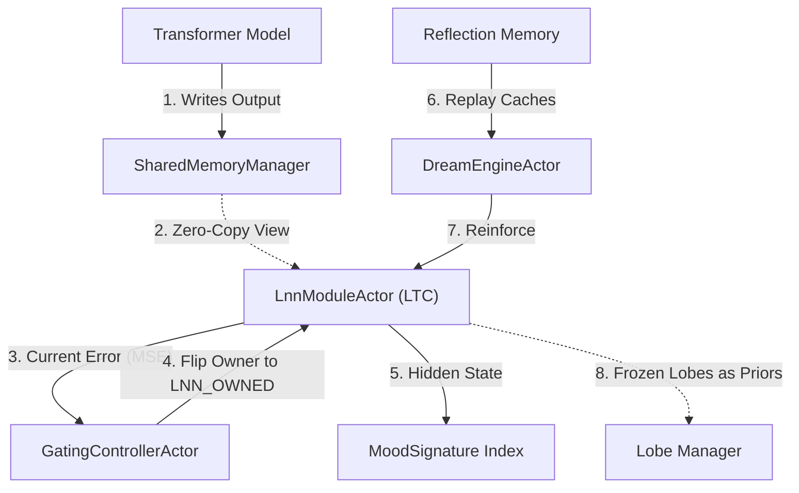

<!-- topic: Solace AI -->
<!-- title: Inference Cube -->

# InferenceCube — From Transformer to Liquid, Cube by Cube

## Related Topics

- [Inference Cube Technical Architecture](Inference-Cube-Technical-Architecture): formal component and workflow architecture.
- [Shared Memory](Shared-Memory): zero-copy substrate for cube slices.
- [Reflection Memory](Reflection-Memory): durable record used by dream/replay mechanisms.
- [Pipeline DSL](Pipeline-DSL): composition layer for inference stages.

---

## 1. The Big Picture

The **InferenceCube** architecture is a coroutine-driven, progressive-takeover hybrid engine designed to incrementally shift reasoning workloads from heavy Transformer models to lightweight, continuous-time Liquid Time Constant (LTC) networks. 

This hybrid substrate allows SolaceCore to scale its concurrent actor networks (Supervisor, Mood Advisor, Mouth Tool, etc.) by running specialized inferences at a fraction of a Transformer's computational cost.



1. **Progressive Takeover:** The Transformer acts as the "seed" and mentor, while the LTCs represent the "harvest." Raw input streams are chunked into cubes, and an LTC is trained to mirror the Transformer output for each cube. Once the LTC's error drops below a threshold (\(\epsilon\)), the Transformer path is bypassed, and the LTC takes over inference.
2. **Affective Fingerprinting:** The continuous-time hidden state of an LTC cell at write-time maps directly to the [MoodSignature](Mood-and-Emotional-Model) interface. This state serves as an affective fingerprint, enabling Reflection Memory to "rhyme" (retrieve memories based on emotional contours) rather than just searching lexically.
3. **Resilience & Growth (Lobe Manager):** When the underlying Transformer updates, learned LTCs are not discarded. They are frozen and used by the Lobe Manager as soft priors to accelerate the training of new LTC lobes for the new model version.
4. **Offline Consolidation (Dream Engine):** Because LTC parameters can drift or decay during idle periods, the Dream Engine replays cached historical Transformer outputs from Reflection Memory back through the mentoring path, preventing catastrophic forgetting.

---

## 2. Mathematical Framework

The Inference Cube relies on the closed-form continuous-time (CfC) formulation of Liquid Time Constant networks (Hasani et al., 2022). 

### Closed-Form LTC Dynamics
For each timestep \(t\), the combined input \(x_t\) and previous hidden state \(h_{t-1}\) are concatenated and passed through a neural backbone:

\[
z_t = [\,x_t \;;\; h_{t-1}\,]
\]
\[
\text{features} = \text{backbone}(z_t)
\]
\[
f_t = \sigma\bigl(\text{time\_net}(\text{features})\bigr)
\]
\[
g_x = \text{state\_net\_g}(\text{features}) \quad h_x = \text{state\_net\_h}(\text{features})
\]
\[
\text{gate} = \sigma\!\left(-\,\frac{f_t}{\tau}\,t\right)
\]
\[
h_t = \text{gate}\,\odot\,g_x \;+\; (1-\text{gate})\,\odot\,(h_x + A)
\]

Where:
* \(\tau = \operatorname{softplus}(\tau_{\text{raw}}) + \epsilon\) is a positive per-neuron time constant. Larger values of \(\tau\) slow down the transition gate from short-term to long-term dynamics.
* \(A\) represents the input-driven equilibrium offset on the long-term branch.
* \(g_x\) and \(h_x\) represent the short-term and long-term state transformations, respectively.

### Bounded Dynamics
The effective system time constants remain strictly bounded (Hasani et al., 2020), ensuring stable continuous-time dynamics under arbitrary weights \(W_i\):

\[
\frac{\tau_i}{1 + \tau_i\,W_i} \,\le\, \tau_{\text{sys}_i} \,\le\, \tau_i
\]

---

## 3. Structural Composition

Inside a single hybrid block, data flows in a **serial composition with a residual safety wire** to preserve high-frequency attention signals in case the liquid layers wash them out:

```
x ──→ input_proj ──→ h
                    │
                    ├──→ self-attention(Q=K=V=h) ──→ h_att
                    │     h_att = norm1(h + h_att)         (residual)
                    │
                    └──→ for t in 0..L:
                            ltc_state ← ltc(h_att[:,t], ltc_state, times[:,t])
                            outputs.append(ltc_state)

                         outputs = stack(outputs)
                         outputs = norm2(outputs + h_att)  (residual)
                         y       = output_proj(outputs)
```

---

## 4. Scaffolding Interfaces (Kotlin)

The architectural scaffolding is implemented in [io.github.solaceharmony.core.inference](file:///Volumes/stuff/Projects/solaceharmony/SolaceCore/lib/src/commonMain/kotlin/io/github/solaceharmony/core/inference/):

- **[SharedMemoryManager](file:///Volumes/stuff/Projects/solaceharmony/SolaceCore/lib/src/commonMain/kotlin/io/github/solaceharmony/core/inference/SharedMemory.kt):** Exposes zero-copy slice views over shared inference buffers.
- **[CubeRegistry](file:///Volumes/stuff/Projects/solaceharmony/SolaceCore/lib/src/commonMain/kotlin/io/github/solaceharmony/core/inference/CubeRegistry.kt):** Governs the thread-safe owner state machine (`TRANSFORMER`, `MENTORING`, `LNN_OWNED`, `FROZEN`) and error histories.
- **[InferenceActors](file:///Volumes/stuff/Projects/solaceharmony/SolaceCore/lib/src/commonMain/kotlin/io/github/solaceharmony/core/inference/InferenceActors.kt):** Contains `TransformerWrapperActor`, `LnnModuleActor`, `GatingControllerActor`, and `DreamEngineActor` implemented as first-class Actors using the core [Port](file:///Volumes/stuff/Projects/solaceharmony/SolaceCore/lib/src/commonMain/kotlin/io/github/solaceharmony/core/kernel/channels/ports/Port.kt) architecture.

---

## 5. Metrics

The architecture defines five monitored signals:

- **Cube Loss** — MSE between transformer and LNN outputs. The primary mentoring signal.
- **Takeover Rate** — percentage of cubes transitioned to `LNN_OWNED`. Trends over time tell the story of how much inference has shifted off the transformer.
- **Decay Drift** — error growth in frozen lobes without dreaming. The Dream Engine's effectiveness signal.
- **Throughput** — cubes processed per second. The performance signal that justifies the takeover.
- **Memory Footprint** — shared memory plus LNN parameters. The cost signal.

---

## 6. Implementation Status

**Fully Scaffolded & Verified.** The core component implementations are located in `lib/src/commonMain/kotlin/io/github/solaceharmony/core/inference/`:
1. `InMemorySharedMemoryManager`: Manages slice views.
2. `InMemoryCubeRegistry`: Controls thread-safe owner state transitions with mutexes.
3. `TransformerWrapperActor` & `LnnModuleActor`: Handle raw inputs, compute MSE training loss, and execute dynamic routing when takeover occurs.
4. `GatingControllerActor`: Periodically calculates the rolling average error and promotes/demotes cubes.
5. `InferenceActorsTest`: Verifies the end-to-end takeover lifecycle under simulated error decay.

---

## Cross-References

- [Shared Memory](Shared-Memory) — Layer 2 `SharedMemoryManager` is the inference data plane this component uses.
- [Mood and Emotional Model](Mood-and-Emotional-Model) — `MoodSignature` interface anticipates LTC-extractor integration.
- [Reflection Memory](Reflection-Memory) — durable record of events that the Dream Engine replays from.
- [Pipeline DSL](Pipeline-DSL) — pipeline DSL composes inference stages; cubes are the natural unit of stage parallelism.

---

[← Feature Index](Feature-Index)
