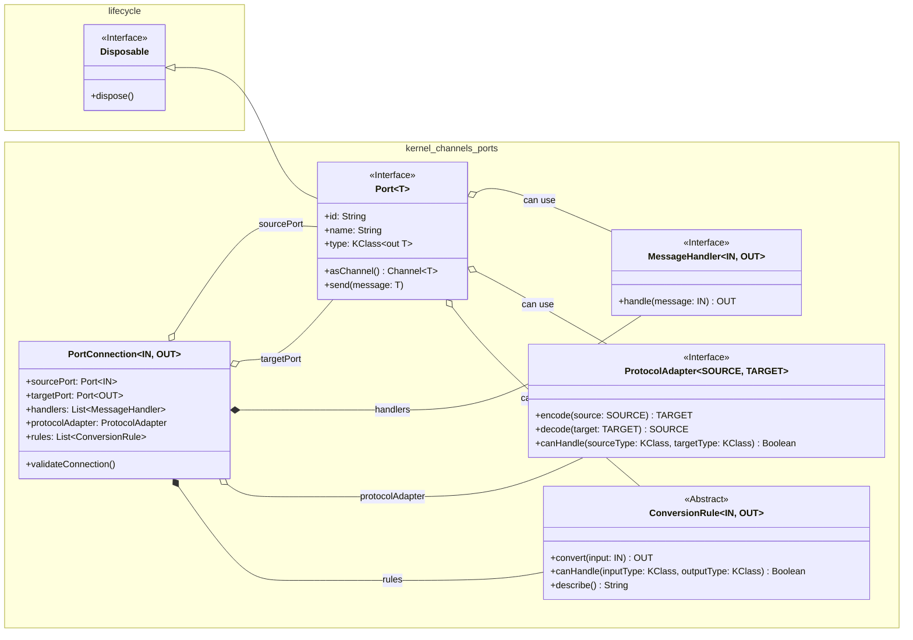

<!-- topic: Runtime -->
<!-- title: Kernel Channel System -->

### 1.1. Channel System (`io.github.solaceharmony.core.kernel.channels`)
The Channel System, located within the `kernel` module, is responsible for enabling type-safe, resource-managed, and distributed message passing between various components of the SolaceCore framework. It is designed with platform independence as a key consideration.

#### 1.1.1. Overview and Purpose
The primary goal of the Channel System is to provide a robust and flexible mechanism for inter-component communication. It emphasizes:
*   **Type Safety:** Ensuring that messages conform to expected types at both compile-time and runtime.
*   **Resource Management:** Proper handling and cleanup of resources associated with channels and ports, often leveraging a `Disposable` pattern.
*   **Distributed Operation:** Designed to function effectively in distributed environments with minimal shared state and low-overhead message passing.
*   **Platform Independence:** Core channel logic is intended to be common across all supported platforms.

#### 1.1.2. Core Abstractions and Interfaces
The foundation of the Channel System is the `Port.kt` file, which defines the primary `Port<T>` interface and several crucial nested interfaces and classes for message handling, protocol adaptation, type conversion, and connection management. It leverages `kotlinx.coroutines.channels.Channel` for its underlying asynchronous communication and `io.github.solaceharmony.core.lifecycle.Disposable` for resource management.

##### 1.1.2.1. Port System Conceptual Roles
Drawing from the `Interface_and_Port_System_Design.md`, the port system is a cornerstone of the actor interface within SolaceCore. It's engineered for flexible, type-safe connections between actors. Conceptually, while the underlying `Port<T>` interface is generic, ports fulfill distinct roles such as:
*   **Input Ports:** Designated for receiving messages.
*   **Output Ports:** Designated for sending messages.
*   **Tool Ports:** Potentially used for specialized request/response interactions or utility functions (though less explicitly defined in the current codebase compared to input/output patterns observed in actor examples).

The design emphasizes dynamic connection capabilities between compatible output and input ports, leveraging Kotlin's `KClass` for type safety. This dynamism is vital for constructing adaptable and reconfigurable actor-based systems. The design document also noted that dynamic port creation and disconnection were areas of ongoing development, aiming to further enhance this flexibility.

##### 1.1.2.2. `Port<T : Any>` Interface
This is the central interface for any communication endpoint in the system.

*   **Inheritance:** Implements `io.github.solaceharmony.core.lifecycle.Disposable`.
*   **Key Properties:**
    *   `id: String`: A unique identifier for the port, automatically generatable.
    *   `name: String`: A human-readable name for the port.
    *   `type: KClass<out T>`: Specifies the Kotlin class of messages the port handles, ensuring type safety.
*   **Key Methods:**
    *   `suspend fun send(message: T)`: Sends a message through the port. Can throw `PortException.Validation`.
    *   `fun asChannel(): Channel<T>`: Returns the underlying `kotlinx.coroutines.channels.Channel` associated with this port.
*   **Companion Object (`Port.Companion`):**
    *   `fun generateId(): String`: Generates a unique ID string (e.g., "port-xxxxxxxxxxxxxxxx").
    *   `fun <IN : Any, OUT : Any> connect(...)`: Factory method to create and validate a `PortConnection` (see below).

##### 1.1.2.3. `Port.MessageHandler<in IN : Any, out OUT : Any>` Interface
Defines a contract for processing messages.
*   **Key Method:**
    *   `suspend fun handle(message: IN): OUT`: Processes an input message of type `IN` and returns an output of type `OUT`.

##### 1.1.2.4. `Port.ProtocolAdapter<SOURCE : Any, TARGET : Any>` Interface
Facilitates conversion between different data protocols or formats.
*   **Key Methods:**
    *   `suspend fun encode(source: SOURCE): TARGET`: Encodes a source object to the target type.
    *   `suspend fun decode(target: TARGET): SOURCE`: Decodes a target object back to the source type.
    *   `fun canHandle(sourceType: KClass<*>, targetType: KClass<*>) : Boolean`: Checks if the adapter can handle conversion between specified types.

##### 1.1.2.5. `Port.ConversionRule<in IN : Any, out OUT : Any>` Abstract Class
Represents a rule for converting an input type `IN` to an output type `OUT`.
*   **Key Abstract Methods:**
    *   `abstract suspend fun convert(input: IN): OUT`: Performs the conversion. Can throw `PortException.Validation`.
    *   `abstract fun canHandle(inputType: KClass<*>, outputType: KClass<*>) : Boolean`: Checks if the rule applies to the given types.
    *   `abstract fun describe(): String`: Provides a description of the rule.
*   **Companion Object (`Port.ConversionRule.Companion`):**
    *   `internal inline fun <reified IN : Any, reified OUT : Any> create(...)`: Factory method to create `ConversionRule` instances.

##### 1.1.2.6. `Port.PortConnection<in IN : Any, out OUT : Any>` Data Class
> **Note — verify against source:** §1.1.2.6 below describes `PortConnection` as a validated connection wrapper. The wiki [Kernel & Ports](Kernel-and-Ports) page describes the same type as additionally **actively routing messages when started**, while §1.1.7 (Future Enhancements) below says message piping is *not* implemented. These three claims need reconciling against the current `Port.kt` source — recorded here so it isn't lost.

Represents a validated connection between a source port and a target port, potentially involving handlers, a protocol adapter, and conversion rules.
*   **Key Properties:**
    *   `sourcePort: Port<@UnsafeVariance IN>`
    *   `targetPort: Port<@UnsafeVariance OUT>`
    *   `handlers: List<Port.MessageHandler<IN, Any>>`
    *   `protocolAdapter: Port.ProtocolAdapter<*, @UnsafeVariance OUT>?`
    *   `rules: List<Port.ConversionRule<IN, OUT>>`
*   **Key Methods:**
    *   `fun validateConnection()`: Validates if the connection is possible based on types, adapter, and rules. Throws `PortConnectionException` on failure.
    *   Internal methods `canConnect()`, `validateConversionChain()`, and `buildConnectionErrorMessage()` support the validation logic.

The relationships between these core abstractions can be visualized as follows:

[Back to Kernel & Ports](Kernel-and-Ports)
