<!-- topic: Reference -->
<!-- title: Kotlin-Aligned System Architecture -->

## System Architecture

### High-Level Architecture

```mermaid
graph TB
    subgraph "User Interfaces"
        CLI[Solace CLI<br/>Compose Multiplatform<br/>composeApp/src/desktopMain/]
        WebUI[Solace Web UI<br/>Compose HTML<br/>composeApp/src/webMain/]
        MobileUI[Solace Mobile<br/>Compose Android/iOS<br/>composeApp/src/androidMain/]
    end

    subgraph "Core Actor System"
        ActorSystem[Actor System<br/>lib/src/commonMain/kotlin/com/solacecore/actor/<br/>ActorSystem.kt]
        ActorSupervisor[Actor Supervisor<br/>lib/src/commonMain/kotlin/com/solacecore/actor/<br/>ActorSupervisor.kt]
        ActorLifecycle[Actor Lifecycle<br/>wiki/Lifecycle-and-Resources.md]
        ActorInference[Actor Inference Engine<br/>wiki/Inference-Cube.md]
    end

    subgraph "Emotional Intelligence"
        MoodManager[Mood Manager<br/>lib/src/commonMain/kotlin/com/solacecore/mood/<br/>MoodManager.kt]
        SNN[Spiking Neural Network<br/>3-layer integrate-and-fire<br/>lib/src/commonMain/kotlin/com/solacecore/mood/snn/]
        MoodOrchestrator[Mood Orchestrator<br/>Decision making<br/>lib/src/commonMain/kotlin/com/solacecore/mood/]
        MemoryConsolidation[Memory Consolidation<br/>wiki/Memory-and-Reflection.md]
        EmotionalContext[Emotional Context<br/>lib/src/commonMain/kotlin/com/solacecore/mood/<br/>EmotionalContext.kt]
    end

    subgraph "Pipeline System"
        PipelineEngine[Pipeline Engine<br/>lib/src/commonMain/kotlin/com/solacecore/pipeline/<br/>PipelineEngine.kt]
        PipelineConfig[Pipeline Config<br/>lib/src/commonMain/kotlin/com/solacecore/pipeline/<br/>PipelineConfig.kt]
        Blocks[13 Pipeline Blocks<br/>lib/src/commonMain/kotlin/com/solacecore/pipeline/blocks/]
    end

    subgraph "Provider Layer"
        OllamaProvider[Ollama Provider<br/>lib/src/commonMain/kotlin/com/solacecore/providers/<br/>OllamaProvider.kt]
        OllamaClient[Ollama Client<br/>lib/src/commonMain/kotlin/com/solacecore/providers/<br/>OllamaClient.kt]
        BaseProvider[Base Provider<br/>lib/src/commonMain/kotlin/com/solacecore/providers/<br/>BaseProvider.kt]
    end

    subgraph "Tool System - MCP"
        MCPCore[MCP Core<br/>lib/src/commonMain/kotlin/com/solacecore/mcp/]
        MCPConverters[Format Converters<br/>lib/src/commonMain/kotlin/com/solacecore/mcp/<br/>McpConverters.kt]
        MCPExecutor[Tool Executor<br/>lib/src/commonMain/kotlin/com/solacecore/mcp/<br/>McpToolExecutor.kt]
        MCPRegistry[Tool Registry<br/>lib/src/commonMain/kotlin/com/solacecore/mcp/<br/>McpToolRegistry.kt]
        MCPRouter[Tool Router<br/>lib/src/commonMain/kotlin/com/solacecore/mcp/<br/>McpToolRouter.kt]
        StructuredTools[Structured Tools<br/>lib/src/commonMain/kotlin/com/solacecore/mcp/<br/>StructuredTools.kt]
    end

    subgraph "Data & History"
        Config[Configuration<br/>lib/src/commonMain/kotlin/com/solacecore/config/<br/>.solace-dev/]
        NeutralXML[Neutral History XML<br/>lib/src/commonMain/kotlin/com/solacecore/neutral/<br/>NeutralHistoryXml.kt]
        NeutralMessages[Neutral Messages<br/>lib/src/commonMain/kotlin/com/solacecore/neutral/<br/>NeutralMessages.kt]
        EventBus[Event Bus<br/>lib/src/commonMain/kotlin/com/solacecore/neutral/<br/>EventBus.kt]
        Converters[Format Converters<br/>lib/src/commonMain/kotlin/com/solacecore/neutral/<br/>Converters.kt]
    end

    subgraph "Safety & Approvals"
        Approvals[Approval System<br/>lib/src/commonMain/kotlin/com/solacecore/safety/<br/>ApprovalSystem.kt]
        RiskAssessment[Risk Assessment<br/>lib/src/commonMain/kotlin/com/solacecore/safety/<br/>RiskAssessment.kt]
    end

    subgraph "Storage & Workflow"
        StorageSystem[Storage System<br/>docs/components/storage/<br/>StorageSystem.kt]
        WorkflowEngine[Workflow Engine<br/>wiki/Workflow-Orchestration.md]
        ScriptingEngine[Scripting Engine<br/>wiki/Scripting-Engine.md]
    end

    CLI --> ActorSystem
    WebUI --> ActorSystem
    MobileUI --> ActorSystem
    ActorSystem --> ActorSupervisor
    ActorSystem --> ActorLifecycle
    ActorSystem --> MoodManager
    ActorSupervisor --> ActorInference
    ActorSupervisor --> WorkflowEngine
    MoodManager --> SNN
    MoodManager --> MoodOrchestrator
    MoodManager --> MemoryConsolidation
    MoodManager --> EmotionalContext
    ActorSystem --> PipelineEngine
    PipelineEngine --> PipelineConfig
    PipelineEngine --> Blocks
    Blocks --> OllamaProvider
    OllamaProvider --> OllamaClient
    OllamaProvider --> BaseProvider
    ActorInference --> MCPCore
    WorkflowEngine --> MCPCore
    MCPCore --> MCPConverters
    MCPCore --> MCPExecutor
    MCPCore --> MCPRegistry
    MCPCore --> MCPRouter
    MCPExecutor --> StructuredTools
    ActorSystem --> NeutralXML
    NeutralXML --> EventBus
    NeutralXML --> NeutralMessages
    NeutralXML --> Converters
    ActorSystem --> Config
    WorkflowEngine --> Approvals
    Approvals --> RiskAssessment
    ActorSystem --> StorageSystem
    ActorSystem --> ScriptingEngine
```

---

[Back to Kotlin-Aligned Architecture Overview](Kotlin-Aligned-Architecture-Overview)
