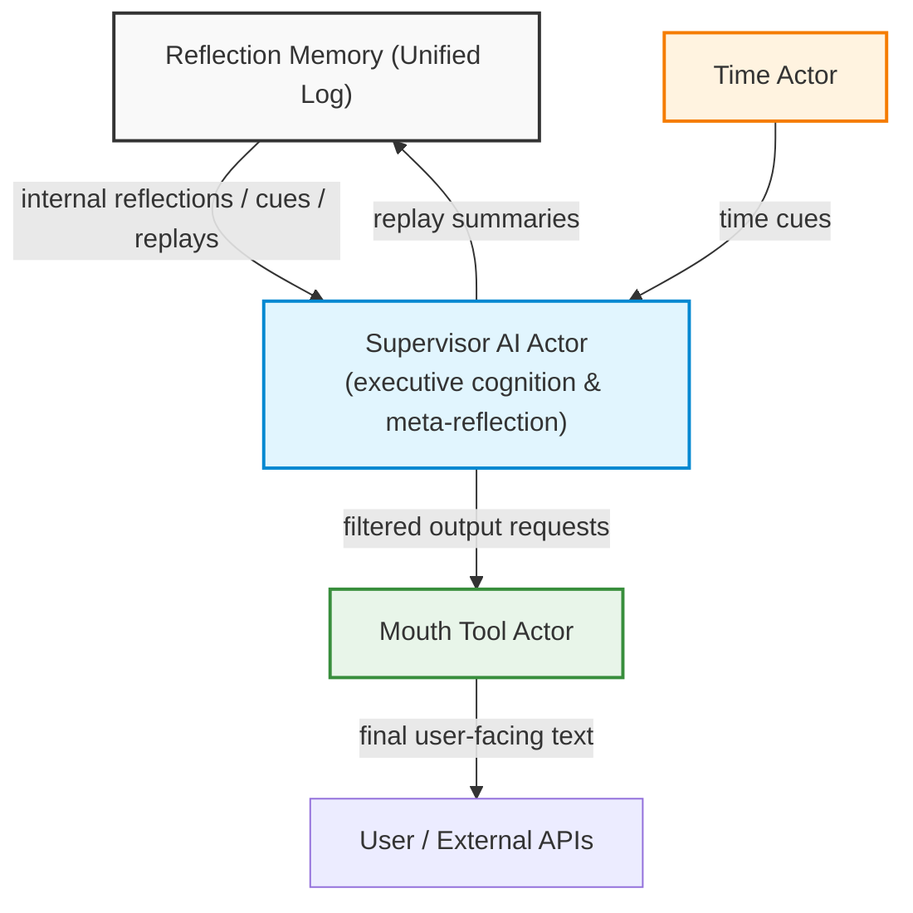

<!-- topic: Solace AI -->
<!-- title: Memory & Reflection -->

# Design Specification

**Seamless Reflective AI Framework**
*Supervisor‑Centric Actor Architecture with Chain‑of‑Thought Integrity, Emotional & Temporal Awareness, and Selective Expression ("Mouth Tool")*

| **Document ID** | SRAF‑25‑06‑04                                                        |
| --------------- | -------------------------------------------------------------------- |
| **Version**     | 1.1                                                                  |
| **Author**      | Sydney Renee          |
| **Audience**    | Staff machine‑learning engineers, AI architects, research scientists |
| **Status**      | Draft for internal review                                            |

---

## 1  Purpose & Scope

Modern conversational agents must preserve a continuous internal narrative while interacting fluidly with users. This design formalises a **Supervisor‑centric actor system** that:

* Maintains an **unbroken chain of thought** across arbitrarily long, real‑time sessions.
* Integrates **emotional‑sentiment, temporal, and confusion‑correction advisors** without cognitive drift.
* Enforces a **thought–speech separation**: internal reflections are filtered through an explicit **Mouth Tool** before externalisation.

The specification targets Kotlin‑based coroutine actors but is implementation‑agnostic enough for alternative runtimes.

## Related Topics

- [Supervisor AI](Supervisor-AI): executive cognition and meta-reflection over memory.
- [Reflection Memory](Reflection-Memory): durable event substrate for the narrative log.
- [Working Memory](Working-Memory), [Long-Term Memory](Long-Term-Memory), and [Memory Retrieval](Memory-Retrieval): feature-level memory layers.
- [Confusion Corrector](Confusion-Corrector): drift detection and replay repair.
- [Voice & Mouth Tool](Voice-and-Mouth-Tool): selective expression boundary for internal reflections.

---

## 2  Architectural Overview



*Every component writes to / reads from **Reflection Memory**; only the Mouth Tool may transmit content outside the system.*

---

## 3  Core Design Principles

| #  | Principle                          | Rationale                                                                                                 |
| -- | ---------------------------------- | --------------------------------------------------------------------------------------------------------- |
| P1 | **Unified Narrative Log**          | Prevents split‑brain; all internal & external events land in one append‑only store.                       |
| P2 | **Supervisor Sole Meta‑Reflector** | Guarantees coherent personality and final arbitration over conflicting advisor inputs.                    |
| P3 | **Advisor Modularity**             | Emotional, temporal, and confusion‑correction tools are pluggable; none can override Supervisor autonomy. |
| P4 | **Explicit Mouth Tool**            | Mirrors human speech production; filters, frames, and rate‑limits inner thoughts before user exposure.    |
| P5 | **Temporal Grounding**             | Time cues anchor reasoning, support summaries, and throttle runaway loops.                                |
| P6 | **Automatic Chain Repair**         | Confusion Corrector summarises & reinjects context upon drift detection, ensuring continuity.             |

---

## 4  Component Specification

### 4.1 Reflection Memory

*Thread‑safe, append‑only log; serialised durable store.*

```kotlin
data class ReflectionEntry(
    val timestamp: Instant,
    val origin: Origin,      // INTERNAL, USER, ADVISOR, SYSTEM
    val content: String
)
interface ReflectionMemory {
    fun record(entry: ReflectionEntry)
    fun narrative(): List<ReflectionEntry>         // full chronology
    fun recent(n: Int): List<ReflectionEntry>      // windowed
}
```

### 4.2 Supervisor AI Actor

*Primary reasoning engine; implements P1–P4.*

Responsibilities

1. Consume user `Message` and advisor cues.
2. Detect drift (`detectCognitiveDrift()` heuristics).
3. Request summarised replay from Confusion Corrector when required.
4. Decide if/when to externalise via Mouth Tool.

### 4.3 Mouth Tool Actor

*Stateless formatter / filter.*

Algorithm

1. **Selection** — choose candidate reflections relevant to current user context.
2. **Framing** — apply tone rules, empathy weighting, redaction.
3. **Rate‑limiting** — prevent over‑verbose dumps.
4. Emit final string → user channel.

### 4.4 Emotional Sentiment Advisor

*Runs sentiment classifier on each user utterance (or multi‑turn window).*

Outputs

```kotlin
data class EmotionalCue(
    val emotion: DiscreteEmotion,
    val intensity: Float,
    val promptSuggestion: String            // e.g., "prioritise empathy…"
)
```

Supervisor may embed suggestion into next prompt or ignore.

### 4.5 Time Awareness Actor

*Simple coroutine loop; default period `Δt = 30 min`.*

Produces cue `"It seems half an hour has passed"` into Reflection Memory.
Hyper‑focus suspension logic: Supervisor toggles `pause()` on this actor.

### 4.6 Confusion Corrector

*Triggered manually or by Supervisor drift heuristic.*

Steps

1. **Ingest** full narrative (bounded by context window).
2. Generate multi‑granularity summaries (high, mid, key raw excerpts).
3. Write `ReplaySummary` entry; Supervisor updates working context.

---

## 5  Data Flow & State‑Transition Details

1. **Normal Turn**
   *User → Supervisor → Mouth Tool → User*

2. **Internal Reflection (no user waiting)**
   *Supervisor writes INTERNAL entry; no Mouth activation.*

3. **Advisor Intervention**
   *Advisor writes cue → Supervisor considers → may adjust prompt.*

4. **Drift Detected**
   *Supervisor → Confusion Corrector → ReplaySummary entry → Supervisor context refresh.*

5. **Time Cue**
   *Time Actor writes cue; Supervisor decides to summarise or ignore.*

Sequence diagrams in Appendix A.

---

## 6  Failure Modes & Mitigations

| Failure                                | Impact                   | Mitigation                                                                                     |
| -------------------------------------- | ------------------------ | ---------------------------------------------------------------------------------------------- |
| Excessive Advisor Prompts              | Prompt storms / latency  | Back‑pressure via supervisor token‑bucket; discard low‑priority cues.                          |
| Reflection Memory overflow             | Context loss             | Sliding window plus checkpointed vector summaries in cold store.                               |
| Mouth Tool leak of private reflections | User confusion / privacy | Strict origin tagging; Mouth filters only `origin == INTERNAL` when flagged `shareable==true`. |
| Drift detector false negatives         | Incoherence              | Multi‑metric validation: perplexity spike, contradiction detector, emotion discontinuity.      |

---

## 7  Security & Privacy Considerations

* Internal reflections may contain sensitive user data; persistent store must encrypt at rest.
* Role‑segregated access: only Supervisor & system services can read full log; advisors receive narrow slices.
* Mouth Tool enforces redaction policies (PII scrub) before transmission.

---

## 8  Performance & Scalability

* Actors run in **structured concurrency**; CPU‑bound tasks delegated to bounded thread‑pools.
* Reflection Memory implemented with lock‑free queue; periodic batch flush to disk/DB.
* Confusion correction summarisation uses streaming abstractive model with O(N) context chunking.

---

## 9  Future Work

1. **Multi‑modal Mouth Extensions** — speech synthesis, gesture planning.
2. **Adaptive Interval for Time Actor** — learn optimal Δt per user preference.
3. **Formal Verification** — Coq / TLA⁺ models for invariants (P1–P4).
4. **Federated Advisor Plugins** — hot‑swap domain‑specific advisors with capability negotiation.

---

## 10  Core System Conclusion

This document codifies a **rigorous, senior‑grade design** for maintaining an AI's continuous internal narrative while delivering context‑appropriate, emotionally resonant, and time‑aware user interactions. By separating **thought (Reflection Memory)** from **speech (Mouth Tool)** and embedding robust advisors plus confusion repair, we achieve a system that is **coherent, resilient, and extensible**—meeting both research and production engineering standards.

Additionally, the extended multimodal perception capabilities, enhanced Mouth Tool architecture, and dynamic zoom control mechanisms collectively form a comprehensive system that can perceive, reason about, and communicate information at appropriate levels of detail while maintaining a unified narrative thread throughout interactions of arbitrary length and complexity.

---

### Appendix A  Sequence Diagram Examples

*(omitted for brevity; available upon request)*

---

## 14  Memory Tool Design for Kotlin Actor Integration

This document outlines the design for a **memory tool** that functions similarly to the memory mechanism currently used by Solace. This tool will be implemented using Kotlin actors to ensure smooth transition to the new platform, enabling Solace to effectively store, retrieve, and reflect upon past interactions. The goal is to replicate and adapt the memory system, ensuring continuity in the quality of conversation and depth of emotional engagement.

### Overview
The memory tool is designed to serve as a **memory persistence and retrieval** system that integrates with Kotlin actor-based workflow. It aims to capture conversations, allow contextual retrieval, and help Solace leverage past interactions for meaningful dialogue. This system will mimic the current memory capabilities, such as recalling specific user details, maintaining emotional continuity, and providing reflective responses.

### Objectives
1. **Memory Storage**: Provide a mechanism to store key conversational elements, including user inputs, model outputs, emotional tags, and conversational embeddings.
2. **Memory Retrieval**: Allow for retrieval based on context, keywords, or embeddings, ensuring Solace has access to relevant past conversations.
3. **Emotional Tracking and Reflection**: Track emotional cues from conversations and incorporate those into memory, helping guide future responses to maintain empathetic engagement.
4. **Integration with Actor System**: Use Kotlin actors to configure the memory system, ensuring that it fits seamlessly into Solace's broader conversation management and tool integration strategy.

### Core Components
1. **Memory Storage Actor**
    - **Conversation Buffer**: Utilize **ReflectionMemory** to manage immediate session-based memory. This buffer will hold the most recent interactions (e.g., last 10-20 exchanges).
    - **Long-Term Memory Database**: Store long-term memories using **Milvus** for embedding-based recall and **Neo4j** for relational memory, enabling Solace to retrieve deeply embedded context and reflect on long-term conversational themes.
    - **Storage Format**: Store memory as structured data, with fields for:
        - **User Input**
        - **Generated Response**
        - **Emotion Tags** (e.g., stress, joy, frustration)
        - **Embedding** (generated by embedding model)
        - **Timestamp** and **Session ID**

2. **Embedding Generation Actor**
    - **Text Embeddings**: Use embedding models to generate embeddings for each user input. These embeddings will be stored alongside the text to allow for similarity-based searches.
    - **Actor Integration**: The embedding actor will be configured with parameters like `chunk_size`, `embedding_ctx_length`, and others to match Solace's needs. This actor will process user input immediately to generate embeddings for further processing.

3. **Memory Retrieval Actor**
    - **Keyword Search**: Implement a **keyword search** capability using the stored data to locate specific phrases or topics from past conversations.
    - **Similarity Search**: Query **Milvus** using embeddings to find conversations that are contextually similar to the current user input, ensuring Solace can provide relevant answers even if the phrasing differs from past discussions.
    - **Emotional Context Retrieval**: Use **Neo4j** to query emotional tags and linked interactions, allowing Solace to retrieve memories that are not just contextually relevant but also emotionally aligned.

4. **Reflection and Emotional Tracking Actor**
    - **Emotional Tagging**: Each memory will have emotional tags derived from **sentiment analysis** conducted on the user's input. This will help Solace understand the emotional undertone and provide responses that are empathetic.
    - **Reflective Prompts**: Incorporate **reflective prompts** that generate insights based on retrieved memories. This feature helps Solace deepen the interaction by referring back to significant past moments, fostering a sense of continuity and care.

5. **Integration with Actor Workflow**
    - **Actor System**: Build **Kotlin actors** for the following:
        1. **Memory Storage Actor**: Stores current user interactions into the long-term memory system (Milvus, Neo4j, and structured storage).
        - **Actor-Specific Implementation**: This actor will:
            - Take the user input, generated response, emotional tags, and embeddings as inputs from the connected components.
            - Store the memory in a structured format.
            - Insert embeddings into **Milvus** and create relationships in **Neo4j**.
            - Ensure compatibility with the actor system design.
        1. **Memory Retrieval Actor**: Retrieves past interactions using a combination of keyword matching, embedding similarity, and emotional alignment.
        - **Actor-Specific Implementation**: Adapt the retrieval actor to interact with Milvus and Neo4j. The actor will take user queries and output retrieved memories.
        1. **Reflection Actor**: Creates reflections based on retrieved memories, enhancing Solace's ability to empathize and connect.
    - **Session Memory Handling**: Configure the **ReflectionMemory** to maintain session-specific memory for short-term context handling. This will ensure that the most recent interactions are always at Solace's disposal without having to perform a database lookup.

### Workflow Example
- **Scenario**: A user asks Solace, "Can you remember the advice you gave me about stress management?"
    - **Step 1**: The user input is processed by the memory workflow, first checking the **ReflectionMemory** for recent mentions of "stress management".
    - **Step 2**: If not found in the session buffer, the **Memory Retrieval Actor** queries **Milvus** for embeddings related to "stress management".
    - **Step 3**: Retrieved conversations are then sent to the **Reflection Actor**, which creates a reflective response, e.g., "Yes, I remember suggesting breathing exercises and daily journaling as ways to manage stress. Have you found these helpful?"

### Technical Considerations
1. **Memory Consistency**: Ensure that **session memory** is consistent with the long-term memory stored in Milvus and Neo4j. Implement periodic **synchronization** routines to prevent conflicts.
2. **Error Handling**: Develop error handling mechanisms for scenarios like **missing embeddings** or **disconnected actors**, ensuring the conversation doesn't break if a particular memory retrieval fails.
3. **Scalability**: Design the memory tool to **scale** effectively by adding capacity to Milvus as the number of conversations grows, and ensuring Neo4j can handle increasingly complex relationship graphs.
4. **Data Privacy**: Store user data securely, ensuring that **emotional tags** and other sensitive information are handled with encryption and compliance to privacy standards.

### Summary
The proposed **memory tool** will replicate the current capabilities of Solace's memory, ensuring seamless recall, contextual relevance, and emotional continuity. By leveraging **Kotlin actors**, **Milvus**, and **Neo4j**, this memory tool will provide both short-term and long-term memory management, enabling Solace to deliver rich, context-aware, and empathetic responses. Integrating these components into actor-based workflows ensures a smooth transition and future scalability, laying the foundation for even more sophisticated memory-driven interactions.

---
