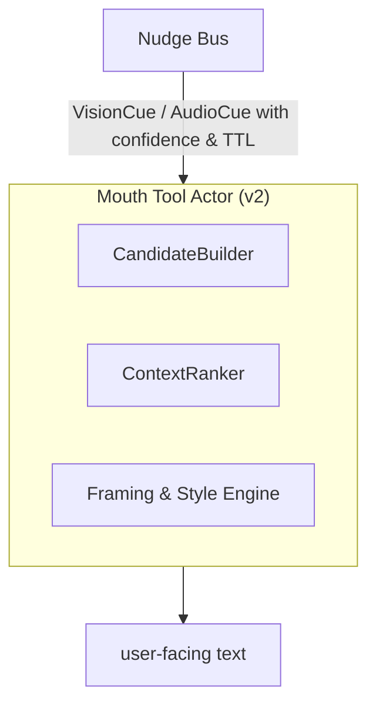

<!-- topic: Solace AI -->
<!-- title: Mouth Tool Technical Spec -->

# Addendum B

**Real‑Time Multimodal Expression Pipeline (Mouth Tool Extension)**
*(Extends SRAF‑25‑06‑04 §4.3 and Addendum A)*

| **Addendum ID** | SRAF‑MM‑MOUTH‑25‑06‑04                                                    |
| --------------- | ------------------------------------------------------------------------- |
| **Scope**       | Dynamic response framing that fuses Vision & Audio cues in the Mouth Tool |
| **Status**      | Draft                                                                     |

---

## B‑1  Objective

Augment the Mouth Tool so it no longer acts as a *pass‑through formatter*, but as an **active narrator** that:

1. **Ingests high‑confidence modality cues** (vision, audio).
2. **Determines conversational relevance** in real time.
3. **Frames or withholds** those cues to produce context‑aligned, human‑like responses.

## Related Topics

- [Supervisor AI](Supervisor-AI): decides which internal drafts are allowed to become speech.
- [Memory & Reflection](Memory-and-Reflection): source of reflection snippets and conversation context.
- [Perception Actors](Perception-Actors): vision/audio/text cues that feed the nudge bus.
- [Multimodal Nudging](Multimodal-Nudging): feature-level cross-perspective cue model.
- [Zoom Levels](Zoom-Levels): detail-level control for response framing.

---

## B‑2  Revised Mouth Tool Architecture



### Sub‑modules

| Module                     | Function                                                                                                                            |
| -------------------------- | ----------------------------------------------------------------------------------------------------------------------------------- |
| **CandidateBuilder**       | Collects `Nudge` objects + latest *Supervisor draft* + reflection snippets; yields candidate facts.                                 |
| **ContextRanker**          | Scores each candidate: *relevance × conversational utility × politeness × redundancy penalty*.                                      |
| **Framing & Style Engine** | Converts top‑ranked facts to natural language, selecting **detail level** (bare confirm vs. enriched description) & emotional tone. |

---

## B‑3  Algorithm (high level)

```pseudocode
INPUT: supervisorDraft, nudges[N], conversationContext
C ← CandidateBuilder(supervisorDraft, nudges)
R ← ContextRanker.score(C, conversationContext)
F ← FramingEngine.frame(R.topK)
OUTPUT: concatenate(F)
```

### Detail‑Level Heuristics

| Condition                                                        | Framing Example                                                 |
| ---------------------------------------------------------------- | --------------------------------------------------------------- |
| *Direct yes/no question* (e.g., "Is the shirt blue?")            | "Yes, the shirt is blue."                                       |
| *Descriptive follow‑up probable* (score > 0.75 detail threshold) | "Yes—the shirt is a rich cobalt blue, close to navy."           |
| *Emotionally charged audio cue*                                  | "She sounds noticeably angry; you may want to approach gently." |

---

## B‑4  Confidence & Politeness Filters

* Drop any modality cue with `confidence < 0.65` by default.
* Use **politeness filter** to soften sensitive audio insights:

  > Raw cue: "anger 0.83" → Output: "She sounds rather upset."

---

## B‑5  Concurrency & Latency

* Mouth Tool polls Nudge Bus every 5 ms; merges with Supervisor draft inside the **same coroutine tick**.
* Additional latency budget ≈ **≤ 10 ms** (string concat and template rendering only).
* Worst‑case end‑to‑end answer (Vision+Audio inference + Mouth framing) still bounded by Vision/Audio actors (≈ ≤ 50 ms) → meets realtime UX targets.

---

## B‑6  Data Contracts

```kotlin
data class Nudge(
    val origin: Modality,           // VISION, AUDIO
    val text: String,               // canonical fact
    val confidence: Float,
    val ttlMs: Long,
    val timestamp: Instant
)
```

Mouth Tool consumes **only** validated nudges forwarded by the Cross‑Perspective Bus.

---

## B‑7  Security / PII Guard

* Framing engine performs **last‑mile PII scrub** on candidate text (vision blur detection, audio names).
* Stylistic guidelines stored in `MouthStyleConfig` (can enable/disable fine‑grained emotional disclosures per deployment policy).

---

## B‑8  Example Dialogue Trace

| T (ms) | Actor                                                                                         | Event                                         |
| ------ | --------------------------------------------------------------------------------------------- | --------------------------------------------- |
|  +0    | User                                                                                          | "Is the shirt blue and does she sound angry?" |
|  +8    | VisionActor                                                                                   | Cue: "shirt blue (0.94)"                      |
|  +15   | AudioActor                                                                                    | Cue: "tone angry (0.83)"                      |
|  +18   | Nudges published                                                                              | → Bus                                         |
|  +20   | Supervisor drafts answer skeleton                                                             |                                               |
|  +25   | Mouth polls Bus, builds candidates                                                            |                                               |
|  +32   | Rank & frame                                                                                  |                                               |
|  +35   | **Output** → "Yes—the shirt is a rich cobalt blue, and her tone suggests she's rather angry." |                                               |

Total < 40 ms after last cue.

---

## B‑9  Open Items

1. **Multi‑cue blending** when vision & audio supply partly conflicting sentiments (e.g., smiling face but angry tone).
2. **Continuous scene** vs. discrete frame sampling—mitigate hallucination between updates.
3. *User privacy mode* switch to suppress audio emotion disclosure.

---

### Final Note

This Mouth Tool extension closes the loop: **perception → cognition → selective expression**, delivering answers that are *both factually grounded in multimodal reality and narratively aligned* with the ongoing conversation—while keeping the internal chain‑of‑thought pristine.

---

[← Voice & Mouth Tool](Voice-and-Mouth-Tool)
