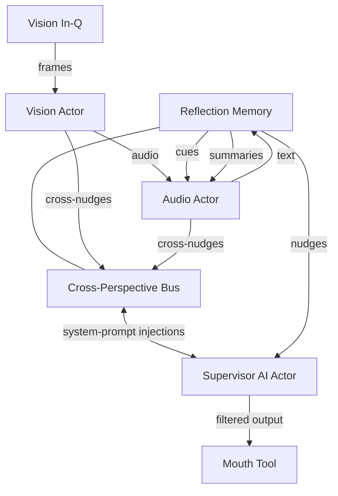

<!-- topic: Solace AI -->
<!-- title: Perception Actors -->


# Addendum A

**Multimodal Perception & Cross‑Perspective Nudging for the Seamless Reflective AI Framework**
*(Extends SRAF‑25‑06‑04 v1.0)*

| **Addendum ID** | SRAF‑MM‑25‑06‑04              |
|-----------------| ----------------------------- |
| **Relates To**  | Sections 2–4 (Component Spec) |
| **Author**      | Assistant                     |
|  **Status**     | Draft                         |

---

## A‑1  Purpose

Augment the baseline architecture with **parallel multimodal actor clusters**—Vision, Audio, and Text—to:

1. **Perceive** raw modality‑specific signals (frames, waveforms, tokens).
2. **Interpret** them **in parallel** against the evolving conversational context.
3. **Nudge** modality‑aware cues into the **system‑prompt sub‑spaces** of *other* actors (cross‑perspective priming).
4. Enable zero‑latency answers to queries such as *"Is the shirt blue?"* or *"Did she sound angry?"* by fusing their outputs through the Supervisor's mouth tool.

---

## A‑2  High‑Level Topology



---

## A‑3  Component Details

### A‑3.1 Vision Actor

| Aspect       | Design                                                                                           |
|--------------| ------------------------------------------------------------------------------------------------ |
| Ingress      | `VideoFrame` or `ImageTensor` via dedicated queue.                                               |
| Model        | Frozen or streaming ViT/CLIP fine‑tuned for attribute tagging & scene graph extraction.          |
| Output       | `VisionCue` {*objects*, *attributes*, *relations*, *confidence*}.                                |
|  Cross‑Nudge | For each salient tag, craft a **prompt token**: <br>`[V‑NUDGE] The scene contains a blue shirt.` |

### A‑3.2 Audio Actor

| Aspect       | Design                                                   |
|--------------| -------------------------------------------------------- |
| Ingress      | PCM chunks / spectrogram tensors.                        |
| Model        | SSL (e.g., wav2vec 2.0) + emotion classification head.   |
| Output       | `AudioCue` {*speaker\_state*, *emotion*, *keywords*}.    |
|  Cross‑Nudge | <br>`[A‑NUDGE] Detected angry tone in speaker‑1 (0.83).` |

### A‑3.3 Cross‑Perspective Bus

A lightweight publish/subscribe layer (lock‑free queue) that:

* Broadcasts each cue as a **system‑prompt injection** to *every* other modality actor **plus** the Supervisor.
* Attaches `origin` and `confidence` metadata for selective filtering.

---

## A‑4  System‑Prompt Nudging Protocol

```
[NUDGE]::<ORIGIN>::<TTL>::<TEXT>
```

* **ORIGIN** ∈ {VISION, AUDIO, TEXT}.
* **TTL** = expiry in ms; prevents stale nudges.
* Supervisor merges high‑confidence nudges into its inner prompt section:

> *"Context‑Prime (VISION): The subject's shirt is blue."*

---

## A‑5  Supervisor Fusion Logic (pseudo)

```kotlin
fun integrateNudges(nudges: List<Nudge>): ContextPrime {
    return nudges
        .filter { it.confidence > 0.7 && !it.expired() }
        .sortedByDescending { it.confidence }
        .joinToString("\n") { "Context‑Prime (${it.origin}): ${it.text}" }
}
```

The fused prime is appended **below** the conversation synopsis but **above** the response scaffold—guaranteeing the LM notices modality facts without user seeing the raw nudge.

---

## A‑6  Example End‑to‑End Flow

1. **Frame Input**: Vision actor tags *blue shirt*.
2. **Audio Chunk**: Audio actor flags *angry tone (0.83)*.
3. Both cues hit **Cross‑Perspective Bus** → forwarded nudges:

   ```
   [NUDGE]::VISION::60_000::The shirt is blue.
   [NUDGE]::AUDIO::30_000::Speaker tone suggests anger.
   ```
4. Supervisor integrates into prompt prime.
5. User asks: *"Is the shirt blue and does she sound angry?"*
6. LM already primed → immediate answer via Mouth Tool:

   > "Yes—the shirt appears blue, and the speaker's tone indicates anger."

---

## A‑7  Latency & Concurrency

* Each modality actor runs on its own coroutine context (`Dispatchers.Default.limitedParallelism(n)`), ensuring **≤ 50 ms** extraction pipeline.
* Nudges are fire‑and‑forget; Supervisor reads latest snapshot per decode loop.
* TTL tuning prevents stale visual facts from polluting later turns.

---

## A‑8  Security & Privacy

* Raw frames/PCM held in in‑memory ring buffers; erased after cue extraction.
* Nudges contain no PII—only derived semantic tags.
* Transport layer between actors is intra‑process; no external egress.

---

## A‑9  Open Issues

1. **Cue Conflict Resolution** (e.g., Vision says *blue*, user later says *red*).
2. **Confidence Calibration** across heterogeneous models.
3. **Token Budget Impact**—prompt‑prime length needs dynamic pruning.

---

## A‑10  Conclusion

The multimodal extension preserves the **single‑narrative guarantee** while granting the Supervisor instantaneous access to *what every sensory actor perceives*. Cross‑perspective nudging embeds high‑confidence modality facts into the LM's prompt, enabling accurate, context‑aware answers with minimal latency and no cognitive fragmentation.

---

