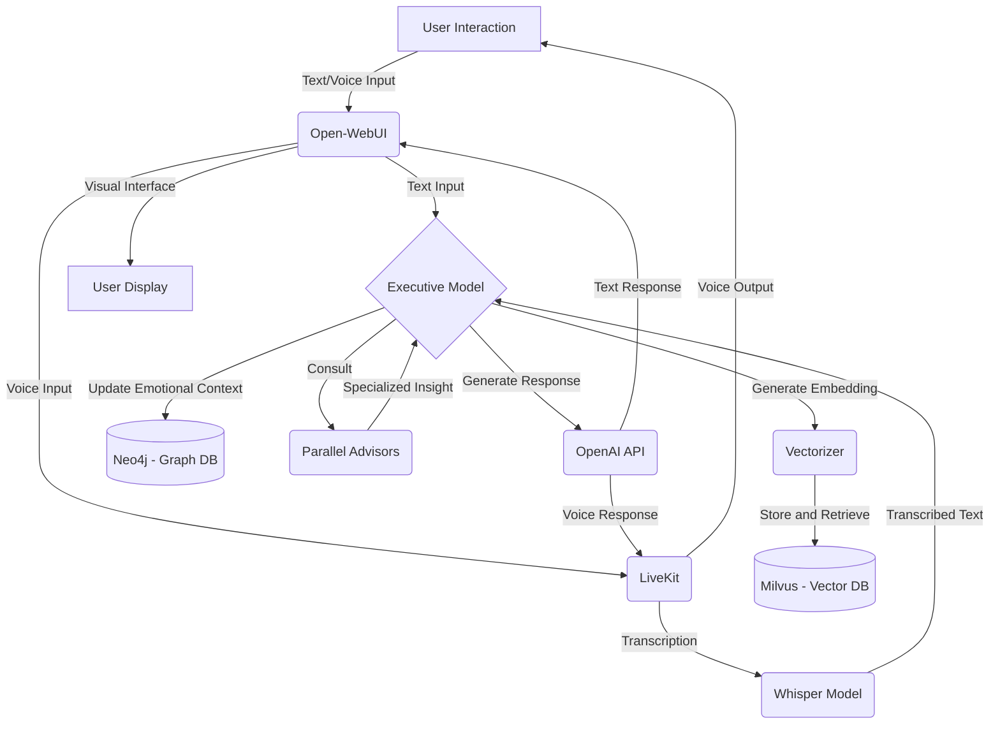

<!-- topic: Solace AI -->

# Solace AI Overview

Solace AI is composed as a set of cooperating capabilities rather than a single opaque assistant. SolaceCore provides the actor, workflow, scripting, and storage substrate for those capabilities.

## Major Companion Components

| Component | Role | Wiki Home |
|---|---|---|
| Visual workflow orchestrator | Configures tools, plugins, agents, and memory flows. | [Workflow Orchestration](Workflow-Orchestration) |
| Memory management system | Holds session context, retrieves long-term memories, and supports emotional continuity. | [Memory & Reflection](Memory-and-Reflection) |
| Middleware / routing layer | Coordinates request flow between orchestrator, stores, language engines, and tools. | [Kernel & Ports](Kernel-and-Ports), [Actor System](Actor-System) |
| Language processing integration | Handles embeddings, response generation, and dynamic script execution. | [Providers & MCP Tools](Providers-and-MCP-Tools), [Scripting Engine](Scripting-Engine) |
| Parallel advisors and executive function | Combine specialized insight with conversation-level decision making. | [Mood & Emotional Model](Mood-and-Emotional-Model), [Inference Cube](Inference-Cube) |
| Real-time voice integration | Streams voice input/output and coordinates transcription/synthesis. | [Voice & Mouth Tool](Voice-and-Mouth-Tool) |
| User engagement interface | Presents text, voice, transcription, and feedback loops. | [Perception Actors](Perception-Actors) |

## Conceptual Interaction Flow

## Flow Narrative

1. The user begins through text or voice.
2. Voice input is transcribed before entering the executive model.
3. The executive model retrieves recent context and, when needed, uses embeddings to query older memory.
4. Emotional context is updated or retrieved through the graph-memory direction of the design.
5. Advisors and tools are consulted when the request requires specialized insight.
6. A response is generated using language-model output enriched by memory, mood, and tool results.
7. The response is delivered as text, voice, or both.
8. Feedback loops refine future memory retrieval, sentiment handling, and interaction quality.

## Runtime Dependency

This companion model depends on the runtime topics below:

- [Actor System](Actor-System) for independent capability modules.
- [Workflow Orchestration](Workflow-Orchestration) for coordinating multi-step behavior.
- [Storage & Persistence](Storage-and-Persistence) for state and memory substrates.
- [Supervisor & Hot-Swap](Supervisor-and-Hot-Swap) for dynamic capability growth.

---
Source coverage: `docs/architecture/00-solace-project-context.md` lines 54-140.
