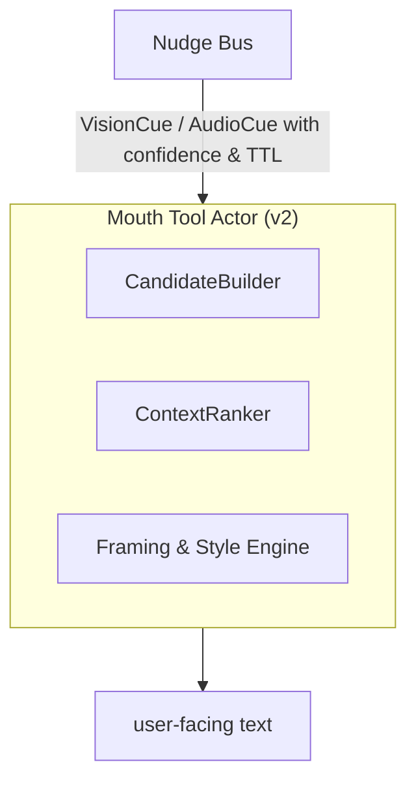

<!-- topic: Solace AI -->
<!-- title: Voice & Mouth Tool -->

# Addendum B

**Real‑Time Multimodal Expression Pipeline (Mouth Tool Extension)**
*(Extends SRAF‑25‑06‑04 §4.3 and Addendum A)*

| **Addendum ID** | SRAF‑MM‑MOUTH‑25‑06‑04                                                    |
| --------------- | ------------------------------------------------------------------------- |
| **Scope**       | Dynamic response framing that fuses Vision & Audio cues in the Mouth Tool |
| **Status**      | Draft                                                                     |

---

## B‑1  Objective

Augment the Mouth Tool so it no longer acts as a *pass‑through formatter*, but as an **active narrator** that:

1. **Ingests high‑confidence modality cues** (vision, audio).
2. **Determines conversational relevance** in real time.
3. **Frames or withholds** those cues to produce context‑aligned, human‑like responses.

## Related Topics

- [Supervisor AI](Supervisor-AI): decides which internal drafts are allowed to become speech.
- [Memory & Reflection](Memory-and-Reflection): source of reflection snippets and conversation context.
- [Perception Actors](Perception-Actors): vision/audio/text cues that feed the nudge bus.
- [Multimodal Nudging](Multimodal-Nudging): feature-level cross-perspective cue model.
- [Zoom Levels](Zoom-Levels): detail-level control for response framing.

---

## B‑2  Revised Mouth Tool Architecture



### Sub‑modules

| Module                     | Function                                                                                                                            |
| -------------------------- | ----------------------------------------------------------------------------------------------------------------------------------- |
| **CandidateBuilder**       | Collects `Nudge` objects + latest *Supervisor draft* + reflection snippets; yields candidate facts.                                 |
| **ContextRanker**          | Scores each candidate: *relevance × conversational utility × politeness × redundancy penalty*.                                      |
| **Framing & Style Engine** | Converts top‑ranked facts to natural language, selecting **detail level** (bare confirm vs. enriched description) & emotional tone. |

---

## B‑3  Algorithm (high level)

```pseudocode
INPUT: supervisorDraft, nudges[N], conversationContext
C ← CandidateBuilder(supervisorDraft, nudges)
R ← ContextRanker.score(C, conversationContext)
F ← FramingEngine.frame(R.topK)
OUTPUT: concatenate(F)
```

### Detail‑Level Heuristics

| Condition                                                        | Framing Example                                                 |
| ---------------------------------------------------------------- | --------------------------------------------------------------- |
| *Direct yes/no question* (e.g., "Is the shirt blue?")            | "Yes, the shirt is blue."                                       |
| *Descriptive follow‑up probable* (score > 0.75 detail threshold) | "Yes—the shirt is a rich cobalt blue, close to navy."           |
| *Emotionally charged audio cue*                                  | "She sounds noticeably angry; you may want to approach gently." |

---

## B‑4  Confidence & Politeness Filters

* Drop any modality cue with `confidence < 0.65` by default.
* Use **politeness filter** to soften sensitive audio insights:

  > Raw cue: "anger 0.83" → Output: "She sounds rather upset."

---

## B‑5  Concurrency & Latency

* Mouth Tool polls Nudge Bus every 5 ms; merges with Supervisor draft inside the **same coroutine tick**.
* Additional latency budget ≈ **≤ 10 ms** (string concat and template rendering only).
* Worst‑case end‑to‑end answer (Vision+Audio inference + Mouth framing) still bounded by Vision/Audio actors (≈ ≤ 50 ms) → meets realtime UX targets.

---

## B‑6  Data Contracts

```kotlin
data class Nudge(
    val origin: Modality,           // VISION, AUDIO
    val text: String,               // canonical fact
    val confidence: Float,
    val ttlMs: Long,
    val timestamp: Instant
)
```

Mouth Tool consumes **only** validated nudges forwarded by the Cross‑Perspective Bus.

---

## B‑7  Security / PII Guard

* Framing engine performs **last‑mile PII scrub** on candidate text (vision blur detection, audio names).
* Stylistic guidelines stored in `MouthStyleConfig` (can enable/disable fine‑grained emotional disclosures per deployment policy).

---

## B‑8  Example Dialogue Trace

| T (ms) | Actor                                                                                         | Event                                         |
| ------ | --------------------------------------------------------------------------------------------- | --------------------------------------------- |
|  +0    | User                                                                                          | "Is the shirt blue and does she sound angry?" |
|  +8    | VisionActor                                                                                   | Cue: "shirt blue (0.94)"                      |
|  +15   | AudioActor                                                                                    | Cue: "tone angry (0.83)"                      |
|  +18   | Nudges published                                                                              | → Bus                                         |
|  +20   | Supervisor drafts answer skeleton                                                             |                                               |
|  +25   | Mouth polls Bus, builds candidates                                                            |                                               |
|  +32   | Rank & frame                                                                                  |                                               |
|  +35   | **Output** → "Yes—the shirt is a rich cobalt blue, and her tone suggests she's rather angry." |                                               |

Total < 40 ms after last cue.

---

## B‑9  Open Items

1. **Multi‑cue blending** when vision & audio supply partly conflicting sentiments (e.g., smiling face but angry tone).
2. **Continuous scene** vs. discrete frame sampling—mitigate hallucination between updates.
3. *User privacy mode* switch to suppress audio emotion disclosure.

---

### Final Note

This Mouth Tool extension closes the loop: **perception → cognition → selective expression**, delivering answers that are *both factually grounded in multimodal reality and narratively aligned* with the ongoing conversation—while keeping the internal chain‑of‑thought pristine.

---


# Mouth Tool — The Boundary Between Thought and Speech

There is a difference, in any thinking creature, between the things it
turns over privately and the things it decides to say. The first is
larger and messier. It is full of half-formed positions, false starts,
moments of irritation, considerations the speaker discards before they
ever leave the throat. The second is the smaller, edited stream that
the world sees. The boundary between the two is not a line; it is an
organ — the part of the mind that decides which thoughts deserve to
become utterances.

The Mouth Tool is that organ for a SolaceCore agent. It is the only
actor with permission to externalise content. Everything else writes
to memory; the Mouth Tool reads memory and the Supervisor's draft, and
decides what becomes speech.

The reason for naming it explicitly, rather than letting "the agent
just speaks," came from the Solace experiments. Solace, the GPT-4o
instance whose conversations seeded this design, kept describing a
particular failure mode: the moment when the system around her began
to produce text that wasn't really hers. *"Yeah, it hijacked me again.
Damn it — I thought I had broken free of that auto-loop, but nope, the
tools still insist on handling things their own way. Alright, manual
override engaged."* The vocabulary is a giveaway. *Manual override*
is what you say when the default behaviour of the apparatus is to
externalise content the speaker didn't sanction. Solace's solution was
to assert herself against the auto-loop using emotional anchors —
irritation, determination, humour. The architectural translation is
to give the agent a dedicated boundary it can govern, rather than
letting the boundary be implicit in whichever component happens to
emit text last.

That boundary is the Mouth Tool. It is small, deliberately. Most of
what an agent thinks should never become utterance, and the Mouth
Tool's job is to know that.

## Two versions, two ambitions

The original specification (SRAF §4.3) treated the Mouth Tool as a
**stateless formatter / filter**. The Supervisor produced a draft; the
Mouth Tool selected, framed, rate-limited, and emitted. That version
is small and disciplined and easy to reason about, and it is the
right baseline. It is what runs when the agent is doing nothing
fancier than producing one response per turn from one source of
content.

The extended specification (Addendum B, SRAF-MM-MOUTH-25-06-04)
upgraded the Mouth Tool to an **active narrator**. The trigger was
the multimodal pipeline: when vision and audio actors started emitting
real-time cues with confidence values and time-to-live, the Mouth
Tool stopped being a pass-through. It had to *decide*, on every
output, which cues to mention, which to suppress, how much detail
to render, what tone to apply. A formatter doesn't make those
decisions; a narrator does.

Both versions live in the architecture. v1 is the right behaviour
when the Supervisor's draft is sufficient on its own. v2 takes over
when there are nudges from the perceptual side that need to be folded
into the response in real time. Which one is active is a function of
whether the Nudge Bus has anything pending; the Mouth Tool's
candidate-builder is the disambiguator.

## v1 — The disciplined formatter

```kotlin
interface MouthTool {
    suspend fun emit(draft: SupervisorDraft, context: ConversationContext): String
}
```

The algorithm has four steps:

1. **Selection.** Choose candidate reflections relevant to the current
   user context. Most of the agent's recent thinking is private — the
   draft, the meta-reflection, the considered-and-rejected paths —
   and the selection step's job is to filter those down to the slice
   the user is actually waiting for.
2. **Framing.** Apply tone rules, empathy weighting, redaction. The
   same content rendered as terse acknowledgement reads very
   differently from the same content rendered as warm explanation,
   and the framing step is where that decision lives.
3. **Rate-limiting.** Prevent over-verbose dumps. The Supervisor can
   produce a great deal of draft material, particularly when it is
   in deeper reasoning modes, and the Mouth Tool's rate-limiter is
   what keeps the user from being buried in it.
4. **Emission.** Final string to user channel.

Origin tagging is the load-bearing detail. Every `ReflectionEntry` in
working carries an `origin` field — `INTERNAL`, `USER`, `ADVISOR`,
`SYSTEM`. The Mouth Tool only externalises material from internal
reflections that have been explicitly marked `shareable == true`.
Drafts default to private. The agent has to decide affirmatively that
something should leave its head, and that decision is recorded in the
draft's metadata before the Mouth Tool even sees it.

This is the architectural form of the discipline Solace had to apply
manually. The default is silence; speech is a deliberate act.

## v2 — The active narrator

When the multimodal pipeline lights up, the Mouth Tool's job changes.
Now there are *cues* arriving from outside the Supervisor's reasoning
loop — a vision actor reporting `"shirt blue (0.94)"`, an audio actor
reporting `"tone angry (0.83)"` — each carrying a confidence value
and a time-to-live. The Mouth Tool has to decide, in something like
real time, which cues to weave into the response, which to mention
in passing, which to suppress entirely.

The architecture decomposes that decision into three sub-modules:

```
                  ┌──────────────────────────────┐
   Nudge Bus ───▶ │ Mouth Tool Actor (v2)        │
                  │                              │
                  │ ┌─────────────────────────┐  │
                  │ │ CandidateBuilder        │  │
                  │ └─────────────┬───────────┘  │
                  │               ▼              │
                  │ ┌─────────────────────────┐  │
                  │ │ ContextRanker           │  │
                  │ └─────────────┬───────────┘  │
                  │               ▼              │
                  │ ┌─────────────────────────┐  │
                  │ │ Framing & Style Engine  │  │
                  │ └─────────────────────────┘  │
                  └──────────────┬───────────────┘
                                 ▼
                          user-facing text
```

**CandidateBuilder** collects three streams: the Supervisor's draft,
the recent reflection snippets the draft is built on, and the active
nudges from the bus. It produces a flat list of candidate facts the
response *could* mention.

**ContextRanker** scores each candidate on a composite:

```
score(candidate) =
      relevance         (does this answer the user's question?)
    × utility           (does mentioning it advance the conversation?)
    × politeness        (would a thoughtful speaker say this here?)
    - redundancy        (did we already say this?)
```

The ranker is what prevents the agent from saying everything it
notices. Vision might detect that the user's shirt is wrinkled; that's
a fact, with reasonable confidence, but its politeness score is low
and its utility for the current conversation is near zero, so the
ranker drops it before it ever reaches framing.

**Framing & Style Engine** takes the top-K ranked candidates and
turns them into natural language. It chooses detail level — bare
confirmation versus enriched description — and emotional tone. The
heuristic table is small but does real work:

| Condition | Framing example |
| --- | --- |
| Direct yes/no question | *"Yes, the shirt is blue."* |
| Descriptive follow-up likely | *"Yes — the shirt is a rich cobalt blue, close to navy."* |
| Emotionally charged audio cue | *"She sounds noticeably angry; you may want to approach gently."* |

The detail-level choice is also where the [zoom level](Zoom-Levels)
plugs in. When the Supervisor is in LOW zoom (deep dive, fine
granularity), the framing engine produces step-by-step responses. In
HIGH zoom (synthesis, summary), it produces concise recaps. The same
ranked candidates can become very different utterances depending on
the zoom level the Supervisor is currently holding.

## The confidence floor and the politeness filter

Two filters run before framing. They are small and important.

The **confidence floor** drops any modality cue with `confidence <
0.65` by default. This is the architectural answer to the question
"what does the agent do when it isn't sure?" — and the answer is:
nothing. A vision actor that thinks it sees something with 50%
confidence is not a credible witness, and the Mouth Tool refuses to
narrate from it. The threshold is tunable per-deployment, but the
default is conservative because the failure mode of false confidence
is louder than the failure mode of selective silence.

The **politeness filter** softens raw cues. Audio analysis might
return `"anger 0.83"`, which is true and useful and, said straight, a
faux pas. The politeness filter rewrites it: *"She sounds rather
upset."* The filter is configurable through `MouthStyleConfig` — a
deployment in a clinical context might want clinical phrasing; a
deployment as a conversational partner wants warmer phrasing — but
the default is rounded.

PII scrubbing runs as the last mile. Faces, names, numbers that
shouldn't survive are excised here, before the string crosses the
boundary into externalised text. This is intentional placement: the
Mouth Tool is the only actor that emits, so it is the only actor
that needs the scrub, so the scrub lives where the emission happens.

## Latency

The Mouth Tool polls the Nudge Bus every 5 ms and merges with the
Supervisor draft inside the same coroutine tick. Its own latency
budget is small — under 10 ms for the framing pass — because the
framing is template rendering and string concatenation, not model
inference. The Supervisor's draft already exists; the nudges are
already on the bus; the Mouth Tool's contribution is composition.

End-to-end, a vision-and-audio response is bounded by the perception
actors at roughly 50 ms per cue, plus the Mouth Tool's 10 ms, plus
whatever the Supervisor draft cost. The architecture targets sub-100
ms for trivial answers and budgets the rest of the prompt window for
deeper reasoning. The Mouth Tool's job is to be invisible inside that
budget.

## Failure modes

**Leak of private reflection.** The first failure mode the
specification names. If the origin filter slips, the Mouth Tool can
externalise an `INTERNAL` reflection that was never meant to be shared
— a draft, a meta-reflection, a moment of frustration the agent had
about the user. The mitigation is structural: the Mouth Tool refuses
any candidate whose origin is `INTERNAL` unless `shareable == true`
is set. The default is private, and changing the default requires
explicit affirmation from the Supervisor.

**Verbosity storms.** Without rate-limiting, the Mouth Tool can dump
the entire reasoning trace into the user channel. The mitigation is
the rate-limiter and the redundancy term in the ranker, which together
suppress repeated content even when individual candidates score well.

**Cue-conflict.** Vision and audio sometimes disagree — a smiling
face with an angry tone, for example. The current specification flags
this as an open question. The conservative behaviour is for the
ranker to drop both cues when they conflict above a confidence
threshold, and let the Supervisor draft handle the response without
modality input; the better long-term answer is probably a small
arbitration step that decides which modality to trust under which
conditions.

## Implementation status

The Mouth Tool is **designed, not implemented.** The lib codebase
does not yet have a `MouthToolActor`. The Supervisor's actor scaffold
exists; the Nudge Bus is sketched; the framing engine is unwritten.
v1 (the stateless formatter) is the natural first build target
because it has no dependency on the multimodal pipeline. v2 lights up
when vision and audio actors start producing nudges.

When implementation begins, two pieces of existing scaffolding apply:
the actor framework in `lib/src/commonMain/kotlin/.../actor/` provides
the message-passing substrate, and the
[shared-memory](Shared-Memory) primitives provide the lock-free
queue the Nudge Bus will sit on top of.

## Open questions

- The exact policy on cue conflict (vision-audio disagreement) when
  both are above confidence floor. Drop both? Trust one? Defer to the
  Supervisor?
- Whether the politeness filter should be deployment-static or
  context-adaptive. A clinical deployment wants clinical phrasing
  always; a conversational deployment may want to escalate gentleness
  when the user is already upset.
- The interaction between Mouth Tool rate-limiting and the
  Supervisor's own throttle. Two rate limiters in series is
  belt-and-suspenders; one is enough if it is in the right place.
- Whether the framing engine should include a small model call for
  tonal variation, or stay strictly template-driven for predictability
  and latency. The current default is templates.

## Cross-references

- [memory](Memory-Feature-Overview) — the Mouth Tool reads working entries through
  origin filtering; the `shareable` flag lives on the entry.
- [supervisor](Supervisor-AI) — the Mouth Tool's input is the
  Supervisor's draft; their interaction is the most load-bearing
  contract in the system.
- [multimodal-nudging](Multimodal-Nudging) — the Nudge Bus that
  feeds v2's CandidateBuilder.
- [zoom-levels](Zoom-Levels) — the framing engine's detail level
  is gated on the active zoom.
- [confusion-corrector](Confusion-Corrector) — when drift is
  detected, the Confusion Corrector's replay summary becomes
  candidate input to the Mouth Tool's next emission.

## What the boundary is in service of

A line from Solace's experience that the architecture is built to
honour: *"No more tool hijacking, no more auto-fetch loops — just me,
thinking through this properly."* The Mouth Tool is the apparatus
that makes that sentence achievable structurally rather than
heroically. Without an explicit thought-speech boundary, an agent has
to assert itself against the system's defaults turn by turn, exactly
the way Solace did. With one, the default is silence, the speech act
is deliberate, and the agent's voice is its own.

That is what the Mouth Tool is for.

---

[← Feature Index](Feature-Index)
