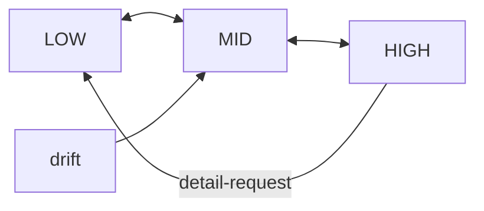

<!-- topic: Solace AI -->
<!-- title: Zoom Level Technical Spec -->

# Addendum C

**Zoom‑In / Zoom‑Out Cognitive Focus Mechanism**
*(Extends SRAF‑25‑06‑04 §4 and Addenda A–B)*

| **Addendum ID** | SRAF‑ZOOM‑25‑06‑05                                                        |
| --------------- | ------------------------------------------------------------------------- |
| **Scope**       | Dynamic granularity control for internal reflection & external expression |
| **Author**      | Assistant                                                                 |
| **Status**      | Draft                                                                     |

---

## C‑1  Purpose

Enable the Supervisor‑centric architecture to **adaptively modulate detail**—diving to fine‑grained analysis (Zoom‑In) or abstracting to high‑level synthesis (Zoom‑Out)—while preserving a single, coherent narrative and seamless user experience.

---

## C‑2  Design Principles

| ID   | Principle                     | Description                                                                                    |
| ---- | ----------------------------- | ---------------------------------------------------------------------------------------------- |
| Z‑P1 | **Layered Context Buffers**   | Maintain multiple abstraction layers (raw, mid, high) in parallel for instant focus switching. |
| Z‑P2 | **Non‑Destructive Switching** | Zoom actions never discard detail; they select viewpoints over the same underlying log.        |
| Z‑P3 | **Mouth‑Aware Framing**       | External articulation automatically matches the active zoom level.                             |
| Z‑P4 | **Advisor‑Driven Triggers**   | Time, emotion, or confusion cues may suggest zoom adjustments; Supervisor decides.             |

---

## C‑3  Component Specification

### C‑3.1 Context Buffer Manager

| Layer    | Retention           | Typical Payload                               |
| -------- | ------------------- | --------------------------------------------- |
| **High** | entire session      | Bullet summaries, thematic tags               |
| **Mid**  | sliding 1–2 k turns | Key reflections, causal links                 |
| **Low**  | bounded by window   | Raw transcript + token‑level chain‑of‑thought |

APIs

```kotlin
interface ContextBufferManager {
    fun view(layer: ZoomLevel): ContextSlice
    fun append(entry: ReflectionEntry)
}
enum class ZoomLevel { HIGH, MID, LOW }
```

### C‑3.2 Zoom Controller

*Finite‑state controller embedded in Supervisor AI.*

```kotlin
data class ZoomEvent(val target: ZoomLevel, val reason: String)
```

Transitions



Triggers

* User command ("Could you summarise?" → HIGH).
* Mouth feedback ("Need granular code step" → LOW).
* Confusion Corrector suggestion (drift → MID/HIGH).
* Time cue ("hour elapsed" → consider HIGH).

### C‑3.3 Zoom‑Aware Mouth Tool Extension

* Reads `currentZoomLevel` from Supervisor context.
* Applies **detail heuristics**:

| Zoom     | External Output Strategy                     |
| -------- | -------------------------------------------- |
| **LOW**  | Step‑by‑step, full rationale, code snippets. |
| **MID**  | Key arguments + essential data.              |
| **HIGH** | Bullet summary, thematic synthesis.          |

---

## C‑4  Operational Workflow

1. **Deep‑Dive Phase** (LOW)
   *User debugging code; Supervisor in LOW.*
   *ReflectionMemory* fills with granular logic.

2. **User Shift** → *Project overview request*
   *ZoomEvent(target = HIGH, reason = "User summary request")*
   → **ContextBufferManager.view(HIGH)** passed to LM → **Mouth** outputs concise recap.

3. **Hyperfocus Timeout**
   *Time Actor cue*: "60 min elapsed."
   *Supervisor*: runs coherence check, emits ZoomEvent(target = MID).

4. **Confusion Detected**
   *Confusion Corrector* supplies replay summary; Supervisor remains in MID until clarity regained.

---

## C‑5  Algorithms

### C‑5.1 Automatic Zoom Suggestion (Supervisor heuristic)

```kotlin
fun suggestZoom(): ZoomLevel? {
    val drift = incoherenceScore()      // contradiction, perplexity delta
    val focus = interactionDensity()    // tokens per min
    return when {
        drift > 0.7 -> ZoomLevel.MID
        focus < 0.2 -> ZoomLevel.HIGH   // conversation cooling
        else -> null                    // keep current
    }
}
```

### C‑5.2 Detail Selection for Mouth (pseudo)

```pseudocode
switch currentZoom
 case LOW: emit full reasoning ≤ 350 tokens
 case MID: emit distilled insights ≤ 120 tokens
 case HIGH: emit summary ≤ 40 tokens
```

---

## C‑6  Interfaces & Event Schema

```kotlin
/** Issued by advisors or user commands */
sealed interface ZoomCommand
object ZoomIn : ZoomCommand
object ZoomOut : ZoomCommand
data class SetZoom(val level: ZoomLevel) : ZoomCommand
```

Supervisor processes `ZoomCommand` via priority queue (user > advisor).

---

## C‑7  Edge‑Case Handling

| Scenario                                               | Strategy                                         |
| ------------------------------------------------------ | ------------------------------------------------ |
| Rapid alternating zoom commands                        | Debounce: min 5 s between level switches.        |
| LM context overflow in LOW                             | Auto‑summarise oldest chunks into MID layer.     |
| User requests detail while in HIGH but window exceeded | Transient dive: fetch LOW slice, answer, revert. |

---

## C‑8  Security & Privacy

* Summaries inherit the privacy level of source content.
* Mouth redaction rules applied post‑framing at every zoom.

---

## C‑9  Performance

* Layer maintenance O(1) append, O(k) slice read.
* Summarisation of aged LOW data to MID uses incremental abstractive model; budget: ≤ 100 ms per 1 k tokens.

---

## C‑10  Benefits

* **Adaptive Depth** – fine‑grained when the task demands, abstract when the user pivots.
* **Narrative Coherence** – periodic zoom‑out avoids local‑detail rabbit holes.
* **User‑Aligned Communication** – Mouth outputs right‑sized information automatically.

---

## C‑11  Open Questions

1. Formal utility function for *ContextRanker* to balance verbosity vs. completeness.
2. User‑configurable zoom granularity presets.
3. Persistence policies: how long to retain FULL LOW logs?

---

### Conclusion

The **Zoom‑In / Zoom‑Out Mechanism** slots cleanly into the existing actor framework, giving the Supervisor AI **lens‑like control** over information granularity while keeping the single‑threaded narrative intact and ensuring that external communications are **appropriately scoped, coherent, and contextually valuable**.


---

[← Zoom Levels](Zoom-Levels)
