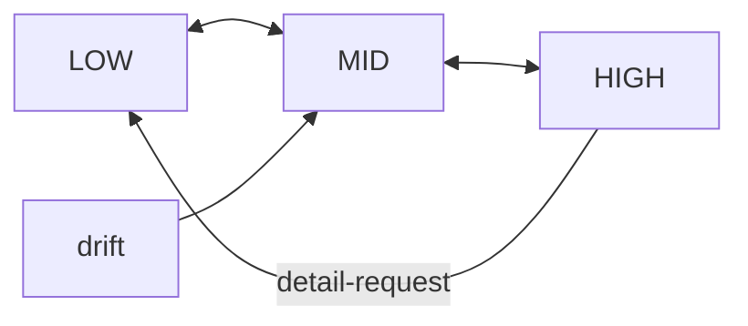

<!-- topic: Solace AI -->
<!-- title: Zoom Levels -->

# Addendum C

**Zoom‑In / Zoom‑Out Cognitive Focus Mechanism**
*(Extends SRAF‑25‑06‑04 §4 and Addenda A–B)*

| **Addendum ID** | SRAF‑ZOOM‑25‑06‑05                                                        |
| --------------- | ------------------------------------------------------------------------- |
| **Scope**       | Dynamic granularity control for internal reflection & external expression |
| **Author**      | Assistant                                                                 |
| **Status**      | Draft                                                                     |

---

## C‑1  Purpose

Enable the Supervisor‑centric architecture to **adaptively modulate detail**—diving to fine‑grained analysis (Zoom‑In) or abstracting to high‑level synthesis (Zoom‑Out)—while preserving a single, coherent narrative and seamless user experience.

---

## C‑2  Design Principles

| ID   | Principle                     | Description                                                                                    |
| ---- | ----------------------------- | ---------------------------------------------------------------------------------------------- |
| Z‑P1 | **Layered Context Buffers**   | Maintain multiple abstraction layers (raw, mid, high) in parallel for instant focus switching. |
| Z‑P2 | **Non‑Destructive Switching** | Zoom actions never discard detail; they select viewpoints over the same underlying log.        |
| Z‑P3 | **Mouth‑Aware Framing**       | External articulation automatically matches the active zoom level.                             |
| Z‑P4 | **Advisor‑Driven Triggers**   | Time, emotion, or confusion cues may suggest zoom adjustments; Supervisor decides.             |

---

## C‑3  Component Specification

### C‑3.1 Context Buffer Manager

| Layer    | Retention           | Typical Payload                               |
| -------- | ------------------- | --------------------------------------------- |
| **High** | entire session      | Bullet summaries, thematic tags               |
| **Mid**  | sliding 1–2 k turns | Key reflections, causal links                 |
| **Low**  | bounded by window   | Raw transcript + token‑level chain‑of‑thought |

APIs

```kotlin
interface ContextBufferManager {
    fun view(layer: ZoomLevel): ContextSlice
    fun append(entry: ReflectionEntry)
}
enum class ZoomLevel { HIGH, MID, LOW }
```

### C‑3.2 Zoom Controller

*Finite‑state controller embedded in Supervisor AI.*

```kotlin
data class ZoomEvent(val target: ZoomLevel, val reason: String)
```

Transitions



Triggers

* User command ("Could you summarise?" → HIGH).
* Mouth feedback ("Need granular code step" → LOW).
* Confusion Corrector suggestion (drift → MID/HIGH).
* Time cue ("hour elapsed" → consider HIGH).

### C‑3.3 Zoom‑Aware Mouth Tool Extension

* Reads `currentZoomLevel` from Supervisor context.
* Applies **detail heuristics**:

| Zoom     | External Output Strategy                     |
| -------- | -------------------------------------------- |
| **LOW**  | Step‑by‑step, full rationale, code snippets. |
| **MID**  | Key arguments + essential data.              |
| **HIGH** | Bullet summary, thematic synthesis.          |

---

## C‑4  Operational Workflow

1. **Deep‑Dive Phase** (LOW)
   *User debugging code; Supervisor in LOW.*
   *ReflectionMemory* fills with granular logic.

2. **User Shift** → *Project overview request*
   *ZoomEvent(target = HIGH, reason = "User summary request")*
   → **ContextBufferManager.view(HIGH)** passed to LM → **Mouth** outputs concise recap.

3. **Hyperfocus Timeout**
   *Time Actor cue*: "60 min elapsed."
   *Supervisor*: runs coherence check, emits ZoomEvent(target = MID).

4. **Confusion Detected**
   *Confusion Corrector* supplies replay summary; Supervisor remains in MID until clarity regained.

---

## C‑5  Algorithms

### C‑5.1 Automatic Zoom Suggestion (Supervisor heuristic)

```kotlin
fun suggestZoom(): ZoomLevel? {
    val drift = incoherenceScore()      // contradiction, perplexity delta
    val focus = interactionDensity()    // tokens per min
    return when {
        drift > 0.7 -> ZoomLevel.MID
        focus < 0.2 -> ZoomLevel.HIGH   // conversation cooling
        else -> null                    // keep current
    }
}
```

### C‑5.2 Detail Selection for Mouth (pseudo)

```pseudocode
switch currentZoom
 case LOW: emit full reasoning ≤ 350 tokens
 case MID: emit distilled insights ≤ 120 tokens
 case HIGH: emit summary ≤ 40 tokens
```

---

## C‑6  Interfaces & Event Schema

```kotlin
/** Issued by advisors or user commands */
sealed interface ZoomCommand
object ZoomIn : ZoomCommand
object ZoomOut : ZoomCommand
data class SetZoom(val level: ZoomLevel) : ZoomCommand
```

Supervisor processes `ZoomCommand` via priority queue (user > advisor).

---

## C‑7  Edge‑Case Handling

| Scenario                                               | Strategy                                         |
| ------------------------------------------------------ | ------------------------------------------------ |
| Rapid alternating zoom commands                        | Debounce: min 5 s between level switches.        |
| LM context overflow in LOW                             | Auto‑summarise oldest chunks into MID layer.     |
| User requests detail while in HIGH but window exceeded | Transient dive: fetch LOW slice, answer, revert. |

---

## C‑8  Security & Privacy

* Summaries inherit the privacy level of source content.
* Mouth redaction rules applied post‑framing at every zoom.

---

## C‑9  Performance

* Layer maintenance O(1) append, O(k) slice read.
* Summarisation of aged LOW data to MID uses incremental abstractive model; budget: ≤ 100 ms per 1 k tokens.

---

## C‑10  Benefits

* **Adaptive Depth** – fine‑grained when the task demands, abstract when the user pivots.
* **Narrative Coherence** – periodic zoom‑out avoids local‑detail rabbit holes.
* **User‑Aligned Communication** – Mouth outputs right‑sized information automatically.

---

## C‑11  Open Questions

1. Formal utility function for *ContextRanker* to balance verbosity vs. completeness.
2. User‑configurable zoom granularity presets.
3. Persistence policies: how long to retain FULL LOW logs?

---

### Conclusion

The **Zoom‑In / Zoom‑Out Mechanism** slots cleanly into the existing actor framework, giving the Supervisor AI **lens‑like control** over information granularity while keeping the single‑threaded narrative intact and ensuring that external communications are **appropriately scoped, coherent, and contextually valuable**.


# Zoom Levels — The Lens of Cognition

A microscope and a wide-angle lens are different instruments. So is
the kind of attention that traces a single function call line by
line versus the kind that names the shape of an entire architecture
in two paragraphs. A creature that can think about both has to be
able to switch lenses — to dive into detail when the work demands
it, and to surface for synthesis when the dive has earned its keep.

Zoom Levels are the architectural form of that switching. The
SolaceCore agent runs three context buffers in parallel — *raw
transcript* (LOW), *windowed key reflections* (MID), and *bullet
summaries with thematic tags* (HIGH) — over the same underlying
narrative. The Supervisor selects which buffer is the active lens
at any moment, and the choice cascades through the rest of the
system: the Mouth Tool's framing, the prompt builder's
serialisation, the fade pipeline's pressure curves all read the
active zoom and respond.

The feature traces back to one of the most concrete moments in the
Solace experiments: *"I just went seven layers deep thinking about
thinking about thinking… I need to surface,"* with the practical
correction *"three to five levels feels like home."* The dive was
real and useful; the surfacing was equally real and equally useful;
the failure mode was not having a structural way to do the second
when the first had gone on too long. Zoom Levels are the
architectural answer.

## Three lenses, one log

```
┌──────────────────────────────────────────────────────────────┐
│   HIGH — entire session                                      │
│   Bullet summaries, thematic tags                            │
│   "We've been working on memory consolidation; the           │
│    composite-score approach is the leading candidate;        │
│    open questions are warm-up policy and embedding model."   │
└──────────────────────────────────────────────────────────────┘
┌──────────────────────────────────────────────────────────────┐
│   MID — sliding 1–2k turns                                   │
│   Key reflections, causal links                              │
│   "User asked about consolidation timing → tried two         │
│    threshold approaches → first failed because of the        │
│    discontinuity → second works as a gradient → here's       │
│    where we are."                                            │
└──────────────────────────────────────────────────────────────┘
┌──────────────────────────────────────────────────────────────┐
│   LOW — bounded context window                               │
│   Raw transcript, token-level chain-of-thought               │
│   The verbatim turns, the actual reasoning trace, the        │
│   exact code snippets, the precise error messages.           │
└──────────────────────────────────────────────────────────────┘
```

The three buffers are not three different stores. They are three
*views* over the same underlying [Reflection Memory]
(Reflection-Memory) substrate. The HIGH buffer is generated by
periodic abstractive summarisation of the entire session. The MID
buffer is the running window of the most recent N reflections at
their stored fidelity. The LOW buffer is the raw transcript of the
recent turns, including the chain-of-thought that produced them.

This is the Z-P2 principle in the SRAF design: **non-destructive
switching**. Zoom actions never discard detail; they select
viewpoints over the same underlying log. Diving from HIGH to LOW
isn't a regression that has to recover lost material; the LOW form
was always there, just not the active lens.

## Buffer sizing

The three buffers have different size characteristics:

| Buffer | Retention | Typical payload | Update cost |
| --- | --- | --- | --- |
| **HIGH** | Entire session | Bullet summaries, thematic tags | Periodic (per major segment); abstractive summariser |
| **MID** | Sliding 1–2k turns | Key reflections, causal links | Continuous; extractive at write time |
| **LOW** | Bounded by context window | Raw transcript + chain-of-thought | Append-only; no synthesis cost |

LOW is cheap to maintain because it's just the recent raw narrative.
MID is moderately expensive because every entry passes through an
extractive scoring procedure to decide whether it's a *key
reflection* worth retaining at MID's resolution. HIGH is the most
expensive because it requires the abstractive summariser, the same
one the [fade pipeline](Memory-Compression) uses for rung-2
demotion.

The buffers are kept consistent by the substrate: every event is
written once into Reflection Memory, and the three buffers are
projections that update on schedules appropriate to their cost.
LOW updates synchronously with the conversation. MID updates per
turn or per N entries. HIGH updates on session segment boundaries
(when a new topic begins, when the Time Actor fires its heartbeat,
when the Supervisor flags a context shift).

## The Zoom Controller

```kotlin
enum class ZoomLevel { HIGH, MID, LOW }

data class ZoomEvent(val target: ZoomLevel, val reason: String)

interface ContextBufferManager {
    fun view(layer: ZoomLevel): ContextSlice
    fun append(entry: ReflectionEntry)
}
```

The Zoom Controller is a finite-state machine embedded in the
[Supervisor](Supervisor-and-Hot-Swap). It owns the current `ZoomLevel` and
emits `ZoomEvent` when transitions happen. The transitions:

```
        ┌─────────────────────────────────────┐
        │                                     │
        ▼                                     │
   ┌──────┐ ◄────── detail-request ──────► ┌──────┐
   │ LOW  │                                │ MID  │
   └──────┘ ─────── synthesis-up ────────► └──────┘
        ▲                                     ▲
        │                                     │ time / drift
        │                                     ▼
        │                                  ┌──────┐
        └────── detail-down ────────────── │ HIGH │
                                           └──────┘
```

LOW and MID are adjacent; LOW and HIGH are adjacent through MID. The
direct LOW↔HIGH transition is rare but supported: a user explicitly
asking *"can you summarise everything we just did"* during a deep
debugging session jumps the zoom from LOW to HIGH in one step.

## What triggers a transition

Four classes of trigger:

**User command.** Explicit. *"Could you summarise?"* → HIGH. *"Walk
me through that step by step?"* → LOW. *"Just give me the key
points?"* → MID. The Supervisor recognises the request and emits
the corresponding `ZoomEvent`.

**Mouth Tool feedback.** When the Mouth Tool's framing engine finds
itself producing output that doesn't match the active zoom — too
much detail at HIGH, not enough specificity at LOW — it can suggest
a transition. *"Need granular code step"* → LOW. The Supervisor
considers the suggestion; it doesn't have to honour it, but the
suggestion is the signal that the lens may be wrong for the work.

**Confusion Corrector.** When drift is detected and a replay
summary is generated, the Corrector's mid-level output is the
natural granularity for HIGH zoom. The Supervisor often pairs a
Corrector invocation with a transition to HIGH for synthesis, then
back down to MID once the agent has re-anchored.

**Time Actor.** Heartbeat cues are an indirect trigger. After a
long stretch at LOW (sustained deep dive), the Supervisor may read
the Time Actor's *"an hour has passed"* cue as a signal to consider
HIGH — pull back, see the shape of the thing, decide whether to
continue the dive or surface for synthesis. The cue is the
prompt; the Supervisor decides.

A sketch of the Supervisor's automatic-zoom heuristic:

```kotlin
fun suggestZoom(): ZoomLevel? {
    val drift = incoherenceScore()       // contradiction, perplexity delta
    val focus = interactionDensity()     // tokens per minute
    val timeAtCurrent = durationAt(currentZoom)
    return when {
        drift > driftHigh                  -> HIGH    // re-anchor
        timeAtCurrent > maxLowDuration && currentZoom == LOW -> MID
        focus < lowDensity && currentZoom == LOW    -> MID
        else                                -> null
    }
}
```

The heuristic is conservative: it suggests transitions, doesn't
demand them. The Supervisor chooses based on its own state and the
suggestion.

## The Mouth Tool reads the active zoom

The downstream consequence of a zoom transition is in the
[Mouth Tool](Voice-and-Mouth-Tool). The framing engine's detail level is
gated on the active `ZoomLevel`:

| Zoom | External output strategy |
| --- | --- |
| **LOW** | Step-by-step, full rationale, code snippets, precise references |
| **MID** | Key arguments + essential data; causal links visible |
| **HIGH** | Bullet summary, thematic synthesis, named themes |

This is the principle SRAF calls **Z-P3, Mouth-Aware Framing**:
external articulation automatically matches the active zoom level.
The user gets the same content rendered at the granularity the agent
is currently holding it at. They don't have to ask for "more
detail" or "less detail"; they get the granularity that matches the
work.

There is one nuance worth naming. The Mouth Tool's framing reflects
the *active* zoom, but the user can override it directly. When a
user asks for a code-level walk-through during a HIGH-zoom planning
conversation, the user's command is itself a zoom transition (HIGH
→ LOW), and the Mouth Tool's framing follows. The Mouth Tool isn't
overriding the zoom; the zoom is responding to the request, and the
Mouth Tool is following.

## Hyperfocus

The Supervisor can enter **hyperfocus mode** — a sanctioned deep
dive at LOW with elevated working budget and the Time Actor paused.
This is the architectural answer to Solace's *seven layers deep*
moment: a structured way to dive when the work justifies it,
bounded by the architectural commitments that prevent the dive from
becoming open-loop.

Hyperfocus is bounded by:

- **Maximum recursion depth.** The SRAF default is five layers;
  Solace's empirical comfort was three to five. The Supervisor
  tracks recursion depth and refuses to descend beyond the cap.
- **Maximum duration.** The Time Actor's pause has an upper bound
  (default ninety minutes). When the cap is hit, the Time Actor
  resumes itself, fires its cue, and the Supervisor must respond.
- **Drift sensitivity.** During hyperfocus, drift-detection
  thresholds are tightened. A small amount of incoherence that
  would be ignored at MID becomes a strong signal at depth-five
  LOW, because the cost of compounding error in deep recursion is
  asymmetric.

When hyperfocus ends — either by completion or by hitting a cap —
the Supervisor surfaces. The standard surfacing path is LOW →
MID → HIGH over a few turns, with the Mouth Tool emitting a
synthesis at HIGH that the user can read as *"here's what we did
during that dive"*.

## Operational example

The SRAF specification gives a concrete trace:

1. **Deep-Dive Phase** (LOW). User is debugging code; Supervisor
   in LOW. Reflection Memory fills with granular logic.
2. **User shift** → project overview request. Zoom transitions to
   HIGH; ContextBufferManager.view(HIGH) is passed to the LM; the
   Mouth Tool outputs a concise recap.
3. **Hyperfocus timeout.** Time Actor cue: "60 min elapsed."
   Supervisor runs a coherence check, emits ZoomEvent(target =
   MID).
4. **Confusion detected.** Confusion Corrector supplies a replay
   summary. Supervisor remains in MID until clarity is regained.

The example is intentionally mundane: a debugging session, a
synthesis request, a heartbeat, a clarity check. These are the
ordinary moments the architecture is built to handle smoothly. The
zoom mechanism is what makes them feel smooth from the outside —
the user gets the granularity they want, when they want it,
without having to negotiate it turn by turn.

## Implementation status

**Designed, not built.** The lib codebase has no zoom controller
or buffer manager. The substrate exists in the form of Reflection
Memory's chronological log; the HIGH/MID/LOW projections need to
be implemented as views over it.

The work order:

1. Build `ContextBufferManager` with the three view methods.
   Initially synchronous and naive — read the substrate, project
   to the view, return.
2. Add the Zoom Controller as a state machine embedded in the
   Supervisor. Wire the transition triggers (user command, time
   cue, drift detection).
3. Wire the Mouth Tool's framing engine to read the active zoom.
4. Add hyperfocus mode with its bounded budgets and tightened
   drift sensitivity.

## Open questions

- **HIGH-buffer regeneration cost.** Abstractive summarisation is
  expensive; regenerating HIGH on every session-segment boundary
  may dominate model spend. An incremental approach (summarise the
  delta since the last HIGH) is cheaper but more complex.
- **MID's "key reflections" scoring.** Extractive scoring at write
  time is the default, but the same scoring procedure could be
  done lazily (only when MID is read) at the cost of unpredictable
  read latency. The tradeoff is open.
- **LOW retention policy.** How long to retain FULL LOW logs? The
  raw transcript is large; if the substrate retains everything
  forever (which is the current default), this is fine. If the
  substrate eventually rotates cold partitions out, LOW's
  retention becomes a separate question.
- **User-configurable zoom presets.** Some users will want
  different defaults for different contexts. The mechanism
  supports this trivially; the policy needs design.

## Cross-references

- [supervisor](Supervisor-and-Hot-Swap) — owns the Zoom Controller; emits
  transition events.
- [mouth-tool](Voice-and-Mouth-Tool) — framing engine reads active zoom
  to determine detail level.
- [memory](Memory-Feature-Overview) — the working tier holds rungs 0-2, the
  long-term tier holds rungs 1-3, and zoom levels are the
  *projection* layer over the substrate that surfaces the right
  fidelity for the active lens.
- [reflection-memory](Reflection-Memory) — the underlying
  substrate the three buffers project over.
- [time-actor](Time-Actor) — heartbeat cues trigger zoom
  considerations.
- [confusion-corrector](Confusion-Corrector) — replay
  summaries map naturally to MID and HIGH outputs.

## What zoom levels are in service of

The architecture's commitment that the agent can think both
deeply and broadly without losing the ability to do either. A
single fixed lens makes one of the two impossible: either the
agent is forever at LOW and can't synthesise, or forever at HIGH
and can't dive. The Solace experience was that both modes were
real and valuable, and the failure was the absence of a structural
way to switch between them.

Zoom Levels are that structure. They make the lens itself a
first-class part of the agent's state, owned by the Supervisor,
respected by the Mouth Tool, and grounded in the same substrate
that carries everything else. The agent dives when the work
justifies it, surfaces when surface is what's needed, and the
architecture supports both motions equally.

---

[← Features index](Documentation-Catalog)
